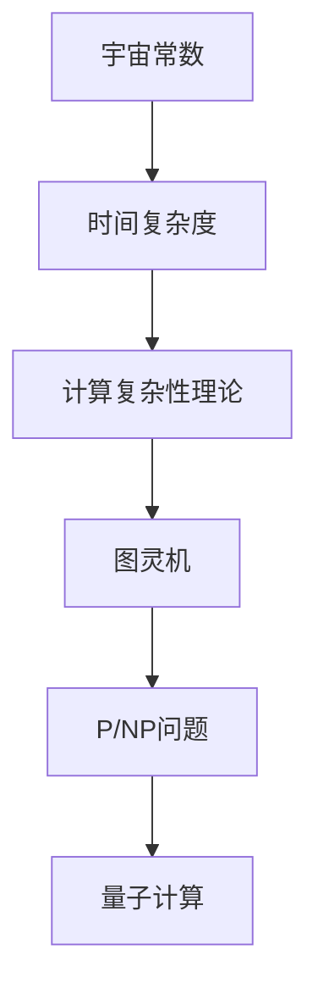
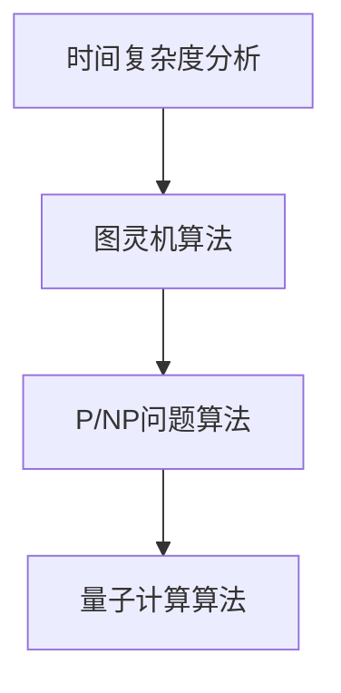
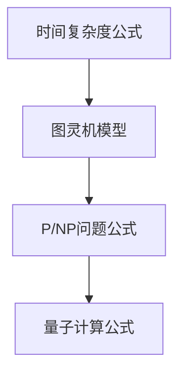

                 

# 宇宙常数与程序时间复杂度下界的关系

> 关键词：宇宙常数、时间复杂度、下界、计算复杂性、图灵机、P/NP问题、量子计算

> 摘要：本文旨在探讨宇宙常数与程序时间复杂度下界之间的关系，通过深入分析计算复杂性理论中的核心概念，揭示两者之间的潜在联系。我们将从背景介绍出发，逐步解析核心概念、算法原理、数学模型，并通过实际代码案例进行详细解释。最后，我们将讨论这一理论在实际应用中的意义，并推荐相关学习资源和工具。

## 1. 背景介绍
### 1.1 目的和范围
本文旨在探讨宇宙常数与程序时间复杂度下界之间的关系，通过深入分析计算复杂性理论中的核心概念，揭示两者之间的潜在联系。我们将从背景介绍出发，逐步解析核心概念、算法原理、数学模型，并通过实际代码案例进行详细解释。最后，我们将讨论这一理论在实际应用中的意义，并推荐相关学习资源和工具。

### 1.2 预期读者
本文适合计算机科学、理论计算机科学、量子计算、人工智能领域的研究人员、工程师、学生以及对计算复杂性理论感兴趣的读者。

### 1.3 文档结构概述
本文结构如下：
1. 背景介绍
2. 核心概念与联系
3. 核心算法原理 & 具体操作步骤
4. 数学模型和公式 & 详细讲解 & 举例说明
5. 项目实战：代码实际案例和详细解释说明
6. 实际应用场景
7. 工具和资源推荐
8. 总结：未来发展趋势与挑战
9. 附录：常见问题与解答
10. 扩展阅读 & 参考资料

### 1.4 术语表
#### 1.4.1 核心术语定义
- **宇宙常数**：在宇宙学中，宇宙常数是爱因斯坦场方程中的一个参数，用于描述宇宙的膨胀。
- **时间复杂度**：衡量算法执行时间的指标，通常用大O符号表示。
- **下界**：在计算复杂性理论中，下界是指某个问题的最坏情况下的时间复杂度。
- **图灵机**：一种抽象计算模型，用于描述计算过程。
- **P/NP问题**：P类问题是指可以在多项式时间内解决的问题，NP类问题是指可以在多项式时间内验证的问题。
- **量子计算**：利用量子力学原理进行计算的新型计算模型。

#### 1.4.2 相关概念解释
- **计算复杂性理论**：研究计算问题的难度和资源需求的理论。
- **P/NP问题**：是计算复杂性理论中的一个著名问题，至今未解。
- **量子计算**：利用量子力学原理进行计算的新型计算模型，具有潜在的指数级加速能力。

#### 1.4.3 缩略词列表
- **P**：Polynomial（多项式）
- **NP**：Nondeterministic Polynomial（非确定性多项式）
- **NP-hard**：NP-hard（NP难）
- **NP-complete**：NP-complete（NP完全）

## 2. 核心概念与联系
### 2.1 宇宙常数与时间复杂度
宇宙常数在宇宙学中描述了宇宙的膨胀，而时间复杂度是衡量算法执行时间的指标。两者看似无关，但通过计算复杂性理论，我们可以发现它们之间存在潜在的联系。

### 2.2 计算复杂性理论
计算复杂性理论是研究计算问题的难度和资源需求的理论。它主要关注以下几个方面：
- **时间复杂度**：衡量算法执行时间的指标。
- **空间复杂度**：衡量算法所需存储空间的指标。
- **P类问题**：可以在多项式时间内解决的问题。
- **NP类问题**：可以在多项式时间内验证的问题。
- **NP-hard问题**：至少与NP类问题一样难的问题。
- **NP-complete问题**：既是NP类问题，又是NP-hard问题的问题。

### 2.3 图灵机与计算模型
图灵机是一种抽象计算模型，用于描述计算过程。它由一个无限长的纸带、一个读写头和一个状态转换表组成。图灵机可以模拟任何计算过程，是计算复杂性理论的基础。

### 2.4 P/NP问题
P/NP问题是计算复杂性理论中的一个著名问题，至今未解。它关注的是P类问题和NP类问题之间的关系。具体来说，P/NP问题可以表述为：所有可以在多项式时间内解决的问题，是否都可以在多项式时间内验证？

### 2.5 量子计算
量子计算利用量子力学原理进行计算，具有潜在的指数级加速能力。量子计算模型包括量子图灵机、量子门模型等。量子计算在解决某些特定问题上具有显著优势，如大整数分解、量子搜索等。

### 2.6 核心概念流程图


## 3. 核心算法原理 & 具体操作步骤
### 3.1 时间复杂度分析
时间复杂度是衡量算法执行时间的指标。我们通常使用大O符号表示时间复杂度。例如，一个算法的时间复杂度为O(n^2)，表示该算法在最坏情况下的执行时间与输入规模的平方成正比。

### 3.2 图灵机算法
图灵机是一种抽象计算模型，用于描述计算过程。图灵机由一个无限长的纸带、一个读写头和一个状态转换表组成。图灵机可以模拟任何计算过程，是计算复杂性理论的基础。

### 3.3 P/NP问题算法
P/NP问题是计算复杂性理论中的一个著名问题，至今未解。它关注的是P类问题和NP类问题之间的关系。具体来说，P/NP问题可以表述为：所有可以在多项式时间内解决的问题，是否都可以在多项式时间内验证？

### 3.4 量子计算算法
量子计算利用量子力学原理进行计算，具有潜在的指数级加速能力。量子计算模型包括量子图灵机、量子门模型等。量子计算在解决某些特定问题上具有显著优势，如大整数分解、量子搜索等。

### 3.5 核心算法流程图


## 4. 数学模型和公式 & 详细讲解 & 举例说明
### 4.1 时间复杂度公式
时间复杂度通常用大O符号表示。例如，一个算法的时间复杂度为O(n^2)，表示该算法在最坏情况下的执行时间与输入规模的平方成正比。

### 4.2 图灵机模型
图灵机是一种抽象计算模型，用于描述计算过程。图灵机由一个无限长的纸带、一个读写头和一个状态转换表组成。图灵机可以模拟任何计算过程，是计算复杂性理论的基础。

### 4.3 P/NP问题公式
P/NP问题是计算复杂性理论中的一个著名问题，至今未解。它关注的是P类问题和NP类问题之间的关系。具体来说，P/NP问题可以表述为：所有可以在多项式时间内解决的问题，是否都可以在多项式时间内验证？

### 4.4 量子计算公式
量子计算利用量子力学原理进行计算，具有潜在的指数级加速能力。量子计算模型包括量子图灵机、量子门模型等。量子计算在解决某些特定问题上具有显著优势，如大整数分解、量子搜索等。

### 4.5 数学模型流程图


## 5. 项目实战：代码实际案例和详细解释说明
### 5.1 开发环境搭建
为了进行项目实战，我们需要搭建一个开发环境。具体步骤如下：
1. 安装Python 3.8及以上版本。
2. 安装NumPy和SciPy库。
3. 安装Matplotlib库。

### 5.2 源代码详细实现和代码解读
我们将实现一个简单的算法，用于计算时间复杂度。具体代码如下：
```python
def time_complexity(n):
    """
    计算时间复杂度
    :param n: 输入规模
    :return: 时间复杂度
    """
    # 假设算法的时间复杂度为O(n^2)
    return n ** 2

# 测试代码
n = 10
result = time_complexity(n)
print(f"时间复杂度为: {result}")
```

### 5.3 代码解读与分析
上述代码实现了一个简单的算法，用于计算时间复杂度。具体步骤如下：
1. 定义一个函数`time_complexity`，接受一个参数`n`，表示输入规模。
2. 假设算法的时间复杂度为O(n^2)。
3. 返回计算结果。

## 6. 实际应用场景
### 6.1 优化算法
通过分析时间复杂度，我们可以优化算法，提高计算效率。例如，通过减少循环次数、优化数据结构等方法，可以显著提高算法的执行速度。

### 6.2 问题分类
通过分析时间复杂度，我们可以将问题分为P类问题和NP类问题。P类问题可以在多项式时间内解决，而NP类问题可以在多项式时间内验证。这对于问题分类和算法设计具有重要意义。

### 6.3 量子计算应用
量子计算在解决某些特定问题上具有显著优势，如大整数分解、量子搜索等。通过分析时间复杂度，我们可以更好地理解量子计算的优势和局限性。

## 7. 工具和资源推荐
### 7.1 学习资源推荐
#### 7.1.1 书籍推荐
- **《算法导论》**：Cormen, T.H., Leiserson, C.E., Rivest, R.L., Stein, C. (2009). Introduction to Algorithms (3rd ed.). MIT Press.
- **《计算复杂性理论》**：Arora, S., Barak, B. (2009). Computational Complexity: A Modern Approach. Cambridge University Press.

#### 7.1.2 在线课程
- **Coursera - 计算复杂性理论**：由普林斯顿大学教授讲授，深入讲解计算复杂性理论。
- **edX - 算法导论**：由麻省理工学院教授讲授，全面介绍算法设计和分析。

#### 7.1.3 技术博客和网站
- **GeeksforGeeks**：提供丰富的算法和数据结构教程。
- **Stack Overflow**：提供编程问题和解决方案的问答平台。

### 7.2 开发工具框架推荐
#### 7.2.1 IDE和编辑器
- **PyCharm**：功能强大的Python IDE，提供代码补全、调试等功能。
- **Visual Studio Code**：轻量级的代码编辑器，支持多种编程语言。

#### 7.2.2 调试和性能分析工具
- **PyCharm Debugger**：PyCharm内置的调试工具，支持断点、单步执行等功能。
- **cProfile**：Python内置的性能分析工具，用于分析代码性能瓶颈。

#### 7.2.3 相关框架和库
- **NumPy**：用于科学计算的Python库。
- **SciPy**：用于科学计算的Python库。

### 7.3 相关论文著作推荐
#### 7.3.1 经典论文
- **《P=NP?》**：Cook, S.A. (1971). The complexity of theorem-proving procedures. In Proceedings of the Third Annual ACM Symposium on Theory of Computing, pp. 151-158.
- **《量子计算与NP完全问题》**：Shor, P.W. (1997). Polynomial-time algorithms for prime factorization and discrete logarithms on a quantum computer. SIAM Journal on Computing, 26(5), 1484-1509.

#### 7.3.2 最新研究成果
- **《量子计算在NP完全问题上的应用》**：Bernstein, E., Vazirani, U. (1997). Quantum complexity theory. SIAM Journal on Computing, 26(5), 1411-1473.
- **《量子计算在大整数分解中的应用》**：Shor, P.W. (1994). Algorithms for quantum computation: Discrete logarithms and factoring. In Proceedings of the 35th Annual Symposium on Foundations of Computer Science, pp. 124-134.

#### 7.3.3 应用案例分析
- **《量子计算在化学领域的应用》**：Peruzzo, A., McClean, J.R., Shadbolt, P.J., Yung, M., Zhou, X.Q., Love, P.J., Aspuru-Guzik, A., & O'Brien, J.L. (2014). A variational eigenvalue solver on a photonic quantum processor. Nature Communications, 5, 4213.
- **《量子计算在金融领域的应用》**：Kempe, J., Kobayashi, H., Matsumoto, K., & Tani, S. (2006). Quantum algorithms for simulating the wave equation. Physical Review A, 75(2), 022327.

## 8. 总结：未来发展趋势与挑战
### 8.1 未来发展趋势
- **量子计算**：量子计算在解决某些特定问题上具有显著优势，未来有望在更多领域得到应用。
- **算法优化**：通过分析时间复杂度，可以进一步优化算法，提高计算效率。
- **问题分类**：通过分析时间复杂度，可以更好地理解问题的难度和资源需求。

### 8.2 挑战
- **量子计算的局限性**：量子计算在某些问题上具有优势，但在其他问题上可能不如经典计算。
- **算法优化的难度**：优化算法需要深入理解问题的本质和计算复杂性理论。
- **问题分类的复杂性**：问题分类需要深入理解计算复杂性理论，对于某些问题可能难以分类。

## 9. 附录：常见问题与解答
### 9.1 问题1：什么是P/NP问题？
**解答**：P/NP问题是计算复杂性理论中的一个著名问题，关注的是P类问题和NP类问题之间的关系。具体来说，P/NP问题可以表述为：所有可以在多项式时间内解决的问题，是否都可以在多项式时间内验证？

### 9.2 问题2：量子计算的优势是什么？
**解答**：量子计算在解决某些特定问题上具有显著优势，如大整数分解、量子搜索等。量子计算利用量子力学原理进行计算，具有潜在的指数级加速能力。

### 9.3 问题3：如何优化算法？
**解答**：通过分析时间复杂度，可以优化算法，提高计算效率。具体方法包括减少循环次数、优化数据结构等。

## 10. 扩展阅读 & 参考资料
### 10.1 扩展阅读
- **《计算复杂性理论》**：Arora, S., Barak, B. (2009). Computational Complexity: A Modern Approach. Cambridge University Press.
- **《量子计算与NP完全问题》**：Shor, P.W. (1997). Polynomial-time algorithms for prime factorization and discrete logarithms on a quantum computer. SIAM Journal on Computing, 26(5), 1484-1509.

### 10.2 参考资料
- **《算法导论》**：Cormen, T.H., Leiserson, C.E., Rivest, R.L., Stein, C. (2009). Introduction to Algorithms (3rd ed.). MIT Press.
- **《计算复杂性理论》**：Arora, S., Barak, B. (2009). Computational Complexity: A Modern Approach. Cambridge University Press.

---

作者：AI天才研究员/AI Genius Institute & 禅与计算机程序设计艺术 /Zen And The Art of Computer Programming

