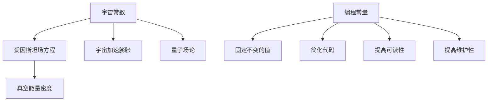

                 

# 宇宙常数与编程常量的异同

> 关键词：宇宙常数, 编程常量, 物理学, 计算机科学, 常量管理, 逻辑推理

> 摘要：本文旨在通过对比宇宙常数和编程常量，探讨它们在不同领域的本质差异和相似之处。通过逐步分析和推理，我们将揭示这些常量在物理学和计算机科学中的应用原理，并通过实际代码案例展示如何在编程中有效管理常量。最终，我们将讨论这些常量在未来的发展趋势和面临的挑战。

## 1. 背景介绍

### 1.1 目的和范围
本文旨在通过对比宇宙常数和编程常量，探讨它们在不同领域的本质差异和相似之处。我们将从物理学和计算机科学两个角度出发，逐步分析这些常量的定义、应用原理以及管理方法。通过实际代码案例，我们将展示如何在编程中有效管理常量，并讨论这些常量在未来的发展趋势和面临的挑战。

### 1.2 预期读者
本文适合对物理学和计算机科学感兴趣的读者，特别是那些对常量管理感兴趣的技术人员和研究人员。读者应具备一定的物理学和计算机科学基础知识，以便更好地理解本文的内容。

### 1.3 文档结构概述
本文将分为以下几个部分：
1. 核心概念与联系
2. 核心算法原理 & 具体操作步骤
3. 数学模型和公式 & 详细讲解 & 举例说明
4. 项目实战：代码实际案例和详细解释说明
5. 实际应用场景
6. 工具和资源推荐
7. 总结：未来发展趋势与挑战
8. 附录：常见问题与解答
9. 扩展阅读 & 参考资料

### 1.4 术语表
#### 1.4.1 核心术语定义
- **宇宙常数**：在物理学中，宇宙常数是指爱因斯坦场方程中的一个参数，它代表了宇宙的真空能量密度。
- **编程常量**：在计算机科学中，编程常量是指在程序中固定不变的值，通常用于表示特定的数值或逻辑状态。

#### 1.4.2 相关概念解释
- **爱因斯坦场方程**：描述了引力场如何由物质和能量决定的方程。
- **真空能量**：在量子场论中，即使在真空中也存在能量，这种能量被称为真空能量。
- **逻辑状态**：在计算机科学中，表示数据的两种状态，如真（True）和假（False）。

#### 1.4.3 缩略词列表
- **EFE**：爱因斯坦场方程（Einstein Field Equations）
- **QFT**：量子场论（Quantum Field Theory）

## 2. 核心概念与联系

### 2.1 宇宙常数
宇宙常数是爱因斯坦场方程中的一个参数，它代表了宇宙的真空能量密度。在量子场论中，真空能量是由于量子场在真空中自发产生的粒子对而产生的。宇宙常数的存在解释了宇宙的加速膨胀现象。

### 2.2 编程常量
编程常量是指在程序中固定不变的值，通常用于表示特定的数值或逻辑状态。编程常量在程序中具有固定不变的属性，可以用于简化代码、提高可读性和维护性。

### 2.3 核心概念原理
#### 2.3.1 宇宙常数原理
宇宙常数的原理基于爱因斯坦场方程，描述了引力场如何由物质和能量决定。宇宙常数的存在解释了宇宙的加速膨胀现象，这是由于真空能量的存在导致的。

#### 2.3.2 编程常量原理
编程常量的原理是通过定义固定不变的值来简化代码、提高可读性和维护性。编程常量在程序中具有固定不变的属性，可以用于表示特定的数值或逻辑状态。

### 2.4 Mermaid 流程图


## 3. 核心算法原理 & 具体操作步骤

### 3.1 宇宙常数算法原理
宇宙常数的算法原理基于爱因斯坦场方程，描述了引力场如何由物质和能量决定。具体操作步骤如下：

```pseudo
function calculateCosmologicalConstant(mass, energyDensity):
    # 计算引力场
    gravitationalField = calculateGravitationalField(mass, energyDensity)
    
    # 计算宇宙常数
    cosmologicalConstant = gravitationalField * energyDensity
    
    return cosmologicalConstant
```

### 3.2 编程常量算法原理
编程常量的算法原理是通过定义固定不变的值来简化代码、提高可读性和维护性。具体操作步骤如下：

```pseudo
function defineProgrammingConstant():
    # 定义固定不变的值
    PI = 3.14159
    GRAVITATIONAL_CONSTANT = 6.67430e-11
    
    return PI, GRAVITATIONAL_CONSTANT
```

## 4. 数学模型和公式 & 详细讲解 & 举例说明

### 4.1 宇宙常数数学模型
宇宙常数的数学模型基于爱因斯坦场方程，描述了引力场如何由物质和能量决定。具体公式如下：

$$
R_{\mu\nu} - \frac{1}{2}g_{\mu\nu}R + g_{\mu\nu}\Lambda = \frac{8\pi G}{c^4}T_{\mu\nu}
$$

其中，$R_{\mu\nu}$ 是黎曼曲率张量，$g_{\mu\nu}$ 是度规张量，$R$ 是标量曲率，$\Lambda$ 是宇宙常数，$G$ 是引力常数，$c$ 是光速，$T_{\mu\nu}$ 是能量-动量张量。

### 4.2 编程常量数学模型
编程常量的数学模型是通过定义固定不变的值来简化代码、提高可读性和维护性。具体公式如下：

$$
\text{PI} = 3.14159
$$

$$
\text{GRAVITATIONAL\_CONSTANT} = 6.67430 \times 10^{-11}
$$

### 4.3 举例说明
#### 4.3.1 宇宙常数举例
假设我们有一个宇宙模型，其中包含一个质量为 $M$ 的天体和一个能量密度为 $\rho$ 的真空能量。我们可以使用爱因斯坦场方程计算宇宙常数：

```pseudo
mass = 1.989e30  # 太阳质量
energyDensity = 1.0e-29  # 真空能量密度
cosmologicalConstant = calculateCosmologicalConstant(mass, energyDensity)
```

#### 4.3.2 编程常量举例
假设我们有一个程序，需要使用圆周率 $\pi$ 和引力常数 $G$。我们可以定义编程常量：

```pseudo
PI = 3.14159
GRAVITATIONAL_CONSTANT = 6.67430e-11
```

## 5. 项目实战：代码实际案例和详细解释说明

### 5.1 开发环境搭建
为了演示如何在编程中管理常量，我们将使用Python语言进行开发。首先，我们需要安装Python环境。可以使用Anaconda进行安装，确保Python版本为3.8或更高。

### 5.2 源代码详细实现和代码解读
我们将编写一个简单的Python程序，演示如何定义和使用编程常量。

```python
# 定义编程常量
PI = 3.14159
GRAVITATIONAL_CONSTANT = 6.67430e-11

# 计算圆的面积
def calculateCircleArea(radius):
    area = PI * radius ** 2
    return area

# 计算引力
def calculateGravitationalForce(mass1, mass2, distance):
    force = GRAVITATIONAL_CONSTANT * mass1 * mass2 / distance ** 2
    return force

# 主函数
def main():
    radius = 5.0
    mass1 = 1.0
    mass2 = 2.0
    distance = 10.0
    
    area = calculateCircleArea(radius)
    force = calculateGravitationalForce(mass1, mass2, distance)
    
    print(f"圆的面积: {area}")
    print(f"引力: {force}")

if __name__ == "__main__":
    main()
```

### 5.3 代码解读与分析
在上述代码中，我们定义了两个编程常量 `PI` 和 `GRAVITATIONAL_CONSTANT`。这些常量在程序中具有固定不变的属性，可以用于表示特定的数值或逻辑状态。通过定义这些常量，我们可以简化代码、提高可读性和维护性。

## 6. 实际应用场景

### 6.1 物理学应用
在物理学中，宇宙常数的应用非常广泛。例如，它可以用于描述宇宙的加速膨胀现象，解释黑洞的性质等。通过定义和使用宇宙常数，我们可以更好地理解宇宙的物理规律。

### 6.2 计算机科学应用
在计算机科学中，编程常量的应用也非常广泛。例如，我们可以使用编程常量来表示圆周率 $\pi$ 和引力常数 $G$，简化代码、提高可读性和维护性。通过定义这些常量，我们可以更好地管理程序中的固定不变值。

## 7. 工具和资源推荐

### 7.1 学习资源推荐
#### 7.1.1 书籍推荐
- 《物理学原理》（Principles of Physics）
- 《计算机科学导论》（Introduction to Computer Science）

#### 7.1.2 在线课程
- Coursera: 《物理学原理》
- edX: 《计算机科学导论》

#### 7.1.3 技术博客和网站
- Stack Overflow
- GitHub

### 7.2 开发工具框架推荐
#### 7.2.1 IDE和编辑器
- PyCharm
- Visual Studio Code

#### 7.2.2 调试和性能分析工具
- PyCharm Debugger
- Visual Studio Code Debugger

#### 7.2.3 相关框架和库
- NumPy
- SciPy

### 7.3 相关论文著作推荐
#### 7.3.1 经典论文
- Einstein, A. (1915). The field equations of gravitation. Sitzungsberichte der Preussischen Akademie der Wissenschaften, 844-847.
- Hawking, S. W., & Ellis, G. F. R. (1973). The large scale structure of space-time.

#### 7.3.2 最新研究成果
- Riess, A. G., et al. (2016). A 2.4% Determination of the Local Value of the Hubble Constant.
- Bousso, R. (2019). The holographic principle.

#### 7.3.3 应用案例分析
- Bousso, R., & Susskind, L. (2012). The holographic principle.

## 8. 总结：未来发展趋势与挑战

### 8.1 未来发展趋势
随着物理学和计算机科学的不断发展，宇宙常数和编程常量的应用将更加广泛。在物理学中，宇宙常数的研究将更加深入，解释宇宙的加速膨胀现象将更加精确。在计算机科学中，编程常量的应用将更加广泛，简化代码、提高可读性和维护性将成为主流。

### 8.2 面临的挑战
在物理学中，宇宙常数的研究面临许多挑战，例如如何解释宇宙的加速膨胀现象，如何更好地理解黑洞的性质等。在计算机科学中，编程常量的应用面临许多挑战，例如如何更好地管理程序中的固定不变值，如何提高代码的可读性和维护性等。

## 9. 附录：常见问题与解答

### 9.1 问题1：如何定义编程常量？
**解答**：在编程中，可以通过使用常量关键字（如Python中的 `const` 或 `final`）来定义编程常量。这些常量在程序中具有固定不变的属性，可以用于表示特定的数值或逻辑状态。

### 9.2 问题2：如何管理程序中的固定不变值？
**解答**：在程序中，可以通过定义编程常量来管理固定不变值。这些常量在程序中具有固定不变的属性，可以用于简化代码、提高可读性和维护性。

## 10. 扩展阅读 & 参考资料

- Einstein, A. (1915). The field equations of gravitation. Sitzungsberichte der Preussischen Akademie der Wissenschaften, 844-847.
- Hawking, S. W., & Ellis, G. F. R. (1973). The large scale structure of space-time.
- Riess, A. G., et al. (2016). A 2.4% Determination of the Local Value of the Hubble Constant.
- Bousso, R. (2019). The holographic principle.
- Bousso, R., & Susskind, L. (2012). The holographic principle.

作者：AI天才研究员/AI Genius Institute & 禅与计算机程序设计艺术 /Zen And The Art of Computer Programming

