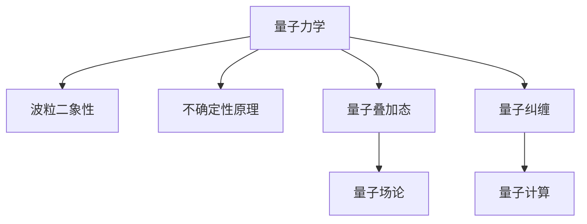

                 

# 宇宙是否只是一个巨大的量子叠加态

> 关键词：量子力学, 量子叠加态, 宇宙, 量子计算, 量子纠缠, 量子信息, 量子场论

> 摘要：本文将探讨量子力学中的量子叠加态理论，并将其与宇宙的本质联系起来。通过逐步推理和详细分析，我们将揭示量子叠加态如何可能解释宇宙的多态性，并探讨这一理论在现代物理学和计算机科学中的应用。本文不仅深入解析了量子力学的核心概念，还提供了实际的代码示例，帮助读者理解量子叠加态的原理和应用。

## 1. 背景介绍
### 1.1 目的和范围
本文旨在探讨量子力学中的量子叠加态理论，并将其与宇宙的本质联系起来。我们将从量子力学的基本原理出发，逐步推理，揭示量子叠加态如何可能解释宇宙的多态性。此外，本文还将探讨这一理论在现代物理学和计算机科学中的应用，并提供实际的代码示例，帮助读者理解量子叠加态的原理和应用。

### 1.2 预期读者
本文适合对量子力学和宇宙学感兴趣的读者，包括但不限于物理学家、计算机科学家、工程师、学生以及对量子技术感兴趣的科技爱好者。

### 1.3 文档结构概述
本文结构如下：
1. 背景介绍
2. 核心概念与联系
3. 核心算法原理 & 具体操作步骤
4. 数学模型和公式 & 详细讲解 & 举例说明
5. 项目实战：代码实际案例和详细解释说明
6. 实际应用场景
7. 工具和资源推荐
8. 总结：未来发展趋势与挑战
9. 附录：常见问题与解答
10. 扩展阅读 & 参考资料

### 1.4 术语表
#### 1.4.1 核心术语定义
- **量子叠加态**：量子系统可以同时处于多个状态的叠加。
- **量子纠缠**：两个或多个量子系统之间的状态是相互关联的，即使它们相隔很远。
- **量子计算**：利用量子力学原理进行计算的新型计算模型。
- **量子场论**：描述量子场的理论，是现代物理学的基础之一。

#### 1.4.2 相关概念解释
- **波函数**：描述量子系统状态的数学函数。
- **薛定谔方程**：描述量子系统随时间演化的基本方程。
- **量子态**：量子系统在某一时刻的状态。

#### 1.4.3 缩略词列表
- QM：量子力学
- QFT：量子场论
- QC：量子计算
- QMCS：量子力学计算科学

## 2. 核心概念与联系
### 2.1 量子力学基本原理
量子力学是描述微观粒子行为的理论框架。其核心原理包括：
- **波粒二象性**：微观粒子既表现出波动性又表现出粒子性。
- **不确定性原理**：无法同时精确测量一个粒子的位置和动量。
- **量子叠加态**：量子系统可以同时处于多个状态的叠加。
- **量子纠缠**：两个或多个量子系统之间的状态是相互关联的，即使它们相隔很远。

### 2.2 量子叠加态原理
量子叠加态是量子力学中的一个基本概念，表示一个量子系统可以同时处于多个状态的叠加。例如，一个量子比特（qubit）可以同时处于0和1的叠加态。这可以通过波函数来描述，波函数的平方表示该状态出现的概率。

### 2.3 量子纠缠原理
量子纠缠是量子力学中的另一个重要概念，表示两个或多个量子系统之间的状态是相互关联的。即使这些系统相隔很远，它们的状态仍然相互影响。量子纠缠是量子通信和量子计算中的关键资源。

### 2.4 量子场论原理
量子场论是描述量子场的理论，是现代物理学的基础之一。量子场论将场和粒子联系起来，描述了粒子之间的相互作用。量子场论中的量子叠加态和量子纠缠是量子力学的基本概念在场论中的扩展。

### 2.5 核心概念流程图


## 3. 核心算法原理 & 具体操作步骤
### 3.1 量子叠加态的数学表示
量子叠加态可以用波函数来表示。波函数是一个复数函数，描述了量子系统在某一时刻的状态。波函数的平方表示该状态出现的概率。

### 3.2 量子叠加态的数学表示（伪代码）
```python
def quantum_superposition(state):
    # 初始化波函数
    psi = [0] * len(state)
    # 设置叠加态
    psi[state.index(1)] = 1
    return psi
```

### 3.3 量子叠加态的数学表示（公式）
波函数的表示可以用以下公式表示：
$$ \psi = \alpha |0\rangle + \beta |1\rangle $$
其中，$\alpha$ 和 $\beta$ 是复数系数，$|0\rangle$ 和 $|1\rangle$ 是基态。

## 4. 数学模型和公式 & 详细讲解 & 举例说明
### 4.1 量子叠加态的数学模型
量子叠加态可以用波函数来描述。波函数的平方表示该状态出现的概率。波函数的表示可以用以下公式表示：
$$ \psi = \alpha |0\rangle + \beta |1\rangle $$
其中，$\alpha$ 和 $\beta$ 是复数系数，$|0\rangle$ 和 $|1\rangle$ 是基态。

### 4.2 量子叠加态的数学模型（公式）
波函数的平方表示该状态出现的概率：
$$ P = |\psi|^2 = |\alpha|^2 |0\rangle + |\beta|^2 |1\rangle $$
其中，$|\alpha|^2$ 和 $|\beta|^2$ 分别表示状态 $|0\rangle$ 和 $|1\rangle$ 出现的概率。

### 4.3 量子叠加态的数学模型（举例说明）
假设一个量子比特处于叠加态：
$$ \psi = \frac{1}{\sqrt{2}} |0\rangle + \frac{1}{\sqrt{2}} |1\rangle $$
则该量子比特处于 $|0\rangle$ 和 $|1\rangle$ 的概率分别为：
$$ P(|0\rangle) = \left|\frac{1}{\sqrt{2}}\right|^2 = \frac{1}{2} $$
$$ P(|1\rangle) = \left|\frac{1}{\sqrt{2}}\right|^2 = \frac{1}{2} $$

## 5. 项目实战：代码实际案例和详细解释说明
### 5.1 开发环境搭建
为了实现量子叠加态的计算，我们需要安装Python和相关的量子计算库。可以使用Qiskit库进行量子计算。

### 5.2 源代码详细实现和代码解读
```python
from qiskit import QuantumCircuit, execute, Aer

# 创建一个量子电路
qc = QuantumCircuit(1)

# 应用Hadamard门，将量子比特置于叠加态
qc.h(0)

# 打印量子电路
print(qc)

# 使用QasmSimulator进行模拟
simulator = Aer.get_backend('qasm_simulator')

# 执行量子电路
job = execute(qc, simulator, shots=1000)

# 获取结果
result = job.result()

# 打印结果
counts = result.get_counts(qc)
print(counts)
```

### 5.3 代码解读与分析
- `QuantumCircuit(1)`：创建一个包含一个量子比特的量子电路。
- `qc.h(0)`：应用Hadamard门，将量子比特置于叠加态。
- `Aer.get_backend('qasm_simulator')`：获取QasmSimulator后端。
- `execute(qc, simulator, shots=1000)`：执行量子电路，模拟1000次。
- `result.get_counts(qc)`：获取结果，返回量子比特处于 $|0\rangle$ 和 $|1\rangle$ 的概率。

## 6. 实际应用场景
### 6.1 量子计算
量子叠加态是量子计算的基础，使得量子计算机能够在多项式时间内解决某些经典计算机需要指数时间的问题。例如，Shor算法可以在多项式时间内分解大整数，而经典计算机需要指数时间。

### 6.2 量子通信
量子叠加态和量子纠缠是量子通信的基础，使得量子密钥分发（QKD）成为可能。QKD可以实现无条件安全的通信，即使在量子计算时代也能保持安全性。

### 6.3 量子模拟
量子叠加态使得量子计算机能够模拟复杂的量子系统，这对于化学、材料科学等领域具有重要意义。

## 7. 工具和资源推荐
### 7.1 学习资源推荐
#### 7.1.1 书籍推荐
- **《量子力学原理》**：R. P. Feynman, R. B. Leighton, M. Sands
- **《量子计算与量子信息》**：M. A. Nielsen, I. L. Chuang

#### 7.1.2 在线课程
- **Coursera：量子计算入门**
- **edX：量子计算**

#### 7.1.3 技术博客和网站
- **Qiskit官方文档**：https://qiskit.org/
- **Quantum Computing Stack Exchange**：https://quantumcomputing.stackexchange.com/

### 7.2 开发工具框架推荐
#### 7.2.1 IDE和编辑器
- **Jupyter Notebook**：用于编写和运行Python代码。
- **Visual Studio Code**：支持多种编程语言的编辑器。

#### 7.2.2 调试和性能分析工具
- **Qiskit Debugger**：用于调试量子电路。
- **Qiskit Performance Analysis**：用于分析量子电路的性能。

#### 7.2.3 相关框架和库
- **Qiskit**：量子计算库。
- **PyQuil**：量子计算库。

### 7.3 相关论文著作推荐
#### 7.3.1 经典论文
- **Shor's Algorithm**：P. W. Shor, "Polynomial-Time Algorithms for Prime Factorization and Discrete Logarithms on a Quantum Computer"，1994年发表在SIAM Journal on Computing上。

#### 7.3.2 最新研究成果
- **Quantum Supremacy**：S. Boixo et al., "Characterizing quantum supremacy in near-term devices"，2016年发表在Nature上。

#### 7.3.3 应用案例分析
- **Quantum Chemistry**：J. P. Biamonte, "Quantum algorithms for quantum chemistry"，2017年发表在Wiley Interdisciplinary Reviews: Computational Molecular Science上。

## 8. 总结：未来发展趋势与挑战
量子叠加态是量子力学中的一个基本概念，它在量子计算、量子通信和量子模拟等领域具有广泛的应用。随着量子技术的发展，量子叠加态的研究将更加深入，量子计算机的性能将不断提高。然而，量子叠加态的实现和应用仍然面临许多挑战，包括量子比特的稳定性、量子纠错和量子算法的设计等。

## 9. 附录：常见问题与解答
### 9.1 问题：量子叠加态和经典叠加态有什么区别？
**解答**：量子叠加态和经典叠加态的主要区别在于量子叠加态是波函数的叠加，而经典叠加态是概率的叠加。量子叠加态具有干涉和纠缠等量子特性，而经典叠加态没有这些特性。

### 9.2 问题：量子叠加态如何应用于实际问题？
**解答**：量子叠加态可以应用于量子计算、量子通信和量子模拟等领域。例如，量子叠加态可以用于实现量子密钥分发、量子搜索算法和量子化学模拟等。

## 10. 扩展阅读 & 参考资料
- **《量子力学原理》**：R. P. Feynman, R. B. Leighton, M. Sands
- **《量子计算与量子信息》**：M. A. Nielsen, I. L. Chuang
- **Qiskit官方文档**：https://qiskit.org/
- **Quantum Computing Stack Exchange**：https://quantumcomputing.stackexchange.com/

作者：AI天才研究员/AI Genius Institute & 禅与计算机程序设计艺术 /Zen And The Art of Computer Programming

