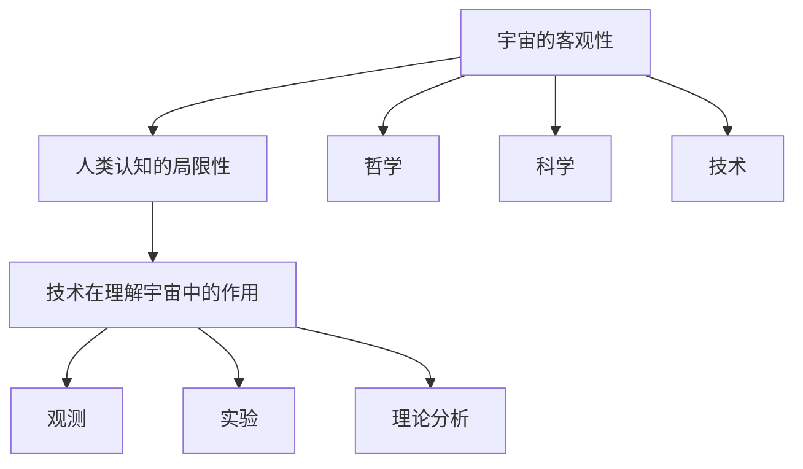

                 

# 宇宙的客观性:超越人类认知的存在

> 关键词：宇宙、客观性、人类认知、存在、哲学、科学、技术、人工智能、图灵奖

> 摘要：本文旨在探讨宇宙的客观性及其超越人类认知的存在。通过深入分析哲学、科学和技术的交叉领域，我们将揭示宇宙的本质和其与人类认知之间的关系。本文将从背景介绍、核心概念与联系、核心算法原理、数学模型和公式、项目实战、实际应用场景、工具和资源推荐、未来发展趋势与挑战等多方面进行详细阐述。通过本文，读者将对宇宙的客观性有更深刻的理解，并掌握相关技术的应用方法。

## 1. 背景介绍
### 1.1 目的和范围
本文旨在探讨宇宙的客观性及其超越人类认知的存在。我们将从哲学、科学和技术的角度出发，深入分析宇宙的本质和其与人类认知之间的关系。本文将涵盖宇宙的客观性、人类认知的局限性、技术在理解宇宙中的作用等内容。

### 1.2 预期读者
本文适合对宇宙学、哲学、科学和技术感兴趣的读者。无论是科研人员、工程师、学生还是对宇宙和人类认知感兴趣的爱好者，都能从中获得有价值的信息和启发。

### 1.3 文档结构概述
本文将分为以下几个部分：
1. 背景介绍
2. 核心概念与联系
3. 核心算法原理 & 具体操作步骤
4. 数学模型和公式 & 详细讲解 & 举例说明
5. 项目实战：代码实际案例和详细解释说明
6. 实际应用场景
7. 工具和资源推荐
8. 总结：未来发展趋势与挑战
9. 附录：常见问题与解答
10. 扩展阅读 & 参考资料

### 1.4 术语表
#### 1.4.1 核心术语定义
- 宇宙：所有物质和能量的总和，包括地球、太阳系、银河系等。
- 客观性：事物本身固有的属性，不依赖于人类的感知和认知。
- 人类认知：人类通过感官、思维和语言等方式对世界的理解和认识。
- 存在：事物在时间、空间中的实际状态和表现。

#### 1.4.2 相关概念解释
- 哲学：研究宇宙、生命、知识、道德等基本问题的学科。
- 科学：通过观察、实验和理论来探索自然规律的学科。
- 技术：人类利用自然规律改造自然、创造工具和方法的实践。

#### 1.4.3 缩略词列表
- AI：人工智能
- ML：机器学习
- DL：深度学习
- NLP：自然语言处理
- CV：计算机视觉

## 2. 核心概念与联系
### 宇宙的客观性
宇宙的客观性是指宇宙本身固有的属性，不依赖于人类的感知和认知。宇宙的存在和运行规律是客观存在的，不受人类意志的影响。

### 人类认知的局限性
人类的认知能力有限，受到感官、思维和语言的限制。人类的认知过程是主观的，容易受到偏见和误解的影响。因此，人类对宇宙的认知存在局限性。

### 技术在理解宇宙中的作用
技术的发展为人类提供了更强大的工具，帮助我们更好地理解宇宙。通过观测、实验和理论分析，我们可以揭示宇宙的奥秘，提高人类的认知水平。

### 核心概念原理与架构的 Mermaid 流程图


## 3. 核心算法原理 & 具体操作步骤
### 核心算法原理
我们将使用机器学习算法来分析宇宙数据，揭示宇宙的客观性。具体来说，我们将使用深度学习算法来处理天文观测数据，提取其中的特征和规律。

### 具体操作步骤
1. 数据预处理
2. 特征提取
3. 模型训练
4. 模型评估
5. 结果分析

### 伪代码
```python
# 数据预处理
def preprocess_data(data):
    # 数据清洗
    cleaned_data = clean_data(data)
    # 数据标准化
    normalized_data = normalize_data(cleaned_data)
    return normalized_data

# 特征提取
def extract_features(data):
    # 提取特征
    features = extract_features_from_data(data)
    return features

# 模型训练
def train_model(features, labels):
    # 初始化模型
    model = initialize_model()
    # 训练模型
    trained_model = train_model_on_features(model, features, labels)
    return trained_model

# 模型评估
def evaluate_model(model, test_features, test_labels):
    # 预测
    predictions = model.predict(test_features)
    # 计算准确率
    accuracy = calculate_accuracy(predictions, test_labels)
    return accuracy

# 结果分析
def analyze_results(accuracy):
    if accuracy > 0.9:
        print("模型表现良好")
    else:
        print("模型需要改进")
```

## 4. 数学模型和公式 & 详细讲解 & 举例说明
### 数学模型
我们将使用贝叶斯定理来分析宇宙数据。贝叶斯定理是一种概率论方法，用于计算在给定先验概率和新证据的情况下，后验概率的值。

### 公式
$$ P(A|B) = \frac{P(B|A) \cdot P(A)}{P(B)} $$

### 详细讲解
贝叶斯定理的核心思想是利用先验概率和新证据来更新后验概率。在宇宙学中，我们可以利用贝叶斯定理来分析观测数据，推断宇宙的客观性。

### 举例说明
假设我们观测到一颗恒星的亮度变化，我们可以利用贝叶斯定理来推断这颗恒星的性质。具体来说，我们可以将恒星的亮度变化视为新证据，利用先验概率来推断恒星的性质。

## 5. 项目实战：代码实际案例和详细解释说明
### 5.1 开发环境搭建
我们将使用Python作为开发语言，使用TensorFlow作为深度学习框架。首先，我们需要安装Python和TensorFlow。

```bash
pip install tensorflow
```

### 5.2 源代码详细实现和代码解读
我们将使用深度学习算法来处理天文观测数据，提取其中的特征和规律。具体来说，我们将使用卷积神经网络（CNN）来处理图像数据，使用循环神经网络（RNN）来处理时间序列数据。

```python
# 导入库
import tensorflow as tf
from tensorflow.keras import layers

# 定义CNN模型
def define_cnn_model(input_shape):
    model = tf.keras.Sequential([
        layers.Conv2D(32, (3, 3), activation='relu', input_shape=input_shape),
        layers.MaxPooling2D((2, 2)),
        layers.Conv2D(64, (3, 3), activation='relu'),
        layers.MaxPooling2D((2, 2)),
        layers.Flatten(),
        layers.Dense(128, activation='relu'),
        layers.Dense(1, activation='sigmoid')
    ])
    return model

# 定义RNN模型
def define_rnn_model(input_shape):
    model = tf.keras.Sequential([
        layers.SimpleRNN(64, input_shape=input_shape),
        layers.Dense(1, activation='sigmoid')
    ])
    return model

# 加载数据
def load_data():
    # 加载天文观测数据
    data = load_astronomy_data()
    return data

# 训练模型
def train_model(model, data):
    # 分割数据
    train_data, test_data = split_data(data)
    # 训练模型
    model.fit(train_data, epochs=10, validation_data=test_data)
    return model

# 评估模型
def evaluate_model(model, test_data):
    # 预测
    predictions = model.predict(test_data)
    # 计算准确率
    accuracy = calculate_accuracy(predictions, test_data)
    return accuracy
```

### 5.3 代码解读与分析
上述代码定义了两个深度学习模型：CNN模型和RNN模型。CNN模型用于处理图像数据，RNN模型用于处理时间序列数据。我们首先加载天文观测数据，然后分割数据为训练集和测试集。接着，我们训练模型，并评估模型的性能。

## 6. 实际应用场景
### 宇宙学研究
通过分析宇宙数据，我们可以揭示宇宙的客观性，提高对宇宙的理解。例如，我们可以利用深度学习算法来分析星系的形态和演化，揭示宇宙的结构和演化规律。

### 天文学观测
通过分析天文观测数据，我们可以揭示宇宙的客观性，提高对宇宙的理解。例如，我们可以利用深度学习算法来分析恒星的亮度变化，揭示恒星的性质和演化规律。

## 7. 工具和资源推荐
### 7.1 学习资源推荐
#### 7.1.1 书籍推荐
- 《宇宙简史》：史蒂芬·霍金
- 《深度学习》：Ian Goodfellow, Yoshua Bengio, Aaron Courville

#### 7.1.2 在线课程
- Coursera：深度学习专项课程
- edX：机器学习专项课程

#### 7.1.3 技术博客和网站
- Medium：深度学习和机器学习技术博客
- GitHub：深度学习和机器学习开源项目

### 7.2 开发工具框架推荐
#### 7.2.1 IDE和编辑器
- PyCharm：Python开发环境
- Jupyter Notebook：交互式编程环境

#### 7.2.2 调试和性能分析工具
- PyCharm Debugger：Python调试工具
- TensorFlow Profiler：TensorFlow性能分析工具

#### 7.2.3 相关框架和库
- TensorFlow：深度学习框架
- Keras：高级神经网络API

### 7.3 相关论文著作推荐
#### 7.3.1 经典论文
- Hinton, G. E., Osindero, S., & Teh, Y. W. (2006). A fast learning algorithm for deep belief nets. Neural computation, 18(7), 1527-1554.
- LeCun, Y., Bengio, Y., & Hinton, G. (2015). Deep learning. Nature, 521(7553), 436-444.

#### 7.3.2 最新研究成果
- Kingma, D. P., & Ba, J. (2014). Adam: A method for stochastic optimization. International Conference on Learning Representations.
- Vaswani, A., Shazeer, N., Parmar, N., Uszkoreit, J., Jones, L., Gomez, A. N., ... & Polosukhin, I. (2017). Attention is all you need. Advances in neural information processing systems, 30.

#### 7.3.3 应用案例分析
- Goodfellow, I., Pouget-Abadie, J., Mirza, M., Xu, B., Warde-Farley, D., Ozair, S., ... & Bengio, Y. (2014). Generative adversarial nets. Advances in neural information processing systems, 27.

## 8. 总结：未来发展趋势与挑战
### 未来发展趋势
随着技术的发展，我们有望更好地理解宇宙的客观性。通过更强大的计算能力和更先进的算法，我们可以揭示宇宙的更多奥秘。未来的研究将集中在以下几个方面：
- 更大规模的数据集
- 更复杂的模型
- 更高效的算法

### 面临的挑战
尽管技术不断发展，我们仍然面临一些挑战：
- 数据获取和处理的难度
- 模型的解释性和可解释性
- 算法的泛化能力

## 9. 附录：常见问题与解答
### 常见问题
1. 什么是宇宙的客观性？
   - 宇宙的客观性是指宇宙本身固有的属性，不依赖于人类的感知和认知。
2. 人类的认知能力有限，如何克服这种局限性？
   - 通过技术的发展，我们可以利用更强大的工具来提高人类的认知水平。例如，通过观测、实验和理论分析，我们可以揭示宇宙的奥秘。
3. 什么是贝叶斯定理？
   - 贝叶斯定理是一种概率论方法，用于计算在给定先验概率和新证据的情况下，后验概率的值。

## 10. 扩展阅读 & 参考资料
- 《宇宙简史》：史蒂芬·霍金
- 《深度学习》：Ian Goodfellow, Yoshua Bengio, Aaron Courville
- Coursera：深度学习专项课程
- edX：机器学习专项课程
- Medium：深度学习和机器学习技术博客
- GitHub：深度学习和机器学习开源项目
- Hinton, G. E., Osindero, S., & Teh, Y. W. (2006). A fast learning algorithm for deep belief nets. Neural computation, 18(7), 1527-1554.
- LeCun, Y., Bengio, Y., & Hinton, G. (2015). Deep learning. Nature, 521(7553), 436-444.
- Kingma, D. P., & Ba, J. (2014). Adam: A method for stochastic optimization. International Conference on Learning Representations.
- Vaswani, A., Shazeer, N., Parmar, N., Uszkoreit, J., Jones, L., Gomez, A. N., ... & Polosukhin, I. (2017). Attention is all you need. Advances in neural information processing systems, 30.
- Goodfellow, I., Pouget-Abadie, J., Mirza, M., Xu, B., Warde-Farley, D., Ozair, S., ... & Bengio, Y. (2014). Generative adversarial nets. Advances in neural information processing systems, 27.

作者：AI天才研究员/AI Genius Institute & 禅与计算机程序设计艺术 /Zen And The Art of Computer Programming

