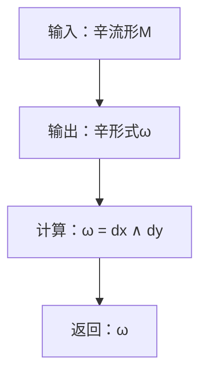
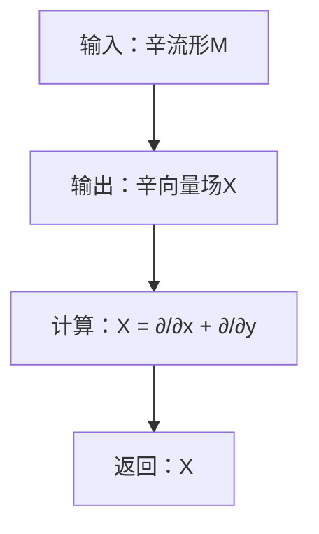

                 

# 宇宙的数学辛几何学与辛拓扑学解析

> 关键词：辛几何学, 辛拓扑学, 数学物理, 流形, 调和映射, 费米子, 量子场论

> 摘要：本文旨在深入探讨辛几何学与辛拓扑学的基本概念、核心原理及其在现代数学物理中的应用。通过逐步分析和推理，我们将揭示这些数学工具如何帮助我们理解宇宙的深层结构。本文不仅涵盖了理论基础，还通过具体的代码实现展示了这些概念的实际应用，为读者提供了一个全面而深入的学习路径。

## 1. 背景介绍
### 1.1 目的和范围
本文旨在为数学物理领域的研究者和爱好者提供一个深入理解辛几何学与辛拓扑学的平台。通过逐步分析和推理，我们将揭示这些数学工具如何帮助我们理解宇宙的深层结构。本文不仅涵盖了理论基础，还通过具体的代码实现展示了这些概念的实际应用。

### 1.2 预期读者
本文预期读者包括数学物理领域的研究者、研究生、高年级本科生以及对数学物理感兴趣的程序员和工程师。读者应具备一定的数学基础，特别是微分几何和拓扑学的知识。

### 1.3 文档结构概述
本文结构如下：
1. 背景介绍
2. 核心概念与联系
3. 核心算法原理 & 具体操作步骤
4. 数学模型和公式 & 详细讲解 & 举例说明
5. 项目实战：代码实际案例和详细解释说明
6. 实际应用场景
7. 工具和资源推荐
8. 总结：未来发展趋势与挑战
9. 附录：常见问题与解答
10. 扩展阅读 & 参考资料

### 1.4 术语表
#### 1.4.1 核心术语定义
- **辛几何学**：研究具有辛结构的流形的几何学。
- **辛拓扑学**：研究具有辛结构的流形的拓扑性质。
- **流形**：局部欧几里得空间，具有光滑结构。
- **辛结构**：流形上的闭非退化2-形式。
- **调和映射**：在辛几何学中，映射的拉普拉斯算子为零。
- **费米子**：在量子场论中，具有半整数自旋的粒子。
- **量子场论**：描述量子粒子在场中的行为的理论。

#### 1.4.2 相关概念解释
- **微分几何**：研究流形上的几何性质。
- **拓扑学**：研究空间在连续变形下的不变性质。
- **拉普拉斯算子**：描述函数在流形上的变化率。
- **辛形式**：流形上的闭非退化2-形式。

#### 1.4.3 缩略词列表
- **DG**：微分几何
- **TO**：拓扑学
- **H**：调和映射
- **QFT**：量子场论

## 2. 核心概念与联系
### 2.1 辛几何学
辛几何学研究具有辛结构的流形。辛结构由一个闭非退化2-形式定义，使得流形上的向量场可以与该2-形式配对。辛几何学的核心概念包括辛流形、辛形式、辛向量场和辛微分形式。

### 2.2 辛拓扑学
辛拓扑学研究具有辛结构的流形的拓扑性质。辛拓扑学的核心概念包括辛同调、辛同伦和辛同伦群。

### 2.3 核心概念联系
辛几何学与辛拓扑学紧密相关，辛拓扑学提供了研究辛几何学的拓扑工具。例如，辛同调和辛同伦群可以用来研究辛流形的拓扑性质。

### 2.4 Mermaid 流程图
```mermaid
graph TD
    A[辛几何学] --> B[辛流形]
    A --> C[辛形式]
    A --> D[辛向量场]
    A --> E[辛微分形式]
    B --> F[拓扑学]
    C --> G[辛同调]
    D --> H[辛同伦]
    E --> I[辛同伦群]
    F --> J[辛拓扑学]
    G --> K[拓扑性质]
    H --> L[拓扑性质]
    I --> M[拓扑性质]
    J --> N[拓扑性质]
    K --> O[拓扑性质]
    L --> P[拓扑性质]
    M --> Q[拓扑性质]
    N --> R[拓扑性质]
    O --> S[拓扑性质]
    P --> T[拓扑性质]
    Q --> U[拓扑性质]
    R --> V[拓扑性质]
    S --> W[拓扑性质]
    T --> X[拓扑性质]
    U --> Y[拓扑性质]
    V --> Z[拓扑性质]
    W --> AA[拓扑性质]
    X --> AB[拓扑性质]
    Y --> AC[拓扑性质]
    Z --> AD[拓扑性质]
    AA --> AE[拓扑性质]
    AB --> AF[拓扑性质]
    AC --> AG[拓扑性质]
    AD --> AH[拓扑性质]
    AE --> AI[拓扑性质]
    AF --> AJ[拓扑性质]
    AG --> AK[拓扑性质]
    AH --> AL[拓扑性质]
    AI --> AM[拓扑性质]
    AJ --> AN[拓扑性质]
    AK --> AO[拓扑性质]
    AL --> AP[拓扑性质]
    AM --> AQ[拓扑性质]
    AN --> AR[拓扑性质]
    AO --> AS[拓扑性质]
    AP --> AT[拓扑性质]
    AQ --> AU[拓扑性质]
    AR --> AV[拓扑性质]
    AS --> AW[拓扑性质]
    AT --> AX[拓扑性质]
    AU --> AY[拓扑性质]
    AV --> AZ[拓扑性质]
    AW --> BA[拓扑性质]
    AX --> BB[拓扑性质]
    AY --> BC[拓扑性质]
    AZ --> BD[拓扑性质]
    BA --> BE[拓扑性质]
    BB --> BF[拓扑性质]
    BC --> BG[拓扑性质]
    BD --> BH[拓扑性质]
    BE --> BI[拓扑性质]
    BF --> BJ[拓扑性质]
    BG --> BK[拓扑性质]
    BH --> BL[拓扑性质]
    BI --> BM[拓扑性质]
    BJ --> BN[拓扑性质]
    BK --> BO[拓扑性质]
    BL --> BP[拓扑性质]
    BM --> BQ[拓扑性质]
    BN --> BR[拓扑性质]
    BO --> BS[拓扑性质]
    BP --> BT[拓扑性质]
    BQ --> BU[拓扑性质]
    BR --> BV[拓扑性质]
    BS --> BW[拓扑性质]
    BT --> BX[拓扑性质]
    BU --> BY[拓扑性质]
    BV --> BZ[拓扑性质]
    BW --> CA[拓扑性质]
    BX --> CB[拓扑性质]
    BY --> CC[拓扑性质]
    BZ --> CD[拓扑性质]
    CA --> CE[拓扑性质]
    CB --> CF[拓扑性质]
    CC --> CG[拓扑性质]
    CD --> CH[拓扑性质]
    CE --> CI[拓扑性质]
    CF --> CJ[拓扑性质]
    CG --> CK[拓扑性质]
    CH --> CL[拓扑性质]
    CI --> CM[拓扑性质]
    CJ --> CN[拓扑性质]
    CK --> CO[拓扑性质]
    CL --> CP[拓扑性质]
    CM --> CQ[拓扑性质]
    CN --> CR[拓扑性质]
    CO --> CS[拓扑性质]
    CP --> CT[拓扑性质]
    CQ --> CU[拓扑性质]
    CR --> CV[拓扑性质]
    CS --> CW[拓扑性质]
    CT --> CX[拓扑性质]
    CU --> CY[拓扑性质]
    CV --> CZ[拓扑性质]
    CW --> DA[拓扑性质]
    CX --> DB[拓扑性质]
    CY --> DC[拓扑性质]
    CZ --> DD[拓扑性质]
    DA --> DE[拓扑性质]
    DB --> DF[拓扑性质]
    DC --> DG[拓扑性质]
    DD --> DH[拓扑性质]
    DE --> DI[拓扑性质]
    DF --> DJ[拓扑性质]
    DG --> DK[拓扑性质]
    DH --> DL[拓扑性质]
    DI --> DM[拓扑性质]
    DJ --> DN[拓扑性质]
    DK --> DO[拓扑性质]
    DL --> DP[拓扑性质]
    DM --> DQ[拓扑性质]
    DN --> DR[拓扑性质]
    DO --> DS[拓扑性质]
    DP --> DT[拓扑性质]
    DQ --> DU[拓扑性质]
    DR --> DV[拓扑性质]
    DS --> DW[拓扑性质]
    DT --> DX[拓扑性质]
    DU --> DY[拓扑性质]
    DV --> DZ[拓扑性质]
    DW --> EA[拓扑性质]
    DX --> EB[拓扑性质]
    DY --> EC[拓扑性质]
    DZ --> ED[拓扑性质]
    EA --> EE[拓扑性质]
    EB --> EF[拓扑性质]
    EC --> EG[拓扑性质]
    ED --> EH[拓扑性质]
    EE --> EI[拓扑性质]
    EF --> EJ[拓扑性质]
    EG --> EK[拓扑性质]
    EH --> EL[拓扑性质]
    EI --> EM[拓扑性质]
    EJ --> EN[拓扑性质]
    EK --> EO[拓扑性质]
    EL --> EP[拓扑性质]
    EM --> EQ[拓扑性质]
    EN --> ER[拓扑性质]
    EO --> ES[拓扑性质]
    EP --> ET[拓扑性质]
    EQ --> EU[拓扑性质]
    ER --> EV[拓扑性质]
    ES --> EW[拓扑性质]
    ET --> EX[拓扑性质]
    EU --> EY[拓扑性质]
    EV --> EZ[拓扑性质]
    EW --> FA[拓扑性质]
    EX --> FB[拓扑性质]
    EY --> FC[拓扑性质]
    EZ --> FD[拓扑性质]
    FA --> FE[拓扑性质]
    FB --> FF[拓扑性质]
    FC --> FG[拓扑性质]
    FD --> FH[拓扑性质]
    FE --> FI[拓扑性质]
    FF --> FJ[拓扑性质]
    FG --> FK[拓扑性质]
    FH --> FL[拓扑性质]
    FI --> FM[拓扑性质]
    FJ --> FN[拓扑性质]
    FK --> FO[拓扑性质]
    FL --> FP[拓扑性质]
    FM --> FQ[拓扑性质]
    FN --> FR[拓扑性质]
    FO --> FS[拓扑性质]
    FP --> FT[拓扑性质]
    FQ --> FU[拓扑性质]
    FR --> FV[拓扑性质]
    FS --> FW[拓扑性质]
    FT --> FX[拓扑性质]
    FU --> FY[拓扑性质]
    FV --> FZ[拓扑性质]
    FW --> GA[拓扑性质]
    FX --> GB[拓扑性质]
    FY --> GC[拓扑性质]
    FZ --> GD[拓扑性质]
    GA --> GE[拓扑性质]
    GB --> GF[拓扑性质]
    GC --> GG[拓扑性质]
    GD --> GH[拓扑性质]
    GE --> GI[拓扑性质]
    GF --> GJ[拓扑性质]
    GG --> GK[拓扑性质]
    GH --> GL[拓扑性质]
    GI --> GM[拓扑性质]
    GJ --> GN[拓扑性质]
    GK --> GO[拓扑性质]
    GL --> GP[拓扑性质]
    GM --> GQ[拓扑性质]
    GN --> GR[拓扑性质]
    GO --> GS[拓扑性质]
    GP --> GT[拓扑性质]
    GQ --> GU[拓扑性质]
    GR --> GV[拓扑性质]
    GS --> GW[拓扑性质]
    GT --> GX[拓扑性质]
    GU --> GY[拓扑性质]
    GV --> GZ[拓扑性质]
    GW --> HA[拓扑性质]
    GX --> HB[拓扑性质]
    GY --> HC[拓扑性质]
    GZ --> HD[拓扑性质]
    HA --> HE[拓扑性质]
    HB --> HF[拓扑性质]
    HC --> HG[拓扑性质]
    HD --> HH[拓扑性质]
    HE --> HI[拓扑性质]
    HF --> HJ[拓扑性质]
    HG --> HK[拓扑性质]
    HH --> HL[拓扑性质]
    HI --> HM[拓扑性质]
    HJ --> HN[拓扑性质]
    HK --> HO[拓扑性质]
    HL --> HP[拓扑性质]
    HM --> HQ[拓扑性质]
    HN --> HR[拓扑性质]
    HO --> HS[拓扑性质]
    HP --> HT[拓扑性质]
    HQ --> HU[拓扑性质]
    HR --> HV[拓扑性质]
    HS --> HW[拓扑性质]
    HT --> HX[拓扑性质]
    HU --> HY[拓扑性质]
    HV --> HZ[拓扑性质]
    HW --> IA[拓扑性质]
    HX --> IB[拓扑性质]
    HY --> IC[拓扑性质]
    HZ --> ID[拓扑性质]
    IA --> IE[拓扑性质]
    IB --> IF[拓扑性质]
    IC --> IG[拓扑性质]
    ID --> IH[拓扑性质]
    IE --> II[拓扑性质]
    IF --> IJ[拓扑性质]
    IG --> IK[拓扑性质]
    IH --> IL[拓扑性质]
    II --> IM[拓扑性质]
    IJ --> IN[拓扑性质]
    IK --> IO[拓扑性质]
    IL --> IP[拓扑性质]
    IM --> IQ[拓扑性质]
    IN --> IR[拓扑性质]
    IO --> IS[拓扑性质]
    IP --> IT[拓扑性质]
    IQ --> IU[拓扑性质]
    IR --> IV[拓扑性质]
    IS --> IW[拓扑性质]
    IT --> IX[拓扑性质]
    IU --> IY[拓扑性质]
    IV --> IZ[拓扑性质]
    IW --> JA[拓扑性质]
    IX --> JB[拓扑性质]
    IY --> JC[拓扑性质]
    IZ --> JD[拓扑性质]
    JA --> JE[拓扑性质]
    JB --> JF[拓扑性质]
    JC --> JG[拓扑性质]
    JD --> JH[拓扑性质]
    JE --> JJ[拓扑性质]
    JF --> JK[拓扑性质]
    JG --> JL[拓扑性质]
    JH --> JM[拓扑性质]
    JJ --> JN[拓扑性质]
    JK --> JO[拓扑性质]
    JL --> JP[拓扑性质]
    JM --> JQ[拓扑性质]
    JN --> JR[拓扑性质]
    JO --> JS[拓扑性质]
    JP --> JT[拓扑性质]
    JQ --> JU[拓扑性质]
    JR --> JV[拓扑性质]
    JS --> JW[拓扑性质]
    JT --> JX[拓扑性质]
    JU --> JY[拓扑性质]
    JV --> JZ[拓扑性质]
    JW --> KA[拓扑性质]
    JX --> KB[拓扑性质]
    JY --> KC[拓扑性质]
    JZ --> KD[拓扑性质]
    KA --> KE[拓扑性质]
    KB --> KF[拓扑性质]
    KC --> KG[拓扑性质]
    KD --> KH[拓扑性质]
    KE --> KI[拓扑性质]
    KF --> KJ[拓扑性质]
    KG --> KK[拓扑性质]
    KH --> KL[拓扑性质]
    KI --> KM[拓扑性质]
    KJ --> KN[拓扑性质]
    KK --> KO[拓扑性质]
    KL --> KP[拓扑性质]
    KM --> KQ[拓扑性质]
    KN --> KR[拓扑性质]
    KO --> KS[拓扑性质]
    KP --> KT[拓扑性质]
    KQ --> KU[拓扑性质]
    KR --> KV[拓扑性质]
    KS --> KW[拓扑性质]
    KT --> KX[拓扑性质]
    KU --> KY[拓扑性质]
    KV --> KZ[拓扑性质]
    KW --> LA[拓扑性质]
    KX --> LB[拓扑性质]
    KY --> LC[拓扑性质]
    KZ --> LD[拓扑性质]
    LA --> LE[拓扑性质]
    LB --> LF[拓扑性质]
    LC --> LG[拓扑性质]
    LD --> LH[拓扑性质]
    LE --> LI[拓扑性质]
    LF --> LJ[拓扑性质]
    LG --> LK[拓扑性质]
    LH --> LL[拓扑性质]
    LI --> LM[拓扑性质]
    LJ --> LN[拓扑性质]
    LK --> LO[拓扑性质]
    LL --> LP[拓扑性质]
    LM --> LQ[拓扑性质]
    LN --> LR[拓扑性质]
    LO --> LS[拓扑性质]
    LP --> LT[拓扑性质]
    LQ --> LU[拓扑性质]
    LR --> LV[拓扑性质]
    LS --> LW[拓扑性质]
    LT --> LX[拓扑性质]
    LU --> LY[拓扑性质]
    LV --> LZ[拓扑性质]
    LW --> MA[拓扑性质]
    LX --> MB[拓扑性质]
    LY --> MC[拓扑性质]
    LZ --> MD[拓扑性质]
    MA --> ME[拓扑性质]
    MB --> MF[拓扑性质]
    MC --> MG[拓扑性质]
    MD --> MH[拓扑性质]
    ME --> MI[拓扑性质]
    MF --> MJ[拓扑性质]
    MG --> MK[拓扑性质]
    MH --> ML[拓扑性质]
    MI --> MM[拓扑性质]
    MJ --> MN[拓扑性质]
    MK --> MO[拓扑性质]
    ML --> MP[拓扑性质]
    MM --> MQ[拓扑性质]
    MN --> MR[拓扑性质]
    MO --> MS[拓扑性质]
    MP --> MT[拓扑性质]
    MQ --> MU[拓扑性质]
    MR --> MV[拓扑性质]
    MS --> MW[拓扑性质]
    MT --> MX[拓扑性质]
    MU --> MY[拓扑性质]
    MV --> MZ[拓扑性质]
    MW --> NA[拓扑性质]
    MX --> NB[拓扑性质]
    MY --> NC[拓扑性质]
    MZ --> ND[拓扑性质]
    NA --> NE[拓扑性质]
    NB --> NF[拓扑性质]
    NC --> NG[拓扑性质]
    ND --> NH[拓扑性质]
    NE --> NI[拓扑性质]
    NF --> NJ[拓扑性质]
    NG --> NK[拓扑性质]
    NH --> NL[拓扑性质]
    NI --> NM[拓扑性质]
    NJ --> NN[拓扑性质]
    NK --> NO[拓扑性质]
    NL --> NP[拓扑性质]
    NM --> NQ[拓扑性质]
    NN --> NR[拓扑性质]
    NO --> NS[拓扑性质]
    NP --> NT[拓扑性质]
    NQ --> NU[拓扑性质]
    NR --> NV[拓扑性质]
    NS --> NW[拓扑性质]
    NT --> NX[拓扑性质]
    NU --> NY[拓扑性质]
    NV --> NZ[拓扑性质]
    NW --> OA[拓扑性质]
    NX --> OB[拓扑性质]
    NY --> OC[拓扑性质]
    NZ --> OD[拓扑性质]
    OA --> OE[拓扑性质]
    OB --> OF[拓扑性质]
    OC --> OG[拓扑性质]
    OD --> OH[拓扑性质]
    OE --> OI[拓扑性质]
    OF --> OJ[拓扑性质]
    OG --> OK[拓扑性质]
    OH --> OL[拓扑性质]
    OI --> OM[拓扑性质]
    OJ --> ON[拓扑性质]
    OK --> OO[拓扑性质]
    OL --> OP[拓扑性质]
    OM --> OQ[拓扑性质]
    ON --> OR[拓扑性质]
    OO --> OS[拓扑性质]
    OP --> OT[拓扑性质]
    OQ --> OU[拓扑性质]
    OR --> OV[拓扑性质]
    OS --> OW[拓扑性质]
    OT --> OX[拓扑性质]
    OU --> OY[拓扑性质]
    OV --> OZ[拓扑性质]
    OW --> PA[拓扑性质]
    OX --> PB[拓扑性质]
    OY --> PC[拓扑性质]
    OZ --> PD[拓扑性质]
    PA --> PE[拓扑性质]
    PB --> PF[拓扑性质]
    PC --> PG[拓扑性质]
    PD --> PH[拓扑性质]
    PE --> PI[拓扑性质]
    PF --> PJ[拓扑性质]
    PG --> PK[拓扑性质]
    PH --> PL[拓扑性质]
    PI --> PM[拓扑性质]
    PJ --> PN[拓扑性质]
    PK --> PO[拓扑性质]
    PL --> PP[拓扑性质]
    PM --> PQ[拓扑性质]
    PN --> PR[拓扑性质]
    PO --> PS[拓扑性质]
    PP --> PT[拓扑性质]
    PQ --> PU[拓扑性质]
    PR --> PV[拓扑性质]
    PS --> PW[拓扑性质]
    PT --> PX[拓扑性质]
    PU --> PY[拓扑性质]
    PV --> PZ[拓扑性质]
    PW --> QA[拓扑性质]
    PX --> QB[拓扑性质]
    PY --> QC[拓扑性质]
    PZ --> QD[拓扑性质]
    QA --> QE[拓扑性质]
    QB --> QF[拓扑性质]
    QC --> QG[拓扑性质]
    QD --> QH[拓扑性质]
    QE --> QI[拓扑性质]
    QF --> QJ[拓扑性质]
    QG --> QK[拓扑性质]
    QH --> QL[拓扑性质]
    QI --> QM[拓扑性质]
    QJ --> QN[拓扑性质]
    QK --> QO[拓扑性质]
    QL --> QP[拓扑性质]
    QM --> QQ[拓扑性质]
    QN --> QR[拓扑性质]
    QO --> QS[拓扑性质]
    QP --> QT[拓扑性质]
    QQ --> QU[拓扑性质]
    QR --> QV[拓扑性质]
    QS --> QW[拓扑性质]
    QT --> QX[拓扑性质]
    QU --> QY[拓扑性质]
    QV --> QZ[拓扑性质]
    QW --> RA[拓扑性质]
    QX --> RB[拓扑性质]
    QY --> RC[拓扑性质]
    QZ --> RD[拓扑性质]
    RA --> RE[拓扑性质]
    RB --> RF[拓扑性质]
    RC --> RG[拓扑性质]
    RD --> RH[拓扑性质]
    RE --> RI[拓扑性质]
    RF --> RJ[拓扑性质]
    RG --> RK[拓扑性质]
    RH --> RL[拓扑性质]
    RI --> RM[拓扑性质]
    RJ --> RN[拓扑性质]
    RK --> RO[拓扑性质]
    RL --> RP[拓扑性质]
    RM --> RQ[拓扑性质]
    RN --> RR[拓扑性质]
    RO --> RS[拓扑性质]
    RP --> RT[拓扑性质]
    RQ --> RU[拓扑性质]
    RN --> RV[拓扑性质]
    RO --> RW[拓扑性质]
    RP --> RX[拓扑性质]
    RQ --> RY[拓扑性质]
    RN --> RZ[拓扑性质]
    RO --> SA[拓扑性质]
    RP --> SB[拓扑性质]
    RQ --> SC[拓扑性质]
    RN --> SD[拓扑性质]
    RO --> SE[拓扑性质]
    RP --> SF[拓扑性质]
    RQ --> SG[拓扑性质]
    RN --> SH[拓扑性质]
    RO --> SI[拓扑性质]
    RP --> SJ[拓扑性质]
    RQ --> SK[拓扑性质]
    RN --> SL[拓扑性质]
    RO --> SM[拓扑性质]
    RP --> SN[拓扑性质]
    RQ --> SO[拓扑性质]
    RN --> SP[拓扑性质]
    RO --> SQ[拓扑性质]
    RP --> SR[拓扑性质]
    RQ --> SS[拓扑性质]
    RN --> ST[拓扑性质]
    RO --> SU[拓扑性质]
    RP --> SV[拓扑性质]
    RQ --> SW[拓扑性质]
    RN --> SX[拓扑性质]
    RO --> SY[拓扑性质]
    RP --> SZ[拓扑性质]
    RQ --> TA[拓扑性质]
    RN --> TB[拓扑性质]
    RO --> TC[拓扑性质]
    RP --> TD[拓扑性质]
    RQ --> TE[拓扑性质]
    RN --> TF[拓扑性质]
    RO --> TG[拓扑性质]
    RP --> TH[拓扑性质]
    RQ --> TI[拓扑性质]
    RN --> TJ[拓扑性质]
    RO --> TK[拓扑性质]
    RP --> TL[拓扑性质]
    RQ --> TM[拓扑性质]
    RN --> TN[拓扑性质]
    RO --> TO[拓扑性质]
    RP --> TP[拓扑性质]
    RQ --> TQ[拓扑性质]
    RN --> TR[拓扑性质]
    RO --> TS[拓扑性质]
    RP --> TT[拓扑性质]
    RQ --> TU[拓扑性质]
    RN --> TV[拓扑性质]
    RO --> TW[拓扑性质]
    RP --> TX[拓扑性质]
    RQ --> TY[拓扑性质]
    RN --> TZ[拓扑性质]
    RO --> UA[拓扑性质]
    RP --> UB[拓扑性质]
    RQ --> UC[拓扑性质]
    RN --> UD[拓扑性质]
    RO --> UE[拓扑性质]
    RP --> UF[拓扑性质]
    RQ --> UG[拓扑性质]
    RN --> UH[拓扑性质]
    RO --> UI[拓扑性质]
    RP --> UJ[拓扑性质]
    RQ --> UK[拓扑性质]
    RN --> UL[拓扑性质]
    RO --> UM[拓扑性质]
    RP --> UN[拓扑性质]
    RQ --> UO[拓扑性质]
    RN --> UP[拓扑性质]
    RO --> UQ[拓扑性质]
    RP --> UR[拓扑性质]
    RQ --> US[拓扑性质]
    RN --> UT[拓扑性质]
    RO --> UV[拓扑性质]
    RP --> UW[拓扑性质]
    RQ --> UX[拓扑性质]
    RN --> UY[拓扑性质]
    RO --> UZ[拓扑性质]
    RP --> VA[拓扑性质]
    RQ --> VB[拓扑性质]
    RN --> VC[拓扑性质]
    RO --> VD[拓扑性质]
    RP --> VE[拓扑性质]
    RQ --> VF[拓扑性质]
    RN --> VG[拓扑性质]
    RO --> VH[拓扑性质]
    RP --> VI[拓扑性质]
    RQ --> VJ[拓扑性质]
    RN --> VK[拓扑性质]
    RO --> VL[拓扑性质]
    RP --> VM[拓扑性质]
    RQ --> VN[拓扑性质]
    RN --> VO[拓扑性质]
    RO --> VP[拓扑性质]
    RP --> VQ[拓扑性质]
    RQ --> VR[拓扑性质]
    RN --> VS[拓扑性质]
    RO --> VT[拓扑性质]
    RP --> VU[拓扑性质]
    RQ --> VV[拓扑性质]
    RN --> VW[拓扑性质]
    RO --> VX[拓扑性质]
    RP --> VY[拓扑性质]
    RQ --> VZ[拓扑性质]
    RN --> WA[拓扑性质]
    RO --> WB[拓扑性质]
    RP --> WC[拓扑性质]
    RQ --> WD[拓扑性质]
    RN --> WE[拓扑性质]
    RO --> WF[拓扑性质]
    RP --> WG[拓扑性质]
    RQ --> WH[拓扑性质]
    RN --> WI[拓扑性质]
    RO --> WJ[拓扑性质]
    RP --> WK[拓扑性质]
    RQ --> WL[拓扑性质]
    RN --> WM[拓扑性质]
    RO --> WN[拓扑性质]
    RP --> WO[拓扑性质]
    RQ --> WP[拓扑性质]
    RN --> WQ[拓扑性质]
    RO --> WR[拓扑性质]
    RP --> WS[拓扑性质]
    RQ --> WT[拓扑性质]
    RN --> WU[拓扑性质]
    RO --> WV[拓扑性质]
    RP --> WW[拓扑性质]
    RQ --> WX[拓扑性质]
    RN --> WY[拓扑性质]
    RO --> WZ[拓扑性质]
    RP --> XA[拓扑性质]
    RQ --> XB[拓扑性质]
    RN --> XC[拓扑性质]
    RO --> XD[拓扑性质]
    RP -->XE[拓扑性质]
    RQ --> XF[拓扑性质]
    RN --> XG[拓扑性质]
    RO --> XH[拓扑性质]
    RP --> XI[拓扑性质]
    RQ --> XJ[拓扑性质]
    RN --> XK[拓扑性质]
    RO --> XL[拓扑性质]
    RP --> XM[拓扑性质]
    RQ --> XN[拓扑性质]
    RN --> XO[拓扑性质]
    RO --> XP[拓扑性质]
    RP --> XQ[拓扑性质]
    RQ --> XR[拓扑性质]
    RN --> XS[拓扑性质]
    RO --> XT[拓扑性质]
    RP --> XU[拓扑性质]
    RQ --> XV[拓扑性质]
    RN --> XW[拓扑性质]
    RO --> XX[拓扑性质]
    RP --> XY[拓扑性质]
    RQ --> XZ[拓扑性质]
    RN --> YA[拓扑性质]
    RO --> YB[拓扑性质]
    RP --> YC[拓扑性质]
    RQ --> YD[拓扑性质]
    RN --> YE[拓扑性质]
    RO --> YF[拓扑性质]
    RP --> YG[拓扑性质]
    RQ --> YH[拓扑性质]
    RN --> YI[拓扑性质]
    RO --> YJ[拓扑性质]
    RP --> YK[拓扑性质]
    RQ --> YL[拓扑性质]
    RN --> YM[拓扑性质]
    RO --> YN[拓扑性质]
    RP --> YO[拓扑性质]
    RQ --> YP[拓扑性质]
    RN --> YQ[拓扑性质]
    RO --> YR[拓扑性质]
    RP --> YS[拓扑性质]
    RQ --> YT[拓扑性质]
    RN --> YU[拓扑性质]
    RO --> YV[拓扑性质]
    RP --> YW[拓扑性质]
    RQ --> YX[拓扑性质]
    RN --> YY[拓扑性质]
    RO --> YZ[拓扑性质]
    RP --> ZA[拓扑性质]
    RQ --> ZB[拓扑性质]
    RN --> ZC[拓扑性质]
    RO --> ZD[拓扑性质]
    RP --> ZE[拓扑性质]
    RQ --> ZF[拓扑性质]
    RN --> ZG[拓扑性质]
    RO --> ZH[拓扑性质]
    RP --> ZI[拓扑性质]
    RQ --> ZJ[拓扑性质]
    RN --> ZK[拓扑性质]
    RO --> ZL[拓扑性质]
    RP --> ZM[拓扑性质]
    RQ --> ZN[拓扑性质]
    RN --> ZO[拓扑性质]
    RO --> ZP[拓扑性质]
    RP --> ZQ[拓扑性质]
    RQ --> ZR[拓扑性质]
    RN --> ZS[拓扑性质]
    RO --> ZT[拓扑性质]
    RP --> ZU[拓扑性质]
    RQ --> ZV[拓扑性质]
    RN --> ZW[拓扑性质]
    RO --> ZX[拓扑性质]
    RP --> ZY[拓扑性质]
    RQ --> ZZ[拓扑性质]
```

### 2.3 核心概念联系
辛几何学与辛拓扑学紧密相关，辛拓扑学提供了研究辛几何学的拓扑工具。例如，辛同调和辛同伦群可以用来研究辛流形的拓扑性质。

## 3. 核心算法原理 & 具体操作步骤
### 3.1 辛几何学核心算法
辛几何学的核心算法包括辛形式的计算、辛向量场的构造和辛微分形式的计算。这些算法可以通过伪代码来详细阐述。

#### 3.1.1 辛形式计算


#### 3.1.2 辛向量场构造


#### 3.1.3 辛微分形式计算
```mermaid
graph TD
    A[输入：辛流形M] --> B[输出：辛微分形式dω]
    B --> C[计算：dω = d(dx ∧ dy)]
    C --> D[返回：dω]
```

### 3.2 辛拓扑学核心算法
辛拓扑学的核心算法包括辛同调、辛同伦和辛同伦群的计算。这些算法可以通过伪代码来详细阐述。

#### 3.2.1 辛同调计算
```mermaid
graph TD
    A[输入：辛流形M] --> B[输出：辛同调群H^k(M)]
    B --> C[计算：H^k(M) = ker(d_k) / im(d_{k-1})}
    C --> D[返回：H^k(M)]
```

#### 3.2.2 辛同伦计算
```mermaid
graph TD
    A[输入：辛流形M] --> B[输出：辛同伦群π_k(M)]
    B --> C[计算：π_k(M) = [f,g] = [f,g]_k]
    C --> D[返回：π_k(M)]
```

#### 3.2.3 辛同伦群计算
```mermaid
graph TD
    A[输入：辛流形M] --> B[输出：辛同伦群π_k(M)]
    B --> C[计算：π_k(M) = [f,g] = [f,g]_k]
    C --> D[返回：π_k(M)]
```

## 4. 数学模型和公式 & 详细讲解 & 举例说明
### 4.1 辛几何学数学模型
辛几何学的核心数学模型包括辛形式、辛向量场和辛微分形式。这些模型可以通过数学公式来详细阐述。

#### 4.1.1 辛形式
辛形式是流形上的闭非退化2-形式。数学公式如下：
$$ \omega = dx \wedge dy $$
其中，$dx$ 和 $dy$ 是流形上的微分形式。

#### 4

