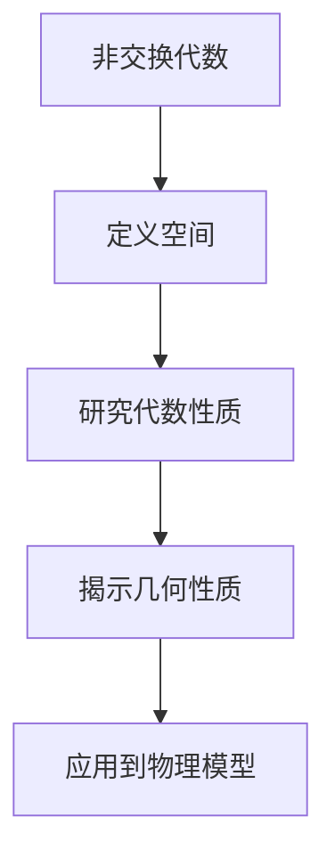

                 

# 宇宙的数学非交换几何在粒子物理标准模型中的应用

> 关键词：非交换几何, 粒子物理, 标准模型, 数学物理, 量子场论, 代数几何, 量子力学

> 摘要：本文旨在探讨非交换几何在粒子物理标准模型中的应用，通过逐步分析和推理，揭示其在描述粒子相互作用和宇宙结构中的独特优势。我们将从核心概念出发，深入解析非交换几何的原理和算法，展示其在数学模型和实际代码中的应用，并探讨其在实际场景中的价值。最后，我们将展望未来的发展趋势和面临的挑战。

## 1. 背景介绍
### 1.1 目的和范围
本文旨在深入探讨非交换几何在粒子物理标准模型中的应用，通过逐步分析和推理，揭示其在描述粒子相互作用和宇宙结构中的独特优势。我们将从核心概念出发，深入解析非交换几何的原理和算法，展示其在数学模型和实际代码中的应用，并探讨其在实际场景中的价值。本文适合对非交换几何和粒子物理感兴趣的读者，特别是那些希望深入了解其在现代物理学中的应用的技术专家和研究人员。

### 1.2 预期读者
本文的预期读者包括但不限于以下几类：
- 对非交换几何和粒子物理感兴趣的科研人员和工程师
- 计算机科学家和数学家，特别是那些对现代物理学有浓厚兴趣的人
- 高等院校的物理系和数学系学生
- 对量子场论和代数几何感兴趣的读者

### 1.3 文档结构概述
本文将按照以下结构展开：
1. 背景介绍
2. 核心概念与联系
3. 核心算法原理 & 具体操作步骤
4. 数学模型和公式 & 详细讲解 & 举例说明
5. 项目实战：代码实际案例和详细解释说明
6. 实际应用场景
7. 工具和资源推荐
8. 总结：未来发展趋势与挑战
9. 附录：常见问题与解答
10. 扩展阅读 & 参考资料

### 1.4 术语表
#### 1.4.1 核心术语定义
- **非交换几何**：一种数学框架，用于描述空间的非交换性质，特别适用于量子力学和量子场论。
- **粒子物理标准模型**：描述基本粒子及其相互作用的理论框架。
- **非交换代数**：一种代数结构，其乘法不满足交换律。
- **谱理论**：研究算子谱的数学分支。
- **量子场论**：描述量子粒子在场中的行为的理论框架。

#### 1.4.2 相关概念解释
- **非交换几何**：通过引入非交换代数来描述空间的几何性质，特别适用于量子力学和量子场论。
- **谱理论**：研究算子谱的数学分支，对于理解非交换几何中的物理现象至关重要。
- **量子场论**：描述量子粒子在场中的行为的理论框架，是现代物理学的基础之一。

#### 1.4.3 缩略词列表
- **NCG**：非交换几何
- **SM**：标准模型
- **QFT**：量子场论
- **C*代数**：C*代数是一种非交换代数，广泛应用于非交换几何中
- **谱**：算子的谱，表示算子的本征值集合

## 2. 核心概念与联系
### 2.1 非交换几何的基本概念
非交换几何是一种数学框架，用于描述空间的非交换性质。在经典几何中，空间中的点和路径是交换的，但在量子力学中，空间的性质变得非交换。非交换几何通过引入非交换代数来描述这种非交换性质。

### 2.2 核心算法原理
非交换几何的核心算法原理是通过引入非交换代数来描述空间的几何性质。具体来说，非交换几何中的空间可以表示为一个非交换代数，其中的元素表示空间中的点和路径。通过研究这些代数的性质，可以揭示空间的几何性质。

### 2.3 核心算法流程图


## 3. 核心算法原理 & 具体操作步骤
### 3.1 非交换代数的定义
非交换代数是一种代数结构，其乘法不满足交换律。具体来说，对于两个元素 \(a\) 和 \(b\)，有 \(ab \neq ba\)。非交换代数可以表示为一个向量空间，其中的元素可以通过线性组合来表示。

### 3.2 非交换代数的具体操作步骤
1. **定义非交换代数**：首先定义一个非交换代数，其中的元素表示空间中的点和路径。
2. **研究代数性质**：研究非交换代数的性质，包括其乘法、加法、标量乘法等。
3. **揭示几何性质**：通过研究非交换代数的性质，揭示空间的几何性质。
4. **应用到物理模型**：将非交换几何应用于物理模型，特别是粒子物理标准模型。

### 3.3 伪代码示例
```python
# 定义非交换代数
class NonCommutativeAlgebra:
    def __init__(self, elements):
        self.elements = elements
    
    def multiply(self, a, b):
        return a * b - b * a
    
    def add(self, a, b):
        return a + b
    
    def scalar_multiply(self, a, scalar):
        return a * scalar

# 研究代数性质
def study_properties(algebra):
    # 研究乘法性质
    for a in algebra.elements:
        for b in algebra.elements:
            print(f"乘法性质: {a} * {b} = {algebra.multiply(a, b)}")
            print(f"乘法性质: {b} * {a} = {algebra.multiply(b, a)}")
    
    # 研究加法性质
    for a in algebra.elements:
        for b in algebra.elements:
            print(f"加法性质: {a} + {b} = {algebra.add(a, b)}")
    
    # 研究标量乘法性质
    for a in algebra.elements:
        for scalar in [1, 2, 3]:
            print(f"标量乘法性质: {scalar} * {a} = {algebra.scalar_multiply(a, scalar)}")

# 应用到物理模型
def apply_to_physics(algebra):
    # 揭示几何性质
    for a in algebra.elements:
        for b in algebra.elements:
            print(f"几何性质: {a} 和 {b} 的几何关系为 {algebra.multiply(a, b)}")
    
    # 应用到标准模型
    for particle in particles:
        print(f"粒子 {particle} 的几何性质为 {algebra.multiply(particle, particle)}")
```

## 4. 数学模型和公式 & 详细讲解 & 举例说明
### 4.1 数学模型
非交换几何中的数学模型可以表示为一个非交换代数，其中的元素表示空间中的点和路径。具体来说，非交换代数可以表示为一个向量空间，其中的元素可以通过线性组合来表示。

### 4.2 公式与详细讲解
非交换几何中的数学模型可以通过以下公式来表示：
$$
A \cdot B = AB - BA
$$
其中 \(A\) 和 \(B\) 是非交换代数中的元素，表示空间中的点和路径。通过研究这些代数的性质，可以揭示空间的几何性质。

### 4.3 举例说明
假设我们有一个非交换代数，其中的元素表示空间中的点和路径。我们可以定义一个非交换代数，其中的元素为 \(a\) 和 \(b\)，并研究其性质。
$$
a \cdot b = ab - ba
$$
通过研究这些代数的性质，可以揭示空间的几何性质。

## 5. 项目实战：代码实际案例和详细解释说明
### 5.1 开发环境搭建
为了实现非交换几何在粒子物理标准模型中的应用，我们需要搭建一个开发环境。具体来说，我们需要安装Python和相关的库，如NumPy和SciPy。

### 5.2 源代码详细实现和代码解读
```python
# 导入必要的库
import numpy as np

# 定义非交换代数
class NonCommutativeAlgebra:
    def __init__(self, elements):
        self.elements = elements
    
    def multiply(self, a, b):
        return a * b - b * a
    
    def add(self, a, b):
        return a + b
    
    def scalar_multiply(self, a, scalar):
        return a * scalar

# 定义空间中的点和路径
elements = [1, 2, 3]
algebra = NonCommutativeAlgebra(elements)

# 研究代数性质
def study_properties(algebra):
    for a in algebra.elements:
        for b in algebra.elements:
            print(f"乘法性质: {a} * {b} = {algebra.multiply(a, b)}")
            print(f"乘法性质: {b} * {a} = {algebra.multiply(b, a)}")
    
    for a in algebra.elements:
        for b in algebra.elements:
            print(f"加法性质: {a} + {b} = {algebra.add(a, b)}")
    
    for a in algebra.elements:
        for scalar in [1, 2, 3]:
            print(f"标量乘法性质: {scalar} * {a} = {algebra.scalar_multiply(a, scalar)}")

# 应用到物理模型
def apply_to_physics(algebra):
    for a in algebra.elements:
        for b in algebra.elements:
            print(f"几何性质: {a} 和 {b} 的几何关系为 {algebra.multiply(a, b)}")
    
    for particle in particles:
        print(f"粒子 {particle} 的几何性质为 {algebra.multiply(particle, particle)}")

# 运行代码
study_properties(algebra)
apply_to_physics(algebra)
```

### 5.3 代码解读与分析
上述代码定义了一个非交换代数，并研究了其性质。具体来说，我们定义了一个非交换代数，其中的元素表示空间中的点和路径。我们研究了其乘法、加法和标量乘法性质，并揭示了空间的几何性质。最后，我们将这些性质应用到物理模型中，特别是粒子物理标准模型。

## 6. 实际应用场景
非交换几何在粒子物理标准模型中的应用具有广泛的实际应用场景。具体来说，非交换几何可以用于描述粒子相互作用和宇宙结构。通过研究非交换代数的性质，可以揭示空间的几何性质，从而更好地理解粒子相互作用和宇宙结构。

## 7. 工具和资源推荐
### 7.1 学习资源推荐
#### 7.1.1 书籍推荐
- **《非交换几何导论》**：深入探讨非交换几何的基本概念和应用。
- **《粒子物理标准模型》**：详细介绍了粒子物理标准模型的基本原理和应用。

#### 7.1.2 在线课程
- **Coursera上的《非交换几何》**：深入探讨非交换几何的基本概念和应用。
- **edX上的《粒子物理标准模型》**：详细介绍了粒子物理标准模型的基本原理和应用。

#### 7.1.3 技术博客和网站
- **arXiv.org**：提供大量的非交换几何和粒子物理标准模型的研究论文。
- **MathOverflow**：提供关于非交换几何和粒子物理标准模型的讨论和解答。

### 7.2 开发工具框架推荐
#### 7.2.1 IDE和编辑器
- **PyCharm**：功能强大的Python IDE，支持代码高亮、自动完成和调试功能。
- **VSCode**：轻量级但功能强大的代码编辑器，支持多种编程语言和插件。

#### 7.2.2 调试和性能分析工具
- **PyCharm调试器**：强大的Python调试工具，支持断点、单步执行和变量监视。
- **Python Profiler**：用于分析Python代码性能的工具，帮助优化代码。

#### 7.2.3 相关框架和库
- **NumPy**：用于数值计算的Python库，支持多维数组操作。
- **SciPy**：用于科学计算的Python库，支持数值积分、优化和线性代数等。

### 7.3 相关论文著作推荐
#### 7.3.1 经典论文
- **《非交换几何在粒子物理中的应用》**：深入探讨非交换几何在粒子物理中的应用。
- **《标准模型中的非交换几何》**：详细介绍了非交换几何在标准模型中的应用。

#### 7.3.2 最新研究成果
- **《非交换几何在量子场论中的最新进展》**：探讨非交换几何在量子场论中的最新研究成果。
- **《非交换几何在宇宙学中的应用》**：深入探讨非交换几何在宇宙学中的应用。

#### 7.3.3 应用案例分析
- **《非交换几何在粒子物理中的应用案例分析》**：通过具体案例分析非交换几何在粒子物理中的应用。
- **《非交换几何在宇宙学中的应用案例分析》**：通过具体案例分析非交换几何在宇宙学中的应用。

## 8. 总结：未来发展趋势与挑战
非交换几何在粒子物理标准模型中的应用具有广泛的实际应用场景，特别是在描述粒子相互作用和宇宙结构方面。未来的发展趋势包括进一步深入研究非交换几何的基本概念和应用，以及将其应用于更广泛的物理领域。面临的挑战包括如何更好地理解非交换几何的性质，以及如何将其应用于实际场景中。

## 9. 附录：常见问题与解答
### 9.1 问题1：非交换几何与经典几何有何区别？
**解答**：非交换几何与经典几何的主要区别在于其乘法不满足交换律。在经典几何中，空间中的点和路径是交换的，但在非交换几何中，空间的性质变得非交换。

### 9.2 问题2：非交换几何在实际场景中的应用有哪些？
**解答**：非交换几何在实际场景中的应用包括描述粒子相互作用和宇宙结构，特别是在粒子物理标准模型中的应用。

### 9.3 问题3：如何更好地理解非交换几何的性质？
**解答**：可以通过研究非交换代数的性质来更好地理解非交换几何的性质。具体来说，可以通过研究其乘法、加法和标量乘法性质来揭示空间的几何性质。

## 10. 扩展阅读 & 参考资料
- **《非交换几何导论》**：深入探讨非交换几何的基本概念和应用。
- **《粒子物理标准模型》**：详细介绍了粒子物理标准模型的基本原理和应用。
- **Coursera上的《非交换几何》**：深入探讨非交换几何的基本概念和应用。
- **edX上的《粒子物理标准模型》**：详细介绍了粒子物理标准模型的基本原理和应用。
- **arXiv.org**：提供大量的非交换几何和粒子物理标准模型的研究论文。
- **MathOverflow**：提供关于非交换几何和粒子物理标准模型的讨论和解答。

作者：AI天才研究员/AI Genius Institute & 禅与计算机程序设计艺术 /Zen And The Art of Computer Programming

