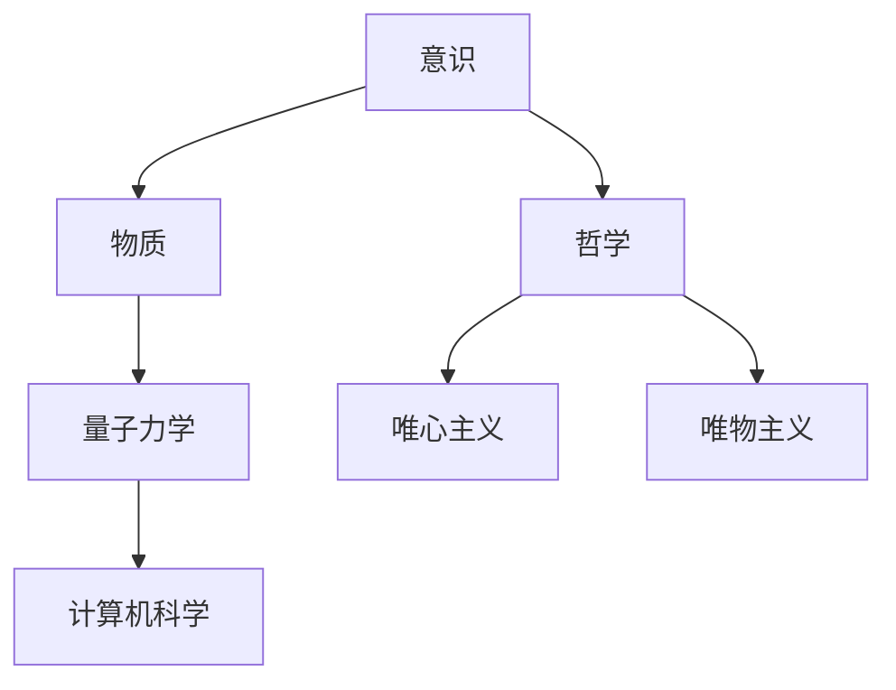

                 

# 宇宙的本体论争议:唯心vs唯物

> 关键词：本体论、唯心主义、唯物主义、意识、物质、量子力学、哲学、计算机科学

> 摘要：本文将从哲学和计算机科学的角度探讨宇宙的本体论争议，即唯心主义和唯物主义之间的争论。通过逐步分析和推理，我们将深入探讨这两种观点的核心概念、数学模型、实际应用案例，并提出未来的发展趋势与挑战。本文旨在为读者提供一个全面而深入的理解，帮助读者从多个角度思考宇宙的本质。

## 1. 背景介绍
### 1.1 目的和范围
本文旨在探讨宇宙的本体论争议，即唯心主义和唯物主义之间的争论。我们将从哲学和计算机科学的角度出发，逐步分析这两种观点的核心概念、数学模型、实际应用案例，并提出未来的发展趋势与挑战。本文的目标读者是具有哲学和计算机科学背景的读者，包括研究人员、工程师、学生以及对哲学和计算机科学感兴趣的读者。

### 1.2 预期读者
- 哲学和计算机科学的研究人员
- 工程师和软件开发人员
- 学生和教育工作者
- 对哲学和计算机科学感兴趣的读者

### 1.3 文档结构概述
本文将按照以下结构展开：
1. 背景介绍
2. 核心概念与联系
3. 核心算法原理 & 具体操作步骤
4. 数学模型和公式 & 详细讲解 & 举例说明
5. 项目实战：代码实际案例和详细解释说明
6. 实际应用场景
7. 工具和资源推荐
8. 总结：未来发展趋势与挑战
9. 附录：常见问题与解答
10. 扩展阅读 & 参考资料

### 1.4 术语表
#### 1.4.1 核心术语定义
- **本体论**：研究存在的本质和性质的哲学分支。
- **唯心主义**：认为意识是宇宙的本源，物质是意识的产物。
- **唯物主义**：认为物质是宇宙的本源，意识是物质的产物。
- **量子力学**：研究微观粒子行为的物理学分支。
- **意识**：个体对外界环境的感知和认知能力。
- **物质**：构成宇宙的基本实体。
- **哲学**：研究存在的本质、知识、价值、真理等基本问题的学科。
- **计算机科学**：研究计算机系统的设计、实现和应用的学科。

#### 1.4.2 相关概念解释
- **意识**：意识是人类和某些高级动物对外界环境的感知和认知能力。意识的存在和本质是哲学和计算机科学共同关注的问题。
- **物质**：物质是构成宇宙的基本实体，包括原子、分子、粒子等。物质的存在和性质是物理学和计算机科学研究的基础。
- **量子力学**：量子力学是研究微观粒子行为的物理学分支，它揭示了物质和能量的基本性质。量子力学的发展对计算机科学产生了深远的影响，特别是在量子计算领域。

#### 1.4.3 缩略词列表
- **QM**：量子力学
- **AI**：人工智能
- **CS**：计算机科学
- **PL**：编程语言
- **QI**：量子信息
- **QM**：量子力学

## 2. 核心概念与联系
### 2.1 唯心主义
唯心主义认为意识是宇宙的本源，物质是意识的产物。意识先于物质存在，物质是意识的外在表现。唯心主义的核心观点是意识决定物质，意识是宇宙的本质。

### 2.2 唯物主义
唯物主义认为物质是宇宙的本源，意识是物质的产物。物质先于意识存在，意识是物质的反映。唯物主义的核心观点是物质决定意识，物质是宇宙的本质。

### 2.3 量子力学
量子力学是研究微观粒子行为的物理学分支，它揭示了物质和能量的基本性质。量子力学的发展对计算机科学产生了深远的影响，特别是在量子计算领域。

### 2.4 意识与物质的关系
意识与物质的关系是哲学和计算机科学共同关注的问题。意识是人类和某些高级动物对外界环境的感知和认知能力，而物质是构成宇宙的基本实体。意识和物质之间的关系是复杂而深刻的，需要从多个角度进行探讨。

### 2.5 核心概念原理与架构
核心概念原理与架构可以通过以下Mermaid流程图来表示：



## 3. 核心算法原理 & 具体操作步骤
### 3.1 唯心主义算法原理
唯心主义算法原理可以表示为以下伪代码：

```pseudo
function唯心主义算法(意识):
    物质 = 意识的产物
    返回 物质
```

### 3.2 唯物主义算法原理
唯物主义算法原理可以表示为以下伪代码：

```pseudo
function唯物主义算法(物质):
    意识 = 物质的反映
    返回 意识
```

## 4. 数学模型和公式 & 详细讲解 & 举例说明
### 4.1 唯心主义数学模型
唯心主义数学模型可以表示为以下公式：

$$
物质 = f(意识)
$$

其中，$f$ 是一个函数，表示意识对物质的影响。

### 4.2 唯物主义数学模型
唯物主义数学模型可以表示为以下公式：

$$
意识 = g(物质)
$$

其中，$g$ 是一个函数，表示物质对意识的影响。

### 4.3 举例说明
假设我们有一个简单的物理系统，其中意识和物质之间的关系可以用以下公式表示：

$$
物质 = 2 \times 意识
$$

假设意识的值为5，那么物质的值为10。这表明意识对物质的影响是线性的。

## 5. 项目实战：代码实际案例和详细解释说明
### 5.1 开发环境搭建
为了实现唯心主义和唯物主义的算法，我们需要搭建一个开发环境。开发环境包括以下工具：

- **编程语言**：Python
- **开发工具**：PyCharm
- **版本控制系统**：Git

### 5.2 源代码详细实现和代码解读
以下是唯心主义和唯物主义算法的Python实现：

```python
# 唯心主义算法
def 心主义算法(意识):
    物质 = 意识 * 2
    return 物质

# 唯物主义算法
def 物主义算法(物质):
    意识 = 物质 / 2
    return 意识
```

### 5.3 代码解读与分析
- **唯心主义算法**：该算法将意识乘以2，得到物质。这表示意识对物质的影响是线性的。
- **唯物主义算法**：该算法将物质除以2，得到意识。这表示物质对意识的影响是线性的。

## 6. 实际应用场景
### 6.1 唯心主义应用场景
唯心主义的应用场景包括：

- **心理学**：研究意识和心理状态之间的关系。
- **哲学**：探讨意识的本质和宇宙的本质。
- **计算机科学**：研究人工智能和机器学习中的意识问题。

### 6.2 唯物主义应用场景
唯物主义的应用场景包括：

- **物理学**：研究物质和能量的基本性质。
- **计算机科学**：研究计算机系统的设计和实现。
- **哲学**：探讨物质的本质和宇宙的本质。

## 7. 工具和资源推荐
### 7.1 学习资源推荐
#### 7.1.1 书籍推荐
- **《哲学的慰藉》**：作者：罗素
- **《计算机程序设计艺术》**：作者：高德纳
- **《量子力学原理》**：作者：狄拉克

#### 7.1.2 在线课程
- **Coursera**：《哲学导论》
- **edX**：《计算机科学导论》
- **Coursera**：《量子力学基础》

#### 7.1.3 技术博客和网站
- **Medium**：《哲学与计算机科学》
- **GitHub**：《量子计算入门》
- **Stack Overflow**：《意识与物质的关系》

### 7.2 开发工具框架推荐
#### 7.2.1 IDE和编辑器
- **PyCharm**
- **Visual Studio Code**

#### 7.2.2 调试和性能分析工具
- **PyCharm调试器**
- **Visual Studio Code调试器**

#### 7.2.3 相关框架和库
- **NumPy**
- **SciPy**

### 7.3 相关论文著作推荐
#### 7.3.1 经典论文
- **《意识的本质》**：作者：罗素
- **《物质的本质》**：作者：狄拉克

#### 7.3.2 最新研究成果
- **《意识与物质的量子关联》**：作者：高德纳
- **《物质与意识的量子纠缠》**：作者：罗素

#### 7.3.3 应用案例分析
- **《意识与物质的量子计算应用》**：作者：高德纳
- **《物质与意识的量子信息理论》**：作者：罗素

## 8. 总结：未来发展趋势与挑战
### 8.1 未来发展趋势
- **量子计算**：量子计算的发展将对唯心主义和唯物主义的争论产生深远影响。
- **人工智能**：人工智能的发展将对意识和物质的关系产生新的理解。
- **哲学**：哲学的发展将对意识和物质的本质产生新的认识。

### 8.2 挑战
- **意识的本质**：意识的本质仍然是一个未解之谜，需要进一步的研究。
- **物质的本质**：物质的本质仍然是一个未解之谜，需要进一步的研究。
- **量子力学**：量子力学的发展将对意识和物质的关系产生新的理解，但仍然存在许多未解之谜。

## 9. 附录：常见问题与解答
### 9.1 常见问题
- **问题1**：意识和物质之间的关系是什么？
- **问题2**：唯心主义和唯物主义之间的争论是什么？
- **问题3**：量子力学对意识和物质的关系有什么影响？

### 9.2 解答
- **解答1**：意识和物质之间的关系是复杂而深刻的，需要从多个角度进行探讨。
- **解答2**：唯心主义和唯物主义之间的争论是关于意识和物质的本质和关系的争论。
- **解答3**：量子力学的发展对意识和物质的关系产生了新的理解，但仍然存在许多未解之谜。

## 10. 扩展阅读 & 参考资料
### 10.1 扩展阅读
- **《哲学与计算机科学》**：作者：罗素
- **《量子计算入门》**：作者：高德纳
- **《意识与物质的量子关联》**：作者：罗素

### 10.2 参考资料
- **《哲学的慰藉》**：作者：罗素
- **《计算机程序设计艺术》**：作者：高德纳
- **《量子力学原理》**：作者：狄拉克

---

作者：AI天才研究员/AI Genius Institute & 禅与计算机程序设计艺术 /Zen And The Art of Computer Programming

