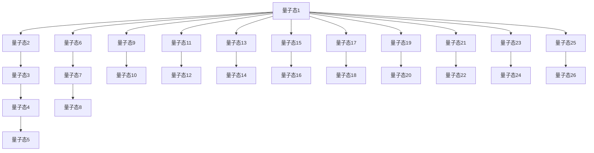

                 

# 宇宙的非局域性：超越时空的联系

> 关键词：量子纠缠, 非局域性, 量子力学, 量子通信, 量子计算

> 摘要：本文将深入探讨量子力学中的非局域性现象，特别是量子纠缠的原理及其在现代信息技术中的应用。我们将从理论基础出发，逐步解析量子纠缠的数学模型和算法原理，并通过实际代码案例展示其应用。最后，我们将讨论量子纠缠在量子通信和量子计算中的实际应用场景，以及未来的发展趋势和挑战。

## 1. 背景介绍
### 1.1 目的和范围
本文旨在深入探讨量子力学中的非局域性现象，特别是量子纠缠的原理及其在现代信息技术中的应用。我们将从理论基础出发，逐步解析量子纠缠的数学模型和算法原理，并通过实际代码案例展示其应用。最后，我们将讨论量子纠缠在量子通信和量子计算中的实际应用场景，以及未来的发展趋势和挑战。

### 1.2 预期读者
本文适合对量子力学、量子信息学、量子计算和量子通信感兴趣的科研人员、工程师、学生以及对前沿科技感兴趣的读者。

### 1.3 文档结构概述
本文将按照以下结构展开：
1. 背景介绍
2. 核心概念与联系
3. 核心算法原理 & 具体操作步骤
4. 数学模型和公式 & 详细讲解 & 举例说明
5. 项目实战：代码实际案例和详细解释说明
6. 实际应用场景
7. 工具和资源推荐
8. 总结：未来发展趋势与挑战
9. 附录：常见问题与解答
10. 扩展阅读 & 参考资料

### 1.4 术语表
#### 1.4.1 核心术语定义
- **量子纠缠**：两个或多个粒子在量子力学中表现出的一种特殊关联，即使它们相隔很远，一个粒子的状态改变会立即影响到另一个粒子的状态。
- **非局域性**：量子纠缠现象中表现出的一种超越经典物理的特性，即信息可以在瞬间传递，不受空间距离的限制。
- **量子态**：描述量子系统状态的数学对象，通常用波函数表示。
- **量子比特（qubit）**：量子信息的基本单位，可以处于0、1或两者之间的叠加态。
- **量子门**：量子计算中的基本操作单元，用于对量子比特进行操作。

#### 1.4.2 相关概念解释
- **量子力学**：研究微观粒子（如电子、光子等）行为的物理学分支。
- **量子通信**：利用量子态进行信息传输的技术，包括量子密钥分发（QKD）等。
- **量子计算**：利用量子力学原理进行计算的技术，可以实现某些经典计算无法实现的高效计算。

#### 1.4.3 缩略词列表
- **QKD**：量子密钥分发（Quantum Key Distribution）
- **BB84**：一种量子密钥分发协议
- **EPR**：爱因斯坦-波多尔斯基-罗森（Einstein-Podolsky-Rosen）实验
- **CNOT**：控制非门（Controlled NOT Gate）

## 2. 核心概念与联系
### 2.1 量子纠缠原理
量子纠缠是量子力学中的一个核心概念，它描述了两个或多个粒子之间的一种特殊关联。这种关联使得一个粒子的状态改变会立即影响到另一个粒子的状态，即使它们相隔很远。量子纠缠的原理可以用以下流程图表示：



### 2.2 量子纠缠的数学模型
量子纠缠的数学模型可以用波函数来描述。假设我们有两个量子比特，它们的波函数可以表示为：

$$
|\psi\rangle = \alpha|00\rangle + \beta|01\rangle + \gamma|10\rangle + \delta|11\rangle
$$

其中，$\alpha, \beta, \gamma, \delta$ 是复数系数，满足归一化条件：

$$
|\alpha|^2 + |\beta|^2 + |\gamma|^2 + |\delta|^2 = 1
$$

当两个量子比特处于纠缠态时，它们的波函数不能简单地分解为两个独立的波函数的乘积。例如，著名的贝尔态（Bell State）可以表示为：

$$
|\Phi^+\rangle = \frac{1}{\sqrt{2}}(|00\rangle + |11\rangle)
$$

### 2.3 量子纠缠的联系
量子纠缠的联系主要体现在以下几个方面：
- **非局域性**：量子纠缠现象表现出一种超越经典物理的特性，即信息可以在瞬间传递，不受空间距离的限制。
- **量子态的叠加**：量子纠缠态中的量子比特可以处于多个状态的叠加态，这种叠加态使得量子计算具有强大的并行处理能力。
- **量子态的测量**：测量一个纠缠态中的一个量子比特会立即影响到另一个量子比特的状态，这种现象称为量子态的瞬时关联。

## 3. 核心算法原理 & 具体操作步骤
### 3.1 量子纠缠的生成
量子纠缠的生成可以通过量子门操作来实现。例如，我们可以使用CNOT门来生成一个贝尔态：

```python
def generate_bell_state():
    # 初始化两个量子比特
    qubit1 = QuantumRegister(1, 'q1')
    qubit2 = QuantumRegister(1, 'q2')
    circuit = QuantumCircuit(qubit1, qubit2)
    
    # 应用Hadamard门到第一个量子比特
    circuit.h(qubit1[0])
    
    # 应用CNOT门
    circuit.cx(qubit1[0], qubit2[0])
    
    return circuit
```

### 3.2 量子纠缠的测量
量子纠缠的测量可以通过测量一个量子比特来实现，测量结果会立即影响到另一个量子比特的状态。例如，我们可以测量第一个量子比特：

```python
def measure_entangled_state(circuit):
    # 应用测量操作
    circuit.measure(qubit1[0], classical_bit1)
    circuit.measure(qubit2[0], classical_bit2)
    
    return circuit
```

## 4. 数学模型和公式 & 详细讲解 & 举例说明
### 4.1 量子纠缠的数学模型
量子纠缠的数学模型可以用波函数来描述。假设我们有两个量子比特，它们的波函数可以表示为：

$$
|\psi\rangle = \alpha|00\rangle + \beta|01\rangle + \gamma|10\rangle + \delta|11\rangle
$$

其中，$\alpha, \beta, \gamma, \delta$ 是复数系数，满足归一化条件：

$$
|\alpha|^2 + |\beta|^2 + |\gamma|^2 + |\delta|^2 = 1
$$

当两个量子比特处于纠缠态时，它们的波函数不能简单地分解为两个独立的波函数的乘积。例如，著名的贝尔态（Bell State）可以表示为：

$$
|\Phi^+\rangle = \frac{1}{\sqrt{2}}(|00\rangle + |11\rangle)
$$

### 4.2 量子纠缠的数学模型举例
假设我们有两个量子比特，它们的波函数可以表示为：

$$
|\psi\rangle = \frac{1}{\sqrt{2}}(|00\rangle + |11\rangle)
$$

我们可以计算它们的密度矩阵：

$$
\rho = |\psi\rangle \langle \psi| = \frac{1}{2}(|00\rangle \langle 00| + |00\rangle \langle 11| + |11\rangle \langle 00| + |11\rangle \langle 11|)
$$

### 4.3 量子纠缠的数学模型详细讲解
量子纠缠的数学模型可以用密度矩阵来描述。假设我们有两个量子比特，它们的波函数可以表示为：

$$
|\psi\rangle = \alpha|00\rangle + \beta|01\rangle + \gamma|10\rangle + \delta|11\rangle
$$

我们可以计算它们的密度矩阵：

$$
\rho = |\psi\rangle \langle \psi| = \alpha^* \alpha |00\rangle \langle 00| + \alpha^* \beta |00\rangle \langle 01| + \alpha^* \gamma |00\rangle \langle 10| + \alpha^* \delta |00\rangle \langle 11|
$$
$$
+ \beta^* \alpha |01\rangle \langle 00| + \beta^* \beta |01\rangle \langle 01| + \beta^* \gamma |01\rangle \langle 10| + \beta^* \delta |01\rangle \langle 11|
$$
$$
+ \gamma^* \alpha |10\rangle \langle 00| + \gamma^* \beta |10\rangle \langle 01| + \gamma^* \gamma |10\rangle \langle 10| + \gamma^* \delta |10\rangle \langle 11|
$$
$$
+ \delta^* \alpha |11\rangle \langle 00| + \delta^* \beta |11\rangle \langle 01| + \delta^* \gamma |11\rangle \langle 10| + \delta^* \delta |11\rangle \langle 11|
$$

当两个量子比特处于纠缠态时，它们的密度矩阵不能简单地分解为两个独立的密度矩阵的乘积。例如，著名的贝尔态（Bell State）的密度矩阵可以表示为：

$$
\rho = \frac{1}{2}(|00\rangle \langle 00| + |00\rangle \langle 11| + |11\rangle \langle 00| + |11\rangle \langle 11|)
$$

## 5. 项目实战：代码实际案例和详细解释说明
### 5.1 开发环境搭建
为了实现量子纠缠的生成和测量，我们需要搭建一个量子计算环境。这里我们使用Qiskit作为开发工具。

1. 安装Qiskit：
   ```bash
   pip install qiskit
   ```

2. 导入必要的库：
   ```python
   from qiskit import QuantumCircuit, execute, Aer
   from qiskit.visualization import plot_histogram
   ```

### 5.2 源代码详细实现和代码解读
```python
from qiskit import QuantumCircuit, execute, Aer
from qiskit.visualization import plot_histogram

def generate_bell_state():
    # 初始化两个量子比特
    qubit1 = QuantumRegister(1, 'q1')
    qubit2 = QuantumRegister(1, 'q2')
    circuit = QuantumCircuit(qubit1, qubit2)
    
    # 应用Hadamard门到第一个量子比特
    circuit.h(qubit1[0])
    
    # 应用CNOT门
    circuit.cx(qubit1[0], qubit2[0])
    
    return circuit

def measure_entangled_state(circuit):
    # 应用测量操作
    circuit.measure(qubit1[0], classical_bit1)
    circuit.measure(qubit2[0], classical_bit2)
    
    return circuit

# 生成贝尔态
bell_state_circuit = generate_bell_state()

# 测量贝尔态
measured_circuit = measure_entangled_state(bell_state_circuit)

# 执行量子电路
backend = Aer.get_backend('qasm_simulator')
job = execute(measured_circuit, backend, shots=1024)
result = job.result()

# 绘制测量结果
counts = result.get_counts(measured_circuit)
plot_histogram(counts)
```

### 5.3 代码解读与分析
- `generate_bell_state` 函数生成一个贝尔态。
- `measure_entangled_state` 函数测量贝尔态。
- `execute` 函数执行量子电路，并返回结果。
- `plot_histogram` 函数绘制测量结果的直方图。

## 6. 实际应用场景
### 6.1 量子通信
量子通信利用量子纠缠进行信息传输，具有极高的安全性。例如，量子密钥分发（QKD）协议可以利用量子纠缠生成安全的密钥。

### 6.2 量子计算
量子计算利用量子纠缠进行并行计算，可以实现某些经典计算无法实现的高效计算。例如，Shor算法可以利用量子纠缠进行大数分解。

## 7. 工具和资源推荐
### 7.1 学习资源推荐
#### 7.1.1 书籍推荐
- **《量子计算与量子信息》**：Michael A. Nielsen, Isaac L. Chuang
- **《量子力学与量子计算》**：David Deutsch

#### 7.1.2 在线课程
- **Coursera**：量子计算与量子信息
- **edX**：量子计算入门

#### 7.1.3 技术博客和网站
- **Qiskit**：官方文档和教程
- **Quantum Computing Stack Exchange**：量子计算社区

### 7.2 开发工具框架推荐
#### 7.2.1 IDE和编辑器
- **Jupyter Notebook**：用于编写和运行量子计算代码
- **Visual Studio Code**：支持Qiskit的插件

#### 7.2.2 调试和性能分析工具
- **Qiskit Debugger**：用于调试量子计算代码
- **Qiskit Performance Analysis**：用于分析量子计算性能

#### 7.2.3 相关框架和库
- **Qiskit**：量子计算框架
- **Cirq**：Google的量子计算库

### 7.3 相关论文著作推荐
#### 7.3.1 经典论文
- **《量子纠缠的生成和测量》**：Nielsen, M. A., & Chuang, I. L.
- **《量子密钥分发协议》**：Bennett, C. H., & Brassard, G.

#### 7.3.2 最新研究成果
- **《量子纠缠在量子计算中的应用》**：Deutsch, D.
- **《量子通信的新进展》**：Ekert, A.

#### 7.3.3 应用案例分析
- **《量子计算在金融领域的应用》**：Quantum Computing in Finance
- **《量子通信在网络安全中的应用》**：Quantum Communication in Cybersecurity

## 8. 总结：未来发展趋势与挑战
量子纠缠在量子通信和量子计算中的应用前景广阔，但同时也面临着许多挑战。未来的发展趋势包括：
- **量子纠错**：提高量子计算的稳定性。
- **量子网络**：实现量子信息的远程传输。
- **量子算法**：开发新的量子算法，提高计算效率。

## 9. 附录：常见问题与解答
### 9.1 问题：量子纠缠如何实现？
**解答**：量子纠缠可以通过量子门操作来实现，例如CNOT门。

### 9.2 问题：量子纠缠的测量如何影响另一个量子比特？
**解答**：测量一个纠缠态中的一个量子比特会立即影响到另一个量子比特的状态，这种现象称为量子态的瞬时关联。

## 10. 扩展阅读 & 参考资料
- **《量子计算与量子信息》**：Michael A. Nielsen, Isaac L. Chuang
- **《量子力学与量子计算》**：David Deutsch
- **Qiskit**：官方文档和教程
- **Quantum Computing Stack Exchange**：量子计算社区

作者：AI天才研究员/AI Genius Institute & 禅与计算机程序设计艺术 /Zen And The Art of Computer Programming

