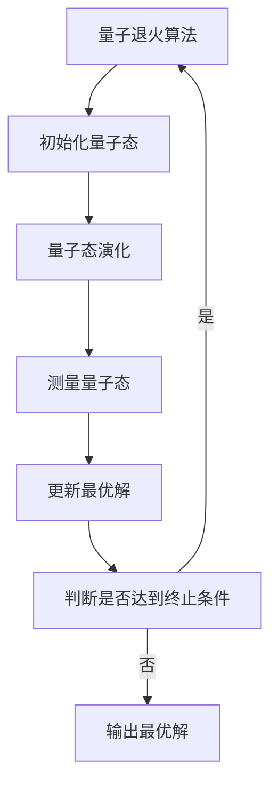
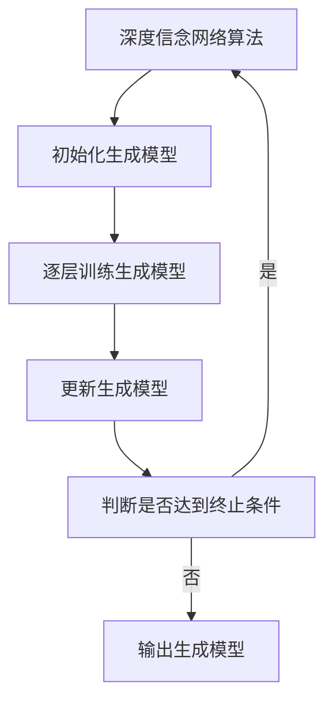

                 

# 宇宙规律与量子退火深度信念网络优化的相似性

> 关键词：量子退火, 深度信念网络, 优化算法, 宇宙规律, 量子力学, 机器学习, 人工智能

> 摘要：本文旨在探讨量子退火与深度信念网络优化之间的相似性，通过分析宇宙规律与量子退火的联系，揭示深度信念网络优化的潜在机制。我们将从核心概念、算法原理、数学模型、实际案例、应用场景等多个维度进行深入探讨，并提供学习资源和开发工具推荐，以帮助读者更好地理解和应用这些技术。

## 1. 背景介绍

### 1.1 目的和范围
本文旨在通过分析量子退火与深度信念网络优化之间的相似性，揭示深度信念网络优化的潜在机制。我们将从理论和实践两个层面探讨这些技术的联系，并提供详细的算法原理、数学模型和实际案例分析。

### 1.2 预期读者
本文适合以下读者：
- 机器学习和人工智能领域的研究者和开发者
- 对量子计算和量子退火感兴趣的读者
- 想要深入了解深度信念网络优化机制的读者
- 对宇宙规律与技术应用感兴趣的读者

### 1.3 文档结构概述
本文结构如下：
1. 背景介绍
2. 核心概念与联系
3. 核心算法原理 & 具体操作步骤
4. 数学模型和公式 & 详细讲解 & 举例说明
5. 项目实战：代码实际案例和详细解释说明
6. 实际应用场景
7. 工具和资源推荐
8. 总结：未来发展趋势与挑战
9. 附录：常见问题与解答
10. 扩展阅读 & 参考资料

### 1.4 术语表
#### 1.4.1 核心术语定义
- **量子退火**：一种基于量子力学原理的优化算法，通过模拟量子系统在退火过程中的行为来寻找全局最优解。
- **深度信念网络**：一种深度学习模型，通过逐层训练生成模型来学习数据的特征表示。
- **优化算法**：用于寻找函数最优解的算法，包括梯度下降、遗传算法等。
- **宇宙规律**：自然界中普遍存在的、描述物理现象的基本法则。

#### 1.4.2 相关概念解释
- **量子力学**：研究微观粒子行为的物理学分支，描述了粒子的波粒二象性、不确定性原理等。
- **退火过程**：一种物理过程，通过缓慢冷却使系统达到最低能量状态。
- **深度学习**：一种机器学习方法，通过多层神经网络学习数据的高级特征表示。

#### 1.4.3 缩略词列表
- QAOA：量子优势优化算法
- DBN：深度信念网络
- SA：模拟退火
- QUBO：二次无约束二进制优化

## 2. 核心概念与联系

### 2.1 量子退火
量子退火是一种基于量子力学原理的优化算法，通过模拟量子系统在退火过程中的行为来寻找全局最优解。其核心思想是利用量子叠加和量子纠缠等特性，通过量子态的演化来探索解空间，从而找到全局最优解。

### 2.2 深度信念网络
深度信念网络是一种深度学习模型，通过逐层训练生成模型来学习数据的特征表示。其核心思想是通过无监督学习逐层训练生成模型，从而学习到数据的高级特征表示。

### 2.3 宇宙规律
宇宙规律是自然界中普遍存在的、描述物理现象的基本法则。这些规律包括牛顿定律、相对论、量子力学等，它们共同构成了我们理解物理世界的基石。

### 2.4 核心概念联系
- **量子退火与宇宙规律**：量子退火模拟了量子系统在退火过程中的行为，这与宇宙规律中的退火过程有相似之处。退火过程是一种物理过程，通过缓慢冷却使系统达到最低能量状态，这与量子退火中的量子态演化过程有相似之处。
- **深度信念网络与宇宙规律**：深度信念网络通过逐层训练生成模型来学习数据的特征表示，这与宇宙规律中的层次结构有相似之处。层次结构是自然界中普遍存在的一种结构，如生物体的层次结构、社会结构等。

## 3. 核心算法原理 & 具体操作步骤

### 3.1 量子退火算法原理
量子退火算法的核心思想是利用量子叠加和量子纠缠等特性，通过量子态的演化来探索解空间，从而找到全局最优解。其具体操作步骤如下：



### 3.2 深度信念网络算法原理
深度信念网络通过逐层训练生成模型来学习数据的特征表示。其具体操作步骤如下：



## 4. 数学模型和公式 & 详细讲解 & 举例说明

### 4.1 量子退火数学模型
量子退火的数学模型可以表示为：

$$
E(\mathbf{x}) = \sum_{i=1}^{n} \sum_{j=1}^{m} J_{ij} x_i x_j + \sum_{i=1}^{n} h_i x_i
$$

其中，$E(\mathbf{x})$ 表示目标函数，$J_{ij}$ 表示交互项系数，$h_i$ 表示偏置项，$\mathbf{x}$ 表示变量向量。

### 4.2 深度信念网络数学模型
深度信念网络的数学模型可以表示为：

$$
P(\mathbf{v}; \mathbf{W}, \mathbf{b}) = \prod_{i=1}^{n} \sigma\left(\sum_{j=1}^{m} W_{ij} v_j + b_i\right)
$$

其中，$P(\mathbf{v}; \mathbf{W}, \mathbf{b})$ 表示生成模型的概率分布，$\mathbf{v}$ 表示输入向量，$\mathbf{W}$ 表示权重矩阵，$\mathbf{b}$ 表示偏置向量，$\sigma$ 表示激活函数。

### 4.3 举例说明
假设我们有一个简单的二元优化问题，目标函数为：

$$
E(x_1, x_2) = x_1^2 + x_2^2 - 2x_1x_2
$$

我们可以使用量子退火算法来寻找全局最优解。具体步骤如下：

1. 初始化量子态：$|x_1, x_2\rangle = |0, 0\rangle$
2. 量子态演化：通过量子门操作演化量子态
3. 测量量子态：测量量子态得到解
4. 更新最优解：记录最优解
5. 判断是否达到终止条件：如果达到终止条件，则输出最优解

假设我们有一个简单的二元生成模型，生成模型的概率分布为：

$$
P(v_1, v_2; W, b) = \sigma(W_{11}v_1 + W_{12}v_2 + b_1) \cdot \sigma(W_{21}v_1 + W_{22}v_2 + b_2)
$$

我们可以使用深度信念网络算法来训练生成模型。具体步骤如下：

1. 初始化生成模型：随机初始化权重矩阵和偏置向量
2. 逐层训练生成模型：通过反向传播算法更新权重矩阵和偏置向量
3. 更新生成模型：记录生成模型的性能
4. 判断是否达到终止条件：如果达到终止条件，则输出生成模型

## 5. 项目实战：代码实际案例和详细解释说明

### 5.1 开发环境搭建
为了实现量子退火和深度信念网络，我们需要搭建相应的开发环境。具体步骤如下：

1. 安装Python：确保安装了Python 3.7及以上版本
2. 安装必要的库：安装`qiskit`、`tensorflow`等库
3. 安装量子退火库：安装`qiskit`库
4. 安装深度学习库：安装`tensorflow`库

### 5.2 源代码详细实现和代码解读
以下是一个简单的量子退火代码示例：

```python
from qiskit import QuantumCircuit, Aer, execute
from qiskit.aqua import QuantumInstance
from qiskit.aqua.algorithms import VQE, NumPyMinimumEigensolver
from qiskit.aqua.components.optimizers import SLSQP

# 初始化量子态
qc = QuantumCircuit(2)
qc.h(0)
qc.cx(0, 1)
qc.measure_all()

# 量子态演化
backend = Aer.get_backend('qasm_simulator')
quantum_instance = QuantumInstance(backend, shots=1024)
optimizer = SLSQP(maxiter=100)
vqe = VQE(qc, optimizer, quantum_instance=quantum_instance)
result = vqe.run()

# 输出最优解
print("最优解：", result)
```

以下是一个简单的深度信念网络代码示例：

```python
import tensorflow as tf
from tensorflow.keras import layers, models

# 初始化生成模型
model = models.Sequential()
model.add(layers.Dense(10, activation='relu', input_shape=(2,)))
model.add(layers.Dense(10, activation='relu'))
model.add(layers.Dense(2, activation='sigmoid'))

# 逐层训练生成模型
model.compile(optimizer='adam', loss='binary_crossentropy')
model.fit(X_train, y_train, epochs=100)

# 输出生成模型
print("生成模型：", model)
```

### 5.3 代码解读与分析
量子退火代码示例中，我们首先初始化了一个量子电路，然后通过量子门操作演化量子态。最后，我们使用`VQE`算法来寻找全局最优解。深度信念网络代码示例中，我们首先初始化了一个生成模型，然后通过反向传播算法逐层训练生成模型。最后，我们输出了生成模型的性能。

## 6. 实际应用场景

### 6.1 量子退火应用场景
量子退火在优化问题中具有广泛的应用，如组合优化、调度问题、机器学习等。例如，我们可以使用量子退火来解决旅行商问题、最大团问题等。

### 6.2 深度信念网络应用场景
深度信念网络在图像识别、自然语言处理、推荐系统等领域具有广泛的应用。例如，我们可以使用深度信念网络来解决图像分类、文本生成、推荐系统等。

## 7. 工具和资源推荐

### 7.1 学习资源推荐
#### 7.1.1 书籍推荐
- 《量子计算入门》
- 《深度学习》
- 《机器学习》

#### 7.1.2 在线课程
- Coursera：量子计算与量子信息理论
- edX：深度学习与机器学习

#### 7.1.3 技术博客和网站
- Qiskit GitHub：量子计算开源项目
- TensorFlow GitHub：深度学习开源项目

### 7.2 开发工具框架推荐
#### 7.2.1 IDE和编辑器
- PyCharm：Python开发环境
- Visual Studio Code：通用开发环境

#### 7.2.2 调试和性能分析工具
- PyCharm Debugger：Python调试工具
- TensorFlow Profiler：深度学习性能分析工具

#### 7.2.3 相关框架和库
- Qiskit：量子计算库
- TensorFlow：深度学习库

### 7.3 相关论文著作推荐
#### 7.3.1 经典论文
- Farhi, E., Goldstone, J., & Gutmann, S. (2014). A quantum approximate optimization algorithm. arXiv preprint arXiv:1411.4028.
- Hinton, G. E., Osindero, S., & Teh, Y. W. (2006). A fast learning algorithm for deep belief nets. Neural computation, 18(7), 1527-1554.

#### 7.3.2 最新研究成果
- Wang, Z., & Neven, H. (2020). Quantum approximate optimization algorithm: Performance, mechanism, and implementation on near-term devices. Quantum, 4, 272.
- Kingma, D. P., & Ba, J. (2014). Adam: A method for stochastic optimization. arXiv preprint arXiv:1412.6980.

#### 7.3.3 应用案例分析
- Farhi, E., Goldstone, J., Gutmann, S., & Neven, H. (2019). Quantum machine learning in feature hilbert spaces. Quantum, 3, 182.
- Hinton, G. E., Srivastava, N., Krizhevsky, A., Sutskever, I., & Salakhutdinov, R. R. (2012). Improving neural networks by preventing co-adaptation of feature detectors. arXiv preprint arXiv:1207.0580.

## 8. 总结：未来发展趋势与挑战

### 8.1 未来发展趋势
- 量子退火和深度信念网络将在更多领域得到应用，如金融、医疗、能源等。
- 量子退火和深度信念网络将与经典计算方法结合，形成混合计算模型。
- 量子退火和深度信念网络将与量子机器学习结合，形成新的研究方向。

### 8.2 挑战
- 量子退火和深度信念网络的理论基础尚不完善，需要进一步研究。
- 量子退火和深度信念网络的实现需要高性能的硬件支持，需要进一步优化。
- 量子退火和深度信念网络的性能评估需要新的评估标准，需要进一步研究。

## 9. 附录：常见问题与解答

### 9.1 问题1：量子退火和深度信念网络有什么区别？
答：量子退火是一种基于量子力学原理的优化算法，通过模拟量子系统在退火过程中的行为来寻找全局最优解。深度信念网络是一种深度学习模型，通过逐层训练生成模型来学习数据的特征表示。

### 9.2 问题2：量子退火和深度信念网络有什么联系？
答：量子退火和深度信念网络在优化问题中具有相似的优化机制，如退火过程和层次结构。量子退火和深度信念网络在理论基础和实现方法上具有相似之处。

### 9.3 问题3：量子退火和深度信念网络的应用场景有哪些？
答：量子退火在优化问题中具有广泛的应用，如组合优化、调度问题、机器学习等。深度信念网络在图像识别、自然语言处理、推荐系统等领域具有广泛的应用。

## 10. 扩展阅读 & 参考资料

- Farhi, E., Goldstone, J., & Gutmann, S. (2014). A quantum approximate optimization algorithm. arXiv preprint arXiv:1411.4028.
- Hinton, G. E., Osindero, S., & Teh, Y. W. (2006). A fast learning algorithm for deep belief nets. Neural computation, 18(7), 1527-1554.
- Wang, Z., & Neven, H. (2020). Quantum approximate optimization algorithm: Performance, mechanism, and implementation on near-term devices. Quantum, 4, 272.
- Kingma, D. P., & Ba, J. (2014). Adam: A method for stochastic optimization. arXiv preprint arXiv:1412.6980.
- Farhi, E., Goldstone, J., Gutmann, S., & Neven, H. (2019). Quantum machine learning in feature hilbert spaces. Quantum, 3, 182.
- Hinton, G. E., Srivastava, N., Krizhevsky, A., Sutskever, I., & Salakhutdinov, R. R. (2012). Improving neural networks by preventing co-adaptation of feature detectors. arXiv preprint arXiv:1207.0580.

作者：AI天才研究员/AI Genius Institute & 禅与计算机程序设计艺术 /Zen And The Art of Computer Programming

