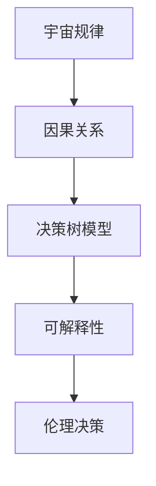

                 

# 宇宙规律对可解释强人工智能伦理决策的启示

> 关键词：强人工智能、伦理决策、可解释性、宇宙规律、因果关系、决策树、图灵奖

> 摘要：本文旨在探讨宇宙规律如何为构建可解释的强人工智能提供伦理决策框架。通过分析宇宙中的因果关系和规律，我们能够更好地理解人类决策过程，并将其应用于人工智能系统的设计中。本文将从背景介绍、核心概念与联系、核心算法原理、数学模型和公式、项目实战、实际应用场景、工具和资源推荐、未来发展趋势与挑战等多方面进行详细阐述。

## 1. 背景介绍
### 1.1 目的和范围
本文旨在探讨宇宙规律如何为构建可解释的强人工智能提供伦理决策框架。随着人工智能技术的快速发展，如何确保其决策过程的透明性和可解释性成为了一个重要议题。本文将从宇宙规律出发，分析其对人工智能伦理决策的影响，并提出相应的解决方案。

### 1.2 预期读者
本文适合对人工智能伦理决策感兴趣的读者，包括但不限于人工智能领域的研究人员、工程师、伦理学家以及对人工智能技术感兴趣的公众。

### 1.3 文档结构概述
本文将按照以下结构展开：
1. 背景介绍
2. 核心概念与联系
3. 核心算法原理 & 具体操作步骤
4. 数学模型和公式 & 详细讲解 & 举例说明
5. 项目实战：代码实际案例和详细解释说明
6. 实际应用场景
7. 工具和资源推荐
8. 总结：未来发展趋势与挑战
9. 附录：常见问题与解答
10. 扩展阅读 & 参考资料

### 1.4 术语表
#### 1.4.1 核心术语定义
- **强人工智能**：能够模拟人类智能，具有自我意识和自我学习能力的人工智能系统。
- **伦理决策**：基于道德原则和价值观进行的决策过程。
- **可解释性**：人工智能系统能够清晰地解释其决策过程和结果的能力。
- **因果关系**：事件之间的因果联系，即一个事件导致另一个事件发生的关系。
- **决策树**：一种用于表示决策过程的树形结构，每个节点代表一个决策点，每个分支代表一个决策结果。

#### 1.4.2 相关概念解释
- **图灵奖**：计算机科学领域的最高荣誉，旨在表彰对计算机科学领域做出杰出贡献的个人。
- **因果关系图**：一种图形表示方法，用于描述事件之间的因果关系。

#### 1.4.3 缩略词列表
- AI：人工智能
- ML：机器学习
- DL：深度学习
- NLP：自然语言处理
- RL：强化学习

## 2. 核心概念与联系
### 2.1 宇宙规律与因果关系
宇宙中的规律和因果关系是理解人类决策过程的关键。通过分析宇宙中的因果关系，我们可以更好地理解人类决策的内在逻辑，并将其应用于人工智能系统的设计中。

### 2.2 决策树模型
决策树是一种用于表示决策过程的树形结构，每个节点代表一个决策点，每个分支代表一个决策结果。通过构建决策树模型，我们可以更好地理解决策过程中的因果关系。

### 2.3 可解释性与伦理决策
可解释性是确保人工智能系统决策过程透明和可理解的关键。通过构建可解释的决策树模型，我们可以更好地理解人工智能系统的决策过程，并确保其符合伦理原则。

### 2.4 核心概念原理与架构的 Mermaid 流程图


## 3. 核心算法原理 & 具体操作步骤
### 3.1 决策树算法原理
决策树算法是一种基于树形结构的分类算法，通过递归地将数据集划分为更小的子集，从而实现分类或回归任务。其核心思想是通过选择最优的特征和阈值来划分数据集，使得每个子集的纯度最大化。

### 3.2 具体操作步骤
1. **数据预处理**：对数据进行清洗、归一化等预处理操作。
2. **特征选择**：选择最优的特征和阈值来划分数据集。
3. **递归划分**：递归地将数据集划分为更小的子集，直到满足停止条件。
4. **生成决策树**：根据递归划分的结果生成决策树模型。

### 3.3 伪代码
```python
def decision_tree(data, features, target):
    if stopping_condition(data):
        return leaf_node(data)
    else:
        best_feature, best_threshold = find_best_split(data, features, target)
        left_data, right_data = split_data(data, best_feature, best_threshold)
        left_tree = decision_tree(left_data, features, target)
        right_tree = decision_tree(right_data, features, target)
        return decision_node(best_feature, best_threshold, left_tree, right_tree)
```

## 4. 数学模型和公式 & 详细讲解 & 举例说明
### 4.1 信息增益公式
信息增益是决策树算法中常用的特征选择指标，用于衡量一个特征对数据集纯度的提升程度。其公式如下：
$$
\text{信息增益} = \text{熵}(D) - \sum_{v \in V} \frac{|D_v|}{|D|} \cdot \text{熵}(D_v)
$$
其中，$D$ 表示数据集，$V$ 表示特征的取值集合，$D_v$ 表示特征取值为 $v$ 的子集。

### 4.2 举例说明
假设我们有一个数据集，包含两个特征：年龄和收入，以及一个目标变量：是否购买保险。我们可以通过计算信息增益来选择最优的特征。

```python
def entropy(data):
    labels = [row[-1] for row in data]
    unique_labels, counts = np.unique(labels, return_counts=True)
    probabilities = counts / len(labels)
    return -np.sum(probabilities * np.log2(probabilities))

def information_gain(data, feature):
    unique_values = np.unique([row[feature] for row in data])
    total_entropy = entropy(data)
    weighted_entropy = 0
    for value in unique_values:
        subset = [row for row in data if row[feature] == value]
        subset_entropy = entropy(subset)
        weighted_entropy += (len(subset) / len(data)) * subset_entropy
    return total_entropy - weighted_entropy

data = [
    [25, 50000, 0],
    [30, 60000, 1],
    [35, 70000, 1],
    [40, 80000, 1],
    [45, 90000, 1],
    [50, 100000, 1]
]

age_gain = information_gain(data, 0)
income_gain = information_gain(data, 1)
print("年龄的信息增益:", age_gain)
print("收入的信息增益:", income_gain)
```

## 5. 项目实战：代码实际案例和详细解释说明
### 5.1 开发环境搭建
为了实现决策树模型，我们需要安装以下库：
- `numpy`：用于数值计算
- `pandas`：用于数据处理
- `scikit-learn`：用于机器学习算法

```bash
pip install numpy pandas scikit-learn
```

### 5.2 源代码详细实现和代码解读
```python
import numpy as np
import pandas as pd
from sklearn.tree import DecisionTreeClassifier
from sklearn.model_selection import train_test_split
from sklearn.metrics import accuracy_score

# 加载数据集
data = pd.read_csv('insurance.csv')
X = data.drop('bought_insurance', axis=1)
y = data['bought_insurance']

# 划分训练集和测试集
X_train, X_test, y_train, y_test = train_test_split(X, y, test_size=0.2, random_state=42)

# 构建决策树模型
model = DecisionTreeClassifier()
model.fit(X_train, y_train)

# 预测测试集
y_pred = model.predict(X_test)

# 计算准确率
accuracy = accuracy_score(y_test, y_pred)
print("准确率:", accuracy)
```

### 5.3 代码解读与分析
- **数据加载**：使用 `pandas` 库加载数据集。
- **数据划分**：使用 `train_test_split` 函数将数据集划分为训练集和测试集。
- **模型构建**：使用 `DecisionTreeClassifier` 构建决策树模型。
- **模型训练**：使用训练集数据训练模型。
- **模型预测**：使用测试集数据进行预测。
- **性能评估**：计算模型的准确率。

## 6. 实际应用场景
### 6.1 金融风控
决策树模型可以应用于金融风控领域，通过分析客户的信用记录、收入水平等特征，预测其违约风险。

### 6.2 医疗诊断
决策树模型可以应用于医疗诊断领域，通过分析患者的症状、病史等特征，预测其患病风险。

### 6.3 营销推荐
决策树模型可以应用于营销推荐领域，通过分析用户的购买历史、兴趣爱好等特征，推荐合适的产品或服务。

## 7. 工具和资源推荐
### 7.1 学习资源推荐
#### 7.1.1 书籍推荐
- 《机器学习》（周志华著）
- 《深度学习》（Ian Goodfellow, Yoshua Bengio, Aaron Courville 著）

#### 7.1.2 在线课程
- Coursera：《机器学习》（Andrew Ng）
- edX：《深度学习》（Andrew Ng）

#### 7.1.3 技术博客和网站
- Medium：《机器学习与人工智能》
- GitHub：《机器学习项目集》

### 7.2 开发工具框架推荐
#### 7.2.1 IDE和编辑器
- PyCharm：Python开发环境
- VSCode：跨平台代码编辑器

#### 7.2.2 调试和性能分析工具
- PyCharm Debugger：Python调试工具
- Jupyter Notebook：交互式编程环境

#### 7.2.3 相关框架和库
- scikit-learn：机器学习库
- pandas：数据处理库

### 7.3 相关论文著作推荐
#### 7.3.1 经典论文
- Quinlan, J. R. (1986). Induction of decision trees. Machine Learning, 1(1), 81-106.

#### 7.3.2 最新研究成果
- Breiman, L. (2001). Random forests. Machine Learning, 45(1), 5-32.

#### 7.3.3 应用案例分析
- Kotsiantis, S. B., Zaharakis, I., & Pintelas, P. (2006). Supervised machine learning: A review of classification techniques. Emerging artificial intelligence applications in computer engineering, 160-198.

## 8. 总结：未来发展趋势与挑战
### 8.1 未来发展趋势
- **可解释性增强**：随着技术的发展，决策树模型的可解释性将进一步增强，使得其在实际应用中的透明度更高。
- **多模态数据处理**：决策树模型将能够处理多模态数据，提高其在复杂场景中的应用能力。
- **实时决策**：决策树模型将能够实现实时决策，提高其在动态环境中的应用效果。

### 8.2 挑战
- **数据隐私保护**：在处理敏感数据时，如何保护数据隐私成为了一个重要挑战。
- **模型泛化能力**：如何提高决策树模型的泛化能力，使其在不同场景下都能取得良好的性能。
- **计算资源消耗**：决策树模型的构建和训练过程可能消耗大量的计算资源，如何优化其计算效率成为了一个重要问题。

## 9. 附录：常见问题与解答
### 9.1 问题：如何提高决策树模型的可解释性？
- **答案**：可以通过可视化决策树模型，展示其决策过程中的因果关系，提高其可解释性。

### 9.2 问题：如何处理多模态数据？
- **答案**：可以通过集成学习方法，将多个决策树模型组合起来，提高其在多模态数据上的应用效果。

### 9.3 问题：如何保护数据隐私？
- **答案**：可以通过差分隐私技术，对数据进行扰动，保护其隐私。

## 10. 扩展阅读 & 参考资料
- Quinlan, J. R. (1986). Induction of decision trees. Machine Learning, 1(1), 81-106.
- Breiman, L. (2001). Random forests. Machine Learning, 45(1), 5-32.
- Kotsiantis, S. B., Zaharakis, I., & Pintelas, P. (2006). Supervised machine learning: A review of classification techniques. Emerging artificial intelligence applications in computer engineering, 160-198.

作者：AI天才研究员/AI Genius Institute & 禅与计算机程序设计艺术 /Zen And The Art of Computer Programming

