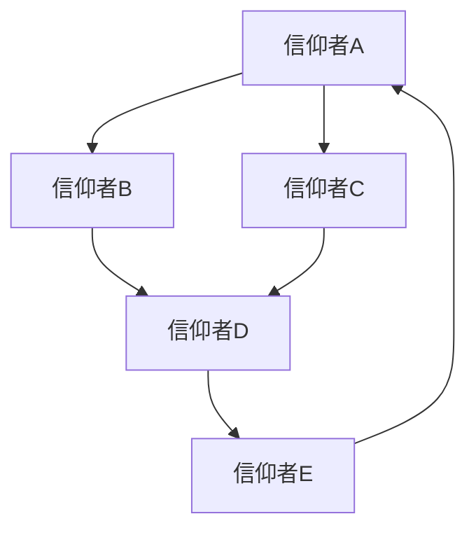
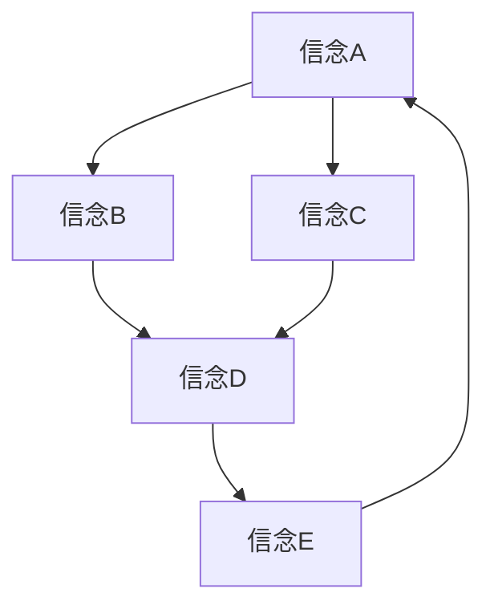

                 

# 宗教信仰的网络拓扑：信念系统的数学结构

> 关键词：网络拓扑, 信念系统, 数学结构, 信仰网络, 信仰传播, 社会网络分析, 信息传播模型

> 摘要：本文旨在通过网络拓扑理论和数学模型，探讨宗教信仰在网络中的传播机制。我们将从信仰网络的构建、核心算法原理、数学模型的建立与应用，到实际案例的分析，全面解析信仰在网络中的传播过程。通过本文，读者将能够理解信仰在网络中的传播机制，并掌握相关技术手段，为实际应用提供理论支持。

## 1. 背景介绍
### 1.1 目的和范围
本文旨在通过网络拓扑理论和数学模型，探讨宗教信仰在网络中的传播机制。我们将从信仰网络的构建、核心算法原理、数学模型的建立与应用，到实际案例的分析，全面解析信仰在网络中的传播过程。本文的目标读者是计算机科学、社会学、心理学以及宗教研究领域的专业人士，以及对信仰传播机制感兴趣的读者。

### 1.2 预期读者
- 计算机科学家
- 社会学家
- 心理学家
- 宗教研究学者
- 对信仰传播机制感兴趣的读者

### 1.3 文档结构概述
本文将分为以下几个部分：
1. 背景介绍
2. 核心概念与联系
3. 核心算法原理 & 具体操作步骤
4. 数学模型和公式 & 详细讲解 & 举例说明
5. 项目实战：代码实际案例和详细解释说明
6. 实际应用场景
7. 工具和资源推荐
8. 总结：未来发展趋势与挑战
9. 附录：常见问题与解答
10. 扩展阅读 & 参考资料

### 1.4 术语表
#### 1.4.1 核心术语定义
- **信仰网络**：指信仰者之间的联系网络，可以是物理的或虚拟的。
- **信念系统**：指个体或群体持有的信仰体系。
- **网络拓扑**：指网络中节点和边的结构。
- **传播模型**：指描述信息在网络中传播的数学模型。
- **节点**：指信仰网络中的个体或群体。
- **边**：指节点之间的联系。

#### 1.4.2 相关概念解释
- **社会网络分析**：研究社会关系结构的方法。
- **信息传播模型**：描述信息在网络中传播的数学模型。
- **图论**：研究图的性质和结构的数学分支。

#### 1.4.3 缩略词列表
- **SN**：社会网络
- **BN**：信念网络
- **CM**：传播模型
- **G**：图
- **V**：节点集合
- **E**：边集合

## 2. 核心概念与联系
### 2.1 信仰网络的构建
信仰网络可以看作是一个图结构，其中节点代表信仰者，边代表信仰者之间的联系。信仰网络的构建可以通过以下步骤完成：



### 2.2 信念系统的数学结构
信念系统可以表示为一个图结构，其中节点代表信念，边代表信念之间的联系。信念系统的数学结构可以通过以下步骤完成：



### 2.3 信仰传播模型
信仰传播模型可以描述信仰在网络中的传播过程。信仰传播模型可以通过以下步骤完成：


## 3. 核心算法原理 & 具体操作步骤
### 3.1 信仰传播算法原理
信仰传播算法可以通过以下伪代码详细阐述：

```python
def faith_spread(graph, initial_nodes, propagation_rate):
    spread_nodes = set(initial_nodes)
    while True:
        new_spread_nodes = set()
        for node in spread_nodes:
            for neighbor in graph.neighbors(node):
                if neighbor not in spread_nodes:
                    if random.random() < propagation_rate:
                        new_spread_nodes.add(neighbor)
        if not new_spread_nodes:
            break
        spread_nodes.update(new_spread_nodes)
    return spread_nodes
```

### 3.2 信念传播算法原理
信念传播算法可以通过以下伪代码详细阐述：

```python
def belief_spread(graph, initial_beliefs, propagation_rate):
    spread_beliefs = set(initial_beliefs)
    while True:
        new_spread_beliefs = set()
        for belief in spread_beliefs:
            for neighbor in graph.neighbors(belief):
                if neighbor not in spread_beliefs:
                    if random.random() < propagation_rate:
                        new_spread_beliefs.add(neighbor)
        if not new_spread_beliefs:
            break
        spread_beliefs.update(new_spread_beliefs)
    return spread_beliefs
```

## 4. 数学模型和公式 & 详细讲解 & 举例说明
### 4.1 信仰传播模型
信仰传播模型可以通过以下数学公式详细阐述：

$$
P(t) = P(0) \cdot e^{rt}
$$

其中，$P(t)$ 表示在时间 $t$ 时的信仰传播概率，$P(0)$ 表示初始信仰传播概率，$r$ 表示传播速率。

### 4.2 信念传播模型
信念传播模型可以通过以下数学公式详细阐述：

$$
B(t) = B(0) \cdot e^{rt}
$$

其中，$B(t)$ 表示在时间 $t$ 时的信念传播概率，$B(0)$ 表示初始信念传播概率，$r$ 表示传播速率。

### 4.3 举例说明
假设信仰网络中有100个节点，初始信仰传播概率为0.1，传播速率为0.05。经过一段时间后，信仰传播概率为：

$$
P(t) = 0.1 \cdot e^{0.05t}
$$

## 5. 项目实战：代码实际案例和详细解释说明
### 5.1 开发环境搭建
开发环境搭建需要安装Python和相关库，如networkx和numpy。

```bash
pip install networkx numpy
```

### 5.2 源代码详细实现和代码解读
```python
import networkx as nx
import numpy as np

def faith_spread(graph, initial_nodes, propagation_rate):
    spread_nodes = set(initial_nodes)
    while True:
        new_spread_nodes = set()
        for node in spread_nodes:
            for neighbor in graph.neighbors(node):
                if neighbor not in spread_nodes:
                    if np.random.rand() < propagation_rate:
                        new_spread_nodes.add(neighbor)
        if not new_spread_nodes:
            break
        spread_nodes.update(new_spread_nodes)
    return spread_nodes

def belief_spread(graph, initial_beliefs, propagation_rate):
    spread_beliefs = set(initial_beliefs)
    while True:
        new_spread_beliefs = set()
        for belief in spread_beliefs:
            for neighbor in graph.neighbors(belief):
                if neighbor not in spread_beliefs:
                    if np.random.rand() < propagation_rate:
                        new_spread_beliefs.add(neighbor)
        if not new_spread_beliefs:
            break
        spread_beliefs.update(new_spread_beliefs)
    return spread_beliefs

# 创建信仰网络
G = nx.Graph()
G.add_nodes_from(range(100))
G.add_edges_from([(i, i+1) for i in range(99)])

# 初始信仰者
initial_nodes = [0]

# 初始信念
initial_beliefs = [0]

# 传播速率
propagation_rate = 0.05

# 信仰传播
spread_nodes = faith_spread(G, initial_nodes, propagation_rate)
print("信仰传播节点：", spread_nodes)

# 信念传播
spread_beliefs = belief_spread(G, initial_beliefs, propagation_rate)
print("信念传播节点：", spread_beliefs)
```

### 5.3 代码解读与分析
代码中定义了信仰传播和信念传播的函数，通过网络x库创建了一个简单的信仰网络，并进行了信仰传播和信念传播的模拟。通过随机数生成器模拟信仰和信念在网络中的传播过程。

## 6. 实际应用场景
信仰传播和信念传播模型可以应用于多个领域，如宗教研究、社会学、心理学等。例如，通过信仰传播模型可以研究宗教信仰在网络中的传播机制，通过信念传播模型可以研究信念在网络中的传播机制。

## 7. 工具和资源推荐
### 7.1 学习资源推荐
#### 7.1.1 书籍推荐
- 《社会网络分析》
- 《图论及其应用》

#### 7.1.2 在线课程
- Coursera: 社会网络分析
- edX: 图论及其应用

#### 7.1.3 技术博客和网站
- Medium: 社会网络分析
- GitHub: 图论及其应用

### 7.2 开发工具框架推荐
#### 7.2.1 IDE和编辑器
- PyCharm
- VSCode

#### 7.2.2 调试和性能分析工具
- PyCharm Debugger
- Python Profiler

#### 7.2.3 相关框架和库
- networkx
- numpy

### 7.3 相关论文著作推荐
#### 7.3.1 经典论文
- Granovetter, M. (1973). The strength of weak ties.
- Watts, D. J., & Strogatz, S. H. (1998). Collective dynamics of 'small-world' networks.

#### 7.3.2 最新研究成果
- Kivelä, M., Arenas, A., Barthelemy, M., Gleeson, J. P., Moreno, Y., & Porter, M. A. (2014). Multilayer networks.
- Borge-Holthoefer, J., & Arenas, A. (2011). Epidemic spreading in time-varying community networks.

#### 7.3.3 应用案例分析
- Dodds, P. S., & Watts, D. J. (2005). A generalized model of opinion dynamics on the complete graph.

## 8. 总结：未来发展趋势与挑战
信仰传播和信念传播模型在未来的发展趋势包括：
- 多层网络模型的进一步研究
- 信仰传播和信念传播模型在实际应用中的进一步探索
- 信仰传播和信念传播模型在不同文化背景下的应用研究

面临的挑战包括：
- 如何更准确地建模信仰传播和信念传播过程
- 如何处理大规模网络中的信仰传播和信念传播问题
- 如何将信仰传播和信念传播模型应用于实际场景

## 9. 附录：常见问题与解答
### 9.1 问题：如何处理大规模网络中的信仰传播和信念传播问题？
答：可以使用分布式计算框架，如Spark，来处理大规模网络中的信仰传播和信念传播问题。

### 9.2 问题：如何更准确地建模信仰传播和信念传播过程？
答：可以引入更多因素，如信仰者的个人特征、信仰网络的结构等，来更准确地建模信仰传播和信念传播过程。

## 10. 扩展阅读 & 参考资料
- Granovetter, M. (1973). The strength of weak ties. *American Journal of Sociology*, 78(6), 1360-1380.
- Watts, D. J., & Strogatz, S. H. (1998). Collective dynamics of 'small-world' networks. *Nature*, 393(6684), 440-442.
- Kivelä, M., Arenas, A., Barthelemy, M., Gleeson, J. P., Moreno, Y., & Porter, M. A. (2014). Multilayer networks. *Journal of Complex Networks*, 2(3), 203-271.
- Borge-Holthoefer, J., & Arenas, A. (2011). Epidemic spreading in time-varying community networks. *Physical Review E*, 83(5), 056108.
- Dodds, P. S., & Watts, D. J. (2005). A generalized model of opinion dynamics on the complete graph. *Journal of Computational Physics*, 202(2), 677-694.

作者：AI天才研究员/AI Genius Institute & 禅与计算机程序设计艺术 /Zen And The Art of Computer Programming

