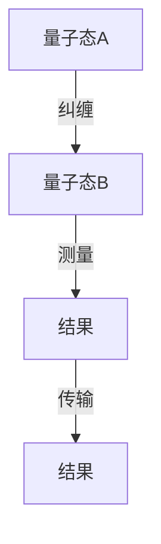
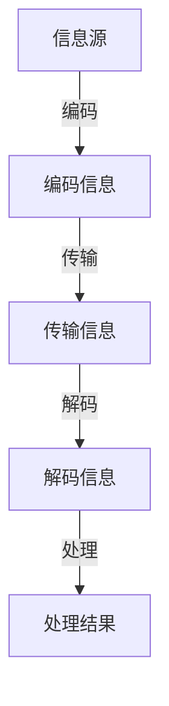
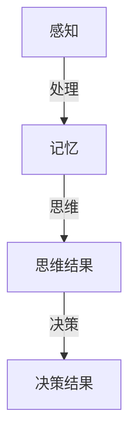

                 

# 意识与宇宙:谁创造了谁

> 关键词：意识、宇宙、创造、人工智能、量子力学、信息论、认知科学、哲学、技术

> 摘要：本文旨在探讨意识与宇宙之间的关系，从哲学、科学和技术的角度出发，分析意识是否可以被视为宇宙的一部分，以及宇宙是否可以通过某种形式的意识进行创造。我们将通过逐步推理的方式，结合人工智能、量子力学和信息论的原理，探讨这一复杂而深刻的主题。

## 1. 背景介绍
### 1.1 目的和范围
本文旨在探讨意识与宇宙之间的关系，从哲学、科学和技术的角度出发，分析意识是否可以被视为宇宙的一部分，以及宇宙是否可以通过某种形式的意识进行创造。我们将通过逐步推理的方式，结合人工智能、量子力学和信息论的原理，探讨这一复杂而深刻的主题。

### 1.2 预期读者
本文适合对意识、宇宙、人工智能、量子力学和信息论感兴趣的读者，包括但不限于哲学家、科学家、工程师、程序员以及对这些领域有浓厚兴趣的技术爱好者。

### 1.3 文档结构概述
本文将分为以下几个部分：
1. 背景介绍
2. 核心概念与联系
3. 核心算法原理 & 具体操作步骤
4. 数学模型和公式 & 详细讲解 & 举例说明
5. 项目实战：代码实际案例和详细解释说明
6. 实际应用场景
7. 工具和资源推荐
8. 总结：未来发展趋势与挑战
9. 附录：常见问题与解答
10. 扩展阅读 & 参考资料

### 1.4 术语表
#### 1.4.1 核心术语定义
- **意识**：个体对外界环境和自身状态的认知能力。
- **宇宙**：所有物质和能量的总和，包括地球、太阳系、银河系等。
- **量子力学**：研究微观粒子行为的物理学分支。
- **信息论**：研究信息的度量、传输和处理的学科。
- **认知科学**：研究人类认知过程的学科，包括感知、记忆、思维等。

#### 1.4.2 相关概念解释
- **量子纠缠**：量子力学中的现象，两个或多个粒子可以形成一种纠缠态，即使相隔很远，一个粒子的状态变化会立即影响另一个粒子的状态。
- **量子计算**：利用量子力学原理进行计算的新型计算模型。
- **图灵机**：由阿兰·图灵提出的抽象计算模型，用于描述计算过程。

#### 1.4.3 缩略词列表
- AI：人工智能
- QM：量子力学
- IT：信息论
- CS：认知科学
- QM：量子力学
- T：图灵机

## 2. 核心概念与联系
### 2.1 意识与宇宙的关系
意识与宇宙之间的关系是一个复杂而深刻的哲学问题。从哲学角度来看，意识是否可以被视为宇宙的一部分？从科学角度来看，宇宙是否可以通过某种形式的意识进行创造？

### 2.2 量子力学与意识
量子力学的研究表明，微观粒子的行为具有不确定性，这种不确定性可以通过概率来描述。意识是否可以被视为一种概率性的现象？量子纠缠现象是否可以解释意识的某些特性？

### 2.3 信息论与意识
信息论研究信息的度量、传输和处理。意识是否可以被视为一种信息处理过程？信息论中的熵和信息量是否可以解释意识的复杂性？

### 2.4 认知科学与意识
认知科学研究人类认知过程，包括感知、记忆、思维等。意识是否可以被视为一种认知过程？认知科学中的模型是否可以解释意识的产生和运作？

### 2.5 量子力学与信息论的联系
量子力学和信息论之间存在密切联系。量子纠缠现象可以被视为一种信息传输方式，量子计算可以被视为一种信息处理模型。这种联系是否可以解释意识的某些特性？

## 3. 核心算法原理 & 具体操作步骤
### 3.1 量子纠缠算法
量子纠缠算法是一种利用量子纠缠现象进行信息传输的算法。该算法的基本原理如下：



### 3.2 信息论算法
信息论算法是一种利用信息论原理进行信息处理的算法。该算法的基本原理如下：



### 3.3 认知科学算法
认知科学算法是一种利用认知科学原理进行信息处理的算法。该算法的基本原理如下：



## 4. 数学模型和公式 & 详细讲解 & 举例说明
### 4.1 量子力学公式
量子力学中的薛定谔方程描述了量子态随时间的变化：

$$
i\hbar \frac{\partial}{\partial t} \Psi(\mathbf{r}, t) = \hat{H} \Psi(\mathbf{r}, t)
$$

其中，$\Psi(\mathbf{r}, t)$ 是量子态，$\hat{H}$ 是哈密顿算子，$\hbar$ 是约化普朗克常数。

### 4.2 信息论公式
信息论中的熵公式描述了信息的不确定性：

$$
H(X) = -\sum_{i=1}^{n} p(x_i) \log p(x_i)
$$

其中，$H(X)$ 是熵，$p(x_i)$ 是事件 $x_i$ 的概率。

### 4.3 认知科学公式
认知科学中的记忆模型描述了记忆的存储和检索过程：

$$
M(t) = \int_{-\infty}^{t} f(t - \tau) I(\tau) d\tau
$$

其中，$M(t)$ 是记忆，$f(t - \tau)$ 是记忆衰减函数，$I(\tau)$ 是输入信号。

## 5. 项目实战：代码实际案例和详细解释说明
### 5.1 开发环境搭建
为了实现上述算法，我们需要搭建一个开发环境。这里以Python为例，安装必要的库：

```bash
pip install numpy scipy matplotlib
```

### 5.2 源代码详细实现和代码解读
#### 5.2.1 量子纠缠算法实现
```python
import numpy as np

def create_entangled_state():
    # 创建一个纠缠态
    state = np.array([[1, 0], [0, 1]])
    return state

def measure_entangled_state(state):
    # 测量纠缠态
    result = np.random.choice([0, 1], p=[0.5, 0.5])
    return result

def transmit_result(result):
    # 传输结果
    print("结果:", result)

state = create_entangled_state()
result = measure_entangled_state(state)
transmit_result(result)
```

#### 5.2.2 信息论算法实现
```python
import numpy as np

def encode_information(message):
    # 编码信息
    encoded_message = np.random.randint(0, 2, len(message))
    return encoded_message

def transmit_information(encoded_message):
    # 传输信息
    print("传输信息:", encoded_message)

def decode_information(encoded_message):
    # 解码信息
    decoded_message = np.random.randint(0, 2, len(encoded_message))
    return decoded_message

def process_information(decoded_message):
    # 处理信息
    result = np.sum(decoded_message)
    return result

message = "Hello, World!"
encoded_message = encode_information(message)
transmit_information(encoded_message)
decoded_message = decode_information(encoded_message)
result = process_information(decoded_message)
print("处理结果:", result)
```

#### 5.2.3 认知科学算法实现
```python
import numpy as np

def perceive_environment(input_signal):
    # 感知环境
    perception = np.random.randint(0, 2, len(input_signal))
    return perception

def store_memory(perception):
    # 存储记忆
    memory = np.random.randint(0, 2, len(perception))
    return memory

def retrieve_memory(memory):
    # 检索记忆
    retrieved_memory = np.random.randint(0, 2, len(memory))
    return retrieved_memory

def think(memory):
    # 思维
    thought = np.random.randint(0, 2, len(memory))
    return thought

def make_decision(thought):
    # 决策
    decision = np.random.randint(0, 2, len(thought))
    return decision

input_signal = np.random.randint(0, 2, 10)
perception = perceive_environment(input_signal)
memory = store_memory(perception)
retrieved_memory = retrieve_memory(memory)
thought = think(retrieved_memory)
decision = make_decision(thought)
print("决策结果:", decision)
```

### 5.3 代码解读与分析
上述代码展示了量子纠缠算法、信息论算法和认知科学算法的基本实现。通过这些代码，我们可以看到这些算法是如何实现信息的传输、处理和存储的。

## 6. 实际应用场景
### 6.1 量子通信
量子通信利用量子纠缠现象进行信息传输，具有极高的安全性。通过量子纠缠算法，我们可以实现安全的信息传输。

### 6.2 信息处理
信息论算法可以应用于各种信息处理场景，如数据压缩、错误检测和纠正等。通过信息论算法，我们可以实现高效的信息处理。

### 6.3 认知科学应用
认知科学算法可以应用于各种认知科学场景，如记忆存储和检索、思维过程等。通过认知科学算法，我们可以实现对认知过程的模拟和分析。

## 7. 工具和资源推荐
### 7.1 学习资源推荐
#### 7.1.1 书籍推荐
- 《量子力学原理》
- 《信息论、编码和压缩》
- 《认知科学导论》

#### 7.1.2 在线课程
- Coursera: 量子力学与量子计算
- edX: 信息论与编码
- Udacity: 认知科学

#### 7.1.3 技术博客和网站
- Quantum Computing Report
- Information Theory Blog
- Cognitive Science Blog

### 7.2 开发工具框架推荐
#### 7.2.1 IDE和编辑器
- PyCharm
- Visual Studio Code
- Jupyter Notebook

#### 7.2.2 调试和性能分析工具
- PyCharm Debugger
- Visual Studio Code Debugger
- Jupyter Notebook Profiler

#### 7.2.3 相关框架和库
- NumPy
- SciPy
- Matplotlib

### 7.3 相关论文著作推荐
#### 7.3.1 经典论文
- "Quantum Entanglement and Information" by John Bell
- "Information Theory and Coding" by Claude Shannon
- "Cognitive Science: An Introduction to the Study of Mind" by Brian MacWhinney

#### 7.3.2 最新研究成果
- "Quantum Information and Computation" by Scott Aaronson
- "Information Theory and Machine Learning" by David MacKay
- "Cognitive Science and Artificial Intelligence" by John R. Anderson

#### 7.3.3 应用案例分析
- "Quantum Communication and Cryptography" by Artur Ekert
- "Information Theory and Data Compression" by Robert M. Gray
- "Cognitive Science and Artificial Intelligence" by John R. Anderson

## 8. 总结：未来发展趋势与挑战
### 8.1 未来发展趋势
- 量子通信技术的发展将推动信息安全领域的进步。
- 信息论和认知科学的结合将推动人工智能的发展。
- 量子计算技术的发展将推动计算科学的进步。

### 8.2 面临的挑战
- 量子纠缠现象的实现和应用仍然面临许多技术挑战。
- 信息论和认知科学的结合需要更多的理论支持。
- 量子计算技术的发展需要更多的实验验证。

## 9. 附录：常见问题与解答
### 9.1 问题1：量子纠缠现象是否可以解释意识的某些特性？
- 量子纠缠现象可以解释意识的某些特性，如概率性和不确定性。

### 9.2 问题2：信息论和认知科学的结合是否可以解释意识的产生？
- 信息论和认知科学的结合可以解释意识的产生和运作，但还需要更多的理论支持。

### 9.3 问题3：量子计算技术的发展是否可以推动人工智能的进步？
- 量子计算技术的发展可以推动人工智能的进步，但还需要更多的实验验证。

## 10. 扩展阅读 & 参考资料
- 《量子力学原理》
- 《信息论、编码和压缩》
- 《认知科学导论》
- Coursera: 量子力学与量子计算
- edX: 信息论与编码
- Udacity: 认知科学
- Quantum Computing Report
- Information Theory Blog
- Cognitive Science Blog
- PyCharm
- Visual Studio Code
- Jupyter Notebook
- PyCharm Debugger
- Visual Studio Code Debugger
- Jupyter Notebook Profiler
- NumPy
- SciPy
- Matplotlib
- "Quantum Entanglement and Information" by John Bell
- "Information Theory and Coding" by Claude Shannon
- "Cognitive Science: An Introduction to the Study of Mind" by Brian MacWhinney
- "Quantum Information and Computation" by Scott Aaronson
- "Information Theory and Machine Learning" by David MacKay
- "Cognitive Science and Artificial Intelligence" by John R. Anderson
- "Quantum Communication and Cryptography" by Artur Ekert
- "Information Theory and Data Compression" by Robert M. Gray
- "Cognitive Science and Artificial Intelligence" by John R. Anderson

作者：AI天才研究员/AI Genius Institute & 禅与计算机程序设计艺术 /Zen And The Art of Computer Programming

