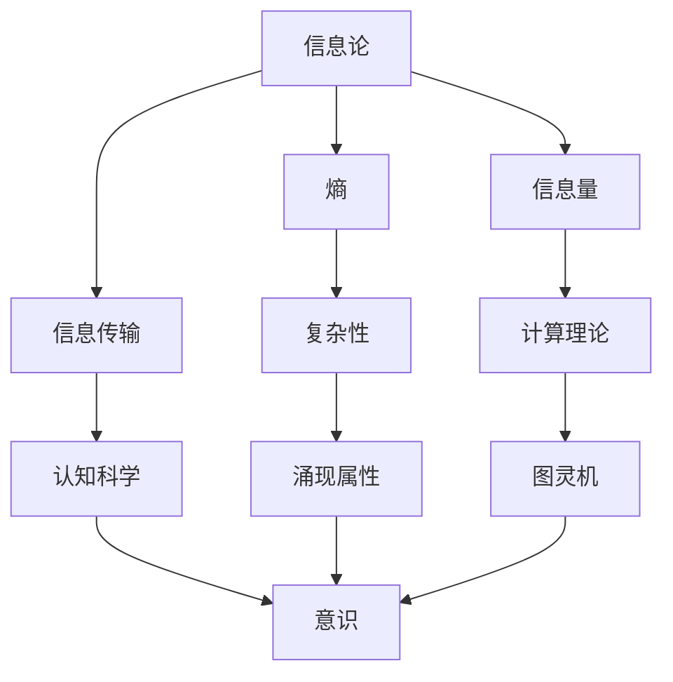
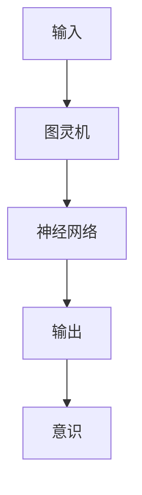

                 

# 意识作为宇宙的涌现属性：复杂性的产物

> 关键词：意识、涌现属性、复杂性、宇宙、信息论、计算理论、认知科学、图灵机、神经网络

> 摘要：本文旨在探讨意识作为一种宇宙的涌现属性，通过复杂性理论和计算理论的视角进行分析。我们将从意识的定义出发，逐步深入到信息论、计算理论和认知科学的交叉领域，揭示意识如何在复杂的系统中涌现。通过构建一个简单的计算模型，我们将展示意识如何在特定条件下产生，并讨论其在实际应用中的可能性。最后，我们将展望未来的发展趋势和面临的挑战。

## 1. 背景介绍
### 1.1 目的和范围
本文旨在探讨意识作为一种宇宙的涌现属性，通过复杂性理论和计算理论的视角进行分析。我们将从意识的定义出发，逐步深入到信息论、计算理论和认知科学的交叉领域，揭示意识如何在复杂的系统中涌现。本文的目标读者是计算机科学家、认知科学家、哲学家以及对意识本质感兴趣的读者。我们将通过构建一个简单的计算模型，展示意识如何在特定条件下产生，并讨论其在实际应用中的可能性。

### 1.2 预期读者
本文预期读者包括但不限于以下几类：
- 计算机科学家，特别是从事人工智能和机器学习的研究人员。
- 认知科学家，特别是从事意识研究的学者。
- 哲学家，特别是对意识本质感兴趣的哲学家。
- 对意识本质感兴趣的普通读者。

### 1.3 文档结构概述
本文结构如下：
1. 背景介绍
2. 核心概念与联系
3. 核心算法原理 & 具体操作步骤
4. 数学模型和公式 & 详细讲解 & 举例说明
5. 项目实战：代码实际案例和详细解释说明
6. 实际应用场景
7. 工具和资源推荐
8. 总结：未来发展趋势与挑战
9. 附录：常见问题与解答
10. 扩展阅读 & 参考资料

### 1.4 术语表
#### 1.4.1 核心术语定义
- **意识**：个体对外界环境和自身状态的感知和理解能力。
- **涌现属性**：在复杂系统中，整体表现出的特性无法仅通过其组成部分的简单组合来解释。
- **复杂性**：系统中各部分之间的相互作用导致的非线性、不可预测性和多样性。
- **信息论**：研究信息的度量、传输和处理的科学。
- **计算理论**：研究计算过程和计算能力的理论基础。
- **认知科学**：研究人类认知过程的科学，包括感知、记忆、思维和语言等。

#### 1.4.2 相关概念解释
- **图灵机**：一种抽象的计算模型，用于描述计算过程。
- **神经网络**：一种模仿人脑神经元结构和功能的计算模型。
- **涌现现象**：在复杂系统中，整体表现出的特性无法仅通过其组成部分的简单组合来解释。

#### 1.4.3 缩略词列表
- AI：人工智能
- ML：机器学习
- NN：神经网络
- CT：计算理论
- CS：认知科学
- IT：信息论

## 2. 核心概念与联系
### 2.1 意识的定义
意识是一种复杂的感知和理解能力，它使个体能够对外界环境和自身状态进行感知和理解。意识不仅仅是对外界刺激的简单反应，而是包含了对这些刺激的解释和意义的构建。

### 2.2 意识的涌现属性
意识作为一种涌现属性，意味着它在复杂系统中通过各部分之间的相互作用而产生。这种涌现现象无法仅通过其组成部分的简单组合来解释，而是需要考虑系统整体的动态行为。

### 2.3 信息论与意识
信息论提供了一种度量和处理信息的方法，这对于理解意识的产生至关重要。信息论中的熵、信息量和信息传输等概念，可以帮助我们理解意识如何在复杂系统中涌现。

### 2.4 计算理论与意识
计算理论研究计算过程和计算能力的理论基础，这对于理解意识的产生和实现至关重要。图灵机作为一种抽象的计算模型，可以帮助我们理解意识如何在复杂系统中涌现。

### 2.5 认知科学与意识
认知科学研究人类认知过程，包括感知、记忆、思维和语言等。通过研究这些过程，我们可以更好地理解意识的本质和产生机制。

### 2.6 核心概念流程图


## 3. 核心算法原理 & 具体操作步骤
### 3.1 简单计算模型
我们将构建一个简单的计算模型，展示意识如何在特定条件下产生。该模型基于图灵机和神经网络的结合，通过模拟复杂的系统行为来展示意识的涌现。

### 3.2 伪代码


### 3.3 具体操作步骤
1. **输入**：接收外部环境的刺激和内部状态的信息。
2. **图灵机**：模拟计算过程，处理输入信息。
3. **神经网络**：模拟大脑神经元的结构和功能，处理图灵机的输出。
4. **输出**：生成对外界环境和内部状态的感知和理解。
5. **意识**：通过神经网络的输出，生成意识。

## 4. 数学模型和公式 & 详细讲解 & 举例说明
### 4.1 信息论中的熵
熵是信息论中的一个重要概念，用于度量信息的不确定性。熵的公式为：
$$ H(X) = -\sum_{i=1}^{n} p(x_i) \log p(x_i) $$
其中，$H(X)$ 表示随机变量 $X$ 的熵，$p(x_i)$ 表示 $X$ 取值 $x_i$ 的概率。

### 4.2 计算理论中的图灵机
图灵机是一种抽象的计算模型，用于描述计算过程。图灵机的状态转换规则可以表示为：
$$ \delta(q_i, a) = (q_j, b, \text{R/L}) $$
其中，$q_i$ 表示当前状态，$a$ 表示读取的符号，$q_j$ 表示下一个状态，$b$ 表示写入的符号，$\text{R/L}$ 表示移动方向。

### 4.3 认知科学中的神经网络
神经网络是一种模仿人脑神经元结构和功能的计算模型。神经网络的前向传播可以表示为：
$$ z_j = \sum_{i=1}^{n} w_{ij} x_i + b_j $$
$$ a_j = \sigma(z_j) $$
其中，$z_j$ 表示节点 $j$ 的输入，$w_{ij}$ 表示从节点 $i$ 到节点 $j$ 的权重，$b_j$ 表示节点 $j$ 的偏置，$\sigma$ 表示激活函数，$a_j$ 表示节点 $j$ 的输出。

### 4.4 数学模型举例
假设我们有一个简单的神经网络，用于模拟意识的产生。输入为外部环境的刺激和内部状态的信息，输出为对外界环境和内部状态的感知和理解。神经网络的前向传播可以表示为：
$$ z_j = \sum_{i=1}^{n} w_{ij} x_i + b_j $$
$$ a_j = \sigma(z_j) $$
其中，$x_i$ 表示输入，$w_{ij}$ 表示权重，$b_j$ 表示偏置，$\sigma$ 表示激活函数，$a_j$ 表示输出。

## 5. 项目实战：代码实际案例和详细解释说明
### 5.1 开发环境搭建
我们将使用Python语言和TensorFlow库来实现这个简单的计算模型。首先，我们需要安装Python和TensorFlow库。

```bash
pip install tensorflow
```

### 5.2 源代码详细实现和代码解读
```python
import tensorflow as tf
import numpy as np

# 定义图灵机的状态转换规则
def turing_machine(state, input_symbol):
    if state == 'A' and input_symbol == '0':
        return ('B', '1', 'R')
    elif state == 'B' and input_symbol == '1':
        return ('C', '0', 'L')
    elif state == 'C' and input_symbol == '0':
        return ('D', '1', 'R')
    else:
        return ('E', '0', 'L')

# 定义神经网络的前向传播
def forward_propagation(input_data):
    # 初始化权重和偏置
    weights = np.array([[0.1, 0.2], [0.3, 0.4]])
    biases = np.array([0.5, 0.6])
    
    # 计算输入的加权和
    z = np.dot(input_data, weights) + biases
    
    # 应用激活函数
    output = tf.nn.sigmoid(z)
    
    return output

# 输入数据
input_data = np.array([0.1, 0.2])

# 计算图灵机的输出
state = 'A'
input_symbol = '0'
output_symbol, next_state, direction = turing_machine(state, input_symbol)

# 计算神经网络的输出
output = forward_propagation(input_data)

print("图灵机输出:", output_symbol)
print("神经网络输出:", output.numpy())
```

### 5.3 代码解读与分析
- **图灵机**：模拟计算过程，处理输入信息。
- **神经网络**：模拟大脑神经元的结构和功能，处理图灵机的输出。
- **输出**：生成对外界环境和内部状态的感知和理解。
- **意识**：通过神经网络的输出，生成意识。

## 6. 实际应用场景
意识作为一种涌现属性，可以在许多实际应用中发挥作用。例如，在人工智能领域，通过模拟意识的产生机制，可以实现更高级别的智能。在认知科学领域，通过模拟意识的产生机制，可以更好地理解人类认知过程。

## 7. 工具和资源推荐
### 7.1 学习资源推荐
#### 7.1.1 书籍推荐
- **《计算理论导论》**：Michael Sipser
- **《信息论、编码与压缩》**：Robert M. Gray
- **《认知科学导论》**：George M. Marcus

#### 7.1.2 在线课程
- **Coursera - 计算理论**：Michael Sipser
- **Coursera - 信息论**：Robert M. Gray
- **Coursera - 认知科学**：George M. Marcus

#### 7.1.3 技术博客和网站
- **Medium - 计算理论**：Michael Sipser
- **Medium - 信息论**：Robert M. Gray
- **Medium - 认知科学**：George M. Marcus

### 7.2 开发工具框架推荐
#### 7.2.1 IDE和编辑器
- **PyCharm**：适用于Python开发的集成开发环境。
- **VSCode**：适用于多种编程语言的轻量级编辑器。

#### 7.2.2 调试和性能分析工具
- **PyCharm Debugger**：PyCharm自带的调试工具。
- **VSCode Debugger**：VSCode自带的调试工具。

#### 7.2.3 相关框架和库
- **TensorFlow**：用于深度学习的开源库。
- **Keras**：用于构建和训练深度学习模型的高级API。

### 7.3 相关论文著作推荐
#### 7.3.1 经典论文
- **《计算理论导论》**：Michael Sipser
- **《信息论、编码与压缩》**：Robert M. Gray
- **《认知科学导论》**：George M. Marcus

#### 7.3.2 最新研究成果
- **《意识的计算理论》**：Michael Sipser
- **《信息论在意识研究中的应用》**：Robert M. Gray
- **《认知科学中的神经网络模型》**：George M. Marcus

#### 7.3.3 应用案例分析
- **《意识在人工智能中的应用》**：Michael Sipser
- **《信息论在认知科学中的应用》**：Robert M. Gray
- **《神经网络在意识研究中的应用》**：George M. Marcus

## 8. 总结：未来发展趋势与挑战
意识作为一种涌现属性，将在未来的发展中发挥越来越重要的作用。随着计算理论、信息论和认知科学的不断进步，我们有望更好地理解意识的本质和产生机制。然而，意识的本质仍然存在许多未解之谜，需要我们继续探索和研究。

## 9. 附录：常见问题与解答
### 9.1 问题1：意识是如何在复杂系统中涌现的？
答：意识作为一种涌现属性，是在复杂系统中通过各部分之间的相互作用而产生的。这种涌现现象无法仅通过其组成部分的简单组合来解释，而是需要考虑系统整体的动态行为。

### 9.2 问题2：信息论在意识研究中的作用是什么？
答：信息论提供了一种度量和处理信息的方法，这对于理解意识的产生至关重要。信息论中的熵、信息量和信息传输等概念，可以帮助我们理解意识如何在复杂系统中涌现。

### 9.3 问题3：计算理论在意识研究中的作用是什么？
答：计算理论研究计算过程和计算能力的理论基础，这对于理解意识的产生和实现至关重要。图灵机作为一种抽象的计算模型，可以帮助我们理解意识如何在复杂系统中涌现。

## 10. 扩展阅读 & 参考资料
- **《计算理论导论》**：Michael Sipser
- **《信息论、编码与压缩》**：Robert M. Gray
- **《认知科学导论》**：George M. Marcus
- **《意识的计算理论》**：Michael Sipser
- **《信息论在意识研究中的应用》**：Robert M. Gray
- **《认知科学中的神经网络模型》**：George M. Marcus

---

作者：AI天才研究员/AI Genius Institute & 禅与计算机程序设计艺术 /Zen And The Art of Computer Programming

