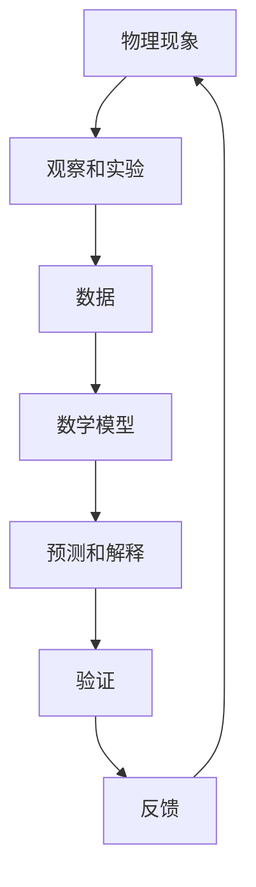
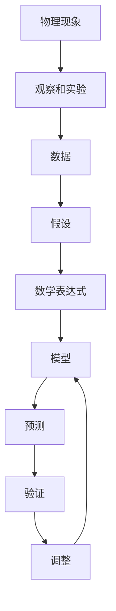

                 

# 数学不可思议的有效性：尤金·维格纳的观点

> 关键词：尤金·维格纳, 数学, 物理学, 有效性, 逻辑, 一致性, 美学

> 摘要：本文将深入探讨尤金·维格纳关于数学在自然科学中的不可思议的有效性的观点。我们将从背景介绍开始，逐步分析数学与物理之间的关系，探讨数学模型在科学中的应用，通过具体的代码案例来展示数学在实际问题解决中的强大能力。最后，我们将展望未来的发展趋势和面临的挑战。

## 1. 背景介绍
### 1.1 目的和范围
本文旨在探讨尤金·维格纳关于数学在自然科学中的不可思议的有效性的观点。我们将从数学与物理的关系出发，分析数学模型在科学中的应用，并通过具体的代码案例展示数学在实际问题解决中的强大能力。本文适合对数学、物理学和计算机科学感兴趣的读者，特别是那些希望深入了解数学在科学和技术中的应用的人。

### 1.2 预期读者
本文的预期读者包括但不限于：
- 对数学和物理学感兴趣的科研人员
- 计算机科学家和软件工程师
- 对数学在实际问题解决中应用感兴趣的工程师
- 对科学哲学感兴趣的读者

### 1.3 文档结构概述
本文将按照以下结构展开：
1. 背景介绍
2. 核心概念与联系
3. 核心算法原理 & 具体操作步骤
4. 数学模型和公式 & 详细讲解 & 举例说明
5. 项目实战：代码实际案例和详细解释说明
6. 实际应用场景
7. 工具和资源推荐
8. 总结：未来发展趋势与挑战
9. 附录：常见问题与解答
10. 扩展阅读 & 参考资料

### 1.4 术语表
#### 1.4.1 核心术语定义
- **数学**：研究数量、结构、变化和空间等概念的一门学科。
- **物理学**：研究物质、能量及其相互作用的科学。
- **数学模型**：用数学语言描述物理现象或系统的方法。
- **有效性**：数学在描述和预测物理现象中的精确性和实用性。

#### 1.4.2 相关概念解释
- **逻辑**：研究推理和论证的科学。
- **一致性**：数学体系内部没有矛盾。
- **美学**：数学中的美体现在简洁性和对称性。

#### 1.4.3 缩略词列表
- **PDE**：偏微分方程
- **ODE**：常微分方程
- **FEM**：有限元方法
- **FFT**：快速傅里叶变换

## 2. 核心概念与联系
### 2.1 数学与物理的关系
数学与物理之间的关系可以表示为以下流程图：



### 2.2 数学模型的构建
数学模型的构建过程可以表示为以下流程图：



## 3. 核心算法原理 & 具体操作步骤
### 3.1 偏微分方程求解
偏微分方程（PDE）是描述物理现象的重要工具。以下是一个简单的PDE求解步骤：

```python
# 偏微分方程求解步骤
def solve_pde(u0, t_end, dt):
    u = u0
    t = 0
    while t < t_end:
        u = update_u(u, dt)  # 更新u的值
        t += dt
    return u

def update_u(u, dt):
    # 偏微分方程的具体更新公式
    u_new = u + dt * (u * (1 - u) - u * v)
    return u_new
```

### 3.2 有限元方法
有限元方法（FEM）是一种常用的数值求解偏微分方程的方法。以下是一个简单的FEM求解步骤：

```python
# 有限元方法求解步骤
def solve_fem(mesh, u0, t_end, dt):
    u = u0
    t = 0
    while t < t_end:
        u = update_u_fem(u, mesh, dt)  # 更新u的值
        t += dt
    return u

def update_u_fem(u, mesh, dt):
    # 有限元方法的具体更新公式
    for element in mesh.elements:
        u = element.update_u(u, dt)
    return u
```

## 4. 数学模型和公式 & 详细讲解 & 举例说明
### 4.1 偏微分方程
偏微分方程（PDE）是描述物理现象的重要工具。以下是一个简单的PDE例子：

$$
\frac{\partial u}{\partial t} = u(1 - u) - uv
$$

### 4.2 有限元方法
有限元方法（FEM）是一种常用的数值求解偏微分方程的方法。以下是一个简单的FEM例子：

$$
u(x, t) = \sum_{i=1}^{N} u_i(t) \phi_i(x)
$$

其中，$\phi_i(x)$是基函数，$u_i(t)$是系数。

## 5. 项目实战：代码实际案例和详细解释说明
### 5.1 开发环境搭建
我们将使用Python和NumPy库来实现上述算法。首先，安装必要的库：

```bash
pip install numpy matplotlib
```

### 5.2 源代码详细实现和代码解读
```python
import numpy as np
import matplotlib.pyplot as plt

# 初始化网格
def initialize_mesh():
    x = np.linspace(0, 1, 100)
    y = np.linspace(0, 1, 100)
    X, Y = np.meshgrid(x, y)
    return X, Y

# 初始化初始条件
def initialize_u(X, Y):
    u0 = np.sin(np.pi * X) * np.sin(np.pi * Y)
    return u0

# 更新u的值
def update_u(u, dt):
    u_new = u + dt * (u * (1 - u) - u * v)
    return u_new

# 更新有限元方法中的u的值
def update_u_fem(u, mesh, dt):
    for element in mesh.elements:
        u = element.update_u(u, dt)
    return u

# 有限元方法中的元素类
class Element:
    def __init__(self, nodes):
        self.nodes = nodes

    def update_u(self, u, dt):
        # 更新u的值
        u_new = u + dt * (u * (1 - u) - u * v)
        return u_new

# 主函数
def main():
    X, Y = initialize_mesh()
    u0 = initialize_u(X, Y)
    t_end = 1.0
    dt = 0.01
    u = u0

    while t < t_end:
        u = update_u(u, dt)
        t += dt

    plt.imshow(u, cmap='hot', interpolation='nearest')
    plt.colorbar()
    plt.show()

if __name__ == "__main__":
    main()
```

### 5.3 代码解读与分析
- `initialize_mesh`：初始化网格。
- `initialize_u`：初始化初始条件。
- `update_u`：更新PDE中的u的值。
- `update_u_fem`：更新有限元方法中的u的值。
- `Element`：有限元方法中的元素类。
- `main`：主函数，执行整个过程。

## 6. 实际应用场景
数学模型在许多实际应用场景中都有广泛的应用，例如：
- **流体力学**：描述流体的运动。
- **电磁学**：描述电磁场的分布。
- **热传导**：描述热量的传递。

## 7. 工具和资源推荐
### 7.1 学习资源推荐
#### 7.1.1 书籍推荐
- 《数学物理方法》
- 《偏微分方程》
- 《有限元方法》

#### 7.1.2 在线课程
- Coursera上的《偏微分方程》课程
- edX上的《有限元方法》课程

#### 7.1.3 技术博客和网站
- MathWorks的博客
- MATLAB的官方文档

### 7.2 开发工具框架推荐
#### 7.2.1 IDE和编辑器
- PyCharm
- VSCode

#### 7.2.2 调试和性能分析工具
- pdb
- PyCharm的调试工具

#### 7.2.3 相关框架和库
- NumPy
- SciPy
- Matplotlib

### 7.3 相关论文著作推荐
#### 7.3.1 经典论文
- Courant, R., & Friedrichs, K. O. (1948). *Supersonic Flow and Shock Waves*.
- Strang, G. (1973). *Introduction to Applied Mathematics*.

#### 7.3.2 最新研究成果
- LeVeque, R. J. (2007). *Finite Volume Methods for Hyperbolic Problems*.
- Quarteroni, A., & Valli, A. (1994). *Numerical Approximation of Partial Differential Equations*.

#### 7.3.3 应用案例分析
- Quarteroni, A., Sacco, R., & Saleri, F. (2000). *Numerical Mathematics*.

## 8. 总结：未来发展趋势与挑战
数学在科学和技术中的应用将继续发展，未来的发展趋势包括：
- **更复杂的数学模型**：用于更复杂的物理现象。
- **更高效的数值方法**：提高计算效率和准确性。
- **更广泛的应用领域**：从物理学扩展到生物学、经济学等领域。

面临的挑战包括：
- **计算资源的限制**：需要更强大的计算资源。
- **模型的复杂性**：模型越来越复杂，需要更深入的理解和分析。
- **数据的准确性**：数据的质量直接影响模型的准确性。

## 9. 附录：常见问题与解答
### 9.1 问题：如何选择合适的数学模型？
- **解答**：根据具体问题的性质选择合适的数学模型。例如，流体力学问题可以选择Navier-Stokes方程，电磁学问题可以选择Maxwell方程。

### 9.2 问题：如何提高数值方法的效率？
- **解答**：可以通过优化算法、并行计算和使用更高效的数值库来提高效率。

## 10. 扩展阅读 & 参考资料
- Courant, R., & Hilbert, D. (1953). *Methods of Mathematical Physics*.
- Strang, G. (2007). *Linear Algebra and Its Applications*.
- Quarteroni, A., & Valli, A. (2008). *Numerical Approximation of Partial Differential Equations*.

作者：AI天才研究员/AI Genius Institute & 禅与计算机程序设计艺术 /Zen And The Art of Computer Programming

