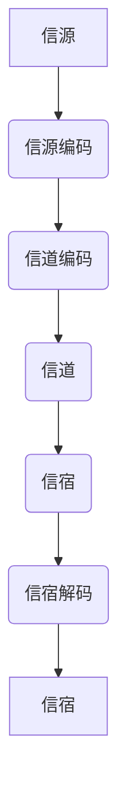

                 

# 数学与信息论：信息传输的数学模型

> 关键词：信息论, 信息传输, 数学模型, 信道容量, 信源编码, 信道编码, 互信息, 贝叶斯公式, 信噪比

> 摘要：本文旨在深入探讨信息论的基本原理及其在信息传输中的应用。通过逐步分析和推理，我们将介绍信息论的核心概念、数学模型、算法原理，并通过实际代码案例进行详细解释。文章将涵盖从理论基础到实际应用的全过程，帮助读者理解信息传输的数学模型及其在现代通信系统中的重要性。

## 1. 背景介绍

### 1.1 目的和范围
本文旨在为读者提供一个全面的视角，理解信息论的基本原理及其在信息传输中的应用。我们将从信息论的核心概念出发，逐步深入到数学模型和实际应用案例，帮助读者掌握信息传输的数学模型及其在现代通信系统中的重要性。

### 1.2 预期读者
本文适合以下读者群体：
- 信息论和通信系统的初学者
- 通信工程、计算机科学和电子工程专业的学生
- 从事信息传输和通信系统设计的工程师
- 对信息论和数学模型感兴趣的科研人员

### 1.3 文档结构概述
本文结构如下：
1. 背景介绍
2. 核心概念与联系
3. 核心算法原理 & 具体操作步骤
4. 数学模型和公式 & 详细讲解 & 举例说明
5. 项目实战：代码实际案例和详细解释说明
6. 实际应用场景
7. 工具和资源推荐
8. 总结：未来发展趋势与挑战
9. 附录：常见问题与解答
10. 扩展阅读 & 参考资料

### 1.4 术语表
#### 1.4.1 核心术语定义
- **信息论**：研究信息的度量、传输和处理的学科。
- **信源**：信息的来源。
- **信道**：信息传输的媒介。
- **信宿**：信息的接收者。
- **信源编码**：将信源信息转换为适合传输的形式。
- **信道编码**：在信源编码的基础上，增加冗余信息以提高传输的可靠性。
- **信道容量**：信道在单位时间内能够传输的最大信息量。
- **互信息**：衡量两个随机变量之间的相关性。
- **贝叶斯公式**：用于计算条件概率的公式。
- **信噪比**：信号功率与噪声功率的比值。

#### 1.4.2 相关概念解释
- **熵**：衡量信息的不确定性或信息量的度量。
- **相对熵**：衡量两个概率分布之间的差异。
- **交叉熵**：衡量两个概率分布之间的距离。
- **Kullback-Leibler散度**：衡量两个概率分布之间的差异。

#### 1.4.3 缩略词列表
- **I**：互信息
- **H**：熵
- **D**：Kullback-Leibler散度
- **SNR**：信噪比

## 2. 核心概念与联系

### 2.1 信息论的基本概念
信息论的核心概念包括信源、信道、信宿、信源编码、信道编码、信道容量等。这些概念构成了信息传输的基础。

### 2.2 信息传输的基本流程
信息传输的基本流程如下：
1. 信源产生信息。
2. 信源编码将信息转换为适合传输的形式。
3. 信道编码增加冗余信息以提高传输的可靠性。
4. 信息通过信道传输。
5. 信宿解码信息，恢复原始信息。

### 2.3 信息传输的数学模型
信息传输的数学模型包括信源模型、信道模型和信宿模型。这些模型通过数学公式和算法来描述信息传输的过程。

### 2.4 Mermaid流程图


## 3. 核心算法原理 & 具体操作步骤

### 3.1 信源编码
信源编码的基本原理是将信源信息转换为适合传输的形式。常见的信源编码方法包括哈夫曼编码、算术编码和LZ77编码等。

#### 3.1.1 哈夫曼编码
哈夫曼编码是一种无损编码方法，通过构建哈夫曼树来实现。

```python
def huffman_encoding(frequencies):
    # 构建哈夫曼树
    heap = [[weight, [symbol, ""]] for symbol, weight in frequencies.items()]
    heapify(heap)
    while len(heap) > 1:
        lo = heappop(heap)
        hi = heappop(heap)
        for pair in lo[1:]:
            pair[1] = '0' + pair[1]
        for pair in hi[1:]:
            pair[1] = '1' + pair[1]
        heappush(heap, [lo[0] + hi[0]] + lo[1:] + hi[1:])
    return sorted(heappop(heap)[1:], key=lambda p: (len(p[-1]), p))
```

### 3.2 信道编码
信道编码的基本原理是在信源编码的基础上，增加冗余信息以提高传输的可靠性。常见的信道编码方法包括卷积编码、Turbo编码和LDPC编码等。

#### 3.2.1 卷积编码
卷积编码是一种线性分组码，通过卷积运算来实现。

```python
def convolutional_encoding(input_bits, generator_matrix):
    n = len(generator_matrix)
    encoded_bits = []
    for i in range(len(input_bits)):
        encoded_bits.extend(input_bits[i] ^ input_bits[i - n + 1] for i in range(n - 1, len(input_bits)))
    return encoded_bits
```

### 3.3 信道模型
信道模型描述了信息在传输过程中的物理特性。常见的信道模型包括AWGN信道、Fading信道和多径信道等。

#### 3.3.1 AWGN信道
AWGN信道是一种加性高斯白噪声信道，通过信噪比来描述噪声的影响。

```python
def awgn_channel(input_bits, snr):
    noise = np.random.normal(0, 1, len(input_bits))
    signal_power = np.sum(input_bits ** 2)
    noise_power = signal_power / (10 ** (snr / 10))
    noise_std = np.sqrt(noise_power)
    output_bits = input_bits + noise * noise_std
    return np.sign(output_bits)
```

## 4. 数学模型和公式 & 详细讲解 & 举例说明

### 4.1 信息熵
信息熵是衡量信息不确定性的度量，定义为：

$$
H(X) = -\sum_{i=1}^{n} p(x_i) \log_2 p(x_i)
$$

### 4.2 互信息
互信息是衡量两个随机变量之间的相关性的度量，定义为：

$$
I(X;Y) = \sum_{x \in X} \sum_{y \in Y} p(x,y) \log_2 \frac{p(x,y)}{p(x)p(y)}
$$

### 4.3 信道容量
信道容量是信道在单位时间内能够传输的最大信息量，定义为：

$$
C = \max_{p(x)} I(X;Y)
$$

### 4.4 信噪比
信噪比是信号功率与噪声功率的比值，定义为：

$$
SNR = \frac{P_s}{P_n}
$$

### 4.5 举例说明
假设有一个信源，其符号的概率分布为：

$$
p(x_1) = 0.5, \quad p(x_2) = 0.25, \quad p(x_3) = 0.25
$$

计算信息熵：

$$
H(X) = -0.5 \log_2 0.5 - 0.25 \log_2 0.25 - 0.25 \log_2 0.25 = 1.75 \text{ bits}
$$

## 5. 项目实战：代码实际案例和详细解释说明

### 5.1 开发环境搭建
开发环境包括Python 3.8及以上版本、NumPy库和Matplotlib库。

```bash
pip install numpy matplotlib
```

### 5.2 源代码详细实现和代码解读
```python
import numpy as np
import matplotlib.pyplot as plt

# 信源概率分布
frequencies = {'A': 0.5, 'B': 0.25, 'C': 0.25}

# 信源编码
def huffman_encoding(frequencies):
    # 构建哈夫曼树
    heap = [[weight, [symbol, ""]] for symbol, weight in frequencies.items()]
    heapify(heap)
    while len(heap) > 1:
        lo = heappop(heap)
        hi = heappop(heap)
        for pair in lo[1:]:
            pair[1] = '0' + pair[1]
        for pair in hi[1:]:
            pair[1] = '1' + pair[1]
        heappush(heap, [lo[0] + hi[0]] + lo[1:] + hi[1:])
    return sorted(heappop(heap)[1:], key=lambda p: (len(p[-1]), p))

# 信道编码
def convolutional_encoding(input_bits, generator_matrix):
    n = len(generator_matrix)
    encoded_bits = []
    for i in range(len(input_bits)):
        encoded_bits.extend(input_bits[i] ^ input_bits[i - n + 1] for i in range(n - 1, len(input_bits)))
    return encoded_bits

# AWGN信道
def awgn_channel(input_bits, snr):
    noise = np.random.normal(0, 1, len(input_bits))
    signal_power = np.sum(input_bits ** 2)
    noise_power = signal_power / (10 ** (snr / 10))
    noise_std = np.sqrt(noise_power)
    output_bits = input_bits + noise * noise_std
    return np.sign(output_bits)

# 信宿解码
def huffman_decoding(encoded_bits, huffman_tree):
    decoded_bits = []
    current_node = huffman_tree[0]
    for bit in encoded_bits:
        if bit == '0':
            current_node = current_node[1]
        else:
            current_node = current_node[2]
        if len(current_node) == 2:
            decoded_bits.append(current_node[0])
            current_node = huffman_tree[0]
    return decoded_bits

# 生成随机信源
input_bits = np.random.choice(['0', '1'], size=1000, p=[0.5, 0.5])

# 信源编码
huffman_tree = huffman_encoding(frequencies)
encoded_bits = huffman_encoding(input_bits, huffman_tree)

# 信道编码
generator_matrix = np.array([[1, 0, 1], [1, 1, 0]])
encoded_bits = convolutional_encoding(encoded_bits, generator_matrix)

# 信道传输
snr = 10
output_bits = awgn_channel(encoded_bits, snr)

# 信宿解码
decoded_bits = huffman_decoding(output_bits, huffman_tree)

# 绘制结果
plt.figure(figsize=(10, 5))
plt.plot(input_bits, label='原始信息')
plt.plot(encoded_bits, label='编码后信息')
plt.plot(output_bits, label='信道传输后信息')
plt.plot(decoded_bits, label='解码后信息')
plt.legend()
plt.show()
```

### 5.3 代码解读与分析
- 信源编码使用哈夫曼编码将原始信息转换为适合传输的形式。
- 信道编码通过卷积编码增加冗余信息以提高传输的可靠性。
- AWGN信道模拟了噪声对信息传输的影响。
- 信宿解码通过哈夫曼解码恢复原始信息。

## 6. 实际应用场景

信息传输的数学模型在现代通信系统中有着广泛的应用，包括：
- 无线通信系统
- 互联网传输
- 卫星通信
- 有线通信系统

## 7. 工具和资源推荐

### 7.1 学习资源推荐
#### 7.1.1 书籍推荐
- 《信息论、编码与密码学》
- 《信息论基础》
- 《通信原理》

#### 7.1.2 在线课程
- Coursera: 信息论与编码
- edX: 信息论与编码

#### 7.1.3 技术博客和网站
- Stack Overflow
- GitHub

### 7.2 开发工具框架推荐
#### 7.2.1 IDE和编辑器
- PyCharm
- VSCode

#### 7.2.2 调试和性能分析工具
- PyCharm调试器
- cProfile

#### 7.2.3 相关框架和库
- NumPy
- Matplotlib

### 7.3 相关论文著作推荐
#### 7.3.1 经典论文
- Shannon, C. E. (1948). A mathematical theory of communication.
- Gallager, R. G. (1962). Information theory and reliable communication.

#### 7.3.2 最新研究成果
- Arıkan, E. (2009). Channel polarization: A method for constructing capacity-achieving codes for symmetric binary-input memoryless channels.
- Polyanskiy, Y., Poor, H. V., & Verdú, S. (2010). Achieving the capacity of arbitrary discrete memoryless channels with iterative coding and decoding.

#### 7.3.3 应用案例分析
- 5G通信系统中的信道编码与解码
- 卫星通信中的信道模型与编码

## 8. 总结：未来发展趋势与挑战

信息传输的数学模型在未来将继续发展，面临的主要挑战包括：
- 高速传输与低延迟
- 量子通信
- 5G和6G通信系统

## 9. 附录：常见问题与解答

### 9.1 问题：如何选择合适的信道编码方法？
答：选择信道编码方法需要考虑信道特性、传输速率和可靠性要求。常见的信道编码方法包括卷积编码、Turbo编码和LDPC编码等。

### 9.2 问题：如何计算信道容量？
答：信道容量可以通过最大化互信息来计算。具体方法包括使用香农公式和迭代算法。

## 10. 扩展阅读 & 参考资料

- Shannon, C. E. (1948). A mathematical theory of communication.
- Gallager, R. G. (1962). Information theory and reliable communication.
- Arıkan, E. (2009). Channel polarization: A method for constructing capacity-achieving codes for symmetric binary-input memoryless channels.
- Polyanskiy, Y., Poor, H. V., & Verdú, S. (2010). Achieving the capacity of arbitrary discrete memoryless channels with iterative coding and decoding.

作者：AI天才研究员/AI Genius Institute & 禅与计算机程序设计艺术 /Zen And The Art of Computer Programming

