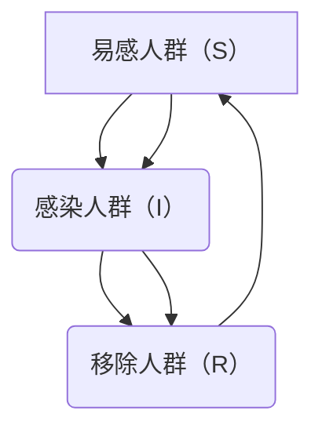

                 

# 数学与公共卫生：疾病传播的数学模型

> 关键词：疾病传播模型, 数学建模, 公共卫生, 基本再生数, 指数增长, 常微分方程, 模拟与预测

> 摘要：本文旨在探讨疾病传播的数学模型在公共卫生领域的应用。通过分析疾病传播的基本原理，我们构建了一个简单的SIR模型，并详细解释了其背后的数学原理和算法。文章不仅提供了模型的理论基础，还通过实际代码案例展示了如何实现和应用这些模型。最后，我们讨论了模型在实际公共卫生中的应用，并展望了未来的发展趋势和挑战。

## 1. 背景介绍
### 1.1 目的和范围
本文旨在深入探讨疾病传播的数学模型在公共卫生领域的应用。通过构建和分析SIR模型，我们将揭示疾病传播的基本原理，并展示如何利用数学工具进行预测和控制。本文的目标读者包括公共卫生领域的专业人士、数据科学家、计算机科学家以及对疾病传播模型感兴趣的读者。

### 1.2 预期读者
- 公共卫生领域的专业人士
- 数据科学家
- 计算机科学家
- 对疾病传播模型感兴趣的读者

### 1.3 文档结构概述
本文将按照以下结构展开：
1. 背景介绍
2. 核心概念与联系
3. 核心算法原理 & 具体操作步骤
4. 数学模型和公式 & 详细讲解 & 举例说明
5. 项目实战：代码实际案例和详细解释说明
6. 实际应用场景
7. 工具和资源推荐
8. 总结：未来发展趋势与挑战
9. 附录：常见问题与解答
10. 扩展阅读 & 参考资料

### 1.4 术语表
#### 1.4.1 核心术语定义
- **SIR模型**：一种流行病学模型，用于描述传染病在人群中的传播过程。
- **S（Susceptible）**：易感人群，指未感染但可能被感染的人群。
- **I（Infected）**：感染人群，指已经感染并具有传染性的人群。
- **R（Removed）**：移除人群，指已经康复或死亡的人群。
- **基本再生数（$R_0$）**：指一个感染者在一个完全易感的人群中平均可以感染的人数。
- **指数增长**：指某种现象以指数形式增长，即增长速度与当前数量成正比。
- **常微分方程（ODE）**：描述变量随时间变化的数学方程。

#### 1.4.2 相关概念解释
- **微分方程**：描述变量随时间变化的数学方程，常用于建模动态系统。
- **常微分方程**：描述单个变量随时间变化的微分方程。
- **初始条件**：微分方程求解时需要给定的初始状态。

#### 1.4.3 缩略词列表
- **SIR**：Susceptible-Infected-Removed
- **ODE**：Ordinary Differential Equation
- **$R_0$**：Basic Reproduction Number

## 2. 核心概念与联系
### 2.1 SIR模型的基本原理
SIR模型是一种流行病学模型，用于描述传染病在人群中的传播过程。模型将人群分为三类：易感人群（S）、感染人群（I）和移除人群（R）。模型的核心假设是：
- 每个时刻，易感人群以一定的概率被感染。
- 感染人群以一定的概率恢复或死亡。
- 恢复或死亡的人群不再具有传染性。

### 2.2 SIR模型的流程图


## 3. 核心算法原理 & 具体操作步骤
### 3.1 SIR模型的数学描述
SIR模型可以用常微分方程来描述。假设总人口数为$N$，易感人群数为$S(t)$，感染人群数为$I(t)$，移除人群数为$R(t)$，则有：
$$
\begin{aligned}
\frac{dS}{dt} &= -\beta \frac{S(t) I(t)}{N} \\
\frac{dI}{dt} &= \beta \frac{S(t) I(t)}{N} - \gamma I(t) \\
\frac{dR}{dt} &= \gamma I(t)
\end{aligned}
$$
其中，$\beta$是感染率，$\gamma$是恢复率。

### 3.2 伪代码实现
```python
def sir_model(S0, I0, R0, N, beta, gamma, t):
    S = [S0]
    I = [I0]
    R = [R0]
    for t in range(1, len(t)):
        dS = -beta * S[t-1] * I[t-1] / N
        dI = beta * S[t-1] * I[t-1] / N - gamma * I[t-1]
        dR = gamma * I[t-1]
        S.append(S[t-1] + dS)
        I.append(I[t-1] + dI)
        R.append(R[t-1] + dR)
    return S, I, R
```

## 4. 数学模型和公式 & 详细讲解 & 举例说明
### 4.1 基本再生数（$R_0$）
基本再生数$R_0$是衡量疾病传播能力的重要指标。$R_0$定义为一个感染者在一个完全易感的人群中平均可以感染的人数。如果$R_0 < 1$，疾病将逐渐消失；如果$R_0 > 1$，疾病将持续传播。

### 4.2 指数增长
在疾病初期，感染人数的增长通常呈现指数增长。假设初始感染人数为$I_0$，感染率为$\beta$，则感染人数随时间的增长可以用以下公式表示：
$$
I(t) = I_0 e^{\beta t}
$$

### 4.3 举例说明
假设一个城市的初始感染人数为100，感染率为0.3，恢复率为0.1。我们可以计算出感染人数随时间的变化情况：
```python
import numpy as np
import matplotlib.pyplot as plt

# 参数设置
S0, I0, R0 = 990, 100, 0
N = S0 + I0 + R0
beta = 0.3
gamma = 0.1
t = np.linspace(0, 100, 1000)

# 计算SIR模型
S, I, R = sir_model(S0, I0, R0, N, beta, gamma, t)

# 绘制结果
plt.plot(t, S, label='Susceptible')
plt.plot(t, I, label='Infected')
plt.plot(t, R, label='Removed')
plt.xlabel('时间 (天)')
plt.ylabel('人数')
plt.title('SIR模型模拟结果')
plt.legend()
plt.show()
```

## 5. 项目实战：代码实际案例和详细解释说明
### 5.1 开发环境搭建
- **Python版本**：3.8及以上
- **库**：numpy, matplotlib

### 5.2 源代码详细实现和代码解读
```python
import numpy as np
import matplotlib.pyplot as plt

def sir_model(S0, I0, R0, N, beta, gamma, t):
    S = [S0]
    I = [I0]
    R = [R0]
    for t in range(1, len(t)):
        dS = -beta * S[t-1] * I[t-1] / N
        dI = beta * S[t-1] * I[t-1] / N - gamma * I[t-1]
        dR = gamma * I[t-1]
        S.append(S[t-1] + dS)
        I.append(I[t-1] + dI)
        R.append(R[t-1] + dR)
    return S, I, R

# 参数设置
S0, I0, R0 = 990, 100, 0
N = S0 + I0 + R0
beta = 0.3
gamma = 0.1
t = np.linspace(0, 100, 1000)

# 计算SIR模型
S, I, R = sir_model(S0, I0, R0, N, beta, gamma, t)

# 绘制结果
plt.plot(t, S, label='Susceptible')
plt.plot(t, I, label='Infected')
plt.plot(t, R, label='Removed')
plt.xlabel('时间 (天)')
plt.ylabel('人数')
plt.title('SIR模型模拟结果')
plt.legend()
plt.show()
```

### 5.3 代码解读与分析
- **参数设置**：初始易感人群数为990，感染人群数为100，移除人群数为0，总人口数为1000，感染率为0.3，恢复率为0.1。
- **SIR模型计算**：通过循环计算每个时间点的易感人群、感染人群和移除人群的数量。
- **结果绘制**：使用matplotlib库绘制感染人数随时间的变化曲线。

## 6. 实际应用场景
SIR模型在公共卫生领域有着广泛的应用，例如：
- **疫情预测**：通过模型预测疫情的发展趋势，为政府决策提供依据。
- **资源分配**：根据模型结果，合理分配医疗资源，提高防控效果。
- **政策制定**：通过模型分析不同防控措施的效果，制定科学的公共卫生政策。

## 7. 工具和资源推荐
### 7.1 学习资源推荐
#### 7.1.1 书籍推荐
- **《流行病学原理》**：John M. Last
- **《数学建模》**：周义仓, 王万义

#### 7.1.2 在线课程
- **Coursera - 模型思维**：Scott E. Page
- **edX - 数学建模**：MIT

#### 7.1.3 技术博客和网站
- **MathWorks - 模型预测**：https://www.mathworks.com/help/simulink/examples/predicting-disease-spread.html
- **SciPy - 数学建模**：https://scipy-lectures.org/advanced/scipy.html

### 7.2 开发工具框架推荐
#### 7.2.1 IDE和编辑器
- **PyCharm**：适用于Python开发的集成开发环境。
- **Jupyter Notebook**：支持实时代码编辑和结果展示。

#### 7.2.2 调试和性能分析工具
- **PyCharm Debugger**：PyCharm自带的调试工具。
- **cProfile**：Python自带的性能分析工具。

#### 7.2.3 相关框架和库
- **NumPy**：用于科学计算的基础库。
- **SciPy**：用于科学计算的高级库。
- **Matplotlib**：用于绘制图表的库。

### 7.3 相关论文著作推荐
#### 7.3.1 经典论文
- **Kermack, W. O., & McKendrick, A. G. (1927). A contribution to the mathematical theory of epidemics. Proceedings of the Royal Society of London. Series A, Containing Papers of a Mathematical and Physical Character, 115(772), 700-721.**

#### 7.3.2 最新研究成果
- **Anderson, R. M., & May, R. M. (1991). Infectious diseases of humans: dynamics and control. Oxford University Press.**

#### 7.3.3 应用案例分析
- **Hethcote, H. W. (2000). The mathematics of infectious diseases. SIAM Review, 42(4), 599-653.**

## 8. 总结：未来发展趋势与挑战
### 8.1 未来发展趋势
- **大数据与机器学习**：利用大数据和机器学习技术提高模型的预测精度。
- **多尺度建模**：结合微观和宏观层面的信息，构建更复杂的疾病传播模型。
- **个性化模型**：根据个体特征构建个性化模型，提高防控效果。

### 8.2 挑战
- **数据获取**：获取准确的疾病传播数据是建模的关键。
- **模型复杂性**：复杂的模型难以解释和应用。
- **政策制定**：如何将模型结果转化为有效的公共卫生政策。

## 9. 附录：常见问题与解答
### 9.1 问题1：如何确定感染率和恢复率？
- **解答**：可以通过历史数据拟合确定感染率和恢复率。

### 9.2 问题2：如何处理模型中的不确定性？
- **解答**：可以通过蒙特卡洛模拟等方法处理模型中的不确定性。

## 10. 扩展阅读 & 参考资料
- **Kermack, W. O., & McKendrick, A. G. (1927). A contribution to the mathematical theory of epidemics. Proceedings of the Royal Society of London. Series A, Containing Papers of a Mathematical and Physical Character, 115(772), 700-721.**
- **Anderson, R. M., & May, R. M. (1991). Infectious diseases of humans: dynamics and control. Oxford University Press.**
- **Hethcote, H. W. (2000). The mathematics of infectious diseases. SIAM Review, 42(4), 599-653.**

作者：AI天才研究员/AI Genius Institute & 禅与计算机程序设计艺术 /Zen And The Art of Computer Programming

