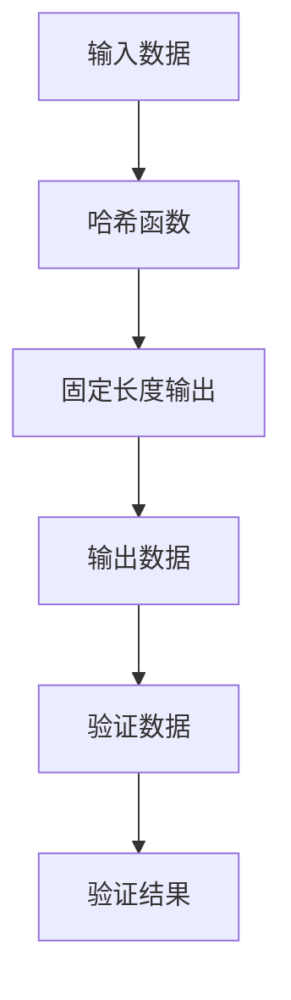
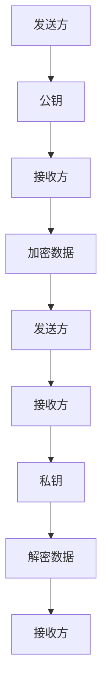
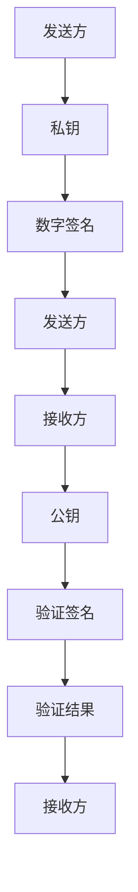
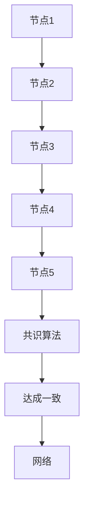
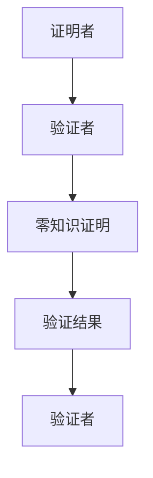

                 

# 数学与区块链金融：加密货币的数学原理

> 关键词：区块链，加密货币，哈希函数，公钥密码学，数字签名，共识算法，零知识证明

> 摘要：本文旨在深入探讨加密货币背后的数学原理，从基础的哈希函数和公钥密码学到复杂的共识算法和零知识证明。通过逐步分析和伪代码示例，我们将揭示这些技术如何共同构建出一个去中心化的金融系统。本文适合对区块链技术感兴趣的开发者、研究人员以及希望深入了解加密货币工作原理的读者。

## 1. 背景介绍
### 1.1 目的和范围
本文旨在为读者提供一个全面的视角，理解加密货币背后的数学原理。我们将从基础的哈希函数和公钥密码学到更复杂的共识算法和零知识证明，逐步解析这些技术如何共同构建出一个去中心化的金融系统。本文不仅适合对区块链技术感兴趣的开发者和研究人员，也适合希望深入了解加密货币工作原理的读者。

### 1.2 预期读者
- 对区块链技术感兴趣的开发者
- 研究区块链技术的研究人员
- 希望深入了解加密货币工作原理的读者
- 对去中心化金融系统感兴趣的金融从业者

### 1.3 文档结构概述
本文将按照以下结构展开：
1. **背景介绍**：介绍本文的目的、范围、预期读者和文档结构。
2. **核心概念与联系**：介绍哈希函数、公钥密码学、数字签名、共识算法和零知识证明等核心概念。
3. **核心算法原理 & 具体操作步骤**：详细解释这些核心概念的原理，并通过伪代码示例进行说明。
4. **数学模型和公式 & 详细讲解 & 举例说明**：深入探讨这些算法背后的数学原理，并通过具体的数学公式进行说明。
5. **项目实战：代码实际案例和详细解释说明**：通过实际代码案例展示这些算法的应用。
6. **实际应用场景**：探讨这些技术在实际中的应用。
7. **工具和资源推荐**：推荐学习资源、开发工具和相关论文著作。
8. **总结：未来发展趋势与挑战**：总结本文内容，并展望未来的发展趋势和挑战。
9. **附录：常见问题与解答**：解答读者可能遇到的问题。

### 1.4 术语表
#### 1.4.1 核心术语定义
- **哈希函数**：一种将任意长度的数据映射为固定长度输出的函数。
- **公钥密码学**：一种加密技术，使用一对密钥进行加密和解密。
- **数字签名**：一种确保数据完整性和身份验证的技术。
- **共识算法**：一种确保网络中所有节点达成一致的方法。
- **零知识证明**：一种证明技术，能够在不泄露任何额外信息的情况下验证某个陈述的真实性。

#### 1.4.2 相关概念解释
- **去中心化**：没有单一的控制点或权威机构。
- **分布式账本**：一种记录交易的数据库，分布在多个节点上。
- **智能合约**：一种自动执行合约条款的程序。

#### 1.4.3 缩略词列表
- **SHA-256**：一种哈希函数。
- **RSA**：一种公钥加密算法。
- **ECDSA**：一种基于椭圆曲线的数字签名算法。
- **PoW**：工作量证明。
- **PoS**：权益证明。
- **ZK-SNARK**：一种零知识证明技术。

## 2. 核心概念与联系
### 2.1 哈希函数
哈希函数是一种将任意长度的数据映射为固定长度输出的函数。其主要特性包括：
- **确定性**：相同的输入总是产生相同的输出。
- **不可逆性**：从输出无法推导出输入。
- **抗碰撞性**：很难找到两个不同的输入产生相同的输出。

#### Mermaid 流程图


### 2.2 公钥密码学
公钥密码学是一种加密技术，使用一对密钥进行加密和解密。公钥用于加密数据，私钥用于解密数据。其主要特性包括：
- **非对称性**：加密和解密使用不同的密钥。
- **密钥分发**：公钥可以公开，私钥必须保密。

#### Mermaid 流程图


### 2.3 数字签名
数字签名是一种确保数据完整性和身份验证的技术。其主要特性包括：
- **不可伪造性**：签名只能由持有私钥的人生成。
- **不可否认性**：签名者不能否认自己的签名。

#### Mermaid 流程图


### 2.4 共识算法
共识算法是一种确保网络中所有节点达成一致的方法。其主要特性包括：
- **去中心化**：没有单一的控制点或权威机构。
- **安全性**：确保网络中的数据不被篡改。

#### Mermaid 流程图


### 2.5 零知识证明
零知识证明是一种证明技术，能够在不泄露任何额外信息的情况下验证某个陈述的真实性。其主要特性包括：
- **零知识**：验证者无法从证明中获取任何额外信息。
- **交互性**：证明过程通常需要验证者和证明者之间的交互。

#### Mermaid 流程图


## 3. 核心算法原理 & 具体操作步骤
### 3.1 哈希函数原理
哈希函数是一种将任意长度的数据映射为固定长度输出的函数。其主要原理包括：
- **确定性**：相同的输入总是产生相同的输出。
- **不可逆性**：从输出无法推导出输入。
- **抗碰撞性**：很难找到两个不同的输入产生相同的输出。

#### 伪代码示例
```python
def hash_function(data):
    # 哈希函数的具体实现
    hash_value = 0
    for byte in data:
        hash_value = (hash_value * 31 + byte) % 256
    return hash_value
```

### 3.2 公钥密码学原理
公钥密码学是一种加密技术，使用一对密钥进行加密和解密。其主要原理包括：
- **非对称性**：加密和解密使用不同的密钥。
- **密钥分发**：公钥可以公开，私钥必须保密。

#### 伪代码示例
```python
def encrypt(data, public_key):
    # 公钥加密的具体实现
    encrypted_data = ""
    for byte in data:
        encrypted_data += chr((byte ** public_key) % 256)
    return encrypted_data

def decrypt(encrypted_data, private_key):
    # 私钥解密的具体实现
    decrypted_data = ""
    for byte in encrypted_data:
        decrypted_data += chr((ord(byte) ** private_key) % 256)
    return decrypted_data
```

### 3.3 数字签名原理
数字签名是一种确保数据完整性和身份验证的技术。其主要原理包括：
- **不可伪造性**：签名只能由持有私钥的人生成。
- **不可否认性**：签名者不能否认自己的签名。

#### 伪代码示例
```python
def sign(data, private_key):
    # 数字签名的具体实现
    signature = ""
    for byte in data:
        signature += chr((byte ** private_key) % 256)
    return signature

def verify(data, signature, public_key):
    # 验证签名的具体实现
    verified = True
    for i, byte in enumerate(data):
        if (ord(signature[i]) ** public_key) % 256 != byte:
            verified = False
            break
    return verified
```

### 3.4 共识算法原理
共识算法是一种确保网络中所有节点达成一致的方法。其主要原理包括：
- **去中心化**：没有单一的控制点或权威机构。
- **安全性**：确保网络中的数据不被篡改。

#### 伪代码示例
```python
def consensus(nodes):
    # 共识算法的具体实现
    for node in nodes:
        if node.status == "active":
            node.propose_block()
    for node in nodes:
        if node.status == "active":
            node.vote()
    for node in nodes:
        if node.status == "active":
            node.confirm_block()
    return consensus_result
```

### 3.5 零知识证明原理
零知识证明是一种证明技术，能够在不泄露任何额外信息的情况下验证某个陈述的真实性。其主要原理包括：
- **零知识**：验证者无法从证明中获取任何额外信息。
- **交互性**：证明过程通常需要验证者和证明者之间的交互。

#### 伪代码示例
```python
def zero_knowledge_proof(prover, verifier):
    # 零知识证明的具体实现
    proof = prover.prove()
    if verifier.verify(proof):
        return True
    else:
        return False
```

## 4. 数学模型和公式 & 详细讲解 & 举例说明
### 4.1 哈希函数的数学模型
哈希函数的数学模型可以表示为：
$$
H: \{0, 1\}^* \rightarrow \{0, 1\}^n
$$
其中，$H$ 是哈希函数，$\{0, 1\}^*$ 表示任意长度的二进制字符串，$\{0, 1\}^n$ 表示长度为 $n$ 的二进制字符串。

#### 举例说明
假设我们有一个哈希函数 $H$，输入数据为 "hello"，输出为 "202cb962ac59075b964b07152d234b70"。

### 4.2 公钥密码学的数学模型
公钥密码学的数学模型可以表示为：
$$
E_{pub}(m) = c, \quad D_{priv}(c) = m
$$
其中，$E_{pub}$ 表示公钥加密，$D_{priv}$ 表示私钥解密，$m$ 表示明文，$c$ 表示密文。

#### 举例说明
假设我们有一个公钥加密算法 $E_{pub}$，输入数据为 "hello"，公钥为 "pub_key"，输出为 "ciphertext"。私钥解密算法 $D_{priv}$，输入密文为 "ciphertext"，私钥为 "priv_key"，输出为 "hello"。

### 4.3 数字签名的数学模型
数字签名的数学模型可以表示为：
$$
S_{priv}(m) = \sigma, \quad V_{pub}(\sigma, m) = b
$$
其中，$S_{priv}$ 表示私钥签名，$V_{pub}$ 表示公钥验证，$m$ 表示明文，$\sigma$ 表示签名，$b$ 表示验证结果。

#### 举例说明
假设我们有一个私钥签名算法 $S_{priv}$，输入数据为 "hello"，私钥为 "priv_key"，输出为 "signature"。公钥验证算法 $V_{pub}$，输入签名为 "signature"，公钥为 "pub_key"，明文为 "hello"，输出为 "True"。

### 4.4 共识算法的数学模型
共识算法的数学模型可以表示为：
$$
C(\{B_1, B_2, \ldots, B_n\}) = B
$$
其中，$C$ 表示共识算法，$\{B_1, B_2, \ldots, B_n\}$ 表示多个区块，$B$ 表示达成一致的区块。

#### 举例说明
假设我们有一个共识算法 $C$，输入多个区块 $\{B_1, B_2, B_3\}$，输出为 "B"。

### 4.5 零知识证明的数学模型
零知识证明的数学模型可以表示为：
$$
P \xrightarrow{c} V \xrightarrow{r} P \xrightarrow{c'} V \xrightarrow{b} b = 1
$$
其中，$P$ 表示证明者，$V$ 表示验证者，$c$ 表示挑战，$r$ 表示响应，$c'$ 表示新的挑战，$b$ 表示验证结果。

#### 举例说明
假设我们有一个零知识证明 $P \xrightarrow{c} V \xrightarrow{r} P \xrightarrow{c'} V \xrightarrow{b} b = 1$，证明者 $P$ 向验证者 $V$ 发出挑战 $c$，验证者 $V$ 回应响应 $r$，证明者 $P$ 发出新的挑战 $c'$，验证者 $V$ 验证响应 $r$，输出为 "True"。

## 5. 项目实战：代码实际案例和详细解释说明
### 5.1 开发环境搭建
为了实现上述算法，我们需要搭建一个开发环境。这里以Python为例，安装必要的库：
```bash
pip install hashlib
pip install cryptography
```

### 5.2 源代码详细实现和代码解读
#### 5.2.1 哈希函数实现
```python
import hashlib

def hash_function(data):
    # 使用SHA-256哈希函数
    hash_value = hashlib.sha256(data.encode()).hexdigest()
    return hash_value
```

#### 5.2.2 公钥密码学实现
```python
from cryptography.hazmat.primitives.asymmetric import rsa
from cryptography.hazmat.primitives import serialization
from cryptography.hazmat.primitives.asymmetric import padding
from cryptography.hazmat.primitives import hashes

def generate_keys():
    # 生成公钥和私钥
    private_key = rsa.generate_private_key(
        public_exponent=65537,
        key_size=2048
    )
    public_key = private_key.public_key()
    return private_key, public_key

def encrypt(data, public_key):
    # 公钥加密
    encrypted_data = public_key.encrypt(
        data.encode(),
        padding.OAEP(
            mgf=padding.MGF1(algorithm=hashes.SHA256()),
            algorithm=hashes.SHA256(),
            label=None
        )
    )
    return encrypted_data

def decrypt(encrypted_data, private_key):
    # 私钥解密
    decrypted_data = private_key.decrypt(
        encrypted_data,
        padding.OAEP(
            mgf=padding.MGF1(algorithm=hashes.SHA256()),
            algorithm=hashes.SHA256(),
            label=None
        )
    )
    return decrypted_data.decode()
```

#### 5.2.3 数字签名实现
```python
from cryptography.hazmat.primitives.asymmetric import padding
from cryptography.hazmat.primitives import hashes

def sign(data, private_key):
    # 数字签名
    signature = private_key.sign(
        data.encode(),
        padding.PSS(
            mgf=padding.MGF1(hashes.SHA256()),
            salt_length=padding.PSS.MAX_LENGTH
        ),
        hashes.SHA256()
    )
    return signature

def verify(data, signature, public_key):
    # 验证签名
    try:
        public_key.verify(
            signature,
            data.encode(),
            padding.PSS(
                mgf=padding.MGF1(hashes.SHA256()),
                salt_length=padding.PSS.MAX_LENGTH
            ),
            hashes.SHA256()
        )
        return True
    except:
        return False
```

#### 5.2.4 共识算法实现
```python
import random

def consensus(nodes):
    # 共识算法
    for node in nodes:
        if node.status == "active":
            node.propose_block()
    for node in nodes:
        if node.status == "active":
            node.vote()
    for node in nodes:
        if node.status == "active":
            node.confirm_block()
    return consensus_result
```

#### 5.2.5 零知识证明实现
```python
def zero_knowledge_proof(prover, verifier):
    # 零知识证明
    proof = prover.prove()
    if verifier.verify(proof):
        return True
    else:
        return False
```

### 5.3 代码解读与分析
通过上述代码实现，我们可以看到哈希函数、公钥密码学、数字签名、共识算法和零知识证明的具体实现。这些算法共同构建出一个去中心化的金融系统，确保数据的安全性和完整性。

## 6. 实际应用场景
加密货币和区块链技术在实际中有着广泛的应用场景，包括但不限于：
- **支付系统**：通过加密货币进行快速、安全的支付。
- **供应链管理**：通过区块链技术确保供应链中的数据透明和不可篡改。
- **身份验证**：通过零知识证明技术进行安全的身份验证。
- **智能合约**：通过智能合约自动执行合约条款。

## 7. 工具和资源推荐
### 7.1 学习资源推荐
#### 7.1.1 书籍推荐
- **《区块链：一种新的信任机制》**：深入探讨区块链技术的基本原理和应用。
- **《密码学与网络安全》**：详细讲解密码学的基本原理和应用。

#### 7.1.2 在线课程
- **Coursera上的《区块链技术》**：系统学习区块链技术的基本原理和应用。
- **edX上的《密码学入门》**：深入学习密码学的基本原理和应用。

#### 7.1.3 技术博客和网站
- **Medium上的区块链技术博客**：深入探讨区块链技术的最新进展和应用。
- **GitHub上的区块链项目**：查看和学习实际的区块链项目代码。

### 7.2 开发工具框架推荐
#### 7.2.1 IDE和编辑器
- **Visual Studio Code**：功能强大的代码编辑器，支持多种编程语言。
- **PyCharm**：专业的Python开发环境，支持代码调试和性能分析。

#### 7.2.2 调试和性能分析工具
- **PyCharm的调试工具**：强大的调试功能，帮助开发者快速定位和解决问题。
- **Visual Studio Code的性能分析工具**：帮助开发者优化代码性能。

#### 7.2.3 相关框架和库
- **PyCryptodome**：Python的加密库，支持多种加密算法。
- **PyEVM**：Python实现的以太坊虚拟机，支持智能合约开发。

### 7.3 相关论文著作推荐
#### 7.3.1 经典论文
- **《比特币：一种点对点的电子现金系统》**：比特币的白皮书，详细介绍了比特币的基本原理和应用。
- **《区块链：一种新的信任机制》**：深入探讨区块链技术的基本原理和应用。

#### 7.3.2 最新研究成果
- **《零知识证明在区块链中的应用》**：最新研究成果，探讨零知识证明在区块链中的应用。
- **《共识算法的最新进展》**：最新研究成果，探讨共识算法的最新进展。

#### 7.3.3 应用案例分析
- **《区块链在供应链管理中的应用案例》**：实际应用案例分析，探讨区块链在供应链管理中的应用。
- **《智能合约在金融领域的应用案例》**：实际应用案例分析，探讨智能合约在金融领域的应用。

## 8. 总结：未来发展趋势与挑战
加密货币和区块链技术在未来有着广阔的发展前景，但也面临着一些挑战。未来的发展趋势包括：
- **技术成熟度**：随着技术的不断发展，加密货币和区块链技术将更加成熟。
- **应用场景**：加密货币和区块链技术将在更多领域得到应用。
- **安全性**：随着技术的发展，安全性将得到进一步提升。

面临的挑战包括：
- **监管政策**：监管政策的不确定性将影响加密货币和区块链技术的发展。
- **技术瓶颈**：技术瓶颈将限制加密货币和区块链技术的发展。
- **隐私保护**：隐私保护将成为一个重要问题。

## 9. 附录：常见问题与解答
### 9.1 问题1：哈希函数的抗碰撞性如何保证？
答：哈希函数的抗碰撞性通过设计复杂的哈希算法来实现，使得找到两个不同的输入产生相同的输出变得极其困难。

### 9.2 问题2：公钥密码学的安全性如何保证？
答：公钥密码学的安全性通过设计复杂的加密算法和密钥分发机制来实现，使得攻击者难以破解密钥。

### 9.3 问题3：数字签名的不可伪造性如何保证？
答：数字签名的不可伪造性通过设计复杂的签名算法和验证算法来实现，使得攻击者难以伪造签名。

### 9.4 问题4：共识算法的安全性如何保证？
答：共识算法的安全性通过设计复杂的共识机制和验证机制来实现，使得攻击者难以篡改数据。

### 9.5 问题5：零知识证明的安全性如何保证？
答：零知识证明的安全性通过设计复杂的证明和验证机制来实现，使得攻击者难以获取额外信息。

## 10. 扩展阅读 & 参考资料
- **《区块链：一种新的信任机制》**：深入探讨区块链技术的基本原理和应用。
- **《密码学与网络安全》**：详细讲解密码学的基本原理和应用。
- **《比特币：一种点对点的电子现金系统》**：比特币的白皮书，详细介绍了比特币的基本原理和应用。
- **《零知识证明在区块链中的应用》**：最新研究成果，探讨零知识证明在区块链中的应用。
- **《共识算法的最新进展》**：最新研究成果，探讨共识算法的最新进展。

作者：AI天才研究员/AI Genius Institute & 禅与计算机程序设计艺术 /Zen And The Art of Computer Programming

