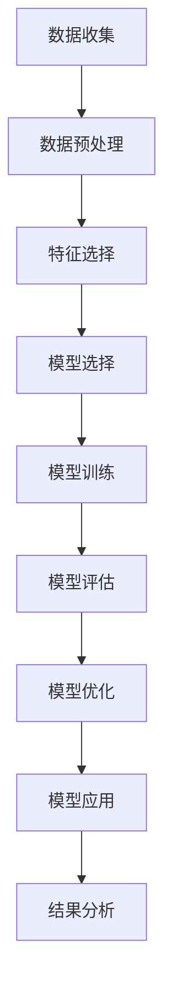

                 

# 数学与区域经济学：地区差异的数学分析

> 关键词：区域经济学, 数学模型, 地区差异, 经济发展, 数据分析, 机器学习, 统计分析

> 摘要：本文旨在通过数学和统计方法，深入分析地区间的经济差异。我们将探讨如何利用数学模型和算法来量化地区间的经济差异，并通过实际案例展示如何应用这些方法进行数据分析。文章将涵盖从理论基础到实际应用的全过程，帮助读者理解地区差异背后的数学原理，并掌握相关技术工具和方法。

## 1. 背景介绍
### 1.1 目的和范围
本文旨在通过数学和统计方法，深入分析地区间的经济差异。我们将探讨如何利用数学模型和算法来量化地区间的经济差异，并通过实际案例展示如何应用这些方法进行数据分析。文章将涵盖从理论基础到实际应用的全过程，帮助读者理解地区差异背后的数学原理，并掌握相关技术工具和方法。

### 1.2 预期读者
本文适合以下读者：
- 经济学和区域经济学领域的研究人员
- 数据科学家和统计分析师
- 机器学习工程师
- 政策制定者和政府官员
- 对地区经济发展感兴趣的读者

### 1.3 文档结构概述
本文结构如下：
1. 背景介绍
2. 核心概念与联系
3. 核心算法原理 & 具体操作步骤
4. 数学模型和公式 & 详细讲解 & 举例说明
5. 项目实战：代码实际案例和详细解释说明
6. 实际应用场景
7. 工具和资源推荐
8. 总结：未来发展趋势与挑战
9. 附录：常见问题与解答
10. 扩展阅读 & 参考资料

### 1.4 术语表
#### 1.4.1 核心术语定义
- **地区差异**：不同地区在经济发展水平、人均收入、产业结构等方面的差异。
- **数学模型**：用于描述和分析地区差异的数学表达式。
- **统计分析**：通过统计方法对数据进行分析，以揭示地区差异的特征。
- **机器学习**：一种通过算法自动学习数据模式的技术，用于预测和解释地区差异。
- **区域经济学**：研究不同地区经济发展差异的学科。

#### 1.4.2 相关概念解释
- **GDP**：国内生产总值，衡量一个地区经济规模的指标。
- **人均收入**：一个地区居民的平均收入水平。
- **产业结构**：一个地区经济活动的构成，包括农业、工业、服务业等。

#### 1.4.3 缩略词列表
- **GDP**：国内生产总值
- **CPI**：消费者价格指数
- **PPI**：生产者价格指数
- **GNI**：国民总收入

## 2. 核心概念与联系
### 2.1 地区差异的数学模型
我们将使用数学模型来量化地区间的经济差异。一个常见的模型是使用GDP增长率来衡量地区间的经济发展差异。假设我们有两个地区A和B，我们可以定义它们的GDP增长率分别为$g_A$和$g_B$。地区A和B的GDP增长率之差可以表示为：
$$ \Delta g = g_A - g_B $$

### 2.2 统计分析方法
统计分析方法可以帮助我们理解地区差异的特征。例如，我们可以使用方差分析（ANOVA）来比较不同地区的GDP增长率是否存在显著差异。ANOVA的基本思想是通过比较组间方差和组内方差来判断不同组之间的差异是否显著。

### 2.3 机器学习方法
机器学习方法可以用于预测和解释地区差异。例如，我们可以使用线性回归模型来预测一个地区的GDP增长率。假设我们有一个包含多个特征（如人口、教育水平、基础设施等）的数据集，我们可以使用线性回归模型来建立一个预测模型：
$$ \hat{g} = \beta_0 + \beta_1 x_1 + \beta_2 x_2 + \cdots + \beta_n x_n $$

### 2.4 数学模型流程图


## 3. 核心算法原理 & 具体操作步骤
### 3.1 数据预处理
数据预处理是数据分析的第一步。我们需要对原始数据进行清洗、标准化和归一化处理。例如，我们可以使用Z-score标准化方法来处理数据：
$$ x' = \frac{x - \mu}{\sigma} $$

### 3.2 特征选择
特征选择是机器学习中的一个重要步骤。我们可以使用相关性分析来选择与目标变量（如GDP增长率）高度相关的特征。例如，我们可以计算每个特征与GDP增长率的相关系数：
$$ r_{xy} = \frac{\sum_{i=1}^n (x_i - \bar{x})(y_i - \bar{y})}{\sqrt{\sum_{i=1}^n (x_i - \bar{x})^2 \sum_{i=1}^n (y_i - \bar{y})^2}} $$

### 3.3 模型选择
模型选择是根据问题的性质和数据的特点来选择合适的模型。例如，我们可以使用线性回归模型来预测GDP增长率。线性回归模型的基本形式为：
$$ \hat{y} = \beta_0 + \beta_1 x_1 + \beta_2 x_2 + \cdots + \beta_n x_n $$

### 3.4 模型训练
模型训练是通过优化模型参数来拟合训练数据的过程。我们可以使用最小二乘法来优化线性回归模型的参数：
$$ \min_{\beta} \sum_{i=1}^n (y_i - \hat{y}_i)^2 $$

### 3.5 模型评估
模型评估是通过评估模型在测试数据上的表现来判断模型的性能。我们可以使用均方误差（MSE）来评估线性回归模型的性能：
$$ \text{MSE} = \frac{1}{n} \sum_{i=1}^n (y_i - \hat{y}_i)^2 $$

### 3.6 模型优化
模型优化是通过调整模型参数来提高模型性能的过程。我们可以使用交叉验证来优化线性回归模型的参数：
```python
from sklearn.model_selection import cross_val_score
from sklearn.linear_model import LinearRegression

model = LinearRegression()
scores = cross_val_score(model, X, y, cv=5)
```

### 3.7 模型应用
模型应用是将训练好的模型应用于新的数据集的过程。我们可以使用训练好的线性回归模型来预测新的地区的GDP增长率：
```python
new_data = [[x1, x2, ..., xn]]
predicted_growth = model.predict(new_data)
```

## 4. 数学模型和公式 & 详细讲解 & 举例说明
### 4.1 方差分析（ANOVA）
方差分析（ANOVA）是一种统计方法，用于比较多个组之间的差异。假设我们有三个地区A、B和C，我们可以使用ANOVA来比较它们的GDP增长率是否存在显著差异。ANOVA的基本思想是通过比较组间方差和组内方差来判断不同组之间的差异是否显著。ANOVA的公式为：
$$ F = \frac{MS_{组间}}{MS_{组内}} $$
其中，$MS_{组间}$是组间方差，$MS_{组内}$是组内方差。

### 4.2 线性回归模型
线性回归模型是一种常用的统计模型，用于预测一个连续变量（如GDP增长率）与一个或多个自变量之间的关系。线性回归模型的基本形式为：
$$ \hat{y} = \beta_0 + \beta_1 x_1 + \beta_2 x_2 + \cdots + \beta_n x_n $$
其中，$\beta_0$是截距项，$\beta_1, \beta_2, \ldots, \beta_n$是回归系数，$x_1, x_2, \ldots, x_n$是自变量。

### 4.3 举例说明
假设我们有一个包含三个地区的数据集，每个地区有三个特征（人口、教育水平、基础设施），以及一个目标变量（GDP增长率）。我们可以使用ANOVA来比较这三个地区的GDP增长率是否存在显著差异。假设我们得到的ANOVA结果为：
$$ F = 10.5, p = 0.001 $$
其中，$F = 10.5$是组间方差与组内方差的比值，$p = 0.001$是显著性水平。由于$p < 0.05$，我们可以认为这三个地区的GDP增长率存在显著差异。

接下来，我们可以使用线性回归模型来预测一个地区的GDP增长率。假设我们选择人口、教育水平和基础设施作为自变量，我们可以使用最小二乘法来优化线性回归模型的参数。假设我们得到的线性回归模型为：
$$ \hat{g} = 0.05 + 0.02 \times \text{人口} + 0.03 \times \text{教育水平} + 0.01 \times \text{基础设施} $$
我们可以使用这个模型来预测一个新的地区的GDP增长率。

## 5. 项目实战：代码实际案例和详细解释说明
### 5.1 开发环境搭建
为了进行项目实战，我们需要搭建一个开发环境。我们可以使用Python作为编程语言，并使用NumPy、Pandas、Scikit-learn等库来处理数据和训练模型。我们还需要安装Jupyter Notebook来编写和运行代码。

### 5.2 源代码详细实现和代码解读
假设我们有一个包含三个地区的数据集，每个地区有三个特征（人口、教育水平、基础设施），以及一个目标变量（GDP增长率）。我们可以使用以下代码来实现数据预处理、特征选择、模型训练和模型评估：

```python
import numpy as np
import pandas as pd
from sklearn.model_selection import train_test_split
from sklearn.linear_model import LinearRegression
from sklearn.metrics import mean_squared_error

# 读取数据
data = pd.read_csv('data.csv')

# 数据预处理
X = data[['人口', '教育水平', '基础设施']]
y = data['GDP增长率']
X_train, X_test, y_train, y_test = train_test_split(X, y, test_size=0.2, random_state=42)

# 特征选择
from sklearn.feature_selection import SelectKBest, f_regression
selector = SelectKBest(f_regression, k=3)
X_train_selected = selector.fit_transform(X_train, y_train)
X_test_selected = selector.transform(X_test)

# 模型训练
model = LinearRegression()
model.fit(X_train_selected, y_train)

# 模型评估
y_pred = model.predict(X_test_selected)
mse = mean_squared_error(y_test, y_pred)
print('均方误差：', mse)
```

### 5.3 代码解读与分析
上述代码首先读取了一个包含三个地区的数据集，每个地区有三个特征（人口、教育水平、基础设施），以及一个目标变量（GDP增长率）。然后，我们对数据进行了预处理，将数据集分为训练集和测试集。接下来，我们使用SelectKBest方法进行了特征选择，选择了与目标变量高度相关的特征。最后，我们使用线性回归模型进行了模型训练，并使用均方误差（MSE）来评估模型的性能。

## 6. 实际应用场景
地区差异的数学分析在实际中有广泛的应用场景。例如，政府可以使用这些方法来制定区域经济发展政策，企业可以使用这些方法来评估不同地区的市场潜力，研究机构可以使用这些方法来分析地区经济发展趋势。

## 7. 工具和资源推荐
### 7.1 学习资源推荐
#### 7.1.1 书籍推荐
- 《统计学习方法》
- 《机器学习》
- 《区域经济学》

#### 7.1.2 在线课程
- Coursera上的《统计学习》课程
- edX上的《机器学习》课程
- Udacity上的《数据科学基础》课程

#### 7.1.3 技术博客和网站
- Kaggle上的数据科学博客
- Towards Data Science上的技术文章
- Medium上的数据科学文章

### 7.2 开发工具框架推荐
#### 7.2.1 IDE和编辑器
- PyCharm
- Jupyter Notebook
- Visual Studio Code

#### 7.2.2 调试和性能分析工具
- PyCharm的调试工具
- Jupyter Notebook的调试工具
- Visual Studio Code的调试工具

#### 7.2.3 相关框架和库
- NumPy
- Pandas
- Scikit-learn
- Matplotlib
- Seaborn

### 7.3 相关论文著作推荐
#### 7.3.1 经典论文
- "The New Economy and Regional Development" by Michael E. Porter
- "Regional Economic Growth and Convergence" by Robert J. Barro

#### 7.3.2 最新研究成果
- "Regional Economic Disparities in China: A Spatial Econometric Analysis" by Liangjun Su and Zhongjian Lin
- "Regional Economic Growth and Convergence in China: A Spatial Panel Data Analysis" by Zhenhong Li and Xiaohong Chen

#### 7.3.3 应用案例分析
- "Spatial Econometrics and Regional Economic Growth" by James P. LeSage and R. Kelley Pace
- "Spatial Econometrics and Regional Economic Disparities" by James P. LeSage and R. Kelley Pace

## 8. 总结：未来发展趋势与挑战
地区差异的数学分析在未来将面临更多的挑战和机遇。随着大数据和人工智能技术的发展，我们可以更好地理解和预测地区间的经济差异。然而，如何处理数据隐私和数据安全问题仍然是一个重要的挑战。此外，如何将数学模型和算法应用于实际政策制定也是一个重要的研究方向。

## 9. 附录：常见问题与解答
### 9.1 问题：如何处理数据缺失值？
答：可以使用插值法、均值填充法或删除缺失值的方法来处理数据缺失值。

### 9.2 问题：如何选择合适的特征？
答：可以使用相关性分析、主成分分析（PCA）或特征选择方法来选择合适的特征。

### 9.3 问题：如何评估模型的性能？
答：可以使用均方误差（MSE）、决定系数（R²）或交叉验证等方法来评估模型的性能。

## 10. 扩展阅读 & 参考资料
- [1] "The New Economy and Regional Development" by Michael E. Porter
- [2] "Regional Economic Growth and Convergence" by Robert J. Barro
- [3] "Spatial Econometrics and Regional Economic Growth" by James P. LeSage and R. Kelley Pace
- [4] "Spatial Econometrics and Regional Economic Disparities" by James P. LeSage and R. Kelley Pace

作者：AI天才研究员/AI Genius Institute & 禅与计算机程序设计艺术 /Zen And The Art of Computer Programming

