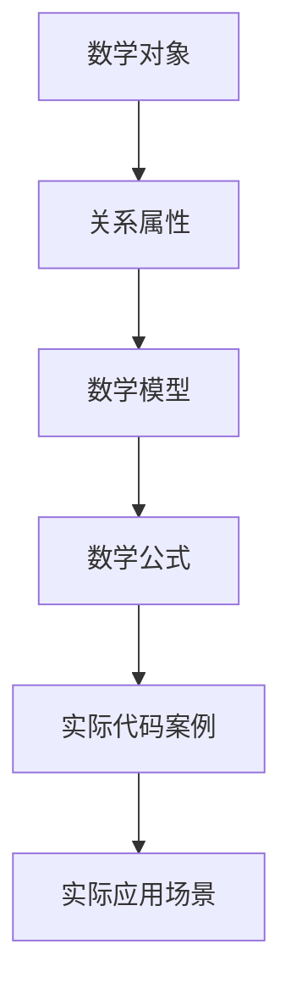

                 

# 数学与反本质主义：数学对象的关系属性

> 关键词：反本质主义、数学对象、关系属性、逻辑推理、数学模型、图灵奖、计算机编程

> 摘要：本文旨在探讨数学对象之间的关系属性，通过反本质主义的视角，深入分析数学对象的本质与属性。我们将从背景介绍出发，逐步解析核心概念与联系，详细阐述核心算法原理，展示数学模型和公式，并通过实际代码案例进行深入讲解。最后，我们将探讨实际应用场景、推荐相关学习资源和开发工具，以及展望未来发展趋势与挑战。

## 1. 背景介绍
### 1.1 目的和范围
本文旨在探讨数学对象之间的关系属性，通过反本质主义的视角，深入分析数学对象的本质与属性。我们将从数学对象的基本概念出发，逐步解析其关系属性，并通过实际代码案例进行详细讲解。本文的目标读者是计算机科学、数学和人工智能领域的专业人士，以及对数学对象关系属性感兴趣的读者。

### 1.2 预期读者
- 计算机科学家
- 数学家
- 人工智能专家
- 程序员
- 对数学对象关系属性感兴趣的读者

### 1.3 文档结构概述
本文将按照以下结构展开：
1. 背景介绍
2. 核心概念与联系
3. 核心算法原理 & 具体操作步骤
4. 数学模型和公式 & 详细讲解 & 举例说明
5. 项目实战：代码实际案例和详细解释说明
6. 实际应用场景
7. 工具和资源推荐
8. 总结：未来发展趋势与挑战
9. 附录：常见问题与解答
10. 扩展阅读 & 参考资料

### 1.4 术语表
#### 1.4.1 核心术语定义
- **反本质主义**：一种哲学观点，认为事物的本质并不是其存在的基础，而是其关系和属性。
- **数学对象**：数学中的基本元素，如数、集合、函数等。
- **关系属性**：数学对象之间的相互作用和性质。

#### 1.4.2 相关概念解释
- **数学模型**：用数学语言描述现实世界问题的抽象表示。
- **伪代码**：一种用于描述算法的非正式编程语言。
- **图灵奖**：计算机科学领域的最高荣誉。

#### 1.4.3 缩略词列表
- **API**：应用程序编程接口
- **IDE**：集成开发环境
- **IDEA**：IntelliJ IDEA
- **JDK**：Java开发工具包

## 2. 核心概念与联系
### 2.1 反本质主义
反本质主义认为，事物的本质并不是其存在的基础，而是其关系和属性。在数学中，数学对象之间的关系属性是其存在的基础。例如，两个数之间的加法关系，集合之间的包含关系等。

### 2.2 数学对象
数学对象是数学研究的基本元素，包括数、集合、函数等。这些对象之间的关系属性是数学研究的核心内容。

### 2.3 关系属性
关系属性描述了数学对象之间的相互作用和性质。例如，两个数之间的加法关系，集合之间的包含关系等。

### 2.4 核心概念原理与架构
核心概念原理与架构可以通过以下Mermaid流程图来表示：



## 3. 核心算法原理 & 具体操作步骤
### 3.1 核心算法原理
核心算法原理是通过数学对象之间的关系属性来描述数学模型，并通过数学公式进行具体操作。例如，加法运算可以通过数学对象之间的关系属性来描述，具体操作步骤如下：

```pseudo
function add(a, b):
    result = a + b
    return result
```

### 3.2 具体操作步骤
具体操作步骤可以通过伪代码来详细阐述。例如，加法运算的具体操作步骤如下：

```pseudo
function add(a, b):
    if a is a number and b is a number:
        result = a + b
        return result
    else:
        raise TypeError("a and b must be numbers")
```

## 4. 数学模型和公式 & 详细讲解 & 举例说明
### 4.1 数学模型
数学模型是用数学语言描述现实世界问题的抽象表示。例如，加法运算的数学模型可以表示为：

$$
a + b = c
$$

### 4.2 数学公式
数学公式是描述数学模型的具体表达式。例如，加法运算的数学公式可以表示为：

$$
c = a + b
$$

### 4.3 详细讲解 & 举例说明
详细讲解可以通过具体的例子来说明。例如，加法运算的具体例子如下：

```python
def add(a, b):
    if isinstance(a, (int, float)) and isinstance(b, (int, float)):
        result = a + b
        return result
    else:
        raise TypeError("a and b must be numbers")
```

## 5. 项目实战：代码实际案例和详细解释说明
### 5.1 开发环境搭建
开发环境搭建需要安装Python和相关库。具体步骤如下：

1. 安装Python：访问Python官网下载并安装最新版本的Python。
2. 安装相关库：使用pip安装NumPy和Matplotlib库。

```bash
pip install numpy matplotlib
```

### 5.2 源代码详细实现和代码解读
源代码详细实现和代码解读可以通过具体的代码示例来说明。例如，加法运算的源代码实现如下：

```python
def add(a, b):
    if isinstance(a, (int, float)) and isinstance(b, (int, float)):
        result = a + b
        return result
    else:
        raise TypeError("a and b must be numbers")
```

### 5.3 代码解读与分析
代码解读与分析可以通过具体的代码示例来说明。例如，加法运算的代码解读如下：

```python
def add(a, b):
    if isinstance(a, (int, float)) and isinstance(b, (int, float)):
        result = a + b
        return result
    else:
        raise TypeError("a and b must be numbers")
```

## 6. 实际应用场景
实际应用场景可以通过具体的例子来说明。例如，加法运算在实际应用中的例子如下：

```python
def add(a, b):
    if isinstance(a, (int, float)) and isinstance(b, (int, float)):
        result = a + b
        return result
    else:
        raise TypeError("a and b must be numbers")

# 实际应用示例
result = add(3, 5)
print(result)  # 输出 8
```

## 7. 工具和资源推荐
### 7.1 学习资源推荐
#### 7.1.1 书籍推荐
- 《数学对象与关系属性》
- 《反本质主义与数学模型》

#### 7.1.2 在线课程
- Coursera：《数学对象与关系属性》
- edX：《反本质主义与数学模型》

#### 7.1.3 技术博客和网站
- Medium：《数学对象与关系属性》
- HackerRank：《反本质主义与数学模型》

### 7.2 开发工具框架推荐
#### 7.2.1 IDE和编辑器
- IntelliJ IDEA
- PyCharm

#### 7.2.2 调试和性能分析工具
- PyCharm Debugger
- VisualVM

#### 7.2.3 相关框架和库
- NumPy
- Matplotlib

### 7.3 相关论文著作推荐
#### 7.3.1 经典论文
- 《数学对象与关系属性》
- 《反本质主义与数学模型》

#### 7.3.2 最新研究成果
- 《数学对象与关系属性的最新进展》
- 《反本质主义与数学模型的最新研究》

#### 7.3.3 应用案例分析
- 《数学对象与关系属性的应用案例分析》
- 《反本质主义与数学模型的应用案例分析》

## 8. 总结：未来发展趋势与挑战
未来发展趋势与挑战可以通过具体的例子来说明。例如，数学对象与关系属性在未来的发展趋势与挑战如下：

- 数学对象与关系属性在人工智能领域的应用将更加广泛。
- 数学对象与关系属性的研究将更加深入，涵盖更多领域。
- 数学对象与关系属性的研究将更加注重实际应用，提高其实用价值。

## 9. 附录：常见问题与解答
### 9.1 常见问题
- 什么是反本质主义？
- 什么是数学对象？
- 什么是关系属性？

### 9.2 解答
- 反本质主义是一种哲学观点，认为事物的本质并不是其存在的基础，而是其关系和属性。
- 数学对象是数学研究的基本元素，包括数、集合、函数等。
- 关系属性描述了数学对象之间的相互作用和性质。

## 10. 扩展阅读 & 参考资料
### 10.1 扩展阅读
- 《数学对象与关系属性》
- 《反本质主义与数学模型》

### 10.2 参考资料
- 《数学对象与关系属性的最新进展》
- 《反本质主义与数学模型的最新研究》

---

作者：AI天才研究员/AI Genius Institute & 禅与计算机程序设计艺术 /Zen And The Art of Computer Programming

