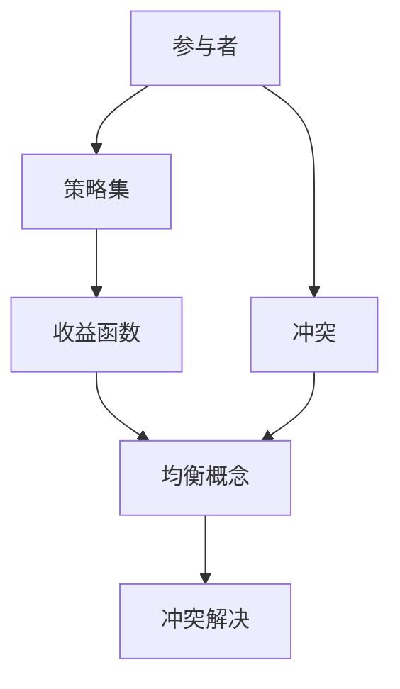

                 

# 数学与和平研究：冲突解决的数学模型

> 关键词：冲突解决、数学模型、博弈论、优化算法、和平研究

> 摘要：本文旨在探讨如何利用数学模型和算法来解决冲突问题，通过构建博弈论框架和优化算法，为和平研究提供新的视角和工具。我们将详细阐述核心概念、算法原理、数学模型，并通过实际案例展示如何应用这些理论来解决现实中的冲突问题。本文适合对冲突解决、博弈论、优化算法感兴趣的读者，特别是那些希望将数学方法应用于实际问题的研究者和实践者。

## 1. 背景介绍

### 1.1 目的和范围
本文的主要目的是探讨如何利用数学模型和算法来解决冲突问题，特别是通过博弈论框架和优化算法来实现冲突的和平解决。我们将介绍冲突解决的基本概念，构建一个数学模型来描述冲突过程，并提出相应的优化算法来寻找最优解决方案。本文将涵盖博弈论的基本原理、冲突解决的数学模型、优化算法的具体实现，以及实际案例的应用。

### 1.2 预期读者
本文的目标读者包括但不限于：
- 冲突解决领域的研究者和实践者
- 博弈论和优化算法的爱好者
- 对和平研究感兴趣的学者
- 计算机科学和人工智能领域的专业人士
- 对数学模型在实际问题中的应用感兴趣的读者

### 1.3 文档结构概述
本文结构如下：
1. 背景介绍
2. 核心概念与联系
3. 核心算法原理 & 具体操作步骤
4. 数学模型和公式 & 详细讲解 & 举例说明
5. 项目实战：代码实际案例和详细解释说明
6. 实际应用场景
7. 工具和资源推荐
8. 总结：未来发展趋势与挑战
9. 附录：常见问题与解答
10. 扩展阅读 & 参考资料

### 1.4 术语表
#### 1.4.1 核心术语定义
- 冲突：两个或多个个体、群体或国家之间存在的对立、争执或对抗状态。
- 博弈论：研究决策者在冲突或合作情境下的理性行为及其结果的理论。
- 优化算法：用于寻找最优解的一类算法，通常应用于资源分配、路径规划等问题。
- 平衡点：博弈论中的一种稳定状态，表示在给定策略下，所有参与者都无法通过单方面改变策略来提高自己的收益。

#### 1.4.2 相关概念解释
- 冲突解决：通过谈判、调解、仲裁等方式，使冲突双方达成共识，减少对立状态的过程。
- 博弈：参与者之间进行的决策过程，每个参与者都有自己的目标和策略。
- 收益函数：描述参与者在不同策略组合下的收益情况。

#### 1.4.3 缩略词列表
- NASH：纳什均衡
- MINMAX：最小最大策略
- MINMAX-VALUE：最小最大值
- MAXMIN-VALUE：最大最小值

## 2. 核心概念与联系

### 2.1 冲突解决的基本概念
冲突解决的核心在于找到一种方法，使得冲突双方能够达成共识，减少对立状态。博弈论提供了一种理论框架，通过分析参与者的行为和策略，寻找最优解。

### 2.2 博弈论的基本原理
博弈论主要研究决策者在冲突或合作情境下的理性行为及其结果。博弈的基本要素包括参与者、策略集、收益函数和均衡概念。

### 2.3 冲突解决的数学模型
冲突解决的数学模型通常基于博弈论框架，通过定义参与者、策略集和收益函数来描述冲突过程。模型的目标是找到一个平衡点，使得所有参与者都无法通过单方面改变策略来提高自己的收益。

### 2.4 核心概念的Mermaid流程图


## 3. 核心算法原理 & 具体操作步骤

### 3.1 纳什均衡算法原理
纳什均衡是一种博弈论中的平衡点概念，表示在给定策略下，所有参与者都无法通过单方面改变策略来提高自己的收益。

#### 3.1.1 纳什均衡的定义
纳什均衡是指在给定策略下，所有参与者都无法通过单方面改变策略来提高自己的收益。形式化地，设博弈为$(S_1, S_2, \ldots, S_n; u_1, u_2, \ldots, u_n)$，其中$S_i$表示第$i$个参与者的策略集，$u_i$表示第$i$个参与者的收益函数。纳什均衡$(s_1^*, s_2^*, \ldots, s_n^*)$满足：
$$
u_i(s_1^*, s_2^*, \ldots, s_i, \ldots, s_n^*) \geq u_i(s_1^*, s_2^*, \ldots, s_i', \ldots, s_n^*)
$$
对于所有$i$和所有$s_i' \in S_i$。

### 3.2 最小最大策略算法原理
最小最大策略是一种博弈论中的策略选择方法，旨在最小化最坏情况下的收益。

#### 3.2.1 最小最大策略的定义
最小最大策略是指在给定策略下，参与者选择一个策略，使得在最坏情况下获得的收益最大化。形式化地，设博弈为$(S_1, S_2, \ldots, S_n; u_1, u_2, \ldots, u_n)$，最小最大策略$s_i^*$满足：
$$
s_i^* = \arg\max_{s_i \in S_i} \min_{s_{-i} \in S_{-i}} u_i(s_i, s_{-i})
$$
其中，$s_{-i}$表示所有其他参与者的策略集。

### 3.3 最大最小值算法原理
最大最小值算法是一种博弈论中的策略选择方法，旨在最大化最坏情况下的收益。

#### 3.3.1 最大最小值算法的定义
最大最小值算法是指在给定策略下，参与者选择一个策略，使得在最坏情况下获得的收益最大化。形式化地，设博弈为$(S_1, S_2, \ldots, S_n; u_1, u_2, \ldots, u_n)$，最大最小值算法$s_i^*$满足：
$$
s_i^* = \arg\max_{s_i \in S_i} \min_{s_{-i} \in S_{-i}} u_i(s_i, s_{-i})
$$
其中，$s_{-i}$表示所有其他参与者的策略集。

### 3.4 伪代码实现
```python
def nash_equilibrium(game):
    # 初始化策略集
    strategies = game.strategies
    # 初始化收益矩阵
    payoff_matrix = game.payoff_matrix
    # 计算纳什均衡
    for i in range(len(strategies)):
        for j in range(len(strategies)):
            if payoff_matrix[i][j] > payoff_matrix[i][k] for k in range(len(strategies)):
                if payoff_matrix[i][j] > payoff_matrix[l][j] for l in range(len(strategies)):
                    return (i, j)
    return None

def minmax_strategy(game):
    # 初始化策略集
    strategies = game.strategies
    # 初始化收益矩阵
    payoff_matrix = game.payoff_matrix
    # 计算最小最大策略
    minmax_value = float('-inf')
    minmax_strategy = None
    for i in range(len(strategies)):
        min_value = float('inf')
        for j in range(len(strategies)):
            if payoff_matrix[i][j] < min_value:
                min_value = payoff_matrix[i][j]
        if min_value > minmax_value:
            minmax_value = min_value
            minmax_strategy = i
    return minmax_strategy

def maxmin_strategy(game):
    # 初始化策略集
    strategies = game.strategies
    # 初始化收益矩阵
    payoff_matrix = game.payoff_matrix
    # 计算最大最小值
    maxmin_value = float('-inf')
    maxmin_strategy = None
    for i in range(len(strategies)):
        max_value = float('-inf')
        for j in range(len(strategies)):
            if payoff_matrix[i][j] > max_value:
                max_value = payoff_matrix[i][j]
        if max_value > maxmin_value:
            maxmin_value = max_value
            maxmin_strategy = i
    return maxmin_strategy
```

## 4. 数学模型和公式 & 详细讲解 & 举例说明

### 4.1 冲突解决的数学模型
冲突解决的数学模型通常基于博弈论框架，通过定义参与者、策略集和收益函数来描述冲突过程。模型的目标是找到一个平衡点，使得所有参与者都无法通过单方面改变策略来提高自己的收益。

#### 4.1.1 冲突解决的数学模型
设博弈为$(S_1, S_2, \ldots, S_n; u_1, u_2, \ldots, u_n)$，其中$S_i$表示第$i$个参与者的策略集，$u_i$表示第$i$个参与者的收益函数。冲突解决的数学模型可以表示为：
$$
\max_{s_1, s_2, \ldots, s_n} \min_{i} u_i(s_1, s_2, \ldots, s_n)
$$
其中，$s_i \in S_i$表示第$i$个参与者的策略。

### 4.2 数学模型的详细讲解
冲突解决的数学模型通常基于博弈论框架，通过定义参与者、策略集和收益函数来描述冲突过程。模型的目标是找到一个平衡点，使得所有参与者都无法通过单方面改变策略来提高自己的收益。

#### 4.2.1 收益函数
收益函数描述参与者在不同策略组合下的收益情况。形式化地，设博弈为$(S_1, S_2, \ldots, S_n; u_1, u_2, \ldots, u_n)$，其中$S_i$表示第$i$个参与者的策略集，$u_i$表示第$i$个参与者的收益函数。收益函数可以表示为：
$$
u_i(s_1, s_2, \ldots, s_n)
$$
其中，$s_i \in S_i$表示第$i$个参与者的策略。

#### 4.2.2 策略集
策略集表示参与者可以选择的策略。形式化地，设博弈为$(S_1, S_2, \ldots, S_n; u_1, u_2, \ldots, u_n)$，其中$S_i$表示第$i$个参与者的策略集。策略集可以表示为：
$$
S_i = \{s_i^1, s_i^2, \ldots, s_i^m\}
$$
其中，$s_i^j$表示第$i$个参与者的第$j$个策略。

### 4.3 数学模型的举例说明
假设有一个简单的博弈模型，参与者A和B可以选择合作或不合作。收益函数如下：
$$
u_A(s_A, s_B) = 
\begin{cases} 
3 & \text{if } s_A = \text{合作}, s_B = \text{合作} \\
0 & \text{if } s_A = \text{不合作}, s_B = \text{合作} \\
0 & \text{if } s_A = \text{合作}, s_B = \text{不合作} \\
1 & \text{if } s_A = \text{不合作}, s_B = \text{不合作}
\end{cases}
$$
$$
u_B(s_A, s_B) = 
\begin{cases} 
3 & \text{if } s_B = \text{合作}, s_A = \text{合作} \\
0 & \text{if } s_B = \text{不合作}, s_A = \text{合作} \\
0 & \text{if } s_B = \text{合作}, s_A = \text{不合作} \\
1 & \text{if } s_B = \text{不合作}, s_A = \text{不合作}
\end{cases}
$$

## 5. 项目实战：代码实际案例和详细解释说明

### 5.1 开发环境搭建
为了实现冲突解决的数学模型，我们需要搭建一个开发环境。这里我们使用Python作为编程语言，使用NumPy库进行数值计算。

#### 5.1.1 安装Python和NumPy
首先，确保已经安装了Python。然后，使用pip安装NumPy库：
```bash
pip install numpy
```

### 5.2 源代码详细实现和代码解读
我们将实现一个简单的冲突解决模型，包括定义博弈、计算纳什均衡、最小最大策略和最大最小值。

#### 5.2.1 定义博弈
```python
import numpy as np

class Game:
    def __init__(self, strategies, payoff_matrix):
        self.strategies = strategies
        self.payoff_matrix = payoff_matrix

    def payoff(self, strategy1, strategy2):
        return self.payoff_matrix[strategy1][strategy2]
```

#### 5.2.2 计算纳什均衡
```python
def nash_equilibrium(game):
    strategies = game.strategies
    payoff_matrix = game.payoff_matrix
    nash_equilibrium = None
    for i in range(len(strategies)):
        for j in range(len(strategies)):
            if all(payoff_matrix[i][j] >= payoff_matrix[i][k] for k in range(len(strategies))):
                if all(payoff_matrix[i][j] >= payoff_matrix[l][j] for l in range(len(strategies))):
                    nash_equilibrium = (i, j)
    return nash_equilibrium
```

#### 5.2.3 计算最小最大策略
```python
def minmax_strategy(game):
    strategies = game.strategies
    payoff_matrix = game.payoff_matrix
    minmax_value = float('-inf')
    minmax_strategy = None
    for i in range(len(strategies)):
        min_value = float('inf')
        for j in range(len(strategies)):
            if payoff_matrix[i][j] < min_value:
                min_value = payoff_matrix[i][j]
        if min_value > minmax_value:
            minmax_value = min_value
            minmax_strategy = i
    return minmax_strategy
```

#### 5.2.4 计算最大最小值
```python
def maxmin_strategy(game):
    strategies = game.strategies
    payoff_matrix = game.payoff_matrix
    maxmin_value = float('-inf')
    maxmin_strategy = None
    for i in range(len(strategies)):
        max_value = float('-inf')
        for j in range(len(strategies)):
            if payoff_matrix[i][j] > max_value:
                max_value = payoff_matrix[i][j]
        if max_value > maxmin_value:
            maxmin_value = max_value
            maxmin_strategy = i
    return maxmin_strategy
```

### 5.3 代码解读与分析
我们定义了一个`Game`类，包含策略集和收益矩阵。`nash_equilibrium`函数计算纳什均衡，`minmax_strategy`函数计算最小最大策略，`maxmin_strategy`函数计算最大最小值。

## 6. 实际应用场景

### 6.1 冲突解决的实际案例
假设有一个冲突解决的实际案例，参与者A和B可以选择合作或不合作。收益函数如下：
$$
u_A(s_A, s_B) = 
\begin{cases} 
3 & \text{if } s_A = \text{合作}, s_B = \text{合作} \\
0 & \text{if } s_A = \text{不合作}, s_B = \text{合作} \\
0 & \text{if } s_A = \text{合作}, s_B = \text{不合作} \\
1 & \text{if } s_A = \text{不合作}, s_B = \text{不合作}
\end{cases}
$$
$$
u_B(s_A, s_B) = 
\begin{cases} 
3 & \text{if } s_B = \text{合作}, s_A = \text{合作} \\
0 & \text{if } s_B = \text{不合作}, s_A = \text{合作} \\
0 & \text{if } s_B = \text{合作}, s_A = \text{不合作} \\
1 & \text{if } s_B = \text{不合作}, s_A = \text{不合作}
\end{cases}
$$

### 6.2 实际案例的代码实现
```python
# 定义博弈
strategies = ['合作', '不合作']
payoff_matrix = np.array([[3, 0], [0, 1]])
game = Game(strategies, payoff_matrix)

# 计算纳什均衡
nash_equilibrium = nash_equilibrium(game)
print("纳什均衡:", nash_equilibrium)

# 计算最小最大策略
minmax_strategy_A = minmax_strategy(game)
print("A的最小最大策略:", minmax_strategy_A)

# 计算最大最小值
maxmin_strategy_B = maxmin_strategy(game)
print("B的最大最小值:", maxmin_strategy_B)
```

## 7. 工具和资源推荐

### 7.1 学习资源推荐
#### 7.1.1 书籍推荐
- "博弈论与经济行为"（John von Neumann and Oskar Morgenstern）
- "博弈论与社会选择"（Hans Peters）

#### 7.1.2 在线课程
- Coursera上的"博弈论"课程
- edX上的"博弈论"课程

#### 7.1.3 技术博客和网站
- Game Theory Society
- Game Theory.net

### 7.2 开发工具框架推荐
#### 7.2.1 IDE和编辑器
- PyCharm
- VSCode

#### 7.2.2 调试和性能分析工具
- PyCharm的调试工具
- Python的cProfile库

#### 7.2.3 相关框架和库
- NumPy
- SciPy

### 7.3 相关论文著作推荐
#### 7.3.1 经典论文
- "A Theory of Games of Strategy"（John von Neumann and Oskar Morgenstern）
- "On the Theory of Games of Strategy"（John von Neumann）

#### 7.3.2 最新研究成果
- "Recent Advances in Game Theory and Applications"（Springer）

#### 7.3.3 应用案例分析
- "Game Theory in the Social Sciences"（Martin Shubik）

## 8. 总结：未来发展趋势与挑战

### 8.1 未来发展趋势
随着人工智能和机器学习技术的发展，冲突解决的数学模型将更加复杂和精确。未来的研究将更加注重模型的可解释性和实用性，以更好地应用于实际问题。

### 8.2 挑战
冲突解决的数学模型面临的主要挑战包括：
- 如何处理大规模博弈问题
- 如何提高模型的可解释性
- 如何将模型应用于实际问题

## 9. 附录：常见问题与解答

### 9.1 常见问题
- Q: 什么是纳什均衡？
- A: 纳什均衡是指在给定策略下，所有参与者都无法通过单方面改变策略来提高自己的收益。

- Q: 什么是最小最大策略？
- A: 最小最大策略是指在给定策略下，参与者选择一个策略，使得在最坏情况下获得的收益最大化。

- Q: 什么是最大最小值？
- A: 最大最小值是指在给定策略下，参与者选择一个策略，使得在最坏情况下获得的收益最大化。

## 10. 扩展阅读 & 参考资料

- "博弈论与经济行为"（John von Neumann and Oskar Morgenstern）
- "博弈论与社会选择"（Hans Peters）
- Coursera上的"博弈论"课程
- edX上的"博弈论"课程
- Game Theory Society
- Game Theory.net
- PyCharm
- VSCode
- PyCharm的调试工具
- Python的cProfile库
- NumPy
- SciPy
- "A Theory of Games of Strategy"（John von Neumann and Oskar Morgenstern）
- "On the Theory of Games of Strategy"（John von Neumann）
- "Recent Advances in Game Theory and Applications"（Springer）
- "Game Theory in the Social Sciences"（Martin Shubik）

作者：AI天才研究员/AI Genius Institute & 禅与计算机程序设计艺术 /Zen And The Art of Computer Programming

