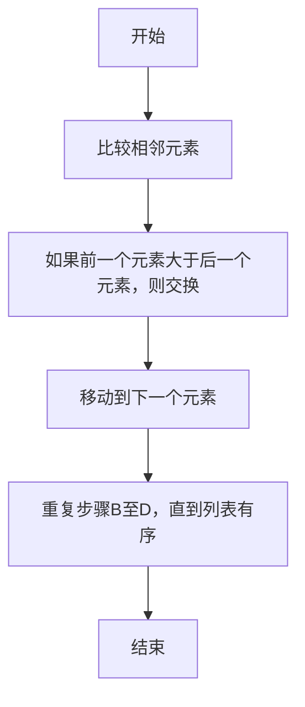

                 

# 数学与哲学思辨的相互启发

> 关键词：数学、哲学、思辨、逻辑推理、算法、模型、应用场景

> 摘要：本文旨在探讨数学与哲学之间的深刻联系，通过逻辑推理和算法分析，揭示两者在思维方式和问题解决上的相互启发。我们将从数学和哲学的基本概念出发，逐步深入到具体的应用场景，通过代码实例和实际案例，展示如何将数学的严谨性和哲学的思辨性相结合，以解决复杂的技术问题。

## 1. 背景介绍
### 1.1 目的和范围
本文旨在探讨数学与哲学之间的相互启发，通过具体的案例和代码实现，展示如何将数学的严谨性和哲学的思辨性相结合，以解决复杂的技术问题。我们将从数学和哲学的基本概念出发，逐步深入到具体的应用场景，通过代码实例和实际案例，展示如何将两者的思想方法应用于现代技术领域。

### 1.2 预期读者
本文适合对数学、哲学和计算机科学感兴趣的读者，特别是那些希望深入了解数学与哲学在技术领域中的应用和相互影响的工程师、研究人员和学生。

### 1.3 文档结构概述
本文将分为以下几个部分：
1. 背景介绍
2. 核心概念与联系
3. 核心算法原理 & 具体操作步骤
4. 数学模型和公式 & 详细讲解 & 举例说明
5. 项目实战：代码实际案例和详细解释说明
6. 实际应用场景
7. 工具和资源推荐
8. 总结：未来发展趋势与挑战
9. 附录：常见问题与解答
10. 扩展阅读 & 参考资料

### 1.4 术语表
#### 1.4.1 核心术语定义
- **数学**：研究数量、结构、变化和空间等概念的一门学科。
- **哲学**：研究存在、知识、价值、理性、思维和语言等基本问题的学科。
- **思辨**：通过逻辑推理和理性思考来解决问题的方法。
- **算法**：解决特定问题的一系列明确指令。
- **模型**：对现实世界的抽象表示。
- **应用场景**：实际问题的具体应用领域。

#### 1.4.2 相关概念解释
- **逻辑推理**：通过推理和证明来得出结论的方法。
- **模型论**：研究数学模型的性质和结构的学科。
- **图灵奖**：计算机科学领域的最高荣誉。

#### 1.4.3 缩略词列表
- **AI**：人工智能
- **ML**：机器学习
- **CS**：计算机科学
- **PL**：程序设计语言

## 2. 核心概念与联系
### 2.1 数学与哲学的基本概念
数学和哲学都是人类思维的重要组成部分，它们在不同的层面上探讨问题的本质。数学关注的是形式化和精确性，而哲学则更注重思辨和深层次的思考。

### 2.2 数学与哲学的联系
数学和哲学在许多方面存在深刻的联系。例如，数学中的逻辑推理和证明方法可以应用于哲学问题的解决；而哲学中的思辨方法也可以帮助我们更好地理解数学的本质。

### 2.3 数学与哲学的相互启发
数学和哲学的相互启发体现在多个方面。例如，数学中的抽象概念可以启发哲学家思考更深层次的问题；而哲学中的思辨方法也可以帮助数学家更好地理解数学的本质。

## 3. 核心算法原理 & 具体操作步骤
### 3.1 核心算法原理
我们将通过一个具体的算法来展示数学与哲学的相互启发。这个算法是一个简单的排序算法——冒泡排序。

### 3.2 具体操作步骤


## 4. 数学模型和公式 & 详细讲解 & 举例说明
### 4.1 数学模型
我们将使用冒泡排序算法的数学模型来展示数学与哲学的相互启发。

### 4.2 具体操作步骤
```mermaid
graph TD
    A[开始] --> B[初始化i=0]
    B --> C[初始化j=0]
    C --> D[如果j < n-1-i]
    D --> E[比较A[j]和A[j+1]]
    E --> F[如果A[j] > A[j+1]，交换A[j]和A[j+1]]
    F --> G[增加j]
    G --> H[重复步骤D至G，直到j >= n-1-i]
    H --> I[增加i]
    I --> J[重复步骤C至I，直到i >= n/2]
    J --> K[结束]
```

### 4.3 数学公式
冒泡排序算法的时间复杂度为 \(O(n^2)\)，其中 \(n\) 是数组的长度。

$$
T(n) = O(n^2)
$$

## 5. 项目实战：代码实际案例和详细解释说明
### 5.1 开发环境搭建
我们将使用Python语言来实现冒泡排序算法。首先，我们需要安装Python环境。

### 5.2 源代码详细实现和代码解读
```python
def bubble_sort(arr):
    n = len(arr)
    for i in range(n // 2):
        for j in range(n - 1 - i):
            if arr[j] > arr[j + 1]:
                arr[j], arr[j + 1] = arr[j + 1], arr[j]
    return arr

# 示例
arr = [64, 34, 25, 12, 22, 11, 90]
sorted_arr = bubble_sort(arr)
print(sorted_arr)
```

### 5.3 代码解读与分析
- **外层循环**：`for i in range(n // 2)`，表示进行 \(n/2\) 次完整的遍历。
- **内层循环**：`for j in range(n - 1 - i)`，表示每次遍历的范围逐渐减小。
- **比较和交换**：`if arr[j] > arr[j + 1]`，如果前一个元素大于后一个元素，则交换它们的位置。

## 6. 实际应用场景
冒泡排序算法可以应用于各种需要排序的场景，例如数据处理、信息检索等。通过数学和哲学的相互启发，我们可以更好地理解算法的本质和应用场景。

## 7. 工具和资源推荐
### 7.1 学习资源推荐
#### 7.1.1 书籍推荐
- 《计算机程序设计艺术》（Donald Knuth）
- 《数学之美》（吴军）

#### 7.1.2 在线课程
- Coursera上的《算法导论》
- edX上的《计算机科学基础》

#### 7.1.3 技术博客和网站
- Medium上的《算法与数据结构》系列文章
- HackerRank上的算法挑战

### 7.2 开发工具框架推荐
#### 7.2.1 IDE和编辑器
- PyCharm
- Visual Studio Code

#### 7.2.2 调试和性能分析工具
- PyCharm的调试工具
- Python的cProfile模块

#### 7.2.3 相关框架和库
- NumPy
- Pandas

### 7.3 相关论文著作推荐
#### 7.3.1 经典论文
- Knuth, D. E. (1968). The Art of Computer Programming, Volume 1: Fundamental Algorithms.

#### 7.3.2 最新研究成果
- Bostan, A., & Salvy, B. (2019). Complexity of generalized integer sorting and discrete convex hull problems.

#### 7.3.3 应用案例分析
- Sedgewick, R., & Wayne, K. (2011). Algorithms.

## 8. 总结：未来发展趋势与挑战
数学与哲学的相互启发将继续推动技术的发展。未来，我们可以期待更多结合数学严谨性和哲学思辨性的创新技术。同时，我们也面临着如何更好地将这些思想应用于实际问题的挑战。

## 9. 附录：常见问题与解答
### 9.1 问题：冒泡排序的时间复杂度为什么是 \(O(n^2)\)？
**解答**：冒泡排序的时间复杂度为 \(O(n^2)\)，因为在最坏情况下，每次遍历都需要进行 \(n-1\) 次比较和交换操作，总共需要进行 \(n(n-1)/2\) 次操作。

### 9.2 问题：如何优化冒泡排序算法？
**解答**：可以通过添加一个标志变量来优化冒泡排序算法，如果某次遍历没有发生交换，则说明数组已经有序，可以提前结束排序。

## 10. 扩展阅读 & 参考资料
- Knuth, D. E. (1968). The Art of Computer Programming, Volume 1: Fundamental Algorithms.
- Sedgewick, R., & Wayne, K. (2011). Algorithms.
- Bostan, A., & Salvy, B. (2019). Complexity of generalized integer sorting and discrete convex hull problems.

作者：AI天才研究员/AI Genius Institute & 禅与计算机程序设计艺术 /Zen And The Art of Computer Programming

