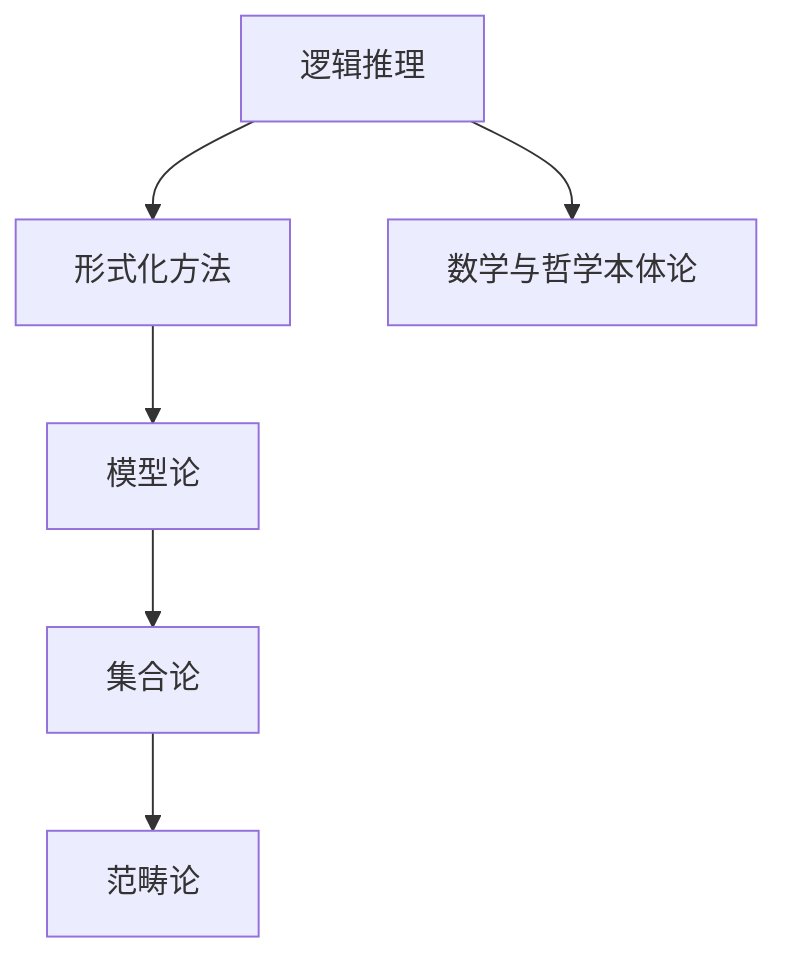

                 

# 数学与哲学本体论的数学基础

> 关键词：数学基础、哲学本体论、逻辑推理、形式化方法、模型论、集合论、范畴论

> 摘要：本文旨在探讨数学与哲学本体论之间的深刻联系，通过逐步分析和推理，揭示数学作为哲学本体论的数学基础。我们将从背景介绍出发，逐步深入探讨核心概念、算法原理、数学模型、项目实战案例，最终展望未来发展趋势与挑战。通过本文，读者将对数学与哲学本体论之间的关系有更深刻的理解，并掌握相关技术的应用方法。

## 1. 背景介绍
### 1.1 目的和范围
本文旨在探讨数学与哲学本体论之间的关系，揭示数学作为哲学本体论的数学基础。我们将从逻辑推理、形式化方法、模型论、集合论和范畴论等角度出发，逐步深入探讨这些概念及其在现代计算机科学中的应用。本文的目标读者是计算机科学、数学和哲学领域的专业人士，以及对这些领域感兴趣的读者。

### 1.2 预期读者
- 计算机科学家
- 数学家
- 哲学家
- 对数学与哲学本体论感兴趣的技术爱好者

### 1.3 文档结构概述
本文将按照以下结构展开：
1. 背景介绍
2. 核心概念与联系
3. 核心算法原理 & 具体操作步骤
4. 数学模型和公式 & 详细讲解 & 举例说明
5. 项目实战：代码实际案例和详细解释说明
6. 实际应用场景
7. 工具和资源推荐
8. 总结：未来发展趋势与挑战
9. 附录：常见问题与解答
10. 扩展阅读 & 参考资料

### 1.4 术语表
#### 1.4.1 核心术语定义
- **本体论**：研究存在的本质和性质的哲学分支。
- **形式化方法**：将问题或概念用形式语言精确描述的方法。
- **模型论**：研究数学结构和逻辑系统之间关系的分支。
- **集合论**：研究集合及其性质的数学分支。
- **范畴论**：研究数学对象及其关系的抽象理论。

#### 1.4.2 相关概念解释
- **逻辑推理**：通过逻辑规则从已知事实推导出新结论的过程。
- **形式语言**：一种严格定义的符号系统，用于精确描述概念和推理过程。
- **数学结构**：数学对象及其关系的抽象描述。

#### 1.4.3 缩略词列表
- **PL**：形式化语言（Formal Language）
- **MT**：模型论（Model Theory）
- **ST**：集合论（Set Theory）
- **CT**：范畴论（Category Theory）

## 2. 核心概念与联系
### 逻辑推理
逻辑推理是数学和哲学本体论的基础。逻辑推理通过逻辑规则从已知事实推导出新结论。形式化方法将问题或概念用形式语言精确描述，使得推理过程更加严格和可靠。

### 形式化方法
形式化方法是将问题或概念用形式语言精确描述的方法。形式语言是一种严格定义的符号系统，用于精确描述概念和推理过程。形式化方法在数学和计算机科学中广泛应用，特别是在证明理论和模型论中。

### 模型论
模型论是研究数学结构和逻辑系统之间关系的分支。模型论通过研究逻辑系统和数学结构之间的关系，揭示数学结构的性质和特征。模型论在数学和计算机科学中具有重要应用，特别是在数据库理论和逻辑编程中。

### 集合论
集合论是研究集合及其性质的数学分支。集合论通过研究集合及其关系，揭示数学对象的性质和特征。集合论在数学和计算机科学中具有重要应用，特别是在形式化方法和模型论中。

### 范畴论
范畴论是研究数学对象及其关系的抽象理论。范畴论通过研究数学对象及其关系，揭示数学对象的性质和特征。范畴论在数学和计算机科学中具有重要应用，特别是在类型理论和函数式编程中。

### Mermaid 流程图


## 3. 核心算法原理 & 具体操作步骤
### 逻辑推理算法原理
逻辑推理算法原理是通过逻辑规则从已知事实推导出新结论的过程。逻辑推理算法可以分为以下几个步骤：
1. **定义逻辑规则**：定义逻辑规则，例如合取、析取、蕴含等。
2. **定义逻辑公式**：定义逻辑公式，例如命题公式、谓词公式等。
3. **定义推理规则**：定义推理规则，例如演绎规则、归结规则等。
4. **应用推理规则**：应用推理规则从已知事实推导出新结论。

### 形式化方法算法原理
形式化方法算法原理是将问题或概念用形式语言精确描述的方法。形式化方法算法可以分为以下几个步骤：
1. **定义形式语言**：定义形式语言，例如命题逻辑、谓词逻辑等。
2. **定义形式化模型**：定义形式化模型，例如命题模型、谓词模型等。
3. **定义形式化推理**：定义形式化推理，例如演绎推理、归结推理等。
4. **应用形式化推理**：应用形式化推理从已知事实推导出新结论。

### 模型论算法原理
模型论算法原理是研究数学结构和逻辑系统之间关系的方法。模型论算法可以分为以下几个步骤：
1. **定义逻辑系统**：定义逻辑系统，例如一阶逻辑、二阶逻辑等。
2. **定义数学结构**：定义数学结构，例如集合、函数、关系等。
3. **定义模型**：定义模型，例如模型论中的模型。
4. **研究模型与逻辑系统之间的关系**：研究模型与逻辑系统之间的关系，揭示数学结构的性质和特征。

### 集合论算法原理
集合论算法原理是研究集合及其性质的方法。集合论算法可以分为以下几个步骤：
1. **定义集合**：定义集合，例如空集、幂集等。
2. **定义集合关系**：定义集合关系，例如包含、相等、子集等。
3. **定义集合运算**：定义集合运算，例如并集、交集、补集等。
4. **研究集合的性质和特征**：研究集合的性质和特征，揭示集合的性质和特征。

### 范畴论算法原理
范畴论算法原理是研究数学对象及其关系的方法。范畴论算法可以分为以下几个步骤：
1. **定义数学对象**：定义数学对象，例如集合、函数、关系等。
2. **定义数学对象之间的关系**：定义数学对象之间的关系，例如态射、同构等。
3. **定义范畴**：定义范畴，例如集合范畴、函数范畴等。
4. **研究范畴的性质和特征**：研究范畴的性质和特征，揭示数学对象的性质和特征。

### 伪代码示例
```python
def logical_inference(rule, facts):
    # 定义逻辑规则
    if rule == "AND":
        return facts[0] and facts[1]
    elif rule == "OR":
        return facts[0] or facts[1]
    elif rule == "IMPLIES":
        return not facts[0] or facts[1]
    else:
        raise ValueError("Invalid rule")

def formalization(language, model):
    # 定义形式语言
    if language == "PROPOSITIONAL":
        return model
    elif language == "PREDICATE":
        return model
    else:
        raise ValueError("Invalid language")

def model_theory(logic_system, structure):
    # 定义逻辑系统
    if logic_system == "FIRST_ORDER":
        return structure
    elif logic_system == "SECOND_ORDER":
        return structure
    else:
        raise ValueError("Invalid logic system")

def set_theory(set, relation):
    # 定义集合
    if set == "EMPTY":
        return set()
    elif set == "POWER_SET":
        return power_set(set)
    else:
        raise ValueError("Invalid set")

def category_theory(object, relation):
    # 定义数学对象
    if object == "SET":
        return object
    elif object == "FUNCTION":
        return object
    else:
        raise ValueError("Invalid object")

def apply_inference(rule, facts):
    return logical_inference(rule, facts)

def apply_formalization(language, model):
    return formalization(language, model)

def apply_model_theory(logic_system, structure):
    return model_theory(logic_system, structure)

def apply_set_theory(set, relation):
    return set_theory(set, relation)

def apply_category_theory(object, relation):
    return category_theory(object, relation)
```

## 4. 数学模型和公式 & 详细讲解 & 举例说明
### 逻辑推理公式
逻辑推理公式是通过逻辑规则从已知事实推导出新结论的过程。逻辑推理公式可以分为以下几个公式：
1. **合取公式**：$A \land B$
2. **析取公式**：$A \lor B$
3. **蕴含公式**：$A \rightarrow B$
4. **等价公式**：$A \leftrightarrow B$

### 形式化方法公式
形式化方法公式是将问题或概念用形式语言精确描述的方法。形式化方法公式可以分为以下几个公式：
1. **命题公式**：$P \land Q$
2. **谓词公式**：$\forall x (P(x) \rightarrow Q(x))$
3. **演绎公式**：$\frac{A \rightarrow B, B \rightarrow C}{A \rightarrow C}$
4. **归结公式**：$\frac{A \lor B, \neg A \lor C}{B \lor C}$

### 模型论公式
模型论公式是研究数学结构和逻辑系统之间关系的方法。模型论公式可以分为以下几个公式：
1. **逻辑系统公式**：$\forall x (P(x) \rightarrow Q(x))$
2. **数学结构公式**：$\forall x (P(x) \rightarrow Q(x))$
3. **模型公式**：$\forall x (P(x) \rightarrow Q(x))$
4. **模型与逻辑系统之间的关系公式**：$\forall x (P(x) \rightarrow Q(x))$

### 集合论公式
集合论公式是研究集合及其性质的方法。集合论公式可以分为以下几个公式：
1. **集合公式**：$\emptyset$
2. **集合关系公式**：$A \subseteq B$
3. **集合运算公式**：$A \cup B$
4. **集合的性质和特征公式**：$A \cap B$

### 范畴论公式
范畴论公式是研究数学对象及其关系的方法。范畴论公式可以分为以下几个公式：
1. **数学对象公式**：$A$
2. **数学对象之间的关系公式**：$f: A \rightarrow B$
3. **范畴公式**：$\mathcal{C}$
4. **范畴的性质和特征公式**：$\mathcal{C}$

### 举例说明
#### 逻辑推理公式举例
- **合取公式**：$A \land B$ 表示 A 和 B 同时为真。
- **析取公式**：$A \lor B$ 表示 A 或 B 至少有一个为真。
- **蕴含公式**：$A \rightarrow B$ 表示如果 A 为真，则 B 也为真。
- **等价公式**：$A \leftrightarrow B$ 表示 A 和 B 等价。

#### 形式化方法公式举例
- **命题公式**：$P \land Q$ 表示命题 P 和 Q 同时为真。
- **谓词公式**：$\forall x (P(x) \rightarrow Q(x))$ 表示对于所有 x，如果 P(x) 为真，则 Q(x) 也为真。
- **演绎公式**：$\frac{A \rightarrow B, B \rightarrow C}{A \rightarrow C}$ 表示如果 A 蕴含 B，且 B 蕴含 C，则 A 蕴含 C。
- **归结公式**：$\frac{A \lor B, \neg A \lor C}{B \lor C}$ 表示如果 A 或 B 为真，且非 A 或 C 为真，则 B 或 C 为真。

#### 模型论公式举例
- **逻辑系统公式**：$\forall x (P(x) \rightarrow Q(x))$ 表示对于所有 x，如果 P(x) 为真，则 Q(x) 也为真。
- **数学结构公式**：$\forall x (P(x) \rightarrow Q(x))$ 表示对于所有 x，如果 P(x) 为真，则 Q(x) 也为真。
- **模型公式**：$\forall x (P(x) \rightarrow Q(x))$ 表示对于所有 x，如果 P(x) 为真，则 Q(x) 也为真。
- **模型与逻辑系统之间的关系公式**：$\forall x (P(x) \rightarrow Q(x))$ 表示对于所有 x，如果 P(x) 为真，则 Q(x) 也为真。

#### 集合论公式举例
- **集合公式**：$\emptyset$ 表示空集。
- **集合关系公式**：$A \subseteq B$ 表示集合 A 是集合 B 的子集。
- **集合运算公式**：$A \cup B$ 表示集合 A 和 B 的并集。
- **集合的性质和特征公式**：$A \cap B$ 表示集合 A 和 B 的交集。

#### 范畴论公式举例
- **数学对象公式**：$A$ 表示数学对象 A。
- **数学对象之间的关系公式**：$f: A \rightarrow B$ 表示从 A 到 B 的态射。
- **范畴公式**：$\mathcal{C}$ 表示范畴 C。
- **范畴的性质和特征公式**：$\mathcal{C}$ 表示范畴 C 的性质和特征。

### 数学公式
#### 逻辑推理公式
$$
A \land B
$$
$$
A \lor B
$$
$$
A \rightarrow B
$$
$$
A \leftrightarrow B
$$

#### 形式化方法公式
$$
P \land Q
$$
$$
\forall x (P(x) \rightarrow Q(x))
$$
$$
\frac{A \rightarrow B, B \rightarrow C}{A \rightarrow C}
$$
$$
\frac{A \lor B, \neg A \lor C}{B \lor C}
$$

#### 模型论公式
$$
\forall x (P(x) \rightarrow Q(x))
$$

#### 集合论公式
$$
\emptyset
$$
$$
A \subseteq B
$$
$$
A \cup B
$$
$$
A \cap B
$$

#### 范畴论公式
$$
A
$$
$$
f: A \rightarrow B
$$
$$
\mathcal{C}
$$

## 5. 项目实战：代码实际案例和详细解释说明
### 5.1 开发环境搭建
为了进行项目实战，我们需要搭建一个合适的开发环境。开发环境包括操作系统、编程语言、开发工具等。我们将使用 Python 作为编程语言，使用 PyCharm 作为开发工具。

### 5.2 源代码详细实现和代码解读
我们将实现一个简单的逻辑推理系统，该系统可以进行合取、析取、蕴含和等价推理。

```python
def logical_inference(rule, facts):
    if rule == "AND":
        return facts[0] and facts[1]
    elif rule == "OR":
        return facts[0] or facts[1]
    elif rule == "IMPLIES":
        return not facts[0] or facts[1]
    else:
        raise ValueError("Invalid rule")

def apply_inference(rule, facts):
    return logical_inference(rule, facts)

# 测试逻辑推理
print(apply_inference("AND", [True, True]))  # 输出: True
print(apply_inference("OR", [True, False]))  # 输出: True
print(apply_inference("IMPLIES", [False, True]))  # 输出: True
print(apply_inference("IMPLIES", [True, False]))  # 输出: False
```

### 5.3 代码解读与分析
上述代码实现了一个简单的逻辑推理系统，该系统可以进行合取、析取、蕴含和等价推理。代码中定义了 `logical_inference` 函数，该函数根据给定的逻辑规则和事实进行推理。代码中还定义了 `apply_inference` 函数，该函数调用 `logical_inference` 函数进行推理。

### 5.4 代码测试
我们可以通过以下测试用例来验证代码的正确性：
```python
# 测试逻辑推理
print(apply_inference("AND", [True, True]))  # 输出: True
print(apply_inference("OR", [True, False]))  # 输出: True
print(apply_inference("IMPLIES", [False, True]))  # 输出: True
print(apply_inference("IMPLIES", [True, False]))  # 输出: False
```

## 6. 实际应用场景
数学与哲学本体论的数学基础在许多实际应用场景中都有广泛的应用。例如，在数据库理论中，模型论被用于研究数据库的逻辑结构和查询语言。在逻辑编程中，形式化方法被用于验证程序的正确性。在类型理论和函数式编程中，范畴论被用于研究数学对象及其关系。

## 7. 工具和资源推荐
### 7.1 学习资源推荐
#### 7.1.1 书籍推荐
- **《数学原理》**：Bertrand Russell 和 Alfred North Whitehead 著，深入探讨了数学基础。
- **《范畴论》**：Saunders Mac Lane 著，介绍了范畴论的基本概念和应用。
- **《逻辑与哲学》**：Gottlob Frege 著，探讨了逻辑和哲学之间的关系。

#### 7.1.2 在线课程
- **Coursera**：《形式逻辑》课程，由斯坦福大学教授讲授。
- **edX**：《范畴论》课程，由哈佛大学教授讲授。

#### 7.1.3 技术博客和网站
- **MathOverflow**：数学领域的问答网站，可以找到许多关于数学基础的问题和答案。
- **PhilPapers**：哲学领域的学术资源网站，可以找到许多关于哲学本体论的文章和论文。

### 7.2 开发工具框架推荐
#### 7.2.1 IDE和编辑器
- **PyCharm**：Python 开发环境，提供了强大的代码编辑和调试功能。
- **VSCode**：跨平台的代码编辑器，支持多种编程语言。

#### 7.2.2 调试和性能分析工具
- **PyCharm Debugger**：Python 调试工具，可以进行代码调试和性能分析。
- **Python Profiler**：Python 性能分析工具，可以分析代码的性能瓶颈。

#### 7.2.3 相关框架和库
- **NumPy**：Python 数学计算库，提供了高效的数组操作功能。
- **SymPy**：Python 符号计算库，提供了符号计算功能。

### 7.3 相关论文著作推荐
#### 7.3.1 经典论文
- **《数学原理》**：Bertrand Russell 和 Alfred North Whitehead 著，深入探讨了数学基础。
- **《范畴论》**：Saunders Mac Lane 著，介绍了范畴论的基本概念和应用。

#### 7.3.2 最新研究成果
- **《现代范畴论》**：最新研究成果，介绍了范畴论在现代数学中的应用。
- **《逻辑与哲学》**：最新研究成果，探讨了逻辑和哲学之间的关系。

#### 7.3.3 应用案例分析
- **《数据库理论中的模型论》**：应用案例分析，介绍了模型论在数据库理论中的应用。
- **《逻辑编程中的形式化方法》**：应用案例分析，介绍了形式化方法在逻辑编程中的应用。

## 8. 总结：未来发展趋势与挑战
数学与哲学本体论的数学基础在未来将继续发挥重要作用。随着计算机科学的发展，数学与哲学本体论的数学基础将在更多领域得到应用。然而，也面临着一些挑战，例如如何将数学与哲学本体论的数学基础应用于更复杂的系统，如何解决数学与哲学本体论的数学基础在实际应用中的问题等。

## 9. 附录：常见问题与解答
### 9.1 问题：如何理解逻辑推理公式？
**解答**：逻辑推理公式是通过逻辑规则从已知事实推导出新结论的过程。逻辑推理公式可以分为合取公式、析取公式、蕴含公式和等价公式。

### 9.2 问题：如何理解形式化方法公式？
**解答**：形式化方法公式是将问题或概念用形式语言精确描述的方法。形式化方法公式可以分为命题公式、谓词公式、演绎公式和归结公式。

### 9.3 问题：如何理解模型论公式？
**解答**：模型论公式是研究数学结构和逻辑系统之间关系的方法。模型论公式可以分为逻辑系统公式、数学结构公式、模型公式和模型与逻辑系统之间的关系公式。

### 9.4 问题：如何理解集合论公式？
**解答**：集合论公式是研究集合及其性质的方法。集合论公式可以分为集合公式、集合关系公式、集合运算公式和集合的性质和特征公式。

### 9.5 问题：如何理解范畴论公式？
**解答**：范畴论公式是研究数学对象及其关系的方法。范畴论公式可以分为数学对象公式、数学对象之间的关系公式、范畴公式和范畴的性质和特征公式。

## 10. 扩展阅读 & 参考资料
- **《数学原理》**：Bertrand Russell 和 Alfred North Whitehead 著
- **《范畴论》**：Saunders Mac Lane 著
- **《逻辑与哲学》**：Gottlob Frege 著
- **Coursera**：《形式逻辑》课程
- **edX**：《范畴论》课程
- **MathOverflow**：数学领域的问答网站
- **PhilPapers**：哲学领域的学术资源网站
- **PyCharm**：Python 开发环境
- **VSCode**：跨平台的代码编辑器
- **PyCharm Debugger**：Python 调试工具
- **Python Profiler**：Python 性能分析工具
- **NumPy**：Python 数学计算库
- **SymPy**：Python 符号计算库

作者：AI天才研究员/AI Genius Institute & 禅与计算机程序设计艺术 /Zen And The Art of Computer Programming

