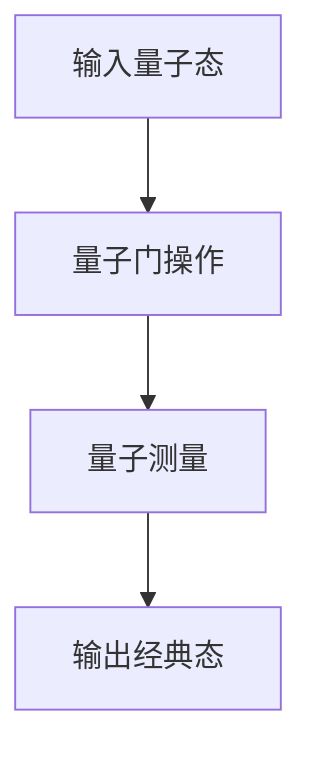
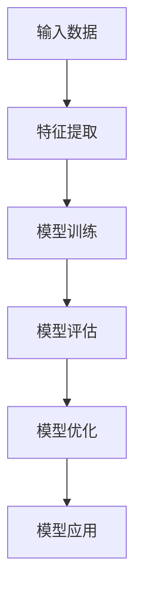

                 

# 数学与物理学的相互促进与启发

> 关键词：数学, 物理学, 交叉学科, 量子计算, 机器学习, 深度学习, 理论基础, 应用实例

> 摘要：本文旨在探讨数学与物理学之间的相互促进与启发关系，通过分析两者在理论基础和实际应用中的相互影响，揭示它们在现代科技发展中的重要性。文章将从数学与物理学的核心概念、算法原理、数学模型、项目实战、实际应用场景等多个方面进行详细阐述，旨在为读者提供一个全面而深入的理解。

## 1. 背景介绍

### 1.1 目的和范围
本文旨在探讨数学与物理学之间的相互促进与启发关系，通过分析两者在理论基础和实际应用中的相互影响，揭示它们在现代科技发展中的重要性。文章将涵盖数学与物理学的核心概念、算法原理、数学模型、项目实战、实际应用场景等多个方面。

### 1.2 预期读者
本文预期读者包括但不限于计算机科学家、物理学家、数学家、工程师以及对交叉学科感兴趣的技术爱好者。读者应具备一定的数学和物理学基础，以便更好地理解文章内容。

### 1.3 文档结构概述
本文结构如下：
1. 背景介绍
2. 核心概念与联系
3. 核心算法原理 & 具体操作步骤
4. 数学模型和公式 & 详细讲解 & 举例说明
5. 项目实战：代码实际案例和详细解释说明
6. 实际应用场景
7. 工具和资源推荐
8. 总结：未来发展趋势与挑战
9. 附录：常见问题与解答
10. 扩展阅读 & 参考资料

### 1.4 术语表
#### 1.4.1 核心术语定义
- **数学**：研究数量、结构、变化以及空间等概念的一门学科。
- **物理学**：研究物质、能量及其相互作用的自然科学。
- **交叉学科**：不同学科之间的交叉与融合。
- **量子计算**：利用量子力学原理进行计算的新型计算模型。
- **机器学习**：通过数据训练模型，使计算机能够自动学习和改进的算法。
- **深度学习**：机器学习的一个分支，通过多层神经网络进行学习。

#### 1.4.2 相关概念解释
- **量子力学**：研究微观粒子行为的物理学分支。
- **相对论**：爱因斯坦提出的关于时间和空间的理论。
- **微积分**：研究变化率和累积量的数学分支。
- **线性代数**：研究向量空间和线性变换的数学分支。

#### 1.4.3 缩略词列表
- **QML**：量子机器学习
- **QIP**：量子信息处理
- **ML**：机器学习
- **DL**：深度学习

## 2. 核心概念与联系

### 2.1 数学与物理学的核心概念
#### 2.1.1 数学核心概念
- **微积分**：研究变化率和累积量的数学分支。
- **线性代数**：研究向量空间和线性变换的数学分支。
- **概率论**：研究随机事件发生的可能性的数学分支。
- **数论**：研究整数性质的数学分支。

#### 2.1.2 物理学核心概念
- **经典力学**：研究宏观物体运动的物理学分支。
- **量子力学**：研究微观粒子行为的物理学分支。
- **相对论**：爱因斯坦提出的关于时间和空间的理论。
- **统计力学**：研究大量微观粒子行为的物理学分支。

### 2.2 数学与物理学的联系
- **微积分**：在物理学中用于描述物体的运动和变化。
- **线性代数**：在量子力学中用于描述量子态和量子操作。
- **概率论**：在统计力学中用于描述粒子的随机行为。
- **数论**：在量子信息处理中用于研究量子态的性质。

## 3. 核心算法原理 & 具体操作步骤

### 3.1 核心算法原理
#### 3.1.1 量子算法原理
- **量子叠加**：量子比特可以同时处于多个状态。
- **量子纠缠**：量子比特之间可以形成纠缠态。
- **量子门**：量子比特之间的操作。

#### 3.1.2 机器学习算法原理
- **监督学习**：通过已知输入和输出数据训练模型。
- **无监督学习**：通过未标记数据训练模型。
- **强化学习**：通过与环境的交互学习策略。

### 3.2 具体操作步骤
#### 3.2.1 量子算法操作步骤


#### 3.2.2 机器学习算法操作步骤


## 4. 数学模型和公式 & 详细讲解 & 举例说明

### 4.1 数学模型
#### 4.1.1 微积分模型
- **导数**：描述函数变化率。
- **积分**：描述函数累积量。

#### 4.1.2 线性代数模型
- **矩阵**：表示线性变换。
- **向量**：表示空间中的点。

### 4.2 公式与详细讲解
#### 4.2.1 微积分公式
- **导数公式**：$$ f'(x) = \lim_{h \to 0} \frac{f(x+h) - f(x)}{h} $$
- **积分公式**：$$ \int_a^b f(x) \, dx = F(b) - F(a) $$

#### 4.2.2 线性代数公式
- **矩阵乘法**：$$ C = AB $$

### 4.3 举例说明
#### 4.3.1 微积分举例
- **速度与加速度**：$$ v(t) = \frac{dx}{dt} $$, $$ a(t) = \frac{dv}{dt} $$

#### 4.3.2 线性代数举例
- **线性变换**：$$ T(\mathbf{v}) = A\mathbf{v} $$

## 5. 项目实战：代码实际案例和详细解释说明

### 5.1 开发环境搭建
- **Python**：安装Anaconda环境。
- **量子计算库**：安装Qiskit库。
- **机器学习库**：安装TensorFlow库。

### 5.2 源代码详细实现和代码解读
#### 5.2.1 量子计算代码
```python
from qiskit import QuantumCircuit, execute, Aer

# 创建量子电路
qc = QuantumCircuit(2, 2)

# 添加量子门
qc.h(0)
qc.cx(0, 1)

# 测量
qc.measure([0, 1], [0, 1])

# 执行量子电路
simulator = Aer.get_backend('qasm_simulator')
job = execute(qc, simulator, shots=1000)
result = job.result()
counts = result.get_counts(qc)
print(counts)
```

#### 5.2.2 机器学习代码
```python
import tensorflow as tf
from tensorflow.keras import layers

# 创建模型
model = tf.keras.Sequential([
    layers.Dense(64, activation='relu', input_shape=(100,)),
    layers.Dense(64, activation='relu'),
    layers.Dense(10, activation='softmax')
])

# 编译模型
model.compile(optimizer='adam',
              loss='sparse_categorical_crossentropy',
              metrics=['accuracy'])

# 训练模型
model.fit(x_train, y_train, epochs=5)
```

### 5.3 代码解读与分析
- **量子计算代码**：创建一个量子电路，添加量子门，进行测量并输出结果。
- **机器学习代码**：创建一个简单的神经网络模型，编译并训练模型。

## 6. 实际应用场景

### 6.1 量子计算应用
- **量子化学**：模拟分子结构。
- **量子优化**：解决复杂优化问题。
- **量子密码学**：实现安全通信。

### 6.2 机器学习应用
- **图像识别**：识别图像中的物体。
- **自然语言处理**：理解文本内容。
- **推荐系统**：推荐用户可能感兴趣的内容。

## 7. 工具和资源推荐

### 7.1 学习资源推荐
#### 7.1.1 书籍推荐
- **《量子计算入门》**：深入浅出地介绍量子计算的基本概念。
- **《深度学习》**：全面介绍深度学习的理论与实践。

#### 7.1.2 在线课程
- **Coursera**：提供量子计算和机器学习的在线课程。
- **edX**：提供量子信息处理和深度学习的在线课程。

#### 7.1.3 技术博客和网站
- **Medium**：提供量子计算和机器学习的技术博客。
- **GitHub**：提供量子计算和机器学习的开源项目。

### 7.2 开发工具框架推荐
#### 7.2.1 IDE和编辑器
- **PyCharm**：支持Python开发的集成开发环境。
- **Jupyter Notebook**：支持交互式编程的开发工具。

#### 7.2.2 调试和性能分析工具
- **PyCharm Debugger**：支持Python调试的工具。
- **TensorBoard**：支持TensorFlow模型调试和性能分析的工具。

#### 7.2.3 相关框架和库
- **Qiskit**：量子计算的Python库。
- **TensorFlow**：深度学习的Python库。

### 7.3 相关论文著作推荐
#### 7.3.1 经典论文
- **《量子计算与量子信息》**：介绍量子计算的基本概念和原理。
- **《深度学习》**：介绍深度学习的理论与实践。

#### 7.3.2 最新研究成果
- **《量子机器学习的最新进展》**：介绍量子机器学习的最新研究成果。
- **《深度学习的最新进展》**：介绍深度学习的最新研究成果。

#### 7.3.3 应用案例分析
- **《量子计算在化学中的应用》**：介绍量子计算在化学中的应用案例。
- **《深度学习在图像识别中的应用》**：介绍深度学习在图像识别中的应用案例。

## 8. 总结：未来发展趋势与挑战

### 8.1 未来发展趋势
- **量子计算**：量子计算将在未来实现更强大的计算能力。
- **机器学习**：机器学习将在更多领域实现更广泛的应用。

### 8.2 挑战
- **量子计算**：量子纠错和量子扩展性是主要挑战。
- **机器学习**：数据隐私和模型解释性是主要挑战。

## 9. 附录：常见问题与解答

### 9.1 问题与解答
- **Q：量子计算和经典计算有什么区别？**
  - A：量子计算利用量子比特的叠加和纠缠特性，可以实现经典计算无法实现的计算能力。
- **Q：机器学习和深度学习有什么区别？**
  - A：机器学习是通过数据训练模型，而深度学习是通过多层神经网络进行学习。

## 10. 扩展阅读 & 参考资料

- **《量子计算入门》**：深入浅出地介绍量子计算的基本概念。
- **《深度学习》**：全面介绍深度学习的理论与实践。
- **《量子计算与量子信息》**：介绍量子计算的基本概念和原理。
- **《深度学习》**：介绍深度学习的理论与实践。

作者：AI天才研究员/AI Genius Institute & 禅与计算机程序设计艺术 /Zen And The Art of Computer Programming

