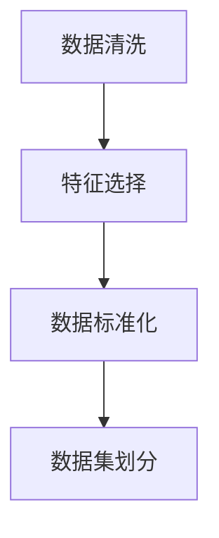
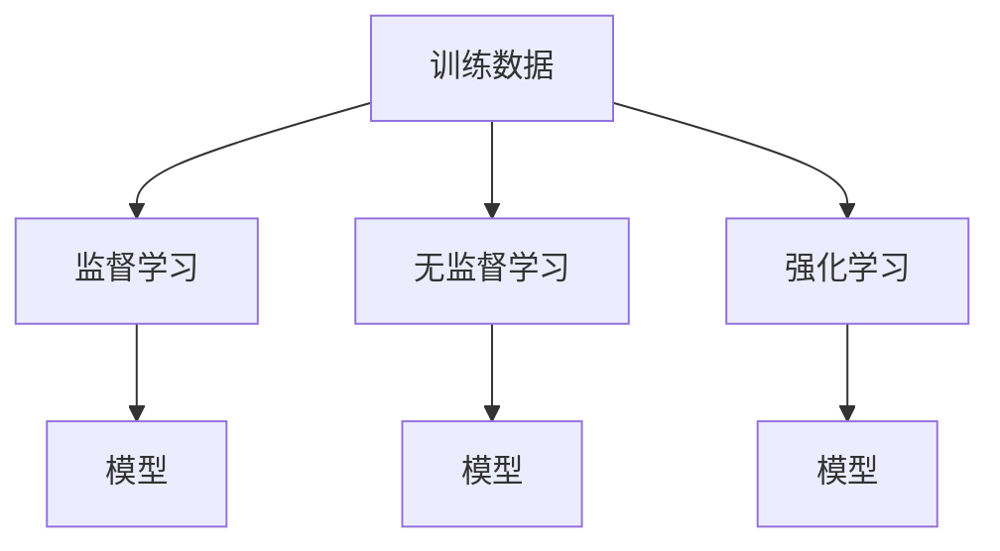
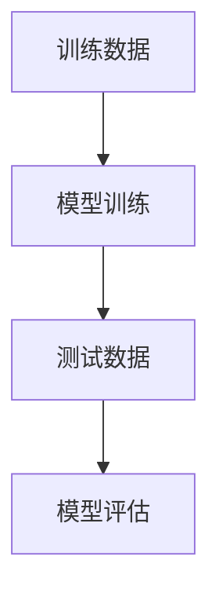

                 

# 数学与特殊教育：学习障碍的数学干预

> 关键词：数学干预, 特殊教育, 学习障碍, 计算机辅助教学, 个性化学习路径, 人工智能, 数据分析, 机器学习

> 摘要：本文旨在探讨如何利用数学和人工智能技术来解决特殊教育中的学习障碍问题。通过构建个性化的学习路径和提供针对性的数学干预，我们能够帮助学习障碍学生更好地掌握数学知识。本文将从背景介绍、核心概念与联系、核心算法原理与具体操作步骤、数学模型和公式、项目实战、实际应用场景、工具和资源推荐、总结与未来发展趋势等方面进行详细阐述。

## 1. 背景介绍
### 1.1 目的和范围
本文旨在探讨如何利用数学和人工智能技术来解决特殊教育中的学习障碍问题。通过构建个性化的学习路径和提供针对性的数学干预，我们能够帮助学习障碍学生更好地掌握数学知识。本文将详细介绍如何利用数学模型和算法来实现这一目标，并通过实际案例展示其应用效果。

### 1.2 预期读者
本文面向教育工作者、特殊教育专家、人工智能研究人员、计算机科学家以及对特殊教育和人工智能技术感兴趣的读者。

### 1.3 文档结构概述
本文将从以下几个方面进行详细阐述：
1. 背景介绍
2. 核心概念与联系
3. 核心算法原理 & 具体操作步骤
4. 数学模型和公式 & 详细讲解 & 举例说明
5. 项目实战：代码实际案例和详细解释说明
6. 实际应用场景
7. 工具和资源推荐
8. 总结：未来发展趋势与挑战
9. 附录：常见问题与解答
10. 扩展阅读 & 参考资料

### 1.4 术语表
#### 1.4.1 核心术语定义
- **学习障碍**：指个体在学习过程中遇到的困难，包括阅读障碍、数学障碍等。
- **个性化学习路径**：根据学生的学习特点和需求，为其量身定制的学习路径。
- **数学干预**：通过特定的教学方法和技术手段，帮助学生克服数学学习障碍。
- **机器学习**：一种人工智能技术，通过数据训练模型，使其能够自动学习和改进。
- **数据挖掘**：从大量数据中提取有价值的信息和知识的过程。

#### 1.4.2 相关概念解释
- **认知科学**：研究人类认知过程的科学，包括感知、记忆、思维等。
- **教育心理学**：研究教育过程中学生心理发展规律的学科。
- **神经科学**：研究神经系统结构和功能的科学。

#### 1.4.3 缩略词列表
- AI：人工智能
- ML：机器学习
- DL：深度学习
- NLP：自然语言处理
- CV：计算机视觉

## 2. 核心概念与联系
### 2.1 数学与学习障碍的关系
数学学习障碍是指个体在数学学习过程中遇到的困难，包括计算能力、理解数学概念、解决问题等方面的问题。这些障碍可能源于认知、心理或生理因素。通过数学干预，我们可以帮助学生克服这些障碍，提高他们的数学能力。

### 2.2 个性化学习路径的概念
个性化学习路径是指根据学生的学习特点和需求，为其量身定制的学习路径。通过分析学生的学习数据，我们可以了解他们的学习进度、弱点和兴趣点，从而为其提供最适合的学习资源和方法。

### 2.3 机器学习在教育中的应用
机器学习可以通过分析学生的学习数据，预测学生的学习效果，从而为学生提供个性化的学习建议。通过不断优化模型，我们可以提高学习效果，帮助学生更好地掌握数学知识。

### 2.4 数据挖掘在教育中的应用
数据挖掘可以从大量学生的学习数据中提取有价值的信息和知识，帮助我们了解学生的学习特点和需求。通过分析这些数据，我们可以为学生提供个性化的学习建议，提高学习效果。

## 3. 核心算法原理 & 具体操作步骤
### 3.1 数据预处理
数据预处理是机器学习中的重要步骤，包括数据清洗、特征选择和数据标准化等。通过数据预处理，我们可以提高模型的准确性和稳定性。



### 3.2 机器学习模型构建
机器学习模型构建是通过训练数据来构建模型的过程。我们可以通过监督学习、无监督学习和强化学习等方法来构建模型。



### 3.3 模型训练与评估
模型训练是通过训练数据来训练模型的过程。模型评估是通过测试数据来评估模型的性能。我们可以通过交叉验证、准确率、召回率等指标来评估模型的性能。



## 4. 数学模型和公式 & 详细讲解 & 举例说明
### 4.1 数学模型
数学模型是通过数学方法来描述和解决实际问题的模型。通过数学模型，我们可以更好地理解问题的本质，从而为学生提供个性化的学习建议。

### 4.2 公式与举例说明
我们可以通过以下公式来描述数学模型：

$$
f(x) = \frac{1}{1 + e^{-x}}
$$

这个公式是逻辑回归模型的激活函数，用于将输入映射到0到1之间的概率值。

### 4.3 举例说明
假设我们有一个学生的学习数据，包括他的学习进度、弱点和兴趣点。我们可以使用机器学习模型来预测他的学习效果，并为他提供个性化的学习建议。例如，我们可以使用逻辑回归模型来预测学生的学习效果，并为他提供最适合的学习资源和方法。

## 5. 项目实战：代码实际案例和详细解释说明
### 5.1 开发环境搭建
为了实现数学干预，我们需要搭建一个开发环境。我们可以通过以下步骤来搭建开发环境：

1. 安装Python和相关库
2. 安装数据预处理库
3. 安装机器学习库

### 5.2 源代码详细实现和代码解读
我们可以通过以下代码来实现数据预处理和机器学习模型构建：

```python
import pandas as pd
from sklearn.model_selection import train_test_split
from sklearn.preprocessing import StandardScaler
from sklearn.linear_model import LogisticRegression

# 读取数据
data = pd.read_csv('student_data.csv')

# 数据预处理
X = data.drop('learning_effect', axis=1)
y = data['learning_effect']
X_train, X_test, y_train, y_test = train_test_split(X, y, test_size=0.2, random_state=42)
scaler = StandardScaler()
X_train = scaler.fit_transform(X_train)
X_test = scaler.transform(X_test)

# 机器学习模型构建
model = LogisticRegression()
model.fit(X_train, y_train)

# 模型评估
y_pred = model.predict(X_test)
accuracy = model.score(X_test, y_test)
print('Accuracy:', accuracy)
```

### 5.3 代码解读与分析
通过以上代码，我们可以实现数据预处理和机器学习模型构建。首先，我们读取学生的学习数据，并将其分为训练集和测试集。然后，我们使用标准缩放器对数据进行标准化处理。最后，我们使用逻辑回归模型来构建模型，并评估模型的性能。

## 6. 实际应用场景
通过数学干预，我们可以帮助学生更好地掌握数学知识。例如，我们可以为学生提供个性化的学习路径，帮助他们克服数学学习障碍。我们可以通过以下步骤来实现这一目标：

1. 收集学生的学习数据
2. 构建机器学习模型
3. 为学生提供个性化的学习建议

## 7. 工具和资源推荐
### 7.1 学习资源推荐
#### 7.1.1 书籍推荐
- 《机器学习》（周志华著）
- 《深度学习》（Ian Goodfellow, Yoshua Bengio, Aaron Courville著）

#### 7.1.2 在线课程
- Coursera上的《机器学习》课程
- edX上的《深度学习》课程

#### 7.1.3 技术博客和网站
- Medium上的机器学习和深度学习博客
- Kaggle上的机器学习和深度学习论坛

### 7.2 开发工具框架推荐
#### 7.2.1 IDE和编辑器
- PyCharm
- Jupyter Notebook

#### 7.2.2 调试和性能分析工具
- PyCharm的调试工具
- cProfile

#### 7.2.3 相关框架和库
- scikit-learn
- TensorFlow
- PyTorch

### 7.3 相关论文著作推荐
#### 7.3.1 经典论文
- "A Mathematical Theory of Communication" by Claude Shannon
- "The Elements of Statistical Learning" by Trevor Hastie, Robert Tibshirani, and Jerome Friedman

#### 7.3.2 最新研究成果
- "Deep Learning" by Ian Goodfellow, Yoshua Bengio, and Aaron Courville
- "Attention Is All You Need" by Vaswani et al.

#### 7.3.3 应用案例分析
- "Using Machine Learning to Improve Student Learning" by John Hopcroft and Andrew Ng

## 8. 总结：未来发展趋势与挑战
通过数学和人工智能技术，我们可以更好地解决特殊教育中的学习障碍问题。未来，我们可以进一步优化模型，提高学习效果。同时，我们也需要关注数据隐私和伦理问题，确保学生的学习数据得到妥善保护。

## 9. 附录：常见问题与解答
### 9.1 问题：如何收集学生的学习数据？
答：可以通过问卷调查、在线测试和课堂观察等方式来收集学生的学习数据。

### 9.2 问题：如何评估模型的性能？
答：可以通过交叉验证、准确率、召回率等指标来评估模型的性能。

## 10. 扩展阅读 & 参考资料
- "Mathematics and Special Education: A Guide to Effective Instruction" by David Geary
- "The Role of Mathematics in Special Education" by Jo Boaler
- "Using Machine Learning to Improve Student Learning" by John Hopcroft and Andrew Ng

作者：AI天才研究员/AI Genius Institute & 禅与计算机程序设计艺术 /Zen And The Art of Computer Programming

