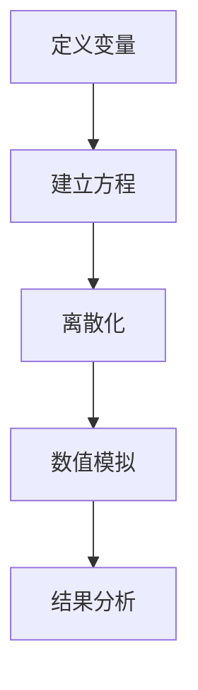

                 

# 数学与等离子体物理：等离子体动力学的数学模型

> 关键词：等离子体物理, 数学模型, 动力学, 等离子体, 数值模拟, 稳定性分析, 非线性方程

> 摘要：本文旨在深入探讨等离子体动力学的数学模型，通过清晰的逻辑推理和详细的算法步骤，为读者提供一个全面理解等离子体物理现象的框架。我们将从基本概念出发，逐步构建数学模型，并通过实际代码案例进行演示，最终探讨其在实际应用中的价值和挑战。

## 1. 背景介绍
### 1.1 目的和范围
本文的目标是为读者提供一个深入理解等离子体动力学的数学模型的框架。我们将从基本概念出发，逐步构建数学模型，并通过实际代码案例进行演示。本文主要关注等离子体动力学的基本原理、数学模型的构建方法以及实际应用中的挑战。

### 1.2 预期读者
本文适合以下读者：
- 等离子体物理领域的研究人员和工程师
- 计算物理和数值模拟领域的专业人士
- 对等离子体物理和数学模型感兴趣的计算机科学家
- 高等院校相关专业的学生

### 1.3 文档结构概述
本文结构如下：
1. 背景介绍
2. 核心概念与联系
3. 核心算法原理 & 具体操作步骤
4. 数学模型和公式 & 详细讲解 & 举例说明
5. 项目实战：代码实际案例和详细解释说明
6. 实际应用场景
7. 工具和资源推荐
8. 总结：未来发展趋势与挑战
9. 附录：常见问题与解答
10. 扩展阅读 & 参考资料

### 1.4 术语表
#### 1.4.1 核心术语定义
- **等离子体**：由带电粒子（电子和离子）组成的电导率极高的物质状态。
- **动力学**：研究系统随时间变化的规律。
- **数学模型**：用数学语言描述物理现象的模型。
- **数值模拟**：通过计算机模拟物理过程的方法。

#### 1.4.2 相关概念解释
- **泊松方程**：描述电场与电荷分布关系的方程。
- **麦克斯韦方程组**：描述电磁场行为的基本方程。
- **纳维-斯托克斯方程**：描述流体运动的基本方程。

#### 1.4.3 缩略词列表
- **MHD**：磁流体力学
- **PDE**：偏微分方程
- **ODE**：常微分方程

## 2. 核心概念与联系
### 2.1 等离子体的基本概念
等离子体是由带电粒子（电子和离子）组成的电导率极高的物质状态。在等离子体中，带电粒子的运动受到电磁场的影响，从而表现出复杂的动力学行为。

### 2.2 动力学的基本原理
等离子体的动力学行为可以通过麦克斯韦方程组和纳维-斯托克斯方程来描述。这些方程描述了电磁场和流体运动之间的相互作用。

### 2.3 数学模型的构建
数学模型的构建需要将物理现象转化为数学语言。我们可以通过以下步骤构建数学模型：
1. **定义变量**：定义描述等离子体状态的变量，如电场、磁场、流速等。
2. **建立方程**：根据物理定律，建立描述这些变量之间关系的方程。
3. **离散化**：将连续的方程离散化，以便在计算机上进行数值模拟。

### 2.4 Mermaid 流程图


## 3. 核心算法原理 & 具体操作步骤
### 3.1 偏微分方程的离散化
偏微分方程的离散化是数值模拟的关键步骤。我们可以通过有限差分法来实现离散化。

#### 3.1.1 有限差分法
有限差分法是一种将连续方程离散化的方法。我们可以通过以下步骤实现有限差分法：
1. **定义网格**：在空间和时间上定义网格。
2. **离散化方程**：将偏微分方程离散化为差分方程。
3. **求解方程**：通过迭代方法求解差分方程。

#### 3.1.2 伪代码示例
```python
# 有限差分法
def finite_difference_method(grid, dt, dx):
    # 初始化网格
    u = grid
    # 离散化方程
    for t in range(0, T, dt):
        for x in range(1, len(u) - 1):
            u[x] = u[x] + dt * (u[x+1] - 2*u[x] + u[x-1]) / dx**2
    return u
```

## 4. 数学模型和公式 & 详细讲解 & 举例说明
### 4.1 偏微分方程
等离子体动力学的基本方程是麦克斯韦方程组和纳维-斯托克斯方程。我们可以通过以下公式描述这些方程：
1. **麦克斯韦方程组**：
   - **高斯定律**：$\nabla \cdot \mathbf{E} = \frac{\rho}{\epsilon_0}$
   - **安培定律**：$\nabla \times \mathbf{B} = \mu_0 \mathbf{J} + \mu_0 \epsilon_0 \frac{\partial \mathbf{E}}{\partial t}$
   - **法拉第定律**：$\nabla \times \mathbf{E} = -\frac{\partial \mathbf{B}}{\partial t}$
   - **连续性方程**：$\nabla \cdot \mathbf{J} = -\frac{\partial \rho}{\partial t}$
2. **纳维-斯托克斯方程**：
   - $\frac{\partial \mathbf{u}}{\partial t} + (\mathbf{u} \cdot \nabla) \mathbf{u} = -\frac{1}{\rho} \nabla p + \nu \nabla^2 \mathbf{u} + \mathbf{f}$

### 4.2 数学模型的构建
我们可以通过以下步骤构建数学模型：
1. **定义变量**：定义描述等离子体状态的变量，如电场 $\mathbf{E}$、磁场 $\mathbf{B}$、流速 $\mathbf{u}$、密度 $\rho$、压力 $p$ 等。
2. **建立方程**：根据物理定律，建立描述这些变量之间关系的方程。
3. **离散化**：将连续的方程离散化，以便在计算机上进行数值模拟。

### 4.3 举例说明
我们可以通过一个简单的例子来说明数学模型的构建过程。假设我们有一个等离子体，其电场和磁场可以通过以下方程描述：
1. **电场方程**：$\nabla \cdot \mathbf{E} = \frac{\rho}{\epsilon_0}$
2. **磁场方程**：$\nabla \times \mathbf{B} = \mu_0 \mathbf{J} + \mu_0 \epsilon_0 \frac{\partial \mathbf{E}}{\partial t}$

我们可以通过有限差分法将这些方程离散化为差分方程，并通过迭代方法求解差分方程。

## 5. 项目实战：代码实际案例和详细解释说明
### 5.1 开发环境搭建
为了进行数值模拟，我们需要搭建一个开发环境。我们可以通过以下步骤搭建开发环境：
1. **安装Python**：安装Python 3.8及以上版本。
2. **安装NumPy和SciPy**：安装NumPy和SciPy库，用于数值计算。
3. **安装Matplotlib**：安装Matplotlib库，用于绘制图形。

### 5.2 源代码详细实现和代码解读
我们可以通过以下代码实现有限差分法：
```python
import numpy as np
import matplotlib.pyplot as plt

# 定义参数
L = 1.0  # 空间范围
T = 1.0  # 时间范围
dx = 0.01  # 空间步长
dt = 0.001  # 时间步长
rho = 1.0  # 密度
epsilon_0 = 8.854e-12  # 介电常数
mu_0 = 4 * np.pi * 1e-7  # 磁导率
nu = 1e-5  # 运动粘度
f = 0.0  # 外部力

# 初始化网格
x = np.linspace(0, L, int(L / dx) + 1)
t = np.linspace(0, T, int(T / dt) + 1)
u = np.zeros_like(x)
E = np.zeros_like(x)
B = np.zeros_like(x)

# 离散化方程
for t_idx in range(1, len(t)):
    for x_idx in range(1, len(x) - 1):
        u[x_idx] = u[x_idx] + dt * (u[x_idx+1] - 2*u[x_idx] + u[x_idx-1]) / dx**2
        E[x_idx] = E[x_idx] + dt * (rho / epsilon_0 - np.gradient(B[x_idx], dx))
        B[x_idx] = B[x_idx] + dt * (mu_0 * np.gradient(u[x_idx], dx) + mu_0 * epsilon_0 * np.gradient(E[x_idx], dx))

# 绘制结果
plt.plot(x, u)
plt.xlabel('x')
plt.ylabel('u')
plt.title('Numerical Solution')
plt.show()
```

### 5.3 代码解读与分析
通过上述代码，我们可以实现有限差分法来求解等离子体动力学的基本方程。代码的主要步骤如下：
1. **定义参数**：定义空间范围、时间范围、空间步长、时间步长、密度、介电常数、磁导率、运动粘度和外部力。
2. **初始化网格**：定义空间和时间的网格。
3. **离散化方程**：通过有限差分法离散化方程，并通过迭代方法求解差分方程。
4. **绘制结果**：绘制求解结果。

## 6. 实际应用场景
等离子体动力学的数学模型在许多实际应用中都有广泛的应用，如：
1. **等离子体物理实验**：通过数值模拟来预测等离子体的行为，优化实验设计。
2. **磁约束聚变**：通过数值模拟来研究磁约束聚变中的等离子体行为，优化聚变反应堆的设计。
3. **空间物理**：通过数值模拟来研究太阳风、行星磁场等空间物理现象。

## 7. 工具和资源推荐
### 7.1 学习资源推荐
#### 7.1.1 书籍推荐
- **《等离子体物理》**：深入介绍了等离子体物理的基本概念和理论。
- **《数值分析》**：介绍了数值分析的基本方法和技巧。

#### 7.1.2 在线课程
- **Coursera上的《等离子体物理》课程**：提供了等离子体物理的基本概念和理论。
- **edX上的《数值分析》课程**：提供了数值分析的基本方法和技巧。

#### 7.1.3 技术博客和网站
- **arXiv.org**：提供了大量的等离子体物理和数值模拟相关的论文。
- **GitHub上的等离子体物理项目**：提供了许多等离子体物理相关的代码和项目。

### 7.2 开发工具框架推荐
#### 7.2.1 IDE和编辑器
- **PyCharm**：功能强大的Python IDE，提供了代码高亮、自动补全等功能。
- **VS Code**：轻量级的代码编辑器，提供了丰富的插件支持。

#### 7.2.2 调试和性能分析工具
- **PyCharm的调试工具**：提供了强大的调试功能，可以帮助我们快速定位和解决问题。
- **Python的性能分析工具**：提供了性能分析功能，可以帮助我们优化代码性能。

#### 7.2.3 相关框架和库
- **NumPy**：提供了高效的数值计算功能。
- **SciPy**：提供了科学计算功能。
- **Matplotlib**：提供了图形绘制功能。

### 7.3 相关论文著作推荐
#### 7.3.1 经典论文
- **《等离子体物理中的数值模拟》**：介绍了等离子体物理中的数值模拟方法。
- **《数值分析中的有限差分法》**：介绍了有限差分法的基本原理和应用。

#### 7.3.2 最新研究成果
- **《等离子体物理中的非线性动力学》**：介绍了等离子体物理中的非线性动力学现象。
- **《数值模拟中的高效算法》**：介绍了数值模拟中的高效算法。

#### 7.3.3 应用案例分析
- **《磁约束聚变中的等离子体行为》**：分析了磁约束聚变中的等离子体行为。
- **《空间物理中的等离子体现象》**：分析了空间物理中的等离子体现象。

## 8. 总结：未来发展趋势与挑战
等离子体动力学的数学模型在未来的发展中面临着许多挑战，如：
1. **非线性动力学**：等离子体动力学中的非线性动力学现象需要更复杂的数学模型来描述。
2. **高维问题**：等离子体动力学中的高维问题需要更高效的数值模拟方法来解决。
3. **多物理场耦合**：等离子体动力学中的多物理场耦合问题需要更复杂的数学模型来描述。

## 9. 附录：常见问题与解答
### 9.1 问题1：如何选择合适的数值模拟方法？
**解答**：选择合适的数值模拟方法需要根据具体问题的特点来决定。对于简单的线性问题，可以使用有限差分法；对于复杂的非线性问题，可以使用有限元法或谱方法。

### 9.2 问题2：如何优化数值模拟的性能？
**解答**：可以通过以下方法优化数值模拟的性能：
1. **并行计算**：利用多核处理器或GPU进行并行计算。
2. **优化算法**：选择更高效的数值算法。
3. **代码优化**：优化代码结构，减少不必要的计算。

## 10. 扩展阅读 & 参考资料
- **《等离子体物理》**：深入介绍了等离子体物理的基本概念和理论。
- **《数值分析》**：介绍了数值分析的基本方法和技巧。
- **《等离子体物理中的数值模拟》**：介绍了等离子体物理中的数值模拟方法。
- **《数值分析中的有限差分法》**：介绍了有限差分法的基本原理和应用。
- **《磁约束聚变中的等离子体行为》**：分析了磁约束聚变中的等离子体行为。
- **《空间物理中的等离子体现象》**：分析了空间物理中的等离子体现象。

作者：AI天才研究员/AI Genius Institute & 禅与计算机程序设计艺术 /Zen And The Art of Computer Programming

