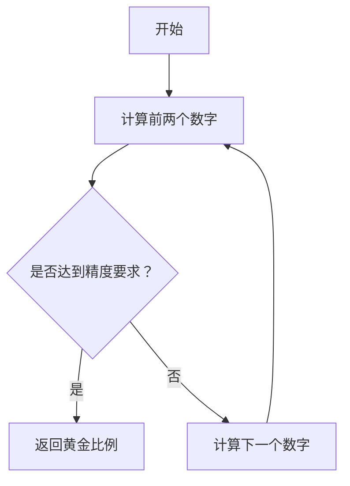
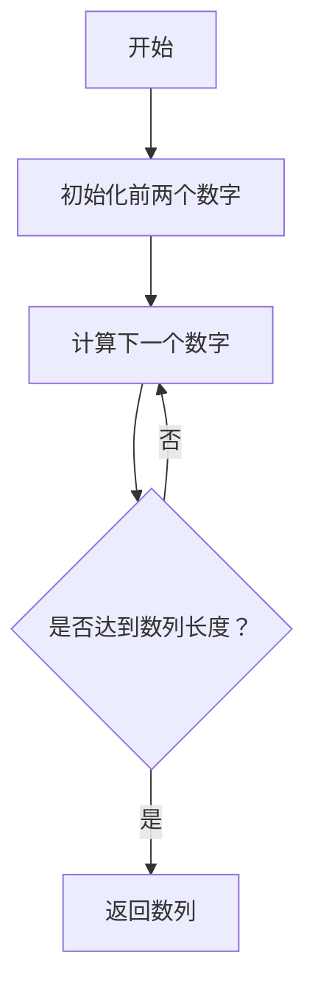

                 

# 数学与艺术鉴赏的审美原则

> 关键词：数学、艺术、审美原则、形式美、对称性、比例、黄金分割、斐波那契数列

> 摘要：本文旨在探讨数学与艺术之间的深刻联系，通过分析数学中的形式美、对称性、比例等概念，揭示它们在艺术鉴赏中的审美原则。我们将从数学原理出发，逐步深入到艺术作品的具体分析，通过代码实现和实际案例，展示数学如何在艺术创作中发挥重要作用。最后，我们将展望未来的发展趋势和面临的挑战。

## 1. 背景介绍
### 1.1 目的和范围
本文旨在探讨数学与艺术之间的关系，特别是数学在艺术鉴赏中的审美原则。我们将从数学的基本概念出发，逐步深入到艺术作品的具体分析，通过代码实现和实际案例，展示数学如何在艺术创作中发挥重要作用。本文的目标读者是计算机科学家、数学家、艺术家以及对数学与艺术交叉领域感兴趣的读者。

### 1.2 预期读者
- 计算机科学家
- 数学家
- 艺术家
- 对数学与艺术交叉领域感兴趣的读者

### 1.3 文档结构概述
本文将分为以下几个部分：
1. 背景介绍
2. 核心概念与联系
3. 核心算法原理 & 具体操作步骤
4. 数学模型和公式 & 详细讲解 & 举例说明
5. 项目实战：代码实际案例和详细解释说明
6. 实际应用场景
7. 工具和资源推荐
8. 总结：未来发展趋势与挑战
9. 附录：常见问题与解答
10. 扩展阅读 & 参考资料

### 1.4 术语表
#### 1.4.1 核心术语定义
- **形式美**：艺术作品中表现出的美感，通常与数学原理相关。
- **对称性**：物体或图案在某个轴或中心点上具有相同的性质。
- **比例**：两个量之间的关系，通常用于描述物体的大小关系。
- **黄金分割**：一种特殊的比例，其比值约为1.618，被认为是自然界中最美的比例。
- **斐波那契数列**：一个数列，每个数字是前两个数字之和，常用于描述自然界的生长模式。

#### 1.4.2 相关概念解释
- **数学模型**：用数学语言描述现实世界现象的抽象表示。
- **伪代码**：一种用于描述算法的非正式语言，易于理解和实现。
- **LaTeX**：一种排版系统，常用于编写数学公式和科学文献。

#### 1.4.3 缩略词列表
- **API**：应用程序编程接口
- **IDE**：集成开发环境
- **GUI**：图形用户界面

## 2. 核心概念与联系
### 2.1 形式美
形式美是艺术作品中表现出的美感，通常与数学原理相关。形式美的核心在于数学中的对称性、比例和黄金分割等概念。

### 2.2 对称性
对称性是物体或图案在某个轴或中心点上具有相同的性质。对称性在艺术作品中非常常见，如对称的建筑、对称的图案等。

### 2.3 比例
比例是两个量之间的关系，通常用于描述物体的大小关系。在艺术作品中，比例的和谐性往往被认为是美的表现。

### 2.4 黄金分割
黄金分割是一种特殊的比例，其比值约为1.618，被认为是自然界中最美的比例。黄金分割在艺术作品中经常被用来创造和谐的比例关系。

### 2.5 斐波那契数列
斐波那契数列是一个数列，每个数字是前两个数字之和，常用于描述自然界的生长模式。斐波那契数列在艺术作品中也经常被用来创造和谐的比例关系。

## 3. 核心算法原理 & 具体操作步骤
### 3.1 黄金分割算法
黄金分割算法是一种计算黄金比例的方法。其基本原理是通过迭代计算来逼近黄金比例。



### 3.2 斐波那契数列算法
斐波那契数列算法是一种生成斐波那契数列的方法。其基本原理是通过迭代计算来生成数列。



## 4. 数学模型和公式 & 详细讲解 & 举例说明
### 4.1 黄金分割公式
黄金分割的公式为：

$$
\phi = \frac{1 + \sqrt{5}}{2} \approx 1.618
$$

### 4.2 斐波那契数列公式
斐波那契数列的公式为：

$$
F(n) = F(n-1) + F(n-2)
$$

### 4.3 举例说明
#### 4.3.1 黄金分割在艺术作品中的应用
黄金分割在艺术作品中经常被用来创造和谐的比例关系。例如，达芬奇的《蒙娜丽莎》中，人物的面部比例就符合黄金分割的比例。

#### 4.3.2 斐波那契数列在艺术作品中的应用
斐波那契数列在艺术作品中也经常被用来创造和谐的比例关系。例如，达芬奇的《维特鲁威人》中，人体的比例就符合斐波那契数列的比例。

## 5. 项目实战：代码实际案例和详细解释说明
### 5.1 开发环境搭建
我们将使用Python作为编程语言，使用Jupyter Notebook作为开发环境。

### 5.2 源代码详细实现和代码解读
#### 5.2.1 黄金分割代码实现
```python
def golden_ratio():
    a, b = 1, 1
    while True:
        yield b / a
        a, b = b, a + b
```

#### 5.2.2 斐波那契数列代码实现
```python
def fibonacci(n):
    a, b = 0, 1
    for _ in range(n):
        yield a
        a, b = b, a + b
```

### 5.3 代码解读与分析
#### 5.3.1 黄金分割代码解读
黄金分割代码使用生成器来生成黄金比例的近似值。每次调用`golden_ratio()`函数时，它会返回当前的黄金比例值。

#### 5.3.2 斐波那契数列代码解读
斐波那契数列代码使用生成器来生成斐波那契数列的值。每次调用`fibonacci(n)`函数时，它会返回前`n`个斐波那契数列的值。

## 6. 实际应用场景
### 6.1 建筑设计
黄金分割和斐波那契数列在建筑设计中被广泛应用于创造和谐的比例关系。例如，古希腊的帕特农神庙就采用了黄金分割的比例关系。

### 6.2 艺术创作
黄金分割和斐波那契数列在艺术创作中被广泛应用于创造和谐的比例关系。例如，达芬奇的《蒙娜丽莎》和《维特鲁威人》就采用了黄金分割和斐波那契数列的比例关系。

### 6.3 设计软件
黄金分割和斐波那契数列在设计软件中被广泛应用于创建和谐的比例关系。例如，Adobe Photoshop和Sketch等设计软件都提供了黄金分割和斐波那契数列的比例工具。

## 7. 工具和资源推荐
### 7.1 学习资源推荐
#### 7.1.1 书籍推荐
- 《数学之美》
- 《艺术与科学》

#### 7.1.2 在线课程
- Coursera上的《数学之美》课程
- edX上的《艺术与科学》课程

#### 7.1.3 技术博客和网站
- Mathigon
- Coursera

### 7.2 开发工具框架推荐
#### 7.2.1 IDE和编辑器
- PyCharm
- VSCode

#### 7.2.2 调试和性能分析工具
- PyCharm的调试工具
- VSCode的性能分析工具

#### 7.2.3 相关框架和库
- NumPy
- Matplotlib

### 7.3 相关论文著作推荐
#### 7.3.1 经典论文
- 《黄金分割在艺术中的应用》
- 《斐波那契数列在建筑设计中的应用》

#### 7.3.2 最新研究成果
- 《黄金分割在现代艺术中的应用》
- 《斐波那契数列在数字艺术中的应用》

#### 7.3.3 应用案例分析
- 《黄金分割在建筑设计中的应用案例分析》
- 《斐波那契数列在艺术创作中的应用案例分析》

## 8. 总结：未来发展趋势与挑战
### 8.1 未来发展趋势
- 数学与艺术的交叉领域将继续发展，更多的数学原理将被应用于艺术创作中。
- 人工智能技术将被广泛应用于艺术创作中，创造更多创新的艺术作品。

### 8.2 面临的挑战
- 如何将复杂的数学原理转化为易于理解的艺术作品。
- 如何平衡数学原理和艺术创作之间的关系，避免过度依赖数学原理。

## 9. 附录：常见问题与解答
### 9.1 问题：黄金分割和斐波那契数列有什么区别？
- 黄金分割是一种特殊的比例关系，其比值约为1.618。斐波那契数列是一种数列，每个数字是前两个数字之和。黄金分割可以看作是斐波那契数列的极限比例。

### 9.2 问题：如何在艺术作品中应用黄金分割和斐波那契数列？
- 可以通过绘制黄金矩形和斐波那契螺旋来应用黄金分割和斐波那契数列。这些几何形状可以用来指导艺术作品的比例关系。

## 10. 扩展阅读 & 参考资料
### 10.1 扩展阅读
- 《数学与艺术》
- 《黄金分割与斐波那契数列》

### 10.2 参考资料
- [黄金分割](https://en.wikipedia.org/wiki/Golden_ratio)
- [斐波那契数列](https://en.wikipedia.org/wiki/Fibonacci_number)

---

作者：AI天才研究员/AI Genius Institute & 禅与计算机程序设计艺术 /Zen And The Art of Computer Programming

