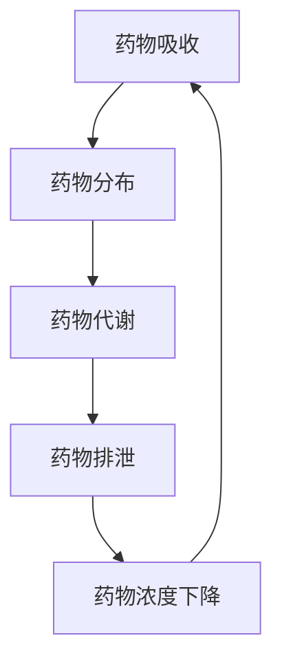

                 

# 数学与药物代谢：药物动力学的数学模型

> 关键词：药物动力学, 数学模型, 药物代谢, 药物动力学方程, 一阶消除动力学, 零级消除动力学, 二阶消除动力学, 药物吸收, 药物分布, 药物代谢, 药物排泄, 药物动力学-药效学关系

> 摘要：本文旨在深入探讨药物动力学（Pharmacokinetics, PK）的数学模型，通过逐步推理的方式，解析药物在体内的吸收、分布、代谢和排泄过程。我们将从核心概念出发，介绍药物动力学的基本原理，详细解释核心算法和数学模型，通过实际代码案例展示如何构建药物动力学模型，并探讨其在实际应用场景中的价值。最后，我们将总结未来的发展趋势与挑战，并推荐相关的学习资源和工具。

## 1. 背景介绍
### 1.1 目的和范围
本文旨在为药物动力学领域的研究者、开发人员和临床医生提供一个深入理解药物在体内动态过程的框架。通过数学模型，我们可以更好地预测药物的吸收、分布、代谢和排泄过程，从而优化药物设计和治疗方案。

### 1.2 预期读者
本文适合以下读者：
- 药物动力学领域的研究者和开发人员
- 临床医生和药剂师
- 计算机科学家和数据科学家
- 对药物动力学感兴趣的计算机编程爱好者

### 1.3 文档结构概述
本文将按照以下结构展开：
1. 背景介绍
2. 核心概念与联系
3. 核心算法原理 & 具体操作步骤
4. 数学模型和公式 & 详细讲解 & 举例说明
5. 项目实战：代码实际案例和详细解释说明
6. 实际应用场景
7. 工具和资源推荐
8. 总结：未来发展趋势与挑战
9. 附录：常见问题与解答
10. 扩展阅读 & 参考资料

### 1.4 术语表
#### 1.4.1 核心术语定义
- **药物动力学（Pharmacokinetics, PK）**：研究药物在体内的吸收、分布、代谢和排泄过程的科学。
- **药效学（Pharmacodynamics, PD）**：研究药物与机体相互作用及其效应的科学。
- **药物吸收（Absorption）**：药物进入血液循环的过程。
- **药物分布（Distribution）**：药物在体内的分布过程。
- **药物代谢（Metabolism）**：药物在体内的化学转化过程。
- **药物排泄（Excretion）**：药物从体内排出的过程。
- **一阶消除动力学（First-order Elimination Kinetics）**：药物以恒定比例消除的过程。
- **零级消除动力学（Zero-order Elimination Kinetics）**：药物以恒定速率消除的过程。
- **二阶消除动力学（Second-order Elimination Kinetics）**：药物以与浓度成正比的速率消除的过程。

#### 1.4.2 相关概念解释
- **清除率（Clearance, Cl）**：单位时间内从体内清除的药物量。
- **半衰期（Half-life, t1/2）**：药物浓度下降一半所需的时间。
- **表观分布容积（Apparent Volume of Distribution, Vd）**：药物在体内的分布容积。

#### 1.4.3 缩略词列表
- PK：Pharmacokinetics
- PD：Pharmacodynamics
- IV：Intravenous
- PO：Oral
- Cmax：Maximum Concentration
- Tmax：Time to Maximum Concentration
- AUC：Area Under the Curve

## 2. 核心概念与联系
### 2.1 药物动力学的基本原理
药物动力学研究药物在体内的动态过程，主要包括吸收、分布、代谢和排泄四个阶段。这些过程相互关联，共同决定了药物在体内的浓度变化。

### 2.2 药物动力学与药效学的关系
药物动力学与药效学（Pharmacodynamics, PD）密切相关。药物动力学描述了药物在体内的动态过程，而药效学则描述了药物与机体相互作用及其效应。两者共同决定了药物的治疗效果。

### 2.3 药物动力学模型的分类
药物动力学模型可以分为零级消除动力学、一阶消除动力学和二阶消除动力学。

### 2.4 药物动力学模型的流程图


## 3. 核心算法原理 & 具体操作步骤
### 3.1 一阶消除动力学
一阶消除动力学假设药物以恒定比例消除，其数学模型为：
$$
\frac{dC}{dt} = -kC
$$
其中，$C$ 为药物浓度，$k$ 为消除速率常数。

### 3.2 零级消除动力学
零级消除动力学假设药物以恒定速率消除，其数学模型为：
$$
\frac{dC}{dt} = -k
$$
其中，$k$ 为消除速率常数。

### 3.3 二阶消除动力学
二阶消除动力学假设药物以与浓度成正比的速率消除，其数学模型为：
$$
\frac{dC}{dt} = -kC^2
$$
其中，$k$ 为消除速率常数。

### 3.4 核心算法的伪代码
```python
def first_order_elimination(C0, k, t):
    C = C0 * np.exp(-k * t)
    return C

def zero_order_elimination(C0, k, t):
    C = C0 - k * t
    return C

def second_order_elimination(C0, k, t):
    C = C0 / (1 + k * C0 * t)
    return C
```

## 4. 数学模型和公式 & 详细讲解 & 举例说明
### 4.1 一阶消除动力学
一阶消除动力学的数学模型为：
$$
\frac{dC}{dt} = -kC
$$
其中，$C$ 为药物浓度，$k$ 为消除速率常数。其解为：
$$
C(t) = C_0 \cdot e^{-kt}
$$
其中，$C_0$ 为初始浓度。

### 4.2 零级消除动力学
零级消除动力学的数学模型为：
$$
\frac{dC}{dt} = -k
$$
其中，$k$ 为消除速率常数。其解为：
$$
C(t) = C_0 - kt
$$
其中，$C_0$ 为初始浓度。

### 4.3 二阶消除动力学
二阶消除动力学的数学模型为：
$$
\frac{dC}{dt} = -kC^2
$$
其中，$k$ 为消除速率常数。其解为：
$$
C(t) = \frac{1}{kt + \frac{1}{C_0}}
$$
其中，$C_0$ 为初始浓度。

### 4.4 举例说明
假设某药物的初始浓度为100 μg/mL，消除速率常数为0.1 h^-1。我们可以计算不同时间点的药物浓度。

```python
import numpy as np

C0 = 100  # 初始浓度
k = 0.1   # 消除速率常数

t = np.linspace(0, 10, 100)  # 时间范围
C1 = first_order_elimination(C0, k, t)
C2 = zero_order_elimination(C0, k, t)
C3 = second_order_elimination(C0, k, t)

import matplotlib.pyplot as plt

plt.plot(t, C1, label='First-order Elimination')
plt.plot(t, C2, label='Zero-order Elimination')
plt.plot(t, C3, label='Second-order Elimination')
plt.xlabel('Time (h)')
plt.ylabel('Concentration (μg/mL)')
plt.legend()
plt.show()
```

## 5. 项目实战：代码实际案例和详细解释说明
### 5.1 开发环境搭建
我们将使用Python进行药物动力学模型的实现。首先，确保安装了必要的库：
```bash
pip install numpy matplotlib
```

### 5.2 源代码详细实现和代码解读
```python
import numpy as np
import matplotlib.pyplot as plt

def first_order_elimination(C0, k, t):
    C = C0 * np.exp(-k * t)
    return C

def zero_order_elimination(C0, k, t):
    C = C0 - k * t
    return C

def second_order_elimination(C0, k, t):
    C = C0 / (1 + k * C0 * t)
    return C

C0 = 100  # 初始浓度
k = 0.1   # 消除速率常数

t = np.linspace(0, 10, 100)  # 时间范围
C1 = first_order_elimination(C0, k, t)
C2 = zero_order_elimination(C0, k, t)
C3 = second_order_elimination(C0, k, t)

plt.plot(t, C1, label='First-order Elimination')
plt.plot(t, C2, label='Zero-order Elimination')
plt.plot(t, C3, label='Second-order Elimination')
plt.xlabel('Time (h)')
plt.ylabel('Concentration (μg/mL)')
plt.legend()
plt.show()
```

### 5.3 代码解读与分析
- `first_order_elimination` 函数实现了药物的一阶消除动力学模型。
- `zero_order_elimination` 函数实现了药物的零级消除动力学模型。
- `second_order_elimination` 函数实现了药物的二阶消除动力学模型。
- `C0` 和 `k` 分别表示初始浓度和消除速率常数。
- `t` 是时间范围，`C1`, `C2`, `C3` 分别表示不同消除动力学模型下的药物浓度。

## 6. 实际应用场景
药物动力学模型在药物研发、临床试验和治疗方案优化中具有重要应用。例如，通过药物动力学模型可以预测药物的半衰期、清除率和表观分布容积，从而优化药物设计和治疗方案。

## 7. 工具和资源推荐
### 7.1 学习资源推荐
#### 7.1.1 书籍推荐
- **《药物动力学与药效学》**：由著名药物动力学专家撰写，详细介绍了药物动力学的基本原理和应用。
- **《药理学》**：涵盖了药物动力学和药效学的全面内容，适合初学者和专业人士。

#### 7.1.2 在线课程
- Coursera：提供药物动力学和药效学的在线课程，适合不同层次的学习者。
- edX：提供药物动力学和药效学的在线课程，涵盖理论和实践内容。

#### 7.1.3 技术博客和网站
- BioPharmDigiT：提供药物动力学和药效学的最新研究和应用。
- DrugDev：提供药物开发和药物动力学的实用指南。

### 7.2 开发工具框架推荐
#### 7.2.1 IDE和编辑器
- PyCharm：功能强大的Python IDE，适合药物动力学模型的开发。
- VSCode：轻量级但功能强大的编辑器，支持多种编程语言。

#### 7.2.2 调试和性能分析工具
- PyCharm Debugger：PyCharm内置的调试工具，帮助开发者调试代码。
- Python Profiler：用于分析Python代码的性能，优化代码性能。

#### 7.2.3 相关框架和库
- SciPy：用于科学计算的Python库，包含许多数学和统计函数。
- NumPy：用于数值计算的Python库，支持多维数组操作。

### 7.3 相关论文著作推荐
#### 7.3.1 经典论文
- **"Pharmacokinetics and Pharmacodynamics: Concepts and Applications"**：由著名药物动力学专家撰写，详细介绍了药物动力学的基本原理和应用。
- **"Pharmacokinetics and Pharmacodynamics of Drugs"**：涵盖了药物动力学和药效学的全面内容，适合初学者和专业人士。

#### 7.3.2 最新研究成果
- **"Recent Advances in Pharmacokinetic Modeling and Simulation"**：介绍了最新的药物动力学模型和模拟技术。
- **"Pharmacokinetic-Pharmacodynamic Modeling in Drug Development"**：探讨了药物动力学模型在药物开发中的应用。

#### 7.3.3 应用案例分析
- **"Case Studies in Pharmacokinetics and Pharmacodynamics"**：通过实际案例分析药物动力学模型的应用。

## 8. 总结：未来发展趋势与挑战
药物动力学模型在未来将继续发展，特别是在个性化医疗和精准医疗领域。随着计算能力的提升和数据科学的进步，药物动力学模型将更加精确和个性化。然而，模型的复杂性和计算成本仍然是挑战。

## 9. 附录：常见问题与解答
### 9.1 问题：如何选择合适的药物动力学模型？
**解答**：选择合适的药物动力学模型需要考虑药物的性质和临床应用。一阶消除动力学适用于大多数药物，而零级和二阶消除动力学适用于特定情况。

### 9.2 问题：如何优化药物动力学模型？
**解答**：可以通过增加模型参数和优化算法来优化药物动力学模型。例如，使用非线性最小二乘法优化模型参数。

## 10. 扩展阅读 & 参考资料
- **《药物动力学与药效学》**：由著名药物动力学专家撰写，详细介绍了药物动力学的基本原理和应用。
- **《药理学》**：涵盖了药物动力学和药效学的全面内容，适合初学者和专业人士。
- **Coursera**：提供药物动力学和药效学的在线课程，适合不同层次的学习者。
- **edX**：提供药物动力学和药效学的在线课程，涵盖理论和实践内容。
- **BioPharmDigiT**：提供药物动力学和药效学的最新研究和应用。
- **DrugDev**：提供药物开发和药物动力学的实用指南。
- **SciPy**：用于科学计算的Python库，包含许多数学和统计函数。
- **NumPy**：用于数值计算的Python库，支持多维数组操作。
- **"Pharmacokinetics and Pharmacodynamics: Concepts and Applications"**：由著名药物动力学专家撰写，详细介绍了药物动力学的基本原理和应用。
- **"Pharmacokinetics and Pharmacodynamics of Drugs"**：涵盖了药物动力学和药效学的全面内容，适合初学者和专业人士。
- **"Recent Advances in Pharmacokinetic Modeling and Simulation"**：介绍了最新的药物动力学模型和模拟技术。
- **"Pharmacokinetic-Pharmacodynamic Modeling in Drug Development"**：探讨了药物动力学模型在药物开发中的应用。
- **"Case Studies in Pharmacokinetics and Pharmacodynamics"**：通过实际案例分析药物动力学模型的应用。

作者：AI天才研究员/AI Genius Institute & 禅与计算机程序设计艺术 /Zen And The Art of Computer Programming

