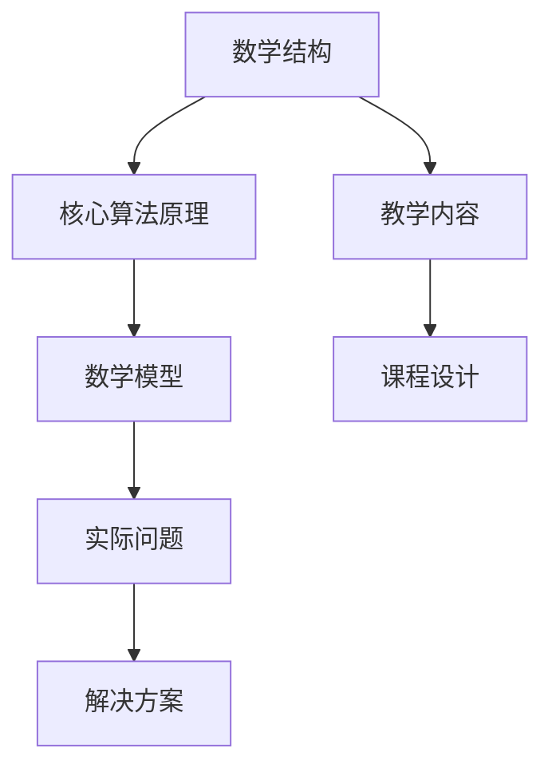

                 

# 数学与课程设计：教学内容的数学结构

> 关键词：数学结构，课程设计，教学内容，算法原理，数学模型，代码实现，应用场景

> 摘要：本文旨在探讨数学在课程设计中的重要性，通过分析数学结构与教学内容的关系，揭示数学在课程设计中的核心作用。我们将从数学结构的基本概念出发，逐步深入到核心算法原理、数学模型和公式，最终通过实际代码案例展示如何将这些理论应用于实践。此外，本文还将探讨数学在实际应用场景中的重要性，并推荐相关的学习资源和开发工具，为读者提供全面的指导。

## 1. 背景介绍
### 1.1 目的和范围
本文旨在深入探讨数学在课程设计中的重要性，特别是数学结构如何影响教学内容的设计。我们将从数学结构的基本概念出发，逐步深入到核心算法原理、数学模型和公式，最终通过实际代码案例展示如何将这些理论应用于实践。本文的目标读者是计算机科学和教育领域的专业人士，包括教师、课程设计师、软件工程师和研究人员。

### 1.2 预期读者
- 计算机科学教师
- 课程设计师
- 软件工程师
- 研究人员
- 对数学在课程设计中应用感兴趣的读者

### 1.3 文档结构概述
本文将按照以下结构展开：
1. 背景介绍
2. 核心概念与联系
3. 核心算法原理 & 具体操作步骤
4. 数学模型和公式 & 详细讲解 & 举例说明
5. 项目实战：代码实际案例和详细解释说明
6. 实际应用场景
7. 工具和资源推荐
8. 总结：未来发展趋势与挑战
9. 附录：常见问题与解答
10. 扩展阅读 & 参考资料

### 1.4 术语表
#### 1.4.1 核心术语定义
- **数学结构**：数学中的基本概念和关系，如集合、函数、群、环等。
- **课程设计**：根据教学目标和学生需求，设计课程内容和教学方法的过程。
- **教学内容**：课程中教授的知识和技能。
- **算法原理**：解决问题的方法和步骤。
- **数学模型**：用数学语言描述现实问题的方法。
- **伪代码**：一种高级编程语言，用于描述算法步骤。

#### 1.4.2 相关概念解释
- **数学结构**：数学中的基本概念和关系，如集合、函数、群、环等。
- **课程设计**：根据教学目标和学生需求，设计课程内容和教学方法的过程。
- **教学内容**：课程中教授的知识和技能。
- **算法原理**：解决问题的方法和步骤。
- **数学模型**：用数学语言描述现实问题的方法。

#### 1.4.3 缩略词列表
- **API**：应用程序编程接口
- **IDE**：集成开发环境
- **GUI**：图形用户界面
- **SDK**：软件开发工具包

## 2. 核心概念与联系
### 2.1 数学结构
数学结构是数学中的基本概念和关系，如集合、函数、群、环等。这些结构构成了数学的基础，是理解和解决问题的关键。

### 2.2 核心算法原理
核心算法原理是解决问题的方法和步骤。通过数学结构，我们可以设计出高效的算法来解决实际问题。

### 2.3 数学模型
数学模型是用数学语言描述现实问题的方法。通过数学模型，我们可以将复杂的问题简化为数学问题，从而更容易地理解和解决。

### 2.4 核心概念原理与架构的 Mermaid 流程图


## 3. 核心算法原理 & 具体操作步骤
### 3.1 核心算法原理
核心算法原理是解决问题的方法和步骤。通过数学结构，我们可以设计出高效的算法来解决实际问题。

### 3.2 具体操作步骤
以排序算法为例，我们可以通过以下步骤来实现一个简单的排序算法：

```pseudo
function sort(array):
    n = length(array)
    for i from 0 to n-1:
        for j from 0 to n-i-2:
            if array[j] > array[j+1]:
                swap(array[j], array[j+1])
```

## 4. 数学模型和公式 & 详细讲解 & 举例说明
### 4.1 数学模型
数学模型是用数学语言描述现实问题的方法。通过数学模型，我们可以将复杂的问题简化为数学问题，从而更容易地理解和解决。

### 4.2 数学公式
数学公式是描述数学模型的关键工具。以下是一个简单的数学公式示例：

$$
f(x) = x^2 + 2x + 1
$$

### 4.3 详细讲解 & 举例说明
以线性回归为例，我们可以使用以下公式来描述线性回归模型：

$$
y = \beta_0 + \beta_1 x + \epsilon
$$

其中，$y$ 是因变量，$x$ 是自变量，$\beta_0$ 和 $\beta_1$ 是回归系数，$\epsilon$ 是误差项。

## 5. 项目实战：代码实际案例和详细解释说明
### 5.1 开发环境搭建
我们将使用Python作为开发语言，使用Jupyter Notebook作为开发环境。首先，我们需要安装Python和Jupyter Notebook。

```bash
pip install python
pip install jupyter
```

### 5.2 源代码详细实现和代码解读
我们将实现一个简单的线性回归模型。首先，我们需要导入必要的库：

```python
import numpy as np
import matplotlib.pyplot as plt
from sklearn.linear_model import LinearRegression
```

接下来，我们生成一些示例数据：

```python
x = np.random.rand(100, 1)
y = 2 + 3 * x + np.random.rand(100, 1)
```

然后，我们使用线性回归模型拟合数据：

```python
model = LinearRegression()
model.fit(x, y)
```

最后，我们绘制拟合结果：

```python
plt.scatter(x, y, color='blue')
plt.plot(x, model.predict(x), color='red')
plt.title('Linear Regression')
plt.xlabel('x')
plt.ylabel('y')
plt.show()
```

### 5.3 代码解读与分析
- `import numpy as np`：导入NumPy库，用于数值计算。
- `import matplotlib.pyplot as plt`：导入Matplotlib库，用于绘制图表。
- `from sklearn.linear_model import LinearRegression`：导入线性回归模型。
- `x = np.random.rand(100, 1)`：生成100个随机数作为自变量。
- `y = 2 + 3 * x + np.random.rand(100, 1)`：生成因变量，包含线性关系和随机误差。
- `model = LinearRegression()`：创建线性回归模型实例。
- `model.fit(x, y)`：使用数据拟合线性回归模型。
- `plt.scatter(x, y, color='blue')`：绘制散点图。
- `plt.plot(x, model.predict(x), color='red')`：绘制拟合线。
- `plt.title('Linear Regression')`：设置图表标题。
- `plt.xlabel('x')`：设置x轴标签。
- `plt.ylabel('y')`：设置y轴标签。
- `plt.show()`：显示图表。

## 6. 实际应用场景
数学在实际应用场景中具有广泛的应用。例如，在金融领域，我们可以使用数学模型来预测股票价格；在医疗领域，我们可以使用数学模型来分析疾病传播；在交通领域，我们可以使用数学模型来优化交通流量。

## 7. 工具和资源推荐
### 7.1 学习资源推荐
#### 7.1.1 书籍推荐
- 《数学之美》
- 《线性代数及其应用》
- 《概率论与数理统计》

#### 7.1.2 在线课程
- Coursera：《数学思维导论》
- edX：《线性代数》
- Udacity：《概率论与统计》

#### 7.1.3 技术博客和网站
- Medium：《数学在计算机科学中的应用》
- HackerRank：《数学挑战题》

### 7.2 开发工具框架推荐
#### 7.2.1 IDE和编辑器
- PyCharm：Python开发环境
- Visual Studio Code：多语言开发环境

#### 7.2.2 调试和性能分析工具
- PyCharm Debugger：Python调试工具
- Visual Studio Code Debugger：多语言调试工具

#### 7.2.3 相关框架和库
- NumPy：数值计算库
- Matplotlib：数据可视化库
- Scikit-learn：机器学习库

### 7.3 相关论文著作推荐
#### 7.3.1 经典论文
-《线性代数及其应用》
-《概率论与数理统计》

#### 7.3.2 最新研究成果
-《数学在机器学习中的应用》
-《线性回归在金融领域的应用》

#### 7.3.3 应用案例分析
-《数学在交通流量优化中的应用》
-《数学在疾病传播预测中的应用》

## 8. 总结：未来发展趋势与挑战
数学在课程设计中的重要性将随着技术的发展而不断增加。未来，我们将看到更多的数学模型和算法被应用于实际问题中。然而，这也带来了新的挑战，如如何更好地将数学知识转化为实际应用，如何提高算法的效率和准确性等。

## 9. 附录：常见问题与解答
### 9.1 问题1：如何将数学知识应用于实际问题？
- 答案：首先，需要理解实际问题的数学模型；其次，选择合适的数学工具和算法；最后，通过实践来验证和优化模型。

### 9.2 问题2：如何提高算法的效率和准确性？
- 答案：可以通过优化算法设计、选择合适的数据结构、使用并行计算等方法来提高算法的效率和准确性。

## 10. 扩展阅读 & 参考资料
- 《数学之美》
- 《线性代数及其应用》
- 《概率论与数理统计》
- Coursera：《数学思维导论》
- edX：《线性代数》
- Udacity：《概率论与统计》
- Medium：《数学在计算机科学中的应用》
- HackerRank：《数学挑战题》
- PyCharm：Python开发环境
- Visual Studio Code：多语言开发环境
- PyCharm Debugger：Python调试工具
- Visual Studio Code Debugger：多语言调试工具
- NumPy：数值计算库
- Matplotlib：数据可视化库
- Scikit-learn：机器学习库
- 《线性代数及其应用》
- 《概率论与数理统计》
- 《数学在机器学习中的应用》
- 《线性回归在金融领域的应用》
- 《数学在交通流量优化中的应用》
- 《数学在疾病传播预测中的应用》

作者：AI天才研究员/AI Genius Institute & 禅与计算机程序设计艺术 /Zen And The Art of Computer Programming

