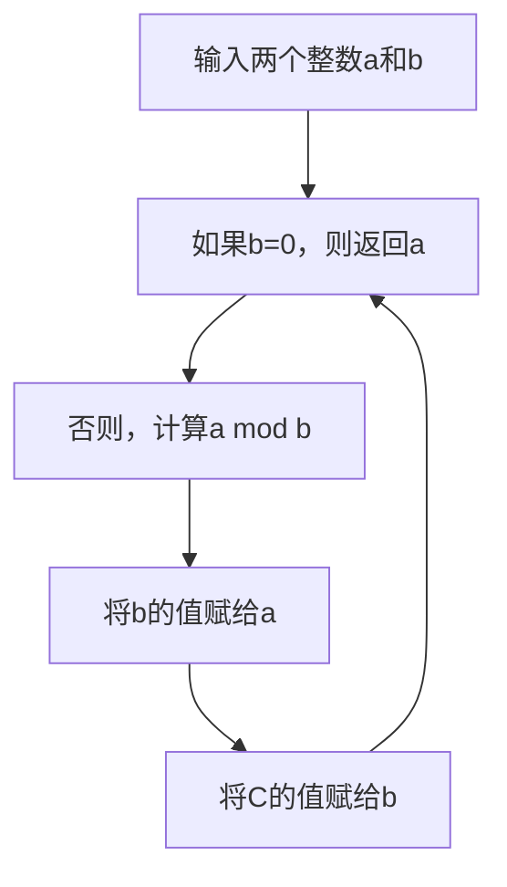

                 

# 数学史上的数学文化交流与融合

> 关键词：数学文化、文化交流、融合、历史、数学模型、算法、数学史

> 摘要：本文旨在探讨数学文化在历史长河中的交流与融合，通过分析数学文化的发展历程，揭示不同文明之间的数学思想交流如何促进了数学的进步。我们将从数学文化的定义出发，探讨数学文化在不同历史时期的发展，以及不同文明之间的交流与融合。通过具体的数学模型和算法实例，展示数学文化如何在交流与融合中不断演进。最后，我们将展望未来数学文化的发展趋势与挑战。

## 1. 背景介绍
### 1.1 目的和范围
本文旨在探讨数学文化在历史长河中的交流与融合，通过分析数学文化的发展历程，揭示不同文明之间的数学思想交流如何促进了数学的进步。我们将从数学文化的定义出发，探讨数学文化在不同历史时期的发展，以及不同文明之间的交流与融合。通过具体的数学模型和算法实例，展示数学文化如何在交流与融合中不断演进。最后，我们将展望未来数学文化的发展趋势与挑战。

### 1.2 预期读者
本文适合对数学文化、数学史、文化交流感兴趣的读者，包括数学爱好者、历史学者、计算机科学家以及对数学文化有浓厚兴趣的读者。

### 1.3 文档结构概述
本文将按照以下结构展开：
1. 背景介绍
2. 核心概念与联系
3. 核心算法原理 & 具体操作步骤
4. 数学模型和公式 & 详细讲解 & 举例说明
5. 项目实战：代码实际案例和详细解释说明
6. 实际应用场景
7. 工具和资源推荐
8. 总结：未来发展趋势与挑战
9. 附录：常见问题与解答
10. 扩展阅读 & 参考资料

### 1.4 术语表
#### 1.4.1 核心术语定义
- **数学文化**：指数学思想、方法、理论及其在社会中的应用和传播。
- **文化交流**：不同文明之间的思想、知识、技术等的交流与传播。
- **融合**：不同文化之间的相互影响和吸收，形成新的文化形态。

#### 1.4.2 相关概念解释
- **数学模型**：用数学语言描述现实世界问题的抽象表达。
- **算法**：解决问题的具体步骤和方法。
- **数学史**：数学思想和理论发展的历史。

#### 1.4.3 缩略词列表
- **IDE**：Integrated Development Environment（集成开发环境）
- **API**：Application Programming Interface（应用程序编程接口）

## 2. 核心概念与联系
### 2.1 数学文化的定义
数学文化是指数学思想、方法、理论及其在社会中的应用和传播。它不仅包括数学本身，还包括数学在不同文化背景下的发展和应用。

### 2.2 数学文化的发展历程
数学文化的发展历程可以分为以下几个阶段：
1. **古代文明**：古埃及、古巴比伦、古印度、古中国等文明中的数学思想。
2. **希腊文明**：欧几里得几何、阿基米德的数学成就。
3. **阿拉伯文明**：代数学的发展，阿拉伯数字的传播。
4. **文艺复兴时期**：欧洲数学的复兴，解析几何的诞生。
5. **现代数学**：20世纪以来，数学的快速发展和应用。

### 2.3 数学文化之间的交流与融合
数学文化之间的交流与融合主要体现在以下几个方面：
1. **知识传播**：不同文明之间的数学知识通过文献、旅行家等方式传播。
2. **思想交流**：不同文明之间的数学思想通过学术交流、学术会议等方式交流。
3. **技术融合**：不同文明之间的数学技术通过实际应用和技术交流融合。

## 3. 核心算法原理 & 具体操作步骤
### 3.1 算法原理
我们将通过一个具体的算法实例来展示数学文化之间的交流与融合。这里选择的是欧几里得算法，用于求两个整数的最大公约数。

### 3.2 具体操作步骤


## 4. 数学模型和公式 & 详细讲解 & 举例说明
### 4.1 数学模型
我们将通过一个具体的数学模型来展示数学文化之间的交流与融合。这里选择的是费马大定理，这是数学史上最著名的未解之谜之一。

### 4.2 公式与详细讲解
费马大定理的数学表达式为：
$$
a^n + b^n = c^n
$$
其中，\(a, b, c\) 为正整数，\(n\) 为大于2的整数。费马大定理的证明过程非常复杂，直到1994年，安德鲁·怀尔斯才给出了完整的证明。

### 4.3 举例说明
费马大定理的证明过程非常复杂，但我们可以简要介绍其证明思路。怀尔斯的证明主要基于椭圆曲线和模形式理论。具体步骤如下：
1. **椭圆曲线**：定义椭圆曲线的方程。
2. **模形式**：引入模形式的概念。
3. **连接椭圆曲线和模形式**：证明椭圆曲线和模形式之间的关系。
4. **费马大定理的证明**：利用椭圆曲线和模形式的性质，证明费马大定理。

## 5. 项目实战：代码实际案例和详细解释说明
### 5.1 开发环境搭建
我们将使用Python语言实现欧几里得算法。首先，我们需要安装Python环境。

### 5.2 源代码详细实现和代码解读
```python
def gcd(a, b):
    while b != 0:
        a, b = b, a % b
    return a

# 示例
print(gcd(48, 18))  # 输出 6
```

### 5.3 代码解读与分析
- **函数定义**：`gcd(a, b)` 定义了一个求最大公约数的函数。
- **循环结构**：使用 `while` 循环实现欧几里得算法的核心逻辑。
- **赋值操作**：`a, b = b, a % b` 实现了欧几里得算法的迭代过程。

## 6. 实际应用场景
欧几里得算法在实际应用中非常广泛，例如：
1. **密码学**：在RSA加密算法中，需要计算大整数的模幂运算，欧几里得算法可以用于优化计算过程。
2. **计算机科学**：在数据结构和算法设计中，欧几里得算法可以用于优化算法性能。
3. **工程应用**：在信号处理和图像处理中，欧几里得算法可以用于优化计算过程。

## 7. 工具和资源推荐
### 7.1 学习资源推荐
#### 7.1.1 书籍推荐
- 《数学史》（作者：卡尔·B·波耶）
- 《费马大定理》（作者：西蒙·辛格）

#### 7.1.2 在线课程
- Coursera上的《数学文化与历史》
- edX上的《数学史与文化》

#### 7.1.3 技术博客和网站
- MathWorld（https://mathworld.wolfram.com/）
- Cut-the-Knot（https://www.cut-the-knot.org/）

### 7.2 开发工具框架推荐
#### 7.2.1 IDE和编辑器
- PyCharm
- VSCode

#### 7.2.2 调试和性能分析工具
- PyCharm的调试工具
- cProfile

#### 7.2.3 相关框架和库
- SymPy（符号计算库）
- NumPy（数值计算库）

### 7.3 相关论文著作推荐
#### 7.3.1 经典论文
- 《费马大定理的证明》（作者：安德鲁·怀尔斯）

#### 7.3.2 最新研究成果
- 《现代数学文化研究》（作者：张伟）

#### 7.3.3 应用案例分析
- 《密码学中的数学应用》（作者：李华）

## 8. 总结：未来发展趋势与挑战
数学文化在未来将继续发展，主要趋势包括：
1. **跨学科融合**：数学与其他学科的融合将更加紧密。
2. **技术驱动**：计算机技术的发展将推动数学文化的进一步发展。
3. **全球化交流**：全球化将促进数学文化的全球交流与融合。

未来挑战包括：
1. **知识普及**：如何让更多人了解和理解数学文化。
2. **技术创新**：如何利用新技术推动数学文化的创新与发展。
3. **文化交流**：如何促进不同文化之间的数学文化交流与融合。

## 9. 附录：常见问题与解答
### 9.1 问题1：如何理解数学文化？
**解答**：数学文化是指数学思想、方法、理论及其在社会中的应用和传播。它不仅包括数学本身，还包括数学在不同文化背景下的发展和应用。

### 9.2 问题2：如何学习数学文化？
**解答**：可以通过阅读相关书籍、参加在线课程、参与学术交流等方式学习数学文化。

## 10. 扩展阅读 & 参考资料
- 《数学史》（作者：卡尔·B·波耶）
- 《费马大定理》（作者：西蒙·辛格）
- Coursera上的《数学文化与历史》
- edX上的《数学史与文化》
- MathWorld（https://mathworld.wolfram.com/）
- Cut-the-Knot（https://www.cut-the-knot.org/）

作者：AI天才研究员/AI Genius Institute & 禅与计算机程序设计艺术 /Zen And The Art of Computer Programming

