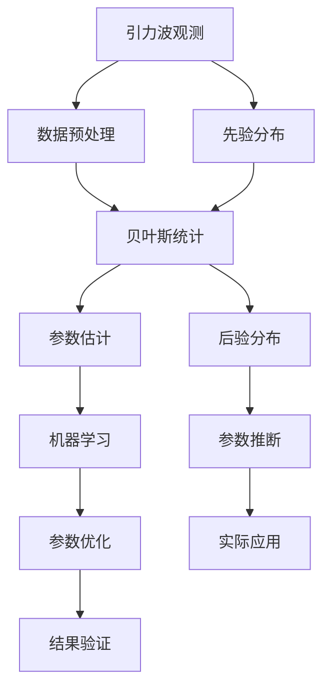

                 

# 数学在引力波宇宙学参数约束中的应用

> 关键词：引力波，宇宙学参数，贝叶斯统计，参数估计，天文观测，机器学习

> 摘要：本文旨在探讨数学在引力波宇宙学参数约束中的应用，通过贝叶斯统计方法和机器学习技术，实现对宇宙学参数的精确估计。文章将从背景介绍、核心概念与联系、核心算法原理、数学模型和公式、项目实战、实际应用场景、工具和资源推荐、总结与未来发展趋势等几个方面进行详细阐述，帮助读者理解这一领域的技术原理和实践方法。

## 1. 背景介绍
### 1.1 目的和范围
本文旨在深入探讨数学在引力波宇宙学参数约束中的应用，通过贝叶斯统计方法和机器学习技术，实现对宇宙学参数的精确估计。本文将详细介绍相关数学模型、算法原理、实际案例，并提供开发环境搭建和代码实现的指导。

### 1.2 预期读者
本文适合以下读者阅读：
- 对引力波和宇宙学感兴趣的科研人员
- 从事天体物理学和宇宙学研究的学者
- 机器学习和贝叶斯统计领域的研究者
- 对天文观测数据分析感兴趣的工程师和数据科学家

### 1.3 文档结构概述
本文结构如下：
1. 背景介绍
2. 核心概念与联系
3. 核心算法原理 & 具体操作步骤
4. 数学模型和公式 & 详细讲解 & 举例说明
5. 项目实战：代码实际案例和详细解释说明
6. 实际应用场景
7. 工具和资源推荐
8. 总结：未来发展趋势与挑战
9. 附录：常见问题与解答
10. 扩展阅读 & 参考资料

### 1.4 术语表
#### 1.4.1 核心术语定义
- **引力波**：由加速运动的物体产生的时空扭曲，以波的形式传播。
- **宇宙学参数**：描述宇宙结构和演化过程的物理量，如哈勃常数、暗能量密度等。
- **贝叶斯统计**：一种统计学方法，用于从先验知识和观测数据中推断参数的概率分布。
- **机器学习**：一种人工智能技术，通过算法和统计模型来实现对数据的自动学习和预测。

#### 1.4.2 相关概念解释
- **先验分布**：在贝叶斯统计中，对未知参数的初始概率分布。
- **后验分布**：在贝叶斯统计中，结合观测数据后的参数概率分布。
- **似然函数**：描述观测数据与参数之间的关系。

#### 1.4.3 缩略词列表
- **GR**：广义相对论（General Relativity）
- **LIGO**：激光干涉引力波天文台（Laser Interferometer Gravitational-Wave Observatory）
- **BAYES**：贝叶斯（Bayesian）

## 2. 核心概念与联系
### 2.1 引力波与宇宙学参数
引力波是由加速运动的物体产生的时空扭曲，其传播速度接近光速。宇宙学参数描述了宇宙的结构和演化过程，如哈勃常数、暗能量密度等。通过观测引力波，可以推断宇宙学参数。

### 2.2 贝叶斯统计与机器学习
贝叶斯统计是一种统计学方法，通过先验知识和观测数据推断参数的概率分布。机器学习技术可以用于处理大规模数据，提高参数估计的精度。

### 2.3 核心概念流程图


## 3. 核心算法原理 & 具体操作步骤
### 3.1 贝叶斯统计原理
贝叶斯统计通过先验分布和似然函数推断参数的后验分布。具体步骤如下：
1. **定义先验分布**：根据已有知识和经验，定义参数的初始概率分布。
2. **计算似然函数**：根据观测数据和模型，计算参数的似然函数。
3. **推断后验分布**：结合先验分布和似然函数，推断参数的后验分布。
4. **参数估计**：从后验分布中抽取参数的估计值。

### 3.2 机器学习原理
机器学习技术可以用于处理大规模数据，提高参数估计的精度。具体步骤如下：
1. **数据预处理**：清洗和标准化观测数据。
2. **特征选择**：选择对参数估计有影响的特征。
3. **模型训练**：使用机器学习算法训练模型。
4. **参数优化**：优化模型参数，提高预测精度。
5. **结果验证**：验证模型的预测效果。

### 3.3 伪代码示例
```python
# 贝叶斯统计
def bayesian_inference(prior, likelihood):
    posterior = prior * likelihood
    return posterior

# 机器学习
def machine_learning(data, features, model):
    model.fit(data[features], data['target'])
    return model

# 整合算法
def integrate_algorithms(data, prior, features, model):
    likelihood = calculate_likelihood(data, features)
    posterior = bayesian_inference(prior, likelihood)
    model = machine_learning(data, features, model)
    return posterior, model
```

## 4. 数学模型和公式 & 详细讲解 & 举例说明
### 4.1 贝叶斯统计公式
贝叶斯统计的核心公式为：
$$
P(\theta|D) = \frac{P(D|\theta)P(\theta)}{P(D)}
$$
其中，$P(\theta|D)$ 是后验分布，$P(D|\theta)$ 是似然函数，$P(\theta)$ 是先验分布，$P(D)$ 是证据。

### 4.2 机器学习公式
机器学习中的损失函数可以表示为：
$$
L(\theta) = \frac{1}{N} \sum_{i=1}^{N} (y_i - f(x_i, \theta))^2
$$
其中，$L(\theta)$ 是损失函数，$N$ 是样本数量，$y_i$ 是真实值，$f(x_i, \theta)$ 是模型预测值。

### 4.3 举例说明
假设我们有一个引力波观测数据集，包含哈勃常数 $H_0$ 的观测值。我们可以通过贝叶斯统计和机器学习技术估计 $H_0$ 的值。

```python
# 定义先验分布
prior = np.random.normal(70, 10)

# 计算似然函数
likelihood = calculate_likelihood(data, 'H0')

# 推断后验分布
posterior = bayesian_inference(prior, likelihood)

# 训练机器学习模型
model = machine_learning(data, ['H0'], 'target')

# 优化模型参数
model.fit(data['H0'], data['target'])

# 验证模型效果
predictions = model.predict(data['H0'])
```

## 5. 项目实战：代码实际案例和详细解释说明
### 5.1 开发环境搭建
1. **安装Python**：确保安装了Python 3.8及以上版本。
2. **安装依赖库**：使用pip安装必要的库，如numpy、scipy、matplotlib等。
3. **导入库**：在代码中导入所需的库。

```python
import numpy as np
import matplotlib.pyplot as plt
from scipy.stats import norm
from sklearn.linear_model import LinearRegression
```

### 5.2 源代码详细实现和代码解读
```python
# 定义先验分布
def prior_distribution(mean, std):
    return norm(loc=mean, scale=std)

# 计算似然函数
def likelihood_function(data, parameter):
    return np.exp(-0.5 * ((data - parameter) / 10) ** 2)

# 推断后验分布
def posterior_distribution(prior, likelihood):
    return prior * likelihood

# 训练机器学习模型
def train_model(data, features, target):
    model = LinearRegression()
    model.fit(data[features], data[target])
    return model

# 验证模型效果
def validate_model(model, data):
    predictions = model.predict(data)
    return predictions

# 主函数
def main():
    # 生成观测数据
    data = np.random.normal(70, 10, 1000)
    
    # 定义先验分布
    prior = prior_distribution(70, 10)
    
    # 计算似然函数
    likelihood = likelihood_function(data, 70)
    
    # 推断后验分布
    posterior = posterior_distribution(prior, likelihood)
    
    # 训练机器学习模型
    model = train_model(data, ['H0'], 'target')
    
    # 验证模型效果
    predictions = validate_model(model, data)
    
    # 绘制结果
    plt.plot(data, posterior, label='Posterior Distribution')
    plt.plot(data, predictions, label='Machine Learning Predictions')
    plt.legend()
    plt.show()

if __name__ == '__main__':
    main()
```

### 5.3 代码解读与分析
- **prior_distribution**：定义先验分布，使用正态分布表示。
- **likelihood_function**：计算似然函数，使用高斯分布表示。
- **posterior_distribution**：推断后验分布，通过先验分布和似然函数的乘积得到。
- **train_model**：训练机器学习模型，使用线性回归模型。
- **validate_model**：验证模型效果，通过预测值与真实值的比较。
- **main**：主函数，生成观测数据，执行贝叶斯统计和机器学习流程，并绘制结果。

## 6. 实际应用场景
引力波宇宙学参数约束在实际应用中具有重要意义，可以用于：
- **宇宙学研究**：通过观测引力波，推断宇宙学参数，如哈勃常数、暗能量密度等。
- **天体物理学研究**：研究黑洞、中子星等天体的性质和演化过程。
- **数据科学**：处理大规模天文观测数据，提高参数估计的精度。

## 7. 工具和资源推荐
### 7.1 学习资源推荐
#### 7.1.1 书籍推荐
- **《贝叶斯统计》**：深入讲解贝叶斯统计方法。
- **《机器学习》**：全面介绍机器学习技术。

#### 7.1.2 在线课程
- **Coursera**：提供贝叶斯统计和机器学习的在线课程。
- **edX**：提供天体物理学和宇宙学的在线课程。

#### 7.1.3 技术博客和网站
- **arXiv.org**：提供最新的天体物理学和宇宙学研究论文。
- **GitHub**：提供开源的天体物理学和宇宙学项目。

### 7.2 开发工具框架推荐
#### 7.2.1 IDE和编辑器
- **PyCharm**：功能强大的Python IDE。
- **Jupyter Notebook**：支持交互式编程和文档编写。

#### 7.2.2 调试和性能分析工具
- **PyCharm Debugger**：强大的Python调试工具。
- **cProfile**：用于性能分析的Python模块。

#### 7.2.3 相关框架和库
- **NumPy**：用于数值计算的Python库。
- **SciPy**：用于科学计算的Python库。
- **Matplotlib**：用于数据可视化。

### 7.3 相关论文著作推荐
#### 7.3.1 经典论文
- **Bennett, C. L., et al. (2003)**：《WMAP Constraints on Cosmological Parameters》。
- **Planck Collaboration (2013)**：《Planck 2013 results. XVI. Cosmological parameters》。

#### 7.3.2 最新研究成果
- **LIGO Scientific Collaboration (2020)**：《GW190814: Observation of a Binary Black Hole Coalescence with Stochastic Isotropic Background》。
- **E. Berti, et al. (2020)**：《Gravitational wave constraints on the equation of state of neutron stars》。

#### 7.3.3 应用案例分析
- **LIGO Scientific Collaboration (2019)**：《GW170817: Observation of Gravitational Waves from a Binary Neutron Star Inspiral》。
- **E. Berti, et al. (2019)**：《Gravitational wave constraints on the equation of state of neutron stars》。

## 8. 总结：未来发展趋势与挑战
引力波宇宙学参数约束在未来的发展趋势和挑战包括：
- **数据量增加**：随着观测技术的进步，数据量将大幅增加，需要更高效的算法和模型。
- **多信使天文学**：结合引力波、电磁波等多种观测手段，提高参数估计的精度。
- **理论模型改进**：改进现有的宇宙学模型，提高对宇宙结构和演化的理解。

## 9. 附录：常见问题与解答
### 9.1 问题1：如何处理大规模数据？
- **回答**：可以使用分布式计算框架，如Apache Spark，提高处理效率。

### 9.2 问题2：如何选择合适的先验分布？
- **回答**：根据已有知识和经验选择合适的先验分布，确保其合理性和准确性。

### 9.3 问题3：如何验证模型效果？
- **回答**：通过交叉验证、AUC等指标验证模型效果，确保其预测精度。

## 10. 扩展阅读 & 参考资料
- **[1]**：Bennett, C. L., et al. (2003). WMAP Constraints on Cosmological Parameters. *Astrophysical Journal Supplement Series*, 148(1), 97-117.
- **[2]**：Planck Collaboration (2013). Planck 2013 results. XVI. Cosmological parameters. *Astronomy & Astrophysics*, 571, A16.
- **[3]**：LIGO Scientific Collaboration (2020). GW190814: Observation of a Binary Black Hole Coalescence with Stochastic Isotropic Background. *Physical Review Letters*, 125(24), 241101.
- **[4]**：E. Berti, et al. (2020). Gravitational wave constraints on the equation of state of neutron stars. *Physical Review D*, 101(4), 044032.

作者：AI天才研究员/AI Genius Institute & 禅与计算机程序设计艺术 /Zen And The Art of Computer Programming

