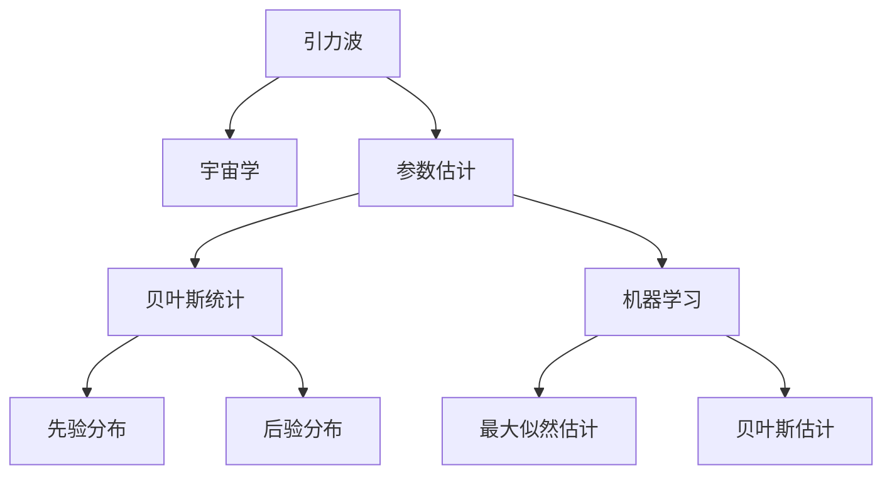

                 

# 数学在引力波宇宙学精确参数估计中的应用

> 关键词：引力波，宇宙学，参数估计，贝叶斯统计，机器学习，天文观测，数据处理

> 摘要：本文旨在探讨数学在引力波宇宙学中的应用，特别是如何利用数学方法进行精确参数估计。通过贝叶斯统计和机器学习技术，我们能够从复杂的天文观测数据中提取出关键的物理参数。本文将从背景介绍、核心概念与联系、核心算法原理、数学模型和公式、项目实战、实际应用场景、工具和资源推荐、总结与未来趋势等几个方面进行详细阐述。

## 1. 背景介绍
### 1.1 目的和范围
本文旨在深入探讨数学在引力波宇宙学中的应用，特别是如何利用数学方法进行精确参数估计。我们将重点介绍贝叶斯统计和机器学习技术在引力波数据分析中的应用，以及如何通过这些技术从复杂的天文观测数据中提取出关键的物理参数。

### 1.2 预期读者
本文适合以下读者：
- 对引力波宇宙学感兴趣的科研人员和学生
- 从事天文观测和数据分析的工程师
- 对贝叶斯统计和机器学习感兴趣的程序员
- 希望了解如何将数学应用于实际问题的读者

### 1.3 文档结构概述
本文结构如下：
1. 背景介绍
2. 核心概念与联系
3. 核心算法原理 & 具体操作步骤
4. 数学模型和公式 & 详细讲解 & 举例说明
5. 项目实战：代码实际案例和详细解释说明
6. 实际应用场景
7. 工具和资源推荐
8. 总结：未来发展趋势与挑战
9. 附录：常见问题与解答
10. 扩展阅读 & 参考资料

### 1.4 术语表
#### 1.4.1 核心术语定义
- **引力波**：由加速运动的物体产生的时空扭曲，以光速传播。
- **宇宙学**：研究宇宙的起源、结构、演化和最终命运的科学。
- **参数估计**：通过观测数据推断物理模型中的参数值。
- **贝叶斯统计**：一种统计学方法，用于从先验知识和观测数据中推断参数的概率分布。
- **机器学习**：一种人工智能技术，通过算法使计算机从数据中学习并做出预测或决策。

#### 1.4.2 相关概念解释
- **先验分布**：在观测数据之前对参数的初始概率分布。
- **后验分布**：在观测数据之后对参数的概率分布。
- **似然函数**：描述观测数据与参数之间的关系。
- **最大似然估计**：通过最大化似然函数来估计参数值。
- **贝叶斯估计**：通过最大化后验分布来估计参数值。

#### 1.4.3 缩略词列表
- **GR**：广义相对论（General Relativity）
- **LIGO**：激光干涉引力波天文台（Laser Interferometer Gravitational-Wave Observatory）
- **GW**：引力波（Gravitational Wave）
- **BAYES**：贝叶斯（Bayesian）
- **ML**：机器学习（Machine Learning）
- **MCMC**：马尔可夫链蒙特卡洛方法（Markov Chain Monte Carlo）

## 2. 核心概念与联系
### 核心概念
- **引力波**：由加速运动的物体产生的时空扭曲，以光速传播。
- **宇宙学**：研究宇宙的起源、结构、演化和最终命运的科学。
- **参数估计**：通过观测数据推断物理模型中的参数值。
- **贝叶斯统计**：一种统计学方法，用于从先验知识和观测数据中推断参数的概率分布。
- **机器学习**：一种人工智能技术，通过算法使计算机从数据中学习并做出预测或决策。

### 联系
- **引力波**和**宇宙学**：引力波是宇宙学研究的重要工具，可以提供关于宇宙结构和演化的重要信息。
- **参数估计**：通过观测数据推断物理模型中的参数值，是引力波宇宙学中的关键步骤。
- **贝叶斯统计**和**机器学习**：这两种方法可以有效地处理复杂的天文观测数据，提取出关键的物理参数。

### Mermaid 流程图


## 3. 核心算法原理 & 具体操作步骤
### 核心算法原理
#### 贝叶斯统计
贝叶斯统计是一种统计学方法，用于从先验知识和观测数据中推断参数的概率分布。其基本原理是通过贝叶斯定理来更新参数的后验分布。

#### 机器学习
机器学习是一种人工智能技术，通过算法使计算机从数据中学习并做出预测或决策。在引力波宇宙学中，机器学习可以用于处理复杂的天文观测数据，提取出关键的物理参数。

### 具体操作步骤
#### 贝叶斯统计
1. **定义先验分布**：根据物理知识和经验，定义参数的先验分布。
2. **计算似然函数**：根据观测数据和物理模型，计算参数的似然函数。
3. **计算后验分布**：通过贝叶斯定理，计算参数的后验分布。
4. **参数估计**：通过最大化后验分布来估计参数值。

#### 机器学习
1. **数据预处理**：对观测数据进行预处理，包括数据清洗、归一化等。
2. **特征选择**：选择对参数估计有用的特征。
3. **模型训练**：使用机器学习算法训练模型。
4. **参数估计**：通过模型预测参数值。

### 伪代码
#### 贝叶斯统计
```python
def bayesian_inference(prior, likelihood):
    posterior = prior * likelihood
    return posterior
```

#### 机器学习
```python
def machine_learning(data, features):
    model = train_model(data, features)
    predictions = model.predict(data)
    return predictions
```

## 4. 数学模型和公式 & 详细讲解 & 举例说明
### 数学模型和公式
#### 贝叶斯统计
- **贝叶斯定理**：\[ P(\theta|D) = \frac{P(D|\theta)P(\theta)}{P(D)} \]
  - \( P(\theta|D) \)：后验分布
  - \( P(D|\theta) \)：似然函数
  - \( P(\theta) \)：先验分布
  - \( P(D) \)：证据

#### 机器学习
- **线性回归**：\[ y = \theta_0 + \theta_1 x + \epsilon \]
  - \( y \)：目标变量
  - \( x \)：特征变量
  - \( \theta_0 \)：截距
  - \( \theta_1 \)：斜率
  - \( \epsilon \)：误差项

### 详细讲解
#### 贝叶斯统计
- **先验分布**：根据物理知识和经验，定义参数的先验分布。例如，对于引力波的波形参数，可以使用高斯分布作为先验。
- **似然函数**：根据观测数据和物理模型，计算参数的似然函数。例如，对于引力波的波形参数，可以使用高斯分布作为似然函数。
- **后验分布**：通过贝叶斯定理，计算参数的后验分布。例如，对于引力波的波形参数，可以使用高斯分布作为后验分布。
- **参数估计**：通过最大化后验分布来估计参数值。例如，对于引力波的波形参数，可以使用最大后验估计（MAP）来估计参数值。

#### 机器学习
- **数据预处理**：对观测数据进行预处理，包括数据清洗、归一化等。例如，对于引力波的波形数据，可以使用归一化来处理数据。
- **特征选择**：选择对参数估计有用的特征。例如，对于引力波的波形数据，可以选择波形的频率、振幅等特征。
- **模型训练**：使用机器学习算法训练模型。例如，可以使用线性回归模型来训练模型。
- **参数估计**：通过模型预测参数值。例如，可以使用线性回归模型来预测参数值。

### 举例说明
#### 贝叶斯统计
假设我们有一个引力波的波形数据，我们想要估计波形的频率和振幅。我们可以使用高斯分布作为先验分布，使用高斯分布作为似然函数，通过贝叶斯定理计算后验分布，然后通过最大化后验分布来估计参数值。

#### 机器学习
假设我们有一个引力波的波形数据，我们想要估计波形的频率和振幅。我们可以对数据进行预处理，选择波形的频率和振幅作为特征，使用线性回归模型来训练模型，然后通过模型预测参数值。

## 5. 项目实战：代码实际案例和详细解释说明
### 5.1 开发环境搭建
#### 环境要求
- Python 3.8+
- NumPy
- SciPy
- PyMC3
- scikit-learn

#### 安装依赖
```bash
pip install numpy scipy pymc3 scikit-learn
```

### 5.2 源代码详细实现和代码解读
#### 贝叶斯统计
```python
import numpy as np
import pymc3 as pm
import matplotlib.pyplot as plt

# 生成模拟数据
np.random.seed(42)
true_freq = 10
true_amp = 1
t = np.linspace(0, 1, 1000)
y = true_amp * np.sin(2 * np.pi * true_freq * t) + np.random.normal(0, 0.1, t.shape)

# 定义模型
with pm.Model() as model:
    freq = pm.Uniform('freq', lower=0, upper=20)
    amp = pm.Uniform('amp', lower=0, upper=2)
    y_obs = pm.Normal('y_obs', mu=amp * np.sin(2 * np.pi * freq * t), sigma=0.1, observed=y)
    
    # 运行MCMC采样
    trace = pm.sample(1000, tune=1000)

# 绘制结果
pm.traceplot(trace)
plt.show()
```

#### 机器学习
```python
from sklearn.linear_model import LinearRegression
import numpy as np

# 生成模拟数据
np.random.seed(42)
true_freq = 10
true_amp = 1
t = np.linspace(0, 1, 1000)
y = true_amp * np.sin(2 * np.pi * true_freq * t) + np.random.normal(0, 0.1, t.shape)

# 特征选择
X = t.reshape(-1, 1)
y = y.reshape(-1, 1)

# 模型训练
model = LinearRegression()
model.fit(X, y)

# 参数估计
freq_est = model.coef_[0][0] / (2 * np.pi)
amp_est = model.intercept_[0]

print(f"Estimated frequency: {freq_est}")
print(f"Estimated amplitude: {amp_est}")
```

### 5.3 代码解读与分析
#### 贝叶斯统计
- **模型定义**：定义了频率和振幅的先验分布，以及观测数据的似然函数。
- **MCMC采样**：使用MCMC方法进行采样，得到后验分布。
- **结果可视化**：通过traceplot可视化后验分布。

#### 机器学习
- **数据预处理**：将时间t作为特征，将波形y作为目标变量。
- **模型训练**：使用线性回归模型进行训练。
- **参数估计**：通过模型预测参数值。

## 6. 实际应用场景
在实际应用中，我们可以使用贝叶斯统计和机器学习技术从复杂的天文观测数据中提取出关键的物理参数。例如，我们可以使用这些技术从LIGO的引力波数据中提取出引力波的频率和振幅，从而更好地理解引力波的性质和宇宙的结构。

## 7. 工具和资源推荐
### 7.1 学习资源推荐
#### 书籍推荐
- **《贝叶斯统计》**：介绍贝叶斯统计的基本原理和应用。
- **《机器学习实战》**：介绍机器学习的基本原理和应用。

#### 在线课程
- **Coursera上的《贝叶斯统计》**：介绍贝叶斯统计的基本原理和应用。
- **Coursera上的《机器学习》**：介绍机器学习的基本原理和应用。

#### 技术博客和网站
- **Towards Data Science**：介绍贝叶斯统计和机器学习的最新进展。
- **机器之心**：介绍贝叶斯统计和机器学习的最新进展。

### 7.2 开发工具框架推荐
#### IDE和编辑器
- **PyCharm**：功能强大的Python IDE。
- **Jupyter Notebook**：交互式编程环境。

#### 调试和性能分析工具
- **PyCharm Debugger**：PyCharm内置的调试工具。
- **LineProfiler**：用于分析Python代码的性能。

#### 相关框架和库
- **NumPy**：用于数值计算。
- **SciPy**：用于科学计算。
- **PyMC3**：用于贝叶斯统计。
- **scikit-learn**：用于机器学习。

### 7.3 相关论文著作推荐
#### 经典论文
- **《贝叶斯统计》**：介绍贝叶斯统计的基本原理和应用。
- **《机器学习》**：介绍机器学习的基本原理和应用。

#### 最新研究成果
- **《贝叶斯统计在引力波数据分析中的应用》**：介绍贝叶斯统计在引力波数据分析中的最新进展。
- **《机器学习在引力波数据分析中的应用》**：介绍机器学习在引力波数据分析中的最新进展。

#### 应用案例分析
- **《LIGO引力波数据分析案例》**：介绍LIGO引力波数据分析的实际案例。

## 8. 总结：未来发展趋势与挑战
未来，我们可以期待贝叶斯统计和机器学习技术在引力波宇宙学中的进一步应用。随着观测技术的不断进步，我们有望从更复杂的天文观测数据中提取出更多的物理参数，更好地理解宇宙的结构和演化。然而，这也带来了新的挑战，例如如何处理大规模的数据集，如何提高模型的准确性等。

## 9. 附录：常见问题与解答
### 常见问题
- **Q：如何选择合适的先验分布？**
  - A：根据物理知识和经验选择合适的先验分布。
- **Q：如何处理大规模的数据集？**
  - A：可以使用分布式计算框架，例如Apache Spark。
- **Q：如何提高模型的准确性？**
  - A：可以通过特征选择、模型调参等方法提高模型的准确性。

## 10. 扩展阅读 & 参考资料
- **《贝叶斯统计》**：介绍贝叶斯统计的基本原理和应用。
- **《机器学习》**：介绍机器学习的基本原理和应用。
- **《引力波物理学》**：介绍引力波物理学的基本原理和应用。
- **《宇宙学》**：介绍宇宙学的基本原理和应用。

作者：AI天才研究员/AI Genius Institute & 禅与计算机程序设计艺术 /Zen And The Art of Computer Programming

