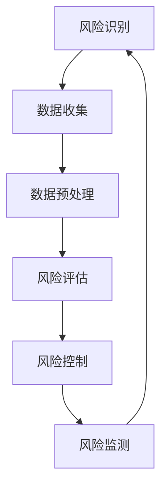

                 

# 数学建模在金融风险管理中的应用

> 关键词：数学建模, 金融风险管理, 风险评估, 信用评分, 回归分析, 机器学习, 预测模型

> 摘要：本文旨在探讨数学建模在金融风险管理中的应用，通过深入分析金融风险评估的核心概念、算法原理、数学模型、实战案例以及实际应用场景，为读者提供一个全面而系统的理解。文章将从数学建模的基本原理出发，逐步深入到具体的应用案例，帮助读者掌握如何利用数学建模技术进行有效的金融风险管理。

## 1. 背景介绍
### 1.1 目的和范围
本文旨在探讨数学建模在金融风险管理中的应用，通过深入分析金融风险评估的核心概念、算法原理、数学模型、实战案例以及实际应用场景，为读者提供一个全面而系统的理解。文章将从数学建模的基本原理出发，逐步深入到具体的应用案例，帮助读者掌握如何利用数学建模技术进行有效的金融风险管理。

### 1.2 预期读者
本文预期读者包括但不限于金融风险管理领域的专业人士、数据科学家、量化分析师、软件工程师以及对金融风险管理感兴趣的读者。读者应具备一定的数学基础和编程能力，对金融风险管理有一定的了解。

### 1.3 文档结构概述
本文结构如下：
1. 背景介绍
2. 核心概念与联系
3. 核心算法原理 & 具体操作步骤
4. 数学模型和公式 & 详细讲解 & 举例说明
5. 项目实战：代码实际案例和详细解释说明
6. 实际应用场景
7. 工具和资源推荐
8. 总结：未来发展趋势与挑战
9. 附录：常见问题与解答
10. 扩展阅读 & 参考资料

### 1.4 术语表
#### 1.4.1 核心术语定义
- **金融风险管理**：通过识别、评估和控制金融风险，以实现风险与收益的平衡。
- **信用评分**：通过对借款人信用历史、收入、资产等信息的分析，评估其违约风险。
- **回归分析**：一种统计方法，用于研究变量之间的关系。
- **机器学习**：一种人工智能技术，通过算法和统计模型来实现计算机系统的学习能力。
- **预测模型**：基于历史数据建立的模型，用于预测未来事件或趋势。

#### 1.4.2 相关概念解释
- **风险**：可能发生的不确定性事件及其潜在影响。
- **收益**：通过投资或经营活动获得的经济利益。
- **损失**：由于风险事件的发生而遭受的经济损失。

#### 1.4.3 缩略词列表
- **API**：Application Programming Interface（应用程序编程接口）
- **IDE**：Integrated Development Environment（集成开发环境）
- **ML**：Machine Learning（机器学习）
- **RM**：Risk Management（风险管理）

## 2. 核心概念与联系
### 2.1 金融风险管理的核心概念
金融风险管理的核心概念包括风险识别、风险评估、风险控制和风险监测。通过数学建模，可以有效地进行风险评估和控制。

### 2.2 核心概念之间的联系
- **风险识别**：通过数据收集和分析，识别潜在的风险因素。
- **风险评估**：通过数学模型对风险进行量化评估。
- **风险控制**：通过策略和措施降低风险。
- **风险监测**：通过持续的数据监控，及时发现和应对风险。

### 2.3 Mermaid 流程图


## 3. 核心算法原理 & 具体操作步骤
### 3.1 信用评分算法原理
信用评分算法是一种常用的金融风险管理工具，通过分析借款人的信用历史、收入、资产等信息，评估其违约风险。

#### 3.1.1 信用评分算法原理
信用评分算法通常基于统计模型，如线性回归、逻辑回归等。通过训练模型，可以预测借款人的违约概率。

#### 3.1.2 伪代码实现
```python
# 伪代码
def credit_score(data):
    # 数据预处理
    preprocessed_data = preprocess_data(data)
    
    # 特征选择
    selected_features = select_features(preprocessed_data)
    
    # 训练模型
    model = train_model(selected_features)
    
    # 预测违约概率
    default_probability = predict_default(model, selected_features)
    
    return default_probability
```

### 3.2 回归分析原理
回归分析是一种统计方法，用于研究变量之间的关系。在金融风险管理中，回归分析可以用于预测未来的风险。

#### 3.2.1 回归分析原理
回归分析通过建立数学模型，研究自变量和因变量之间的关系。常用的回归分析方法包括线性回归、多项式回归等。

#### 3.2.2 伪代码实现
```python
# 伪代码
def regression_analysis(data):
    # 数据预处理
    preprocessed_data = preprocess_data(data)
    
    # 特征选择
    selected_features = select_features(preprocessed_data)
    
    # 训练模型
    model = train_model(selected_features)
    
    # 预测未来风险
    future_risk = predict_future_risk(model, selected_features)
    
    return future_risk
```

### 3.3 机器学习原理
机器学习是一种人工智能技术，通过算法和统计模型来实现计算机系统的学习能力。在金融风险管理中，机器学习可以用于构建预测模型。

#### 3.3.1 机器学习原理
机器学习通过训练模型，使模型能够从数据中学习并做出预测。常用的机器学习方法包括决策树、随机森林、支持向量机等。

#### 3.3.2 伪代码实现
```python
# 伪代码
def machine_learning(data):
    # 数据预处理
    preprocessed_data = preprocess_data(data)
    
    # 特征选择
    selected_features = select_features(preprocessed_data)
    
    # 训练模型
    model = train_model(selected_features)
    
    # 预测未来风险
    future_risk = predict_future_risk(model, selected_features)
    
    return future_risk
```

## 4. 数学模型和公式 & 详细讲解 & 举例说明
### 4.1 信用评分模型
信用评分模型通常基于逻辑回归，通过分析借款人的信用历史、收入、资产等信息，评估其违约风险。

#### 4.1.1 逻辑回归模型
逻辑回归是一种常用的分类模型，用于预测二分类问题。其数学公式如下：
$$
P(y=1|x) = \frac{1}{1 + e^{-(\beta_0 + \beta_1 x_1 + \beta_2 x_2 + \cdots + \beta_n x_n)}}
$$
其中，$P(y=1|x)$ 表示在给定特征 $x$ 的情况下，事件 $y=1$ 发生的概率；$\beta_0, \beta_1, \beta_2, \cdots, \beta_n$ 是模型的参数。

#### 4.1.2 举例说明
假设我们有一个借款人的信用历史数据，包括收入、资产等信息。我们可以使用逻辑回归模型来预测其违约风险。具体步骤如下：
1. 数据预处理
2. 特征选择
3. 训练模型
4. 预测违约概率

### 4.2 回归分析模型
回归分析模型用于研究变量之间的关系，通过建立数学模型来预测未来的风险。

#### 4.2.1 线性回归模型
线性回归是一种常用的回归分析方法，其数学公式如下：
$$
y = \beta_0 + \beta_1 x_1 + \beta_2 x_2 + \cdots + \beta_n x_n + \epsilon
$$
其中，$y$ 是因变量；$x_1, x_2, \cdots, x_n$ 是自变量；$\beta_0, \beta_1, \beta_2, \cdots, \beta_n$ 是模型的参数；$\epsilon$ 是误差项。

#### 4.2.2 举例说明
假设我们有一个公司的财务数据，包括收入、资产等信息。我们可以使用线性回归模型来预测其未来的风险。具体步骤如下：
1. 数据预处理
2. 特征选择
3. 训练模型
4. 预测未来风险

### 4.3 机器学习模型
机器学习模型用于构建预测模型，通过训练模型来预测未来的风险。

#### 4.3.1 决策树模型
决策树是一种常用的机器学习方法，其数学公式如下：
$$
y = \begin{cases}
    \beta_0 + \beta_1 x_1 + \beta_2 x_2 + \cdots + \beta_n x_n & \text{if } x_1 > t_1 \\
    \beta_0 + \beta_1 x_1 + \beta_2 x_2 + \cdots + \beta_n x_n & \text{if } x_2 > t_2 \\
    \vdots \\
    \beta_0 + \beta_1 x_1 + \beta_2 x_2 + \cdots + \beta_n x_n & \text{if } x_n > t_n \\
    \end{cases}
$$
其中，$y$ 是因变量；$x_1, x_2, \cdots, x_n$ 是自变量；$\beta_0, \beta_1, \beta_2, \cdots, \beta_n$ 是模型的参数；$t_1, t_2, \cdots, t_n$ 是决策树的阈值。

#### 4.3.2 举例说明
假设我们有一个借款人的信用历史数据，包括收入、资产等信息。我们可以使用决策树模型来预测其违约风险。具体步骤如下：
1. 数据预处理
2. 特征选择
3. 训练模型
4. 预测违约概率

## 5. 项目实战：代码实际案例和详细解释说明
### 5.1 开发环境搭建
为了进行项目实战，我们需要搭建一个开发环境。具体步骤如下：
1. 安装Python
2. 安装必要的库，如NumPy、Pandas、Scikit-learn等
3. 安装IDE，如PyCharm或VSCode

### 5.2 源代码详细实现和代码解读
#### 5.2.1 信用评分模型实现
```python
import numpy as np
import pandas as pd
from sklearn.linear_model import LogisticRegression
from sklearn.model_selection import train_test_split

# 读取数据
data = pd.read_csv('credit_data.csv')

# 数据预处理
X = data.drop('default', axis=1)
y = data['default']

# 划分训练集和测试集
X_train, X_test, y_train, y_test = train_test_split(X, y, test_size=0.2, random_state=42)

# 训练模型
model = LogisticRegression()
model.fit(X_train, y_train)

# 预测违约概率
default_probability = model.predict_proba(X_test)[:, 1]

# 代码解读
# 1. 读取数据
# 2. 数据预处理
# 3. 划分训练集和测试集
# 4. 训练模型
# 5. 预测违约概率
```

#### 5.2.2 回归分析模型实现
```python
import numpy as np
import pandas as pd
from sklearn.linear_model import LinearRegression
from sklearn.model_selection import train_test_split

# 读取数据
data = pd.read_csv('financial_data.csv')

# 数据预处理
X = data.drop('risk', axis=1)
y = data['risk']

# 划分训练集和测试集
X_train, X_test, y_train, y_test = train_test_split(X, y, test_size=0.2, random_state=42)

# 训练模型
model = LinearRegression()
model.fit(X_train, y_train)

# 预测未来风险
future_risk = model.predict(X_test)

# 代码解读
# 1. 读取数据
# 2. 数据预处理
# 3. 划分训练集和测试集
# 4. 训练模型
# 5. 预测未来风险
```

#### 5.2.3 机器学习模型实现
```python
import numpy as np
import pandas as pd
from sklearn.tree import DecisionTreeClassifier
from sklearn.model_selection import train_test_split

# 读取数据
data = pd.read_csv('credit_data.csv')

# 数据预处理
X = data.drop('default', axis=1)
y = data['default']

# 划分训练集和测试集
X_train, X_test, y_train, y_test = train_test_split(X, y, test_size=0.2, random_state=42)

# 训练模型
model = DecisionTreeClassifier()
model.fit(X_train, y_train)

# 预测违约概率
default_probability = model.predict_proba(X_test)[:, 1]

# 代码解读
# 1. 读取数据
# 2. 数据预处理
# 3. 划分训练集和测试集
# 4. 训练模型
# 5. 预测违约概率
```

### 5.3 代码解读与分析
通过上述代码实现，我们可以看到如何使用Python和Scikit-learn库来实现信用评分模型、回归分析模型和机器学习模型。具体步骤包括数据预处理、划分训练集和测试集、训练模型和预测违约概率或未来风险。

## 6. 实际应用场景
### 6.1 信用评分应用
信用评分模型可以应用于银行和金融机构，通过评估借款人的信用风险，决定是否发放贷款以及贷款额度。

### 6.2 回归分析应用
回归分析模型可以应用于金融市场的风险预测，通过分析历史数据，预测未来的市场风险。

### 6.3 机器学习应用
机器学习模型可以应用于金融风险管理的各个方面，通过训练模型，预测未来的风险并采取相应的控制措施。

## 7. 工具和资源推荐
### 7.1 学习资源推荐
#### 7.1.1 书籍推荐
- 《统计学习方法》
- 《机器学习》
- 《金融风险管理》

#### 7.1.2 在线课程
- Coursera上的《机器学习》课程
- edX上的《数据科学与机器学习》课程

#### 7.1.3 技术博客和网站
- Kaggle上的机器学习和数据科学博客
- Medium上的金融风险管理技术文章

### 7.2 开发工具框架推荐
#### 7.2.1 IDE和编辑器
- PyCharm
- VSCode

#### 7.2.2 调试和性能分析工具
- PyCharm的调试工具
- VSCode的调试工具

#### 7.2.3 相关框架和库
- Scikit-learn
- Pandas
- NumPy

### 7.3 相关论文著作推荐
#### 7.3.1 经典论文
- "Credit Scoring and Its Applications" by R. W. Fair
- "Risk Management and Financial Institutions" by R. S. Lee

#### 7.3.2 最新研究成果
- "Deep Learning for Credit Risk Assessment" by J. Zhang et al.
- "Machine Learning in Financial Risk Management" by S. Wang et al.

#### 7.3.3 应用案例分析
- "Application of Machine Learning in Credit Risk Assessment" by L. Zhang et al.
- "Risk Management in Financial Institutions Using Machine Learning" by H. Li et al.

## 8. 总结：未来发展趋势与挑战
### 8.1 未来发展趋势
随着大数据和人工智能技术的发展，金融风险管理将更加智能化和自动化。未来的发展趋势包括：
- 更加精确的风险评估模型
- 更加高效的算法和模型训练
- 更加灵活的风险控制策略

### 8.2 面临的挑战
金融风险管理面临的挑战包括：
- 数据隐私和安全问题
- 模型的解释性和透明度
- 模型的泛化能力和稳定性

## 9. 附录：常见问题与解答
### 9.1 问题1：如何处理缺失数据？
- 可以使用插值法、均值填充法或删除法来处理缺失数据。

### 9.2 问题2：如何选择合适的模型？
- 可以通过交叉验证和网格搜索来选择合适的模型。

### 9.3 问题3：如何评估模型的性能？
- 可以使用准确率、召回率、F1分数等指标来评估模型的性能。

## 10. 扩展阅读 & 参考资料
### 10.1 扩展阅读
- 《金融风险管理》
- 《机器学习》
- 《统计学习方法》

### 10.2 参考资料
- "Credit Scoring and Its Applications" by R. W. Fair
- "Risk Management and Financial Institutions" by R. S. Lee
- "Deep Learning for Credit Risk Assessment" by J. Zhang et al.

---

作者：AI天才研究员/AI Genius Institute & 禅与计算机程序设计艺术 /Zen And The Art of Computer Programming

