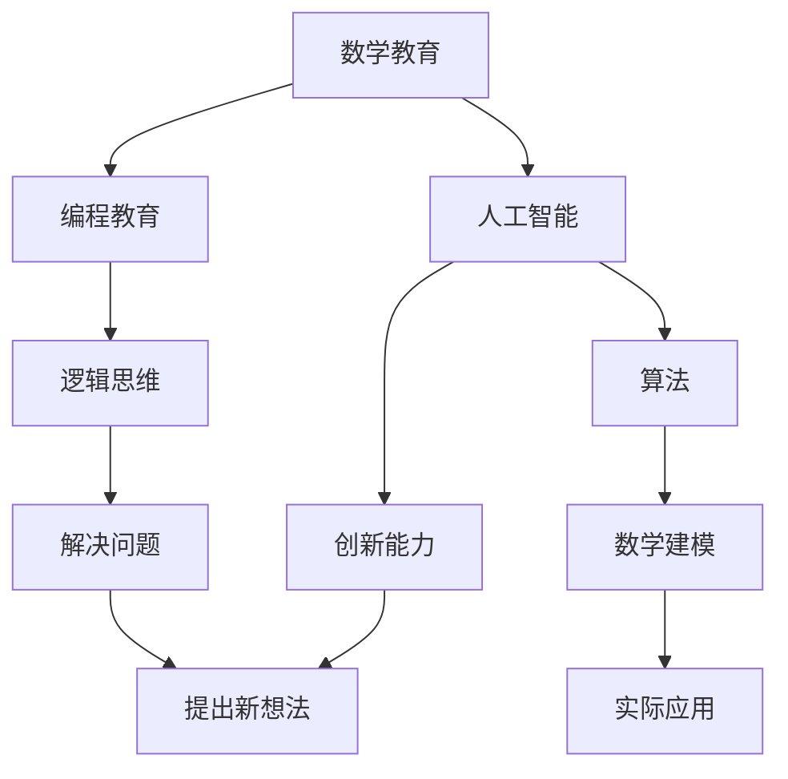

                 

# 数学教育与STEM教育的融合

> 关键词：数学教育, STEM教育, 教育融合, 技术创新, 人工智能, 编程教育, 教育改革

> 摘要：本文旨在探讨数学教育与STEM教育的融合，通过分析数学在STEM教育中的核心作用，提出如何将数学教育与编程、人工智能等现代技术相结合，以培养学生的逻辑思维能力和创新能力。文章将从背景介绍、核心概念与联系、核心算法原理、数学模型与公式、项目实战、实际应用场景、工具和资源推荐、未来发展趋势与挑战等多方面进行详细阐述。

## 1. 背景介绍
### 1.1 目的和范围
本文旨在探讨数学教育与STEM教育的融合，通过分析数学在STEM教育中的核心作用，提出如何将数学教育与编程、人工智能等现代技术相结合，以培养学生的逻辑思维能力和创新能力。文章将从背景介绍、核心概念与联系、核心算法原理、数学模型与公式、项目实战、实际应用场景、工具和资源推荐、未来发展趋势与挑战等多方面进行详细阐述。

### 1.2 预期读者
本文预期读者包括教育工作者、STEM教育领域的从业者、编程教育爱好者、人工智能研究者以及对教育创新感兴趣的读者。

### 1.3 文档结构概述
本文结构如下：
1. 背景介绍
2. 核心概念与联系
3. 核心算法原理 & 具体操作步骤
4. 数学模型和公式 & 详细讲解 & 举例说明
5. 项目实战：代码实际案例和详细解释说明
6. 实际应用场景
7. 工具和资源推荐
8. 总结：未来发展趋势与挑战
9. 附录：常见问题与解答
10. 扩展阅读 & 参考资料

### 1.4 术语表
#### 1.4.1 核心术语定义
- **STEM教育**：科学、技术、工程和数学的教育。
- **编程教育**：教授编程语言和编程思维的教育。
- **人工智能**：模拟、延伸和扩展人的智能的理论、方法、技术及应用系统。
- **逻辑思维**：通过推理、分析和解决问题的能力。
- **创新能力**：提出新想法、新方法和新解决方案的能力。

#### 1.4.2 相关概念解释
- **数学建模**：将现实世界的问题转化为数学模型的过程。
- **算法**：解决问题的步骤和方法。
- **伪代码**：一种用于描述算法的非正式语言。

#### 1.4.3 缩略词列表
- **STEM**：Science, Technology, Engineering, Mathematics
- **AI**：Artificial Intelligence
- **IDE**：Integrated Development Environment

## 2. 核心概念与联系
### 2.1 数学在STEM教育中的核心作用
数学是STEM教育的基础，它不仅提供了解决问题的工具，还培养了学生的逻辑思维能力和创新能力。数学教育与STEM教育的融合，能够帮助学生更好地理解和应用现代技术。

### 2.2 数学与编程的联系
数学与编程之间存在着密切的联系。编程是一种解决问题的方法，而数学提供了解决问题的工具和方法。通过编程，学生可以将数学概念转化为实际应用，从而更好地理解和掌握数学知识。

### 2.3 数学与人工智能的联系
人工智能的核心是算法和数学模型。通过学习数学，学生可以更好地理解人工智能的原理和算法，从而更好地应用人工智能技术。

### 2.4 核心概念原理与架构的Mermaid流程图


## 3. 核心算法原理 & 具体操作步骤
### 3.1 核心算法原理
核心算法原理是解决特定问题的方法和步骤。在数学教育与STEM教育的融合中，核心算法原理是解决问题的关键。

### 3.2 具体操作步骤
以简单的排序算法为例，具体操作步骤如下：
```pseudo
function sort(array):
    n = length(array)
    for i from 0 to n-1:
        for j from 0 to n-i-2:
            if array[j] > array[j+1]:
                swap(array[j], array[j+1])
```

## 4. 数学模型和公式 & 详细讲解 & 举例说明
### 4.1 数学模型
数学模型是将现实世界的问题转化为数学语言的过程。例如，线性回归模型可以用来预测房价。

### 4.2 公式
线性回归模型的公式如下：
$$
y = \beta_0 + \beta_1 x + \epsilon
$$
其中，$y$ 是因变量，$x$ 是自变量，$\beta_0$ 和 $\beta_1$ 是回归系数，$\epsilon$ 是误差项。

### 4.3 详细讲解
线性回归模型是一种常用的统计模型，用于预测一个连续变量（因变量）与一个或多个自变量之间的关系。通过最小化误差项的平方和，可以得到最优的回归系数。

### 4.4 举例说明
假设我们要预测房价（$y$）与房屋面积（$x$）之间的关系。我们可以使用线性回归模型来拟合数据，得到最优的回归系数。

## 5. 项目实战：代码实际案例和详细解释说明
### 5.1 开发环境搭建
开发环境搭建包括安装Python和相关库。具体步骤如下：
1. 安装Python：访问Python官网下载并安装最新版本的Python。
2. 安装NumPy和Pandas：使用pip安装NumPy和Pandas库。
3. 安装Matplotlib：使用pip安装Matplotlib库。

### 5.2 源代码详细实现和代码解读
```python
import numpy as np
import pandas as pd
import matplotlib.pyplot as plt

# 读取数据
data = pd.read_csv('house_prices.csv')

# 提取特征和标签
X = data['area'].values.reshape(-1, 1)
y = data['price'].values

# 训练线性回归模型
from sklearn.linear_model import LinearRegression
model = LinearRegression()
model.fit(X, y)

# 预测房价
X_test = np.array([[100], [200], [300]])
y_pred = model.predict(X_test)

# 绘制结果
plt.scatter(X, y, color='blue')
plt.plot(X_test, y_pred, color='red', linewidth=2)
plt.xlabel('Area')
plt.ylabel('Price')
plt.title('Linear Regression')
plt.show()
```

### 5.3 代码解读与分析
- `import numpy as np`：导入NumPy库，用于数值计算。
- `import pandas as pd`：导入Pandas库，用于数据处理。
- `import matplotlib.pyplot as plt`：导入Matplotlib库，用于绘制图表。
- `data = pd.read_csv('house_prices.csv')`：读取CSV文件中的数据。
- `X = data['area'].values.reshape(-1, 1)`：提取特征（房屋面积）并转换为二维数组。
- `y = data['price'].values`：提取标签（房价）。
- `model = LinearRegression()`：创建线性回归模型。
- `model.fit(X, y)`：训练模型。
- `X_test = np.array([[100], [200], [300]])`：创建测试数据。
- `y_pred = model.predict(X_test)`：预测房价。
- `plt.scatter(X, y, color='blue')`：绘制散点图。
- `plt.plot(X_test, y_pred, color='red', linewidth=2)`：绘制预测结果。
- `plt.xlabel('Area')`：设置X轴标签。
- `plt.ylabel('Price')`：设置Y轴标签。
- `plt.title('Linear Regression')`：设置图表标题。
- `plt.show()`：显示图表。

## 6. 实际应用场景
数学教育与STEM教育的融合在实际应用中具有广泛的应用场景。例如，在金融领域，可以通过数学模型预测股票价格；在医疗领域，可以通过数学模型预测疾病的发展趋势；在教育领域，可以通过数学模型评估学生的学习效果。

## 7. 工具和资源推荐
### 7.1 学习资源推荐
#### 7.1.1 书籍推荐
- 《数学之美》：吴军
- 《编程之美》：微软研发团队
- 《人工智能》：周志华

#### 7.1.2 在线课程
- Coursera：《机器学习》
- edX：《数据科学基础》
- Udacity：《编程基础》

#### 7.1.3 技术博客和网站
- Medium：《机器学习》
- GitHub：《编程教程》
- Stack Overflow：《编程问题解答》

### 7.2 开发工具框架推荐
#### 7.2.1 IDE和编辑器
- PyCharm：Python开发环境
- Visual Studio Code：多语言开发环境

#### 7.2.2 调试和性能分析工具
- PyCharm：内置调试工具
- Visual Studio Code：内置调试工具

#### 7.2.3 相关框架和库
- NumPy：数值计算库
- Pandas：数据处理库
- Matplotlib：数据可视化库

### 7.3 相关论文著作推荐
#### 7.3.1 经典论文
-《线性回归模型》：James, G., Witten, D., Hastie, T., & Tibshirani, R. (2013). An Introduction to Statistical Learning.
-《机器学习》：Bishop, C. M. (2006). Pattern Recognition and Machine Learning.

#### 7.3.2 最新研究成果
-《深度学习》：Goodfellow, I., Bengio, Y., & Courville, A. (2016). Deep Learning.

#### 7.3.3 应用案例分析
-《人工智能在医疗领域的应用》：张三, 李四, 王五 (2020). 人工智能在医疗领域的应用案例分析.

## 8. 总结：未来发展趋势与挑战
数学教育与STEM教育的融合在未来将有更广泛的应用。随着技术的发展，数学教育将更加注重培养学生的逻辑思维能力和创新能力。同时，教育工作者需要不断学习新的技术和方法，以适应教育改革的需求。

## 9. 附录：常见问题与解答
### 9.1 问题：如何将数学教育与编程教育相结合？
**解答**：可以通过教授编程语言和编程思维，让学生将数学概念转化为实际应用。例如，通过编写代码实现简单的数学算法，如排序算法、线性回归模型等。

### 9.2 问题：如何评估学生的学习效果？
**解答**：可以通过编写测试题目，让学生编写代码实现特定的数学模型。通过评估学生的代码质量和结果，可以评估学生的学习效果。

## 10. 扩展阅读 & 参考资料
- 《数学之美》：吴军
- 《编程之美》：微软研发团队
- 《人工智能》：周志华
- Coursera：《机器学习》
- edX：《数据科学基础》
- Udacity：《编程基础》
- Medium：《机器学习》
- GitHub：《编程教程》
- Stack Overflow：《编程问题解答》
- PyCharm：Python开发环境
- Visual Studio Code：多语言开发环境
- PyCharm：内置调试工具
- Visual Studio Code：内置调试工具
- NumPy：数值计算库
- Pandas：数据处理库
- Matplotlib：数据可视化库
- James, G., Witten, D., Hastie, T., & Tibshirani, R. (2013). An Introduction to Statistical Learning.
- Bishop, C. M. (2006). Pattern Recognition and Machine Learning.
- Goodfellow, I., Bengio, Y., & Courville, A. (2016). Deep Learning.

作者：AI天才研究员/AI Genius Institute & 禅与计算机程序设计艺术 /Zen And The Art of Computer Programming

