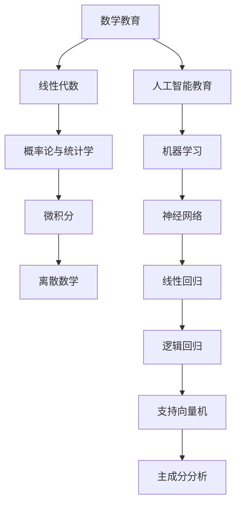

                 

# 数学教育与人工智能教育的融合

> 关键词：数学教育, 人工智能教育, 数学模型, 机器学习, 算法原理, 代码实现, 应用场景, 教育创新

> 摘要：本文旨在探讨数学教育与人工智能教育的融合，通过分析数学与人工智能之间的核心联系，介绍数学模型在人工智能中的应用，提供具体的代码实现案例，并展望未来的发展趋势与挑战。通过本文，读者将能够理解数学在人工智能中的重要性，掌握如何将数学知识应用于实际的AI项目中。

## 1. 背景介绍
### 1.1 目的和范围
本文旨在探讨数学教育与人工智能教育的融合，通过分析数学与人工智能之间的核心联系，介绍数学模型在人工智能中的应用，提供具体的代码实现案例，并展望未来的发展趋势与挑战。本文主要面向对数学和人工智能感兴趣的教育工作者、研究人员和学生，旨在帮助他们更好地理解数学在人工智能中的重要性，并掌握如何将数学知识应用于实际的AI项目中。

### 1.2 预期读者
- 教育工作者：希望了解如何将数学教育与人工智能教育相结合，提高学生的综合能力。
- 研究人员：希望深入了解数学模型在人工智能中的应用，为研究工作提供参考。
- 学生：希望掌握数学在人工智能中的应用，提高自己的编程和算法能力。

### 1.3 文档结构概述
本文将分为以下几个部分：
1. 背景介绍
2. 核心概念与联系
3. 核心算法原理 & 具体操作步骤
4. 数学模型和公式 & 详细讲解 & 举例说明
5. 项目实战：代码实际案例和详细解释说明
6. 实际应用场景
7. 工具和资源推荐
8. 总结：未来发展趋势与挑战
9. 附录：常见问题与解答
10. 扩展阅读 & 参考资料

### 1.4 术语表
#### 1.4.1 核心术语定义
- **数学模型**：一种通过数学语言描述现实世界现象的方法。
- **机器学习**：一种人工智能技术，通过算法使计算机从数据中学习，从而实现特定任务。
- **算法**：解决特定问题的一系列步骤。
- **向量**：具有大小和方向的一组数值。
- **矩阵**：由数字排列成的矩形阵列。
- **梯度下降**：一种优化算法，用于最小化损失函数。
- **线性回归**：一种统计方法，用于预测连续变量。

#### 1.4.2 相关概念解释
- **向量空间**：一组向量的集合，满足一定的数学运算规则。
- **特征向量**：线性变换后保持方向不变的向量。
- **特征值**：与特征向量对应的标量。
- **线性代数**：研究向量空间及其线性变换的数学分支。
- **概率论**：研究随机现象的数学分支。
- **统计学**：研究数据收集、分析、解释和展示的科学。

#### 1.4.3 缩略词列表
- **AI**：人工智能
- **ML**：机器学习
- **NN**：神经网络
- **LR**：线性回归
- **GD**：梯度下降
- **PCA**：主成分分析

## 2. 核心概念与联系
### 2.1 数学与人工智能的关系
数学是人工智能的基础，许多人工智能算法和模型都依赖于数学理论。数学为人工智能提供了理论基础，帮助我们理解和构建复杂的算法。数学模型在人工智能中的应用包括但不限于：
- **线性代数**：用于处理多维数据和矩阵运算。
- **概率论与统计学**：用于处理不确定性问题和数据分布。
- **微积分**：用于优化算法和梯度计算。
- **离散数学**：用于处理离散数据和逻辑推理。

### 2.2 数学模型在人工智能中的应用
数学模型在人工智能中的应用非常广泛，主要包括：
- **线性回归**：用于预测连续变量。
- **逻辑回归**：用于分类问题。
- **支持向量机**：用于分类和回归问题。
- **神经网络**：用于复杂模式识别和预测。
- **主成分分析**：用于数据降维和特征提取。

### 2.3 Mermaid 流程图


## 3. 核心算法原理 & 具体操作步骤
### 3.1 线性回归算法原理
线性回归是一种用于预测连续变量的统计方法。其基本原理是通过最小化预测值与实际值之间的差异来找到最佳拟合直线。

#### 伪代码
```python
def linear_regression(X, y):
    # X: 特征矩阵
    # y: 目标向量
    n = len(y)
    X_t = X.T
    X_t_X = np.dot(X_t, X)
    X_t_y = np.dot(X_t, y)
    w = np.dot(np.linalg.inv(X_t_X), X_t_y)
    return w
```

### 3.2 梯度下降算法原理
梯度下降是一种优化算法，用于最小化损失函数。其基本原理是沿着损失函数的梯度方向更新参数，直到达到最小值。

#### 伪代码
```python
def gradient_descent(X, y, w, learning_rate, num_iterations):
    n = len(y)
    for i in range(num_iterations):
        y_pred = np.dot(X, w)
        error = y_pred - y
        gradient = (1/n) * np.dot(X.T, error)
        w -= learning_rate * gradient
    return w
```

## 4. 数学模型和公式 & 详细讲解 & 举例说明
### 4.1 线性回归公式
线性回归的基本公式为：
$$
y = \beta_0 + \beta_1 x_1 + \beta_2 x_2 + \cdots + \beta_n x_n
$$
其中，$\beta_0, \beta_1, \beta_2, \ldots, \beta_n$ 是模型参数，$x_1, x_2, \ldots, x_n$ 是特征变量。

### 4.2 梯度下降公式
梯度下降的基本公式为：
$$
w_{t+1} = w_t - \alpha \nabla J(w_t)
$$
其中，$w_t$ 是当前参数，$\alpha$ 是学习率，$\nabla J(w_t)$ 是损失函数的梯度。

### 4.3 举例说明
假设我们有一个简单的线性回归问题，数据集如下：
| x | y |
|---|---|
| 1 | 2 |
| 2 | 3 |
| 3 | 4 |
| 4 | 5 |

我们可以使用线性回归模型来拟合这些数据。首先，我们需要将数据转换为矩阵形式：
$$
X = \begin{bmatrix}
1 & 1 \\
1 & 2 \\
1 & 3 \\
1 & 4
\end{bmatrix}, \quad y = \begin{bmatrix}
2 \\
3 \\
4 \\
5
\end{bmatrix}
$$

然后，我们可以使用线性回归算法来计算参数：
$$
w = (X^T X)^{-1} X^T y
$$

具体计算过程如下：
$$
X^T X = \begin{bmatrix}
4 & 10 \\
10 & 30
\end{bmatrix}, \quad (X^T X)^{-1} = \begin{bmatrix}
15 & -5 \\
-5 & 1
\end{bmatrix}
$$

$$
X^T y = \begin{bmatrix}
20 \\
50
\end{bmatrix}
$$

$$
w = \begin{bmatrix}
15 & -5 \\
-5 & 1
\end{bmatrix} \begin{bmatrix}
20 \\
50
\end{bmatrix} = \begin{bmatrix}
100 \\
10
\end{bmatrix}
$$

因此，线性回归模型为：
$$
y = 10 + 10x
$$

## 5. 项目实战：代码实际案例和详细解释说明
### 5.1 开发环境搭建
我们将使用Python进行代码实现，需要安装以下库：
- `numpy`：用于数值计算。
- `matplotlib`：用于数据可视化。

安装命令如下：
```bash
pip install numpy matplotlib
```

### 5.2 源代码详细实现和代码解读
```python
import numpy as np
import matplotlib.pyplot as plt

# 数据集
X = np.array([[1], [2], [3], [4]])
y = np.array([2, 3, 4, 5])

# 线性回归
def linear_regression(X, y):
    X_t = X.T
    X_t_X = np.dot(X_t, X)
    X_t_y = np.dot(X_t, y)
    w = np.dot(np.linalg.inv(X_t_X), X_t_y)
    return w

# 梯度下降
def gradient_descent(X, y, w, learning_rate, num_iterations):
    n = len(y)
    for i in range(num_iterations):
        y_pred = np.dot(X, w)
        error = y_pred - y
        gradient = (1/n) * np.dot(X.T, error)
        w -= learning_rate * gradient
    return w

# 训练线性回归模型
w = linear_regression(X, y)
print("线性回归参数：", w)

# 训练梯度下降模型
w_gd = np.zeros(2)
w_gd = gradient_descent(X, y, w_gd, 0.01, 1000)
print("梯度下降参数：", w_gd)

# 可视化结果
plt.scatter(X, y, color='blue')
plt.plot(X, np.dot(X, w), color='red', label='线性回归')
plt.plot(X, np.dot(X, w_gd), color='green', label='梯度下降')
plt.legend()
plt.show()
```

### 5.3 代码解读与分析
- **数据集**：我们使用了一个简单的线性数据集。
- **线性回归**：通过计算参数 $w$ 来拟合数据。
- **梯度下降**：通过迭代更新参数 $w$ 来最小化损失函数。
- **可视化**：使用 `matplotlib` 可视化线性回归和梯度下降的结果。

## 6. 实际应用场景
数学教育与人工智能教育的融合在许多实际应用场景中都有广泛的应用，例如：
- **金融预测**：通过线性回归和梯度下降预测股票价格。
- **医疗诊断**：通过支持向量机和神经网络进行疾病诊断。
- **图像识别**：通过卷积神经网络进行图像分类。
- **自然语言处理**：通过循环神经网络进行文本生成。

## 7. 工具和资源推荐
### 7.1 学习资源推荐
#### 7.1.1 书籍推荐
- **《数学之美》**：吴军著，深入浅出地介绍了数学在人工智能中的应用。
- **《统计学习方法》**：李航著，详细介绍了机器学习的理论和方法。
- **《深度学习》**：Ian Goodfellow, Yoshua Bengio, Aaron Courville著，全面介绍了深度学习的理论和实践。

#### 7.1.2 在线课程
- **Coursera**：提供多个关于机器学习和深度学习的课程。
- **edX**：提供多个关于数据科学和人工智能的课程。
- **Udacity**：提供多个关于机器学习和深度学习的课程。

#### 7.1.3 技术博客和网站
- **Towards Data Science**：提供多个关于机器学习和数据科学的文章。
- **Medium**：提供多个关于人工智能的文章。
- **Kaggle**：提供多个关于机器学习和数据科学的比赛和教程。

### 7.2 开发工具框架推荐
#### 7.2.1 IDE和编辑器
- **PyCharm**：功能强大的Python IDE。
- **Jupyter Notebook**：交互式的Python开发环境。
- **VS Code**：轻量级的代码编辑器，支持多种编程语言。

#### 7.2.2 调试和性能分析工具
- **PyCharm Debugger**：PyCharm自带的调试工具。
- **Pylint**：静态代码分析工具。
- **Line_profiler**：Python性能分析工具。

#### 7.2.3 相关框架和库
- **NumPy**：用于数值计算的Python库。
- **Pandas**：用于数据处理的Python库。
- **Scikit-learn**：用于机器学习的Python库。
- **TensorFlow**：用于深度学习的Python库。
- **Keras**：用于深度学习的高级API。

### 7.3 相关论文著作推荐
#### 7.3.1 经典论文
- **《A Mathematical Theory of Communication》**：Claude Shannon著，信息论的经典论文。
- **《The Elements of Statistical Learning》**：Trevor Hastie, Robert Tibshirani, Jerome Friedman著，统计学习的经典著作。

#### 7.3.2 最新研究成果
- **《Attention is All You Need》**：Ashish Vaswani, Noam Shazeer, Niki Parmar等著，Transformer模型的经典论文。
- **《Generative Adversarial Nets》**：Ian Goodfellow, Jean Pouget-Abadie, Mehdi Mirza等著，GAN模型的经典论文。

#### 7.3.3 应用案例分析
- **《Deep Learning in Neural Networks: An Overview》**：Geoffrey Hinton, Yoshua Bengio, Yann LeCun等著，深度学习在神经网络中的应用案例分析。
- **《Machine Learning: A Probabilistic Perspective》**：Kevin P. Murphy著，机器学习在概率论中的应用案例分析。

## 8. 总结：未来发展趋势与挑战
数学教育与人工智能教育的融合将推动人工智能技术的发展，未来的发展趋势包括：
- **更复杂的数学模型**：更复杂的数学模型将被应用于更复杂的任务。
- **更高效的算法**：更高效的算法将被开发出来，提高计算效率。
- **更广泛的应用场景**：更广泛的应用场景将被开发出来，提高人工智能的普及率。

未来的发展挑战包括：
- **数据隐私**：如何保护数据隐私，避免数据泄露。
- **算法公平性**：如何确保算法的公平性，避免算法歧视。
- **计算资源**：如何提高计算资源的利用率，降低计算成本。

## 9. 附录：常见问题与解答
### 9.1 问题：如何选择合适的数学模型？
**解答**：选择合适的数学模型需要考虑任务的复杂性、数据的规模和质量等因素。通常，线性模型适用于简单任务，非线性模型适用于复杂任务。

### 9.2 问题：如何提高算法的效率？
**解答**：提高算法的效率可以通过优化算法、减少计算量和提高硬件性能等方式实现。

### 9.3 问题：如何保护数据隐私？
**解答**：保护数据隐私可以通过加密、匿名化和差分隐私等方式实现。

## 10. 扩展阅读 & 参考资料
- **《数学之美》**：吴军著
- **《统计学习方法》**：李航著
- **《深度学习》**：Ian Goodfellow, Yoshua Bengio, Aaron Courville著
- **《A Mathematical Theory of Communication》**：Claude Shannon著
- **《The Elements of Statistical Learning》**：Trevor Hastie, Robert Tibshirani, Jerome Friedman著
- **《Attention is All You Need》**：Ashish Vaswani, Noam Shazeer, Niki Parmar等著
- **《Generative Adversarial Nets》**：Ian Goodfellow, Jean Pouget-Abadie, Mehdi Mirza等著
- **《Deep Learning in Neural Networks: An Overview》**：Geoffrey Hinton, Yoshua Bengio, Yann LeCun等著
- **《Machine Learning: A Probabilistic Perspective》**：Kevin P. Murphy著

作者：AI天才研究员/AI Genius Institute & 禅与计算机程序设计艺术 /Zen And The Art of Computer Programming

