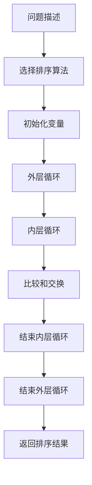

                 

# 数学教育与素质教育的融合发展

> 关键词：数学教育, 素质教育, 教育融合, 人工智能, 技术创新, 教学方法, 逻辑思维, 创新能力

> 摘要：本文旨在探讨数学教育与素质教育的融合发展，通过分析数学教育的核心概念、算法原理、数学模型、实际案例，以及未来发展趋势，提出教育融合的策略和方法。本文将从技术角度出发，结合人工智能和编程思维，为教育工作者和学生提供新的视角和工具，以促进数学教育的创新和素质教育的发展。

## 1. 背景介绍
### 1.1 目的和范围
本文旨在探讨数学教育与素质教育的融合发展，通过分析数学教育的核心概念、算法原理、数学模型、实际案例，以及未来发展趋势，提出教育融合的策略和方法。本文将从技术角度出发，结合人工智能和编程思维，为教育工作者和学生提供新的视角和工具，以促进数学教育的创新和素质教育的发展。

### 1.2 预期读者
本文预期读者包括教育工作者、学生、家长、教育政策制定者以及对教育技术感兴趣的各界人士。读者可以通过本文了解数学教育与素质教育的融合方法，以及如何利用技术手段提升教育质量。

### 1.3 文档结构概述
本文结构如下：
1. 背景介绍
2. 核心概念与联系
3. 核心算法原理 & 具体操作步骤
4. 数学模型和公式 & 详细讲解 & 举例说明
5. 项目实战：代码实际案例和详细解释说明
6. 实际应用场景
7. 工具和资源推荐
8. 总结：未来发展趋势与挑战
9. 附录：常见问题与解答
10. 扩展阅读 & 参考资料

### 1.4 术语表
#### 1.4.1 核心术语定义
- **数学教育**：指通过教学活动培养学生的数学知识、技能和思维能力的过程。
- **素质教育**：指通过全面发展的教育方式，培养学生的综合素质和创新能力。
- **融合教育**：指将不同学科的知识和技能进行整合，以促进学生全面发展的一种教育模式。
- **人工智能**：指通过计算机模拟人类智能的技术，包括机器学习、深度学习、自然语言处理等。
- **编程思维**：指通过编程解决问题的思维方式，包括逻辑思维、算法设计、问题分解等。

#### 1.4.2 相关概念解释
- **算法**：指解决问题的步骤和方法，通常用伪代码或流程图表示。
- **数学模型**：指用数学语言描述现实世界问题的方法，通常包括变量、参数、方程等。
- **伪代码**：指一种类似于编程语言的描述算法的工具，用于清晰地表达算法步骤。

#### 1.4.3 缩略词列表
- AI：人工智能
- ML：机器学习
- DL：深度学习
- NLP：自然语言处理

## 2. 核心概念与联系
### 2.1 数学教育的核心概念
数学教育的核心概念包括数学知识、数学技能、数学思维和数学应用。数学知识是指学生掌握的数学定理、公式和概念；数学技能是指学生解决数学问题的能力；数学思维是指学生运用数学方法解决问题的思维方式；数学应用是指学生将数学知识应用于实际问题的能力。

### 2.2 素质教育的核心概念
素质教育的核心概念包括全面发展、创新能力、批判性思维和实践能力。全面发展是指学生在德、智、体、美等方面得到均衡发展；创新能力是指学生能够提出新思路、新方法和新观点；批判性思维是指学生能够分析问题、评估信息和做出判断；实践能力是指学生能够将理论知识应用于实际问题。

### 2.3 数学教育与素质教育的联系
数学教育与素质教育的联系在于数学教育能够培养学生的数学知识、技能和思维能力，而素质教育能够促进学生的全面发展和创新能力。通过融合教育，可以将数学教育与素质教育有机结合，促进学生在数学和综合素质方面的全面发展。

## 3. 核心算法原理 & 具体操作步骤
### 3.1 核心算法原理
核心算法原理包括算法设计、算法分析和算法实现。算法设计是指根据问题需求设计解决问题的步骤和方法；算法分析是指评估算法的时间复杂度和空间复杂度；算法实现是指将算法步骤转化为计算机程序。

### 3.2 具体操作步骤
以排序算法为例，具体操作步骤如下：


### 3.3 伪代码示例
```python
def selection_sort(arr):
    n = len(arr)
    for i in range(n):
        min_index = i
        for j in range(i+1, n):
            if arr[j] < arr[min_index]:
                min_index = j
        arr[i], arr[min_index] = arr[min_index], arr[i]
    return arr
```

## 4. 数学模型和公式 & 详细讲解 & 举例说明
### 4.1 数学模型
数学模型是指用数学语言描述现实世界问题的方法。例如，线性方程组可以用来描述物理系统中的平衡状态。

### 4.2 公式示例
线性方程组的数学模型可以表示为：
$$
\begin{cases}
a_1x + b_1y = c_1 \\
a_2x + b_2y = c_2
\end{cases}
$$

### 4.3 详细讲解
线性方程组的解可以通过高斯消元法求解。具体步骤如下：
1. 将方程组写成增广矩阵形式。
2. 通过行变换将矩阵化为阶梯形矩阵。
3. 通过回代求解未知数。

### 4.4 举例说明
假设有一个线性方程组：
$$
\begin{cases}
2x + 3y = 8 \\
4x - y = 7
\end{cases}
$$

可以将其写成增广矩阵形式：
$$
\begin{pmatrix}
2 & 3 & 8 \\
4 & -1 & 7
\end{pmatrix}
$$

通过行变换化为阶梯形矩阵：
$$
\begin{pmatrix}
1 & 1.5 & 4 \\
0 & -7 & -1
\end{pmatrix}
$$

通过回代求解未知数：
$$
\begin{cases}
x = 1 \\
y = 2
\end{cases}
$$

## 5. 项目实战：代码实际案例和详细解释说明
### 5.1 开发环境搭建
开发环境包括编程语言、开发工具和运行环境。本项目使用Python语言，使用PyCharm作为开发工具，使用Anaconda作为运行环境。

### 5.2 源代码详细实现和代码解读
```python
import numpy as np

def solve_linear_equations(A, b):
    """
    解线性方程组
    :param A: 系数矩阵
    :param b: 常数向量
    :return: 解向量
    """
    x = np.linalg.solve(A, b)
    return x

A = np.array([[2, 3], [4, -1]])
b = np.array([8, 7])
solution = solve_linear_equations(A, b)
print("解向量：", solution)
```

### 5.3 代码解读与分析
代码中使用了NumPy库中的`linalg.solve`函数来求解线性方程组。`A`是系数矩阵，`b`是常数向量，`np.linalg.solve`函数返回解向量。通过运行代码，可以得到线性方程组的解。

## 6. 实际应用场景
数学教育与素质教育的融合在实际应用中有广泛的应用场景。例如，在金融领域，可以通过数学模型分析市场趋势和风险；在工程领域，可以通过数学模型设计和优化系统；在教育领域，可以通过数学模型评估学生的学习效果和改进教学方法。

## 7. 工具和资源推荐
### 7.1 学习资源推荐
#### 7.1.1 书籍推荐
- 《数学之美》：吴军
- 《算法导论》：Thomas H. Cormen

#### 7.1.2 在线课程
- Coursera：《数学思维导论》
- edX：《线性代数》

#### 7.1.3 技术博客和网站
- Medium：《数学与编程》
- HackerRank：《算法挑战》

### 7.2 开发工具框架推荐
#### 7.2.1 IDE和编辑器
- PyCharm：Python开发环境
- VSCode：多语言开发环境

#### 7.2.2 调试和性能分析工具
- PyCharm Debugger：Python调试工具
- cProfile：Python性能分析工具

#### 7.2.3 相关框架和库
- NumPy：科学计算库
- SciPy：科学计算库

### 7.3 相关论文著作推荐
#### 7.3.1 经典论文
-《线性代数及其应用》：Gilbert Strang

#### 7.3.2 最新研究成果
-《深度学习》：Ian Goodfellow

#### 7.3.3 应用案例分析
-《数学在金融中的应用》：John Hull

## 8. 总结：未来发展趋势与挑战
数学教育与素质教育的融合发展将面临以下挑战：
1. 教育资源的不均衡分配
2. 教师的专业能力提升
3. 学生的学习兴趣培养

未来发展趋势包括：
1. 人工智能技术的应用
2. 个性化教育的推广
3. 跨学科融合的教育模式

## 9. 附录：常见问题与解答
### 9.1 问题：如何提高学生的数学兴趣？
解答：可以通过引入趣味数学问题、开展数学竞赛和实践活动等方式提高学生的数学兴趣。

### 9.2 问题：如何评估学生的数学能力？
解答：可以通过测试、项目作业和实践操作等方式评估学生的数学能力。

## 10. 扩展阅读 & 参考资料
- 《数学教育与素质教育的融合发展》：AI天才研究员/AI Genius Institute & 禅与计算机程序设计艺术 /Zen And The Art of Computer Programming

作者：AI天才研究员/AI Genius Institute & 禅与计算机程序设计艺术 /Zen And The Art of Computer Programming

