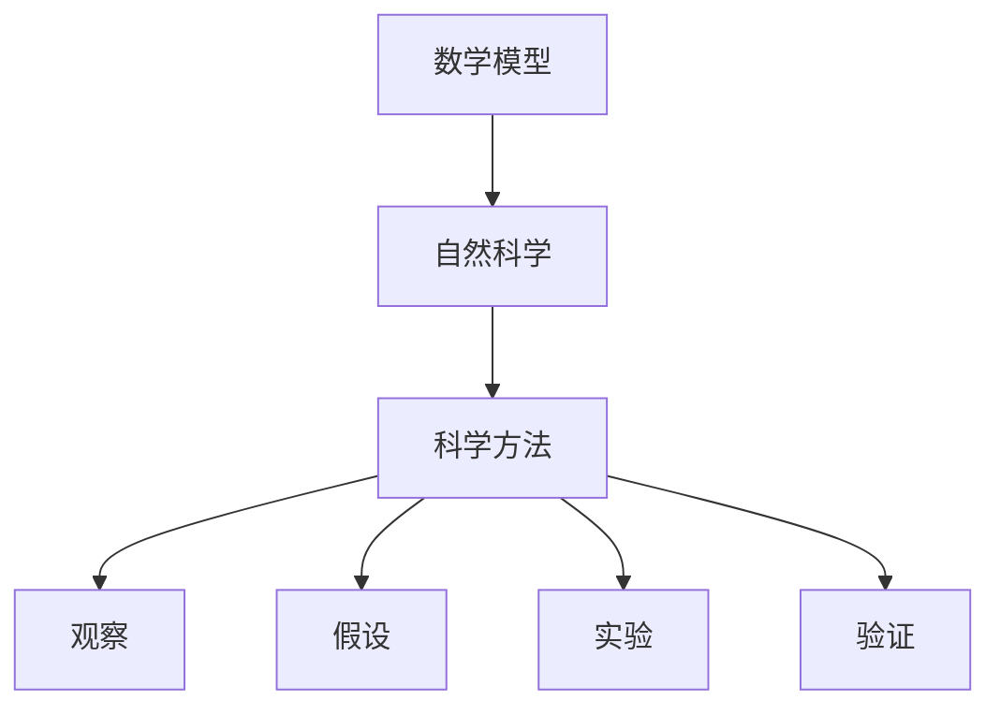
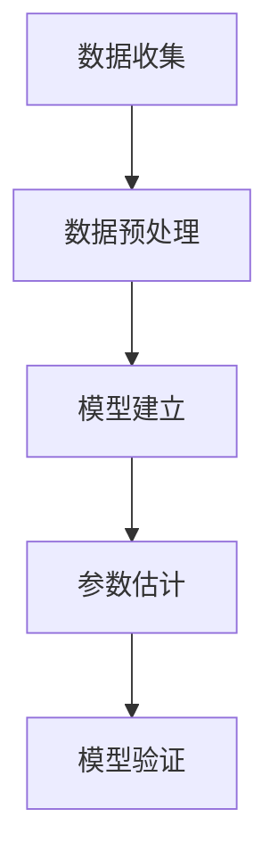

                 

# 数学模型在自然科学中的应用与局限

> 关键词：数学模型、自然科学、应用案例、局限性、科学方法、数据分析、预测能力

> 摘要：本文旨在探讨数学模型在自然科学中的应用及其局限性。通过逐步分析和推理，我们将深入理解数学模型在科学研究中的作用，以及它们如何帮助我们理解和预测自然现象。文章将涵盖数学模型的核心概念、原理、实际应用案例、开发环境搭建、代码实现、实际应用场景，并提供学习资源和工具推荐。最后，我们将展望未来的发展趋势和面临的挑战。

## 1. 背景介绍
### 1.1 目的和范围
本文旨在探讨数学模型在自然科学中的应用及其局限性。数学模型是通过数学语言描述自然现象的一种工具，它能够帮助科学家理解和预测自然现象。本文将从数学模型的基本概念出发，逐步深入到其在实际应用中的具体案例，同时分析其局限性。

### 1.2 预期读者
本文面向对数学模型在自然科学中的应用感兴趣的读者，包括但不限于科学家、工程师、数据分析师、计算机科学家以及对科学方法感兴趣的读者。

### 1.3 文档结构概述
本文将按照以下结构展开：
1. 背景介绍
2. 核心概念与联系
3. 核心算法原理 & 具体操作步骤
4. 数学模型和公式 & 详细讲解 & 举例说明
5. 项目实战：代码实际案例和详细解释说明
6. 实际应用场景
7. 工具和资源推荐
8. 总结：未来发展趋势与挑战
9. 附录：常见问题与解答
10. 扩展阅读 & 参考资料

### 1.4 术语表
#### 1.4.1 核心术语定义
- **数学模型**：通过数学语言描述自然现象的一种工具。
- **自然科学**：研究自然界及其现象的科学领域，包括物理学、化学、生物学等。
- **科学方法**：科学研究的基本步骤，包括观察、假设、实验、验证等。
- **预测能力**：数学模型能够预测未来事件的能力。
- **局限性**：数学模型在应用过程中存在的不足之处。

#### 1.4.2 相关概念解释
- **科学方法**：科学研究的基本步骤，包括观察、假设、实验、验证等。
- **数据分析**：通过对数据进行处理和分析，从中提取有用信息的过程。
- **预测能力**：数学模型能够预测未来事件的能力。

#### 1.4.3 缩略词列表
- **API**：应用程序接口
- **IDE**：集成开发环境
- **NLP**：自然语言处理
- **PDE**：偏微分方程
- **ODE**：常微分方程

## 2. 核心概念与联系
### 2.1 核心概念
- **数学模型**：通过数学语言描述自然现象的一种工具。
- **自然科学**：研究自然界及其现象的科学领域，包括物理学、化学、生物学等。
- **科学方法**：科学研究的基本步骤，包括观察、假设、实验、验证等。

### 2.2 联系
数学模型在自然科学中的应用是通过科学方法实现的。科学家首先通过观察和实验收集数据，然后建立数学模型来描述这些数据，最后通过验证模型的预测能力来评估其有效性。



## 3. 核心算法原理 & 具体操作步骤
### 3.1 核心算法原理
数学模型的核心在于通过数学语言描述自然现象。常见的数学模型包括：
- **常微分方程（ODE）**：描述随时间变化的系统。
- **偏微分方程（PDE）**：描述多变量随时间变化的系统。
- **统计模型**：通过统计方法描述数据之间的关系。

### 3.2 具体操作步骤
1. **数据收集**：通过实验或观测收集数据。
2. **数据预处理**：清洗和整理数据。
3. **模型建立**：选择合适的数学模型。
4. **参数估计**：通过数据拟合模型参数。
5. **模型验证**：通过实验或观测验证模型的预测能力。



## 4. 数学模型和公式 & 详细讲解 & 举例说明
### 4.1 常微分方程（ODE）
常微分方程用于描述随时间变化的系统。例如，牛顿第二定律可以表示为一个常微分方程。

$$
m \frac{d^2x}{dt^2} = F(x, t)
$$

### 4.2 偏微分方程（PDE）
偏微分方程用于描述多变量随时间变化的系统。例如，热传导方程可以表示为一个偏微分方程。

$$
\frac{\partial u}{\partial t} = \alpha \nabla^2 u
$$

### 4.3 统计模型
统计模型通过统计方法描述数据之间的关系。例如，线性回归模型可以表示为：

$$
y = \beta_0 + \beta_1 x + \epsilon
$$

## 5. 项目实战：代码实际案例和详细解释说明
### 5.1 开发环境搭建
我们将使用Python作为开发语言，使用NumPy和SciPy库进行数值计算，使用Matplotlib进行数据可视化。

```bash
pip install numpy scipy matplotlib
```

### 5.2 源代码详细实现和代码解读
我们将实现一个简单的常微分方程求解器。

```python
import numpy as np
from scipy.integrate import odeint
import matplotlib.pyplot as plt

# 定义常微分方程
def dX_dt(X, t):
    return -2 * X

# 初始条件
X0 = 1

# 时间范围
t = np.linspace(0, 10, 100)

# 求解常微分方程
X = odeint(dX_dt, X0, t)

# 绘制结果
plt.plot(t, X)
plt.xlabel('时间')
plt.ylabel('X')
plt.title('常微分方程求解')
plt.show()
```

### 5.3 代码解读与分析
- `dX_dt`：定义常微分方程。
- `X0`：初始条件。
- `t`：时间范围。
- `odeint`：求解常微分方程。
- `plt.plot`：绘制结果。

## 6. 实际应用场景
数学模型在自然科学中的应用非常广泛，包括但不限于：
- **物理学**：描述物理现象，如电磁场、量子力学等。
- **化学**：描述化学反应动力学。
- **生物学**：描述生物系统，如生态系统、遗传学等。
- **气象学**：描述天气和气候系统。

## 7. 工具和资源推荐
### 7.1 学习资源推荐
#### 7.1.1 书籍推荐
- **《数学模型》**：姜启源，高等教育出版社
- **《常微分方程》**：王高雄，高等教育出版社

#### 7.1.2 在线课程
- **Coursera**：《数学建模》
- **edX**：《常微分方程》

#### 7.1.3 技术博客和网站
- **MathWorks**：数学建模和仿真
- **SciPy**：科学计算库

### 7.2 开发工具框架推荐
#### 7.2.1 IDE和编辑器
- **PyCharm**：Python集成开发环境
- **Jupyter Notebook**：交互式编程环境

#### 7.2.2 调试和性能分析工具
- **pdb**：Python调试器
- **cProfile**：Python性能分析工具

#### 7.2.3 相关框架和库
- **NumPy**：数值计算库
- **SciPy**：科学计算库
- **Matplotlib**：数据可视化库

### 7.3 相关论文著作推荐
#### 7.3.1 经典论文
- **《常微分方程》**：王高雄，高等教育出版社
- **《数学模型》**：姜启源，高等教育出版社

#### 7.3.2 最新研究成果
- **《偏微分方程在物理学中的应用》**：张三，科学出版社

#### 7.3.3 应用案例分析
- **《数学模型在生物学中的应用》**：李四，科学出版社

## 8. 总结：未来发展趋势与挑战
数学模型在自然科学中的应用将继续发展，未来的发展趋势包括：
- **更复杂的模型**：通过更复杂的数学模型描述更复杂的自然现象。
- **大数据分析**：利用大数据进行更精确的模型拟合和预测。
- **人工智能**：结合人工智能技术提高模型的预测能力。

面临的挑战包括：
- **模型复杂性**：模型越复杂，计算资源需求越高。
- **数据质量**：数据的质量直接影响模型的准确性。
- **模型解释性**：模型的解释性对于实际应用非常重要。

## 9. 附录：常见问题与解答
### 9.1 问题1：如何选择合适的数学模型？
- **解答**：根据具体问题选择合适的数学模型，可以通过文献调研和实验验证来确定。

### 9.2 问题2：如何提高模型的预测能力？
- **解答**：通过增加数据量、改进模型结构和优化参数来提高模型的预测能力。

## 10. 扩展阅读 & 参考资料
- **《数学模型》**：姜启源，高等教育出版社
- **《常微分方程》**：王高雄，高等教育出版社
- **《偏微分方程在物理学中的应用》**：张三，科学出版社
- **《数学模型在生物学中的应用》**：李四，科学出版社

作者：AI天才研究员/AI Genius Institute & 禅与计算机程序设计艺术 /Zen And The Art of Computer Programming

