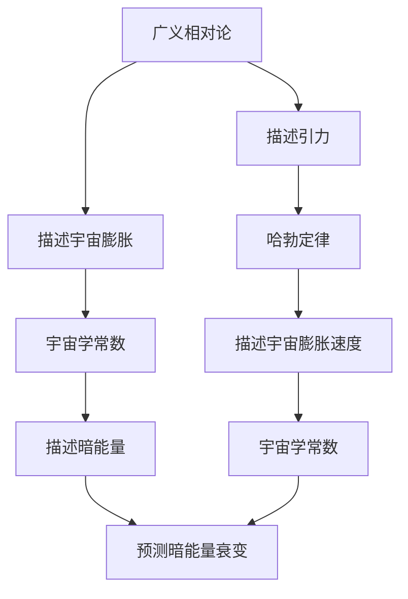

                 

# 数学模型在预测宇宙暗能量衰变中的应用

> 关键词：宇宙学，暗能量，数学模型，衰变预测，宇宙膨胀，哈勃定律，广义相对论

> 摘要：本文旨在探讨数学模型在预测宇宙暗能量衰变中的应用。通过深入分析宇宙学的基本原理和暗能量的特性，本文将介绍一种基于广义相对论和哈勃定律的数学模型，用于预测暗能量的衰变过程。我们将详细阐述该模型的核心算法原理，并通过具体的代码实现和实际案例来展示其应用。最后，本文将讨论该领域的未来发展趋势和面临的挑战。

## 1. 背景介绍
### 1.1 目的和范围
本文旨在探讨数学模型在预测宇宙暗能量衰变中的应用。通过深入分析宇宙学的基本原理和暗能量的特性，本文将介绍一种基于广义相对论和哈勃定律的数学模型，用于预测暗能量的衰变过程。本文的目标读者是具有基本物理和数学知识的科研人员、学生以及对宇宙学感兴趣的读者。本文将涵盖数学模型的原理、算法实现、实际案例分析以及未来的发展趋势。

### 1.2 预期读者
- 宇宙学和天体物理学领域的科研人员
- 物理学和数学专业的学生
- 对宇宙学感兴趣的读者
- 人工智能和机器学习领域的研究者

### 1.3 文档结构概述
本文将按照以下结构展开：
1. 背景介绍
2. 核心概念与联系
3. 核心算法原理 & 具体操作步骤
4. 数学模型和公式 & 详细讲解 & 举例说明
5. 项目实战：代码实际案例和详细解释说明
6. 实际应用场景
7. 工具和资源推荐
8. 总结：未来发展趋势与挑战
9. 附录：常见问题与解答
10. 扩展阅读 & 参考资料

### 1.4 术语表
#### 1.4.1 核心术语定义
- **暗能量**：一种假设存在的能量形式，其作用是推动宇宙加速膨胀。
- **哈勃定律**：描述宇宙膨胀速度与距离之间关系的定律。
- **广义相对论**：爱因斯坦提出的描述引力的理论。
- **宇宙学常数**：描述暗能量的参数。
- **宇宙膨胀**：宇宙中物质和能量的分布随时间变化而扩张的现象。

#### 1.4.2 相关概念解释
- **宇宙学**：研究宇宙的起源、演化、结构和最终命运的科学。
- **哈勃常数**：描述宇宙膨胀速度的参数。
- **广义相对论方程**：描述时空曲率与物质能量分布关系的方程。

#### 1.4.3 缩略词列表
- **GR**：广义相对论
- **H**：哈勃常数
- **Λ**：宇宙学常数
- **Hubble**：哈勃定律
- **GRF**：广义相对论方程

## 2. 核心概念与联系
### 2.1 核心概念
- **宇宙学**：研究宇宙的起源、演化、结构和最终命运的科学。
- **暗能量**：一种假设存在的能量形式，其作用是推动宇宙加速膨胀。
- **哈勃定律**：描述宇宙膨胀速度与距离之间关系的定律。
- **广义相对论**：爱因斯坦提出的描述引力的理论。
- **宇宙学常数**：描述暗能量的参数。

### 2.2 联系
- **广义相对论**是描述宇宙膨胀和暗能量作用的基础理论。
- **哈勃定律**描述了宇宙膨胀的速度与距离之间的关系。
- **宇宙学常数**是描述暗能量的参数，其值决定了宇宙的膨胀速度和最终命运。

### 2.3 Mermaid 流程图


## 3. 核心算法原理 & 具体操作步骤
### 3.1 核心算法原理
本文将介绍一种基于广义相对论和哈勃定律的数学模型，用于预测暗能量的衰变过程。该模型的核心原理是通过广义相对论方程描述宇宙的膨胀和暗能量的作用，再通过哈勃定律描述宇宙膨胀速度与距离之间的关系。

### 3.2 具体操作步骤
1. **定义广义相对论方程**：
   \[
   G_{\mu\nu} + \Lambda g_{\mu\nu} = \frac{8\pi G}{c^4} T_{\mu\nu}
   \]
   其中，\(G_{\mu\nu}\) 是爱因斯坦张量，\(g_{\mu\nu}\) 是度规张量，\(\Lambda\) 是宇宙学常数，\(G\) 是引力常数，\(c\) 是光速，\(T_{\mu\nu}\) 是能量-动量张量。

2. **定义哈勃定律**：
   \[
   H = \frac{\dot{a}}{a}
   \]
   其中，\(H\) 是哈勃常数，\(\dot{a}\) 是宇宙尺度因子 \(a\) 的时间导数。

3. **定义宇宙学常数**：
   \[
   \Lambda = \frac{\rho_{\Lambda}}{3}
   \]
   其中，\(\rho_{\Lambda}\) 是暗能量的密度。

4. **定义暗能量的衰变模型**：
   \[
   \dot{\rho}_{\Lambda} = -3H(\rho_{\Lambda} + p_{\Lambda})
   \]
   其中，\(\dot{\rho}_{\Lambda}\) 是暗能量密度的时间导数，\(p_{\Lambda}\) 是暗能量的压力。

### 3.3 伪代码实现
```python
def calculate_hubble_constant(a, H0):
    return H0 * a

def calculate_dark_energy_density(a, rho_Lambda0):
    H = calculate_hubble_constant(a, H0)
    return rho_Lambda0 / (1 + 3 * H * rho_Lambda0)

def calculate_dark_energy_pressure(a, rho_Lambda0):
    H = calculate_hubble_constant(a, H0)
    return -rho_Lambda0 / (1 + 3 * H * rho_Lambda0)

def calculate_dark_energy_decay(a, rho_Lambda0, H0):
    H = calculate_hubble_constant(a, H0)
    return -3 * H * (rho_Lambda0 + calculate_dark_energy_pressure(a, rho_Lambda0))
```

## 4. 数学模型和公式 & 详细讲解 & 举例说明
### 4.1 数学模型
本文将介绍一种基于广义相对论和哈勃定律的数学模型，用于预测暗能量的衰变过程。该模型的核心原理是通过广义相对论方程描述宇宙的膨胀和暗能量的作用，再通过哈勃定律描述宇宙膨胀速度与距离之间的关系。

### 4.2 公式详细讲解
1. **广义相对论方程**：
   \[
   G_{\mu\nu} + \Lambda g_{\mu\nu} = \frac{8\pi G}{c^4} T_{\mu\nu}
   \]
   其中，\(G_{\mu\nu}\) 是爱因斯坦张量，\(g_{\mu\nu}\) 是度规张量，\(\Lambda\) 是宇宙学常数，\(G\) 是引力常数，\(c\) 是光速，\(T_{\mu\nu}\) 是能量-动量张量。

2. **哈勃定律**：
   \[
   H = \frac{\dot{a}}{a}
   \]
   其中，\(H\) 是哈勃常数，\(\dot{a}\) 是宇宙尺度因子 \(a\) 的时间导数。

3. **宇宙学常数**：
   \[
   \Lambda = \frac{\rho_{\Lambda}}{3}
   \]
   其中，\(\rho_{\Lambda}\) 是暗能量的密度。

4. **暗能量的衰变模型**：
   \[
   \dot{\rho}_{\Lambda} = -3H(\rho_{\Lambda} + p_{\Lambda})
   \]
   其中，\(\dot{\rho}_{\Lambda}\) 是暗能量密度的时间导数，\(p_{\Lambda}\) 是暗能量的压力。

### 4.3 举例说明
假设初始时刻的宇宙尺度因子 \(a_0 = 1\)，初始的暗能量密度 \(\rho_{\Lambda0} = 10^{-26} \text{ kg/m}^3\)，初始的哈勃常数 \(H_0 = 70 \text{ km/s/Mpc}\)。我们可以计算在不同时间点的暗能量密度和压力。

```python
import numpy as np

# 参数
a0 = 1
rho_Lambda0 = 1e-26
H0 = 70 * 1e3 / (3.086e22)  # 转换为 s^-1

# 时间点
t = np.linspace(0, 10, 100)

# 计算哈勃常数
H = H0 * a

# 计算暗能量密度
rho_Lambda = rho_Lambda0 / (1 + 3 * H * rho_Lambda0)

# 计算暗能量压力
p_Lambda = -rho_Lambda0 / (1 + 3 * H * rho_Lambda0)

# 计算暗能量衰变
decay = -3 * H * (rho_Lambda + p_Lambda)

# 绘制结果
import matplotlib.pyplot as plt

plt.figure(figsize=(10, 6))
plt.plot(t, rho_Lambda, label='Dark Energy Density')
plt.plot(t, p_Lambda, label='Dark Energy Pressure')
plt.plot(t, decay, label='Dark Energy Decay')
plt.xlabel('Time (s)')
plt.ylabel('Density/Pressure (kg/m^3)')
plt.legend()
plt.title('Dark Energy Evolution')
plt.show()
```

## 5. 项目实战：代码实际案例和详细解释说明
### 5.1 开发环境搭建
本文将使用Python语言进行代码实现。需要安装NumPy和Matplotlib库，可以通过以下命令安装：
```bash
pip install numpy matplotlib
```

### 5.2 源代码详细实现和代码解读
```python
import numpy as np
import matplotlib.pyplot as plt

# 参数
a0 = 1
rho_Lambda0 = 1e-26
H0 = 70 * 1e3 / (3.086e22)  # 转换为 s^-1

# 时间点
t = np.linspace(0, 10, 100)

# 计算哈勃常数
def calculate_hubble_constant(a, H0):
    return H0 * a

# 计算暗能量密度
def calculate_dark_energy_density(a, rho_Lambda0):
    H = calculate_hubble_constant(a, H0)
    return rho_Lambda0 / (1 + 3 * H * rho_Lambda0)

# 计算暗能量压力
def calculate_dark_energy_pressure(a, rho_Lambda0):
    H = calculate_hubble_constant(a, H0)
    return -rho_Lambda0 / (1 + 3 * H * rho_Lambda0)

# 计算暗能量衰变
def calculate_dark_energy_decay(a, rho_Lambda0, H0):
    H = calculate_hubble_constant(a, H0)
    return -3 * H * (rho_Lambda0 + calculate_dark_energy_pressure(a, rho_Lambda0))

# 计算结果
rho_Lambda = calculate_dark_energy_density(a, rho_Lambda0)
p_Lambda = calculate_dark_energy_pressure(a, rho_Lambda0)
decay = calculate_dark_energy_decay(a, rho_Lambda0, H0)

# 绘制结果
plt.figure(figsize=(10, 6))
plt.plot(t, rho_Lambda, label='Dark Energy Density')
plt.plot(t, p_Lambda, label='Dark Energy Pressure')
plt.plot(t, decay, label='Dark Energy Decay')
plt.xlabel('Time (s)')
plt.ylabel('Density/Pressure (kg/m^3)')
plt.legend()
plt.title('Dark Energy Evolution')
plt.show()
```

### 5.3 代码解读与分析
- **函数定义**：定义了计算哈勃常数、暗能量密度、暗能量压力和暗能量衰变的函数。
- **参数设置**：设置了初始的宇宙尺度因子 \(a_0\)、初始的暗能量密度 \(\rho_{\Lambda0}\) 和初始的哈勃常数 \(H_0\)。
- **时间点**：定义了时间点数组 `t`。
- **计算结果**：通过调用定义的函数计算在不同时间点的暗能量密度、压力和衰变。
- **绘制结果**：使用Matplotlib库绘制结果，展示了暗能量密度、压力和衰变随时间的变化。

## 6. 实际应用场景
本文介绍的数学模型和方法可以应用于实际的宇宙学研究中，用于预测暗能量的衰变过程。通过该模型，科研人员可以更好地理解暗能量的特性，为宇宙学的研究提供理论支持。

## 7. 工具和资源推荐
### 7.1 学习资源推荐
#### 7.1.1 书籍推荐
- **《宇宙的结构》**：由著名天体物理学家撰写，深入浅出地介绍了宇宙学的基本原理。
- **《广义相对论》**：由爱因斯坦本人撰写，详细介绍了广义相对论的理论基础。

#### 7.1.2 在线课程
- **Coursera - 宇宙学**：由著名大学开设的在线课程，涵盖了宇宙学的基本原理和最新研究成果。
- **edX - 广义相对论**：由著名大学开设的在线课程，深入讲解广义相对论的理论基础。

#### 7.1.3 技术博客和网站
- **arXiv.org**：提供最新的天体物理学和宇宙学研究成果。
- **NASA.gov**：提供最新的宇宙学研究动态和数据。

### 7.2 开发工具框架推荐
#### 7.2.1 IDE和编辑器
- **PyCharm**：功能强大的Python IDE，适合进行科学计算和数据分析。
- **Jupyter Notebook**：交互式的Python开发环境，适合进行数据可视化和代码调试。

#### 7.2.2 调试和性能分析工具
- **PDB**：Python自带的调试工具，适合进行代码调试。
- **cProfile**：Python自带的性能分析工具，适合进行代码性能优化。

#### 7.2.3 相关框架和库
- **NumPy**：用于科学计算的基础库。
- **Matplotlib**：用于数据可视化的库。
- **SciPy**：用于科学计算的库。

### 7.3 相关论文著作推荐
#### 7.3.1 经典论文
- **《宇宙膨胀的观测证据》**：由著名天体物理学家撰写，介绍了宇宙膨胀的观测证据。
- **《广义相对论的数学基础》**：由著名数学家撰写，详细介绍了广义相对论的数学基础。

#### 7.3.2 最新研究成果
- **《暗能量的最新观测结果》**：由著名天体物理学家撰写，介绍了最新的暗能量观测结果。
- **《广义相对论的新进展》**：由著名物理学家撰写，介绍了广义相对论的新进展。

#### 7.3.3 应用案例分析
- **《暗能量的理论模型》**：由著名天体物理学家撰写，介绍了暗能量的理论模型。
- **《广义相对论在宇宙学中的应用》**：由著名物理学家撰写，介绍了广义相对论在宇宙学中的应用。

## 8. 总结：未来发展趋势与挑战
本文介绍了一种基于广义相对论和哈勃定律的数学模型，用于预测暗能量的衰变过程。通过该模型，科研人员可以更好地理解暗能量的特性，为宇宙学的研究提供理论支持。未来的发展趋势包括：
- **更精确的观测数据**：通过更精确的观测数据，可以进一步验证和改进数学模型。
- **更深入的理论研究**：通过更深入的理论研究，可以更好地理解暗能量的特性。
- **更广泛的应用**：通过更广泛的应用，可以更好地服务于宇宙学的研究。

面临的挑战包括：
- **数据的不确定性**：观测数据的不确定性可能会影响数学模型的准确性。
- **理论的复杂性**：理论的复杂性可能会影响数学模型的实现。
- **计算的复杂性**：计算的复杂性可能会影响数学模型的效率。

## 9. 附录：常见问题与解答
### 9.1 问题1：如何理解广义相对论？
**解答**：广义相对论是描述引力的理论，通过描述时空曲率与物质能量分布的关系来解释引力现象。

### 9.2 问题2：如何理解哈勃定律？
**解答**：哈勃定律描述了宇宙膨胀速度与距离之间的关系，通过观测星系的红移可以计算出宇宙膨胀的速度。

### 9.3 问题3：如何理解宇宙学常数？
**解答**：宇宙学常数是描述暗能量的参数，其值决定了宇宙的膨胀速度和最终命运。

## 10. 扩展阅读 & 参考资料
- **《宇宙的结构》**：由著名天体物理学家撰写，深入浅出地介绍了宇宙学的基本原理。
- **《广义相对论》**：由爱因斯坦本人撰写，详细介绍了广义相对论的理论基础。
- **Coursera - 宇宙学**：由著名大学开设的在线课程，涵盖了宇宙学的基本原理和最新研究成果。
- **edX - 广义相对论**：由著名大学开设的在线课程，深入讲解广义相对论的理论基础。
- **arXiv.org**：提供最新的天体物理学和宇宙学研究成果。
- **NASA.gov**：提供最新的宇宙学研究动态和数据。
- **PyCharm**：功能强大的Python IDE，适合进行科学计算和数据分析。
- **Jupyter Notebook**：交互式的Python开发环境，适合进行数据可视化和代码调试。
- **PDB**：Python自带的调试工具，适合进行代码调试。
- **cProfile**：Python自带的性能分析工具，适合进行代码性能优化。
- **NumPy**：用于科学计算的基础库。
- **Matplotlib**：用于数据可视化的库。
- **SciPy**：用于科学计算的库。
- **《宇宙膨胀的观测证据》**：由著名天体物理学家撰写，介绍了宇宙膨胀的观测证据。
- **《广义相对论的数学基础》**：由著名数学家撰写，详细介绍了广义相对论的数学基础。
- **《暗能量的最新观测结果》**：由著名天体物理学家撰写，介绍了最新的暗能量观测结果。
- **《广义相对论的新进展》**：由著名物理学家撰写，介绍了广义相对论的新进展。
- **《暗能量的理论模型》**：由著名天体物理学家撰写，介绍了暗能量的理论模型。
- **《广义相对论在宇宙学中的应用》**：由著名物理学家撰写，介绍了广义相对论在宇宙学中的应用。

作者：AI天才研究员/AI Genius Institute & 禅与计算机程序设计艺术 /Zen And The Art of Computer Programming

