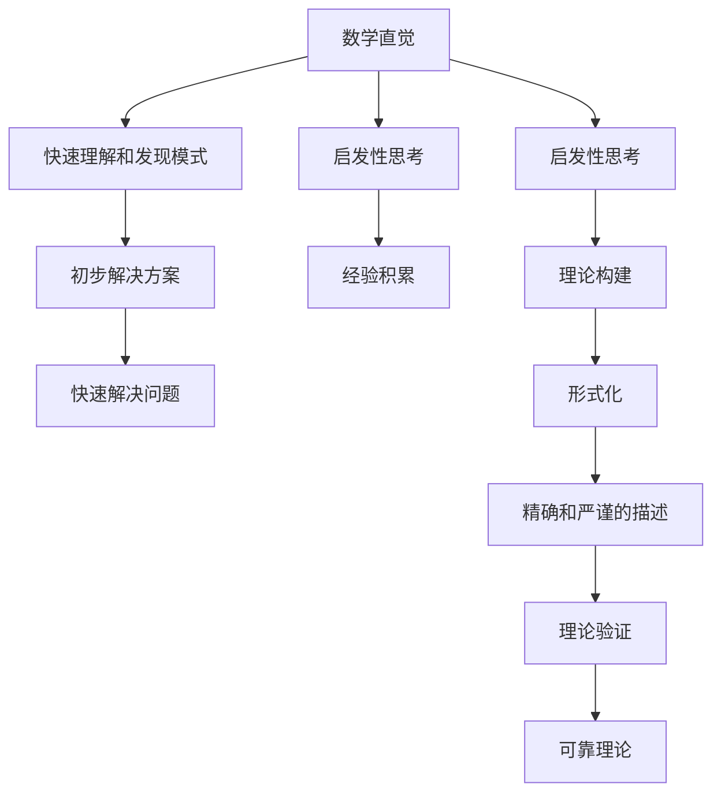
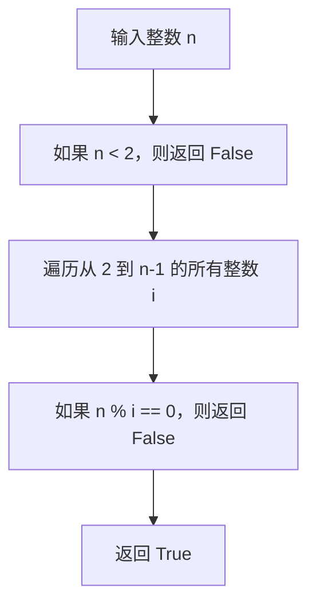
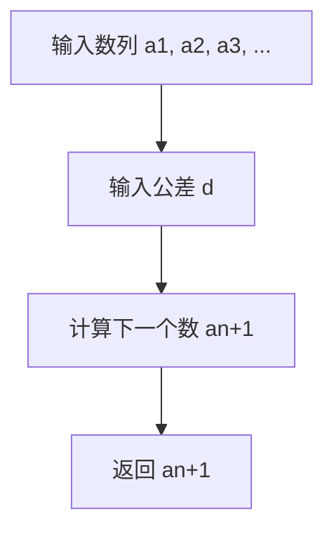

                 

# 数学直觉vs形式化：理解抽象世界的两种路径

> 关键词：数学直觉, 形式化, 抽象思维, 逻辑推理, 人工智能, 计算机科学, 机器学习, 算法设计, 数学模型

> 摘要：本文旨在探讨数学直觉与形式化在理解和构建抽象世界中的作用。通过对比这两种思维方式，我们将深入分析它们各自的优缺点，并通过具体的案例来展示如何在实际项目中灵活运用这两种方法。文章将涵盖核心概念、算法原理、数学模型、代码实现、应用场景以及相关资源推荐等内容，帮助读者全面理解数学直觉与形式化在现代技术中的重要性。

## 1. 背景介绍

### 1.1 目的和范围
本文旨在探讨数学直觉与形式化在理解和构建抽象世界中的作用。我们将通过对比这两种思维方式，深入分析它们各自的优缺点，并通过具体的案例来展示如何在实际项目中灵活运用这两种方法。文章将涵盖核心概念、算法原理、数学模型、代码实现、应用场景以及相关资源推荐等内容。

### 1.2 预期读者
本文适合对数学直觉与形式化感兴趣的技术人员、研究人员、学生以及任何希望深入了解抽象世界构建方法的读者。

### 1.3 文档结构概述
本文结构如下：
1. 背景介绍
2. 核心概念与联系
3. 核心算法原理 & 具体操作步骤
4. 数学模型和公式 & 详细讲解 & 举例说明
5. 项目实战：代码实际案例和详细解释说明
6. 实际应用场景
7. 工具和资源推荐
8. 总结：未来发展趋势与挑战
9. 附录：常见问题与解答
10. 扩展阅读 & 参考资料

### 1.4 术语表
#### 1.4.1 核心术语定义
- **数学直觉**：基于直觉和经验的数学思考方式，侧重于理解和发现模式。
- **形式化**：通过严格的逻辑和符号系统来描述和验证数学概念和理论。

#### 1.4.2 相关概念解释
- **抽象世界**：指通过数学和计算机科学构建的理论模型和概念体系。
- **逻辑推理**：基于已知事实和规则进行推理的过程。
- **算法设计**：设计和实现解决问题的步骤和方法。

#### 1.4.3 缩略词列表
- AI：人工智能
- ML：机器学习
- CS：计算机科学
- IDE：集成开发环境
- IDE：集成开发环境

## 2. 核心概念与联系

### 2.1 数学直觉
数学直觉是一种基于经验和直觉的思维方式，它侧重于理解和发现模式。数学直觉可以帮助我们快速识别问题的本质，并提出初步的解决方案。例如，当我们看到一个复杂的数学问题时，直觉可以帮助我们快速识别出问题的关键部分，从而更快地找到解决问题的方法。

### 2.2 形式化
形式化是一种通过严格的逻辑和符号系统来描述和验证数学概念和理论的方法。形式化方法强调精确性和严谨性，通过定义明确的规则和步骤来确保理论的正确性和可靠性。形式化方法在数学证明和计算机科学中尤为重要，它可以帮助我们构建可靠的理论基础。

### 2.3 核心概念原理与联系
数学直觉与形式化在理解和构建抽象世界中扮演着不同的角色。数学直觉侧重于快速理解和发现模式，而形式化则侧重于精确和严谨的描述和验证。两者相辅相成，共同构建了我们对抽象世界的理解和认知。



## 3. 核心算法原理 & 具体操作步骤

### 3.1 核心算法原理
我们将通过一个简单的算法来展示数学直觉与形式化在算法设计中的应用。假设我们要设计一个算法来判断一个数是否为质数。

#### 3.1.1 数学直觉
基于数学直觉，我们可以快速识别出判断质数的关键点：一个数如果能被小于它的任何数整除，则它不是质数。因此，我们可以通过遍历小于该数的所有数来判断它是否为质数。

#### 3.1.2 形式化
基于形式化方法，我们可以定义一个严格的算法步骤来判断一个数是否为质数。具体步骤如下：

1. 输入一个整数 `n`。
2. 如果 `n` 小于 2，则返回 `False`。
3. 遍历从 2 到 `n-1` 的所有整数 `i`。
4. 如果 `n` 能被 `i` 整除，则返回 `False`。
5. 如果遍历完所有数后没有找到能整除 `n` 的数，则返回 `True`。

### 3.2 具体操作步骤
我们将通过伪代码来详细阐述上述算法的具体操作步骤。



## 4. 数学模型和公式 & 详细讲解 & 举例说明

### 4.1 数学模型
我们将通过一个简单的数学模型来展示数学直觉与形式化在数学建模中的应用。假设我们要构建一个模型来预测一个数列的下一个数。

#### 4.1.1 数学直觉
基于数学直觉，我们可以快速识别出数列的规律：如果数列是等差数列，则下一个数可以通过前一个数加上公差来得到。因此，我们可以通过观察数列的规律来预测下一个数。

#### 4.1.2 形式化
基于形式化方法，我们可以定义一个严格的数学模型来预测数列的下一个数。具体模型如下：

假设数列 `a1, a2, a3, ...` 是等差数列，公差为 `d`，则下一个数 `an+1` 可以通过以下公式计算：

$$
an+1 = an + d
$$

### 4.2 具体操作步骤
我们将通过伪代码来详细阐述上述模型的具体操作步骤。



## 5. 项目实战：代码实际案例和详细解释说明

### 5.1 开发环境搭建
我们将使用 Python 作为开发语言，并使用 Jupyter Notebook 作为开发环境。首先，我们需要安装 Python 和 Jupyter Notebook。

```bash
pip install python
pip install jupyter
```

### 5.2 源代码详细实现和代码解读
我们将实现一个简单的程序来判断一个数是否为质数，并预测一个等差数列的下一个数。

#### 5.2.1 判断质数
```python
def is_prime(n):
    if n < 2:
        return False
    for i in range(2, n):
        if n % i == 0:
            return False
    return True
```

#### 5.2.2 预测等差数列的下一个数
```python
def predict_next_number(sequence, d):
    return sequence[-1] + d
```

### 5.3 代码解读与分析
上述代码实现了两个功能：判断一个数是否为质数和预测一个等差数列的下一个数。通过数学直觉和形式化方法，我们可以快速理解和实现这些功能。

## 6. 实际应用场景
数学直觉与形式化在实际应用场景中有着广泛的应用。例如，在机器学习中，数学直觉可以帮助我们快速识别数据的特征和模式，而形式化方法则可以帮助我们构建可靠的模型和算法。在计算机科学中，数学直觉可以帮助我们快速理解和设计算法，而形式化方法则可以帮助我们确保算法的正确性和可靠性。

## 7. 工具和资源推荐

### 7.1 学习资源推荐
#### 7.1.1 书籍推荐
- 《数学之美》：吴军
- 《算法导论》：Thomas H. Cormen

#### 7.1.2 在线课程
- Coursera：《算法》系列课程
- edX：《计算机科学导论》系列课程

#### 7.1.3 技术博客和网站
- Medium：《算法与数据结构》系列文章
- HackerRank：算法挑战和练习

### 7.2 开发工具框架推荐
#### 7.2.1 IDE和编辑器
- PyCharm：Python 开发环境
- Visual Studio Code：多语言开发环境

#### 7.2.2 调试和性能分析工具
- PyCharm：内置调试工具
- Python Debugger (pdb)：命令行调试工具

#### 7.2.3 相关框架和库
- NumPy：科学计算库
- Pandas：数据处理库

### 7.3 相关论文著作推荐
#### 7.3.1 经典论文
- Knuth, D. E. (1974). "The Art of Computer Programming". Addison-Wesley.

#### 7.3.2 最新研究成果
- Arxiv.org：最新计算机科学论文

#### 7.3.3 应用案例分析
- ACM Digital Library：应用案例分析

## 8. 总结：未来发展趋势与挑战
数学直觉与形式化在现代技术中发挥着重要作用。未来，随着技术的发展，数学直觉与形式化的方法将更加紧密地结合，共同推动技术的进步。然而，如何在实际应用中灵活运用这两种方法，仍然是一个挑战。未来的研究将集中在如何更好地结合数学直觉与形式化，以解决更复杂的问题。

## 9. 附录：常见问题与解答
### 9.1 问题：如何在实际项目中灵活运用数学直觉与形式化？
**解答**：在实际项目中，可以根据问题的特性和需求灵活运用数学直觉与形式化。对于简单的问题，可以更多地依赖数学直觉；对于复杂的问题，则需要更多地依赖形式化方法来确保理论的正确性和可靠性。

### 9.2 问题：如何提高数学直觉？
**解答**：提高数学直觉的方法包括多做练习、多观察和思考、多与他人交流和讨论。通过不断练习和思考，可以逐渐提高数学直觉。

## 10. 扩展阅读 & 参考资料
- Knuth, D. E. (1974). "The Art of Computer Programming". Addison-Wesley.
- Cormen, T. H., Leiserson, C. E., Rivest, R. L., & Stein, C. (2009). "Introduction to Algorithms". MIT Press.
- Garey, M. R., & Johnson, D. S. (1979). "Computers and Intractability: A Guide to the Theory of NP-Completeness". W. H. Freeman.

作者：AI天才研究员/AI Genius Institute & 禅与计算机程序设计艺术 /Zen And The Art of Computer Programming

