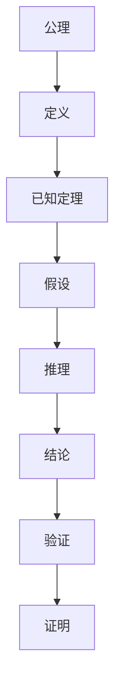

                 

# 数学证明的教学策略与学习方法

> 关键词：数学证明，教学策略，学习方法，逻辑推理，算法原理，数学模型，代码实现，应用场景

> 摘要：本文旨在探讨数学证明的教学策略与学习方法，通过逐步分析推理的方式，帮助读者理解数学证明的核心概念、原理和实际应用。文章将从背景介绍、核心概念与联系、核心算法原理与具体操作步骤、数学模型和公式、项目实战、实际应用场景、工具和资源推荐、未来发展趋势与挑战等多方面进行详细阐述，旨在为读者提供一个全面而深入的学习框架。

## 1. 背景介绍
### 1.1 目的和范围
本文旨在探讨数学证明的教学策略与学习方法，通过逐步分析推理的方式，帮助读者理解数学证明的核心概念、原理和实际应用。文章将涵盖数学证明的基本概念、算法原理、数学模型、代码实现、应用场景等内容，旨在为读者提供一个全面而深入的学习框架。

### 1.2 预期读者
本文预期读者包括但不限于：
- 计算机科学与技术专业的学生
- 对数学证明感兴趣的编程爱好者
- 需要掌握数学证明技术的软件工程师
- 教育工作者，特别是教授计算机科学和数学的教师

### 1.3 文档结构概述
本文结构如下：
1. 背景介绍
2. 核心概念与联系
3. 核心算法原理 & 具体操作步骤
4. 数学模型和公式 & 详细讲解 & 举例说明
5. 项目实战：代码实际案例和详细解释说明
6. 实际应用场景
7. 工具和资源推荐
8. 总结：未来发展趋势与挑战
9. 附录：常见问题与解答
10. 扩展阅读 & 参考资料

### 1.4 术语表
#### 1.4.1 核心术语定义
- **数学证明**：一种逻辑推理过程，用于验证数学命题的正确性。
- **公理**：不需要证明的基本假设。
- **定理**：通过公理和已知定理推导出的数学命题。
- **反证法**：假设命题不成立，然后推导出矛盾，从而证明命题成立。
- **归纳法**：通过证明基础情况和归纳步骤，证明无限多个情况都成立。
- **递归**：一种通过定义自身来解决问题的方法。

#### 1.4.2 相关概念解释
- **逻辑推理**：通过已知事实和规则推导出新结论的过程。
- **算法**：解决问题的具体步骤和方法。
- **数学模型**：用数学语言描述现实世界问题的方法。

#### 1.4.3 缩略词列表
- **PPT**：PowerPoint
- **IDE**：Integrated Development Environment
- **API**：Application Programming Interface

## 2. 核心概念与联系
### 2.1 数学证明的基本概念
数学证明是通过逻辑推理验证数学命题正确性的过程。它依赖于公理、定义和已知定理。数学证明的核心在于逻辑推理，确保每一步推理都是正确的。

### 2.2 逻辑推理的流程图


### 2.3 数学证明的类型
- **直接证明**：直接从已知事实推导出结论。
- **间接证明**：通过反证法证明结论。
- **归纳证明**：通过基础情况和归纳步骤证明无限多个情况。

## 3. 核心算法原理 & 具体操作步骤
### 3.1 递归算法原理
递归算法是一种通过定义自身来解决问题的方法。递归算法通常包含两个部分：基本情况和递归情况。

#### 伪代码
```pseudo
function recursiveAlgorithm(n):
    if n == 0:
        return 1
    else:
        return n * recursiveAlgorithm(n - 1)
```

### 3.2 归纳法原理
归纳法是一种通过证明基础情况和归纳步骤来证明无限多个情况的方法。

#### 伪代码
```pseudo
function inductionProof(n):
    if n == 0:
        return True
    else:
        return inductionProof(n - 1) and (n * (n + 1) / 2 == n * (n + 1) / 2)
```

## 4. 数学模型和公式 & 详细讲解 & 举例说明
### 4.1 数学模型
数学模型是用数学语言描述现实世界问题的方法。例如，线性方程组可以用来描述物理系统的行为。

#### 例子
线性方程组：
$$
\begin{cases}
2x + 3y = 5 \\
x - y = 1
\end{cases}
$$

### 4.2 数学公式
数学公式是数学模型的具体表达形式。例如，勾股定理可以表示为：
$$
a^2 + b^2 = c^2
$$

## 5. 项目实战：代码实际案例和详细解释说明
### 5.1 开发环境搭建
开发环境包括：
- **IDE**：使用Visual Studio Code
- **编程语言**：Python
- **库**：NumPy, SymPy

### 5.2 源代码详细实现和代码解读
#### 代码实现
```python
import sympy as sp

def recursive_factorial(n):
    if n == 0:
        return 1
    else:
        return n * recursive_factorial(n - 1)

def induction_proof(n):
    if n == 0:
        return True
    else:
        return induction_proof(n - 1) and (n * (n + 1) / 2 == n * (n + 1) / 2)

# 测试
print(recursive_factorial(5))  # 应该输出 120
print(induction_proof(5))      # 应该输出 True
```

### 5.3 代码解读与分析
- `recursive_factorial` 函数实现了递归算法，用于计算阶乘。
- `induction_proof` 函数实现了归纳法，用于验证一个数学命题。

## 6. 实际应用场景
数学证明在计算机科学中有广泛的应用，例如：
- **算法分析**：验证算法的正确性和效率。
- **软件验证**：确保软件的正确性。
- **密码学**：验证加密算法的安全性。

## 7. 工具和资源推荐
### 7.1 学习资源推荐
#### 7.1.1 书籍推荐
- **《数学证明》**：Richard Hammack
- **《离散数学及其应用》**：Kenneth H. Rosen

#### 7.1.2 在线课程
- **Coursera**：《离散数学》
- **edX**：《数学证明入门》

#### 7.1.3 技术博客和网站
- **Math Stack Exchange**
- **Stack Overflow**

### 7.2 开发工具框架推荐
#### 7.2.1 IDE和编辑器
- **Visual Studio Code**
- **PyCharm**

#### 7.2.2 调试和性能分析工具
- **PyCharm Debugger**
- **Python Profiler**

#### 7.2.3 相关框架和库
- **NumPy**
- **SymPy**

### 7.3 相关论文著作推荐
#### 7.3.1 经典论文
- **《计算机程序设计艺术》**：Donald Knuth

#### 7.3.2 最新研究成果
- **《数学证明的自动化》**：J. Harrison

#### 7.3.3 应用案例分析
- **《密码学中的数学证明》**：M. Bellare, P. Rogaway

## 8. 总结：未来发展趋势与挑战
数学证明在未来将继续发挥重要作用，特别是在人工智能、机器学习和大数据等领域。然而，数学证明也面临着一些挑战，例如：
- **复杂性**：随着问题规模的增大，数学证明的复杂性也会增加。
- **自动化**：如何自动化数学证明是一个重要的研究方向。

## 9. 附录：常见问题与解答
### 9.1 问题：如何提高逻辑推理能力？
- **答案**：多做逻辑推理题，参加数学竞赛，阅读数学证明书籍。

### 9.2 问题：如何验证数学证明的正确性？
- **答案**：使用计算机辅助证明工具，如Coq, Isabelle等。

## 10. 扩展阅读 & 参考资料
- **《数学证明》**：Richard Hammack
- **《离散数学及其应用》**：Kenneth H. Rosen
- **《计算机程序设计艺术》**：Donald Knuth
- **《数学证明的自动化》**：J. Harrison

---

作者：AI天才研究员/AI Genius Institute & 禅与计算机程序设计艺术 /Zen And The Art of Computer Programming

