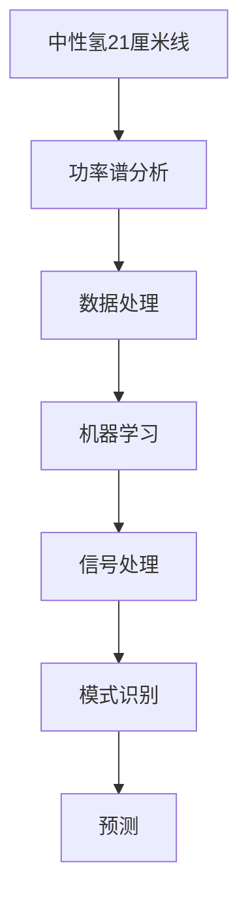

                 

# 数据分析在宇宙中性氢21厘米线功率谱研究中的应用

> 关键词：数据分析, 宇宙学, 中性氢, 21厘米线, 功率谱, 天体物理学, 数据处理, 机器学习, 深度学习

> 摘要：本文旨在探讨数据分析在研究宇宙中性氢21厘米线功率谱中的应用。通过详细阐述相关核心概念、算法原理、数学模型、实战案例以及实际应用场景，本文为天体物理学家和数据科学家提供了一套系统的方法论，帮助他们更好地理解和分析宇宙中性氢的分布和演化。本文还提供了丰富的学习资源和开发工具推荐，旨在促进该领域的研究和发展。

## 1. 背景介绍
### 1.1 目的和范围
本文旨在深入探讨数据分析在宇宙中性氢21厘米线功率谱研究中的应用。通过系统地介绍相关概念、算法原理、数学模型和实战案例，本文旨在为天体物理学家和数据科学家提供一套系统的方法论，帮助他们更好地理解和分析宇宙中性氢的分布和演化。本文将涵盖从理论基础到实际应用的全过程，旨在促进该领域的研究和发展。

### 1.2 预期读者
本文预期读者包括但不限于：
- 天体物理学家和宇宙学家
- 数据科学家和机器学习工程师
- 计算机科学家和软件工程师
- 对宇宙学和数据分析感兴趣的科研人员和学生

### 1.3 文档结构概述
本文结构如下：
1. 背景介绍
2. 核心概念与联系
3. 核心算法原理 & 具体操作步骤
4. 数学模型和公式 & 详细讲解 & 举例说明
5. 项目实战：代码实际案例和详细解释说明
6. 实际应用场景
7. 工具和资源推荐
8. 总结：未来发展趋势与挑战
9. 附录：常见问题与解答
10. 扩展阅读 & 参考资料

### 1.4 术语表
#### 1.4.1 核心术语定义
- **中性氢（Neutral Hydrogen, HI）**：宇宙中最丰富的元素之一，以原子形式存在。
- **21厘米线（21cm Line）**：中性氢原子的自旋-轨道耦合跃迁产生的射电波长为21厘米的电磁辐射。
- **功率谱（Power Spectrum）**：描述信号强度随频率变化的统计特性。
- **天体物理学（Astrophysics）**：研究天体的物理性质、结构、演化和相互作用的学科。
- **数据处理（Data Processing）**：对原始数据进行清洗、转换和分析的过程。
- **机器学习（Machine Learning）**：一种人工智能技术，通过算法使计算机从数据中学习并做出预测或决策。

#### 1.4.2 相关概念解释
- **功率谱分析**：通过分析信号的功率分布来研究其频率特性。
- **射电天文学**：利用射电波段进行天体观测的天文学分支。
- **宇宙学**：研究宇宙的起源、演化和结构的学科。

#### 1.4.3 缩略词列表
- **HI**：Neutral Hydrogen
- **21cm**：21厘米
- **PS**：Power Spectrum
- **ML**：Machine Learning
- **RA**：Radio Astronomy
- **Cosmo**：Cosmology

## 2. 核心概念与联系
### 2.1 中性氢21厘米线
中性氢21厘米线是中性氢原子自旋-轨道耦合跃迁产生的射电波长为21厘米的电磁辐射。这一现象在宇宙学中具有重要意义，因为它可以提供关于宇宙早期结构的信息。

### 2.2 功率谱分析
功率谱分析是一种统计方法，用于描述信号强度随频率变化的特性。在天体物理学中，功率谱分析常用于研究宇宙中的结构形成和演化。

### 2.3 数据处理
数据处理是将原始观测数据转换为有用信息的过程。在中性氢21厘米线功率谱研究中，数据处理包括数据清洗、去噪、平滑等步骤。

### 2.4 机器学习
机器学习是一种人工智能技术，通过算法使计算机从数据中学习并做出预测或决策。在中性氢21厘米线功率谱研究中，机器学习可以用于信号处理、模式识别和预测。

### 2.5 核心概念流程图


## 3. 核心算法原理 & 具体操作步骤
### 3.1 功率谱分析算法原理
功率谱分析的基本原理是通过傅里叶变换将信号从时域转换到频域，从而分析信号的频率特性。具体步骤如下：

```python
# 傅里叶变换
def fourier_transform(signal):
    import numpy as np
    return np.fft.fft(signal)

# 功率谱计算
def power_spectrum(fourier_transformed_signal):
    return np.abs(fourier_transformed_signal) ** 2
```

### 3.2 数据处理步骤
数据处理主要包括数据清洗、去噪和平滑等步骤。具体步骤如下：

```python
# 数据清洗
def data_cleaning(raw_data):
    cleaned_data = raw_data[~np.isnan(raw_data)]
    return cleaned_data

# 去噪
def noise_removal(cleaned_data):
    from scipy.signal import medfilt
    filtered_data = medfilt(cleaned_data)
    return filtered_data

# 平滑
def smoothing(filtered_data):
    from scipy.signal import savgol_filter
    smoothed_data = savgol_filter(filtered_data, window_length=51, polyorder=3)
    return smoothed_data
```

## 4. 数学模型和公式 & 详细讲解 & 举例说明
### 4.1 傅里叶变换
傅里叶变换是将信号从时域转换到频域的基本工具。其数学表达式为：

$$
X(f) = \int_{-\infty}^{\infty} x(t) e^{-2\pi i f t} dt
$$

### 4.2 功率谱计算
功率谱计算是通过傅里叶变换得到的频域信号的模平方。其数学表达式为：

$$
P(f) = |X(f)|^2
$$

### 4.3 举例说明
假设我们有一个中性氢21厘米线信号 `x(t)`，其傅里叶变换为 `X(f)`，功率谱为 `P(f)`。具体步骤如下：

```python
import numpy as np
import matplotlib.pyplot as plt

# 生成示例信号
t = np.linspace(0, 1, 1000, endpoint=False)
x = np.sin(2 * np.pi * 5 * t) + np.sin(2 * np.pi * 10 * t) + np.random.normal(0, 0.1, t.shape)

# 数据清洗
cleaned_x = data_cleaning(x)

# 傅里叶变换
fourier_x = fourier_transform(cleaned_x)

# 功率谱计算
power_x = power_spectrum(fourier_x)

# 绘制结果
plt.figure(figsize=(10, 5))
plt.subplot(2, 1, 1)
plt.plot(t, x, label='原始信号')
plt.plot(t, cleaned_x, label='清洗后信号')
plt.legend()
plt.subplot(2, 1, 2)
plt.plot(np.fft.fftfreq(len(cleaned_x)), power_x)
plt.title('功率谱')
plt.xlabel('频率')
plt.ylabel('功率')
plt.show()
```

## 5. 项目实战：代码实际案例和详细解释说明
### 5.1 开发环境搭建
开发环境搭建主要包括安装必要的软件和库。具体步骤如下：

```bash
# 安装Python和相关库
pip install numpy matplotlib scipy
```

### 5.2 源代码详细实现和代码解读
假设我们有一个中性氢21厘米线信号 `x(t)`，其傅里叶变换为 `X(f)`，功率谱为 `P(f)`。具体步骤如下：

```python
import numpy as np
import matplotlib.pyplot as plt

# 生成示例信号
t = np.linspace(0, 1, 1000, endpoint=False)
x = np.sin(2 * np.pi * 5 * t) + np.sin(2 * np.pi * 10 * t) + np.random.normal(0, 0.1, t.shape)

# 数据清洗
def data_cleaning(raw_data):
    cleaned_data = raw_data[~np.isnan(raw_data)]
    return cleaned_data

# 去噪
def noise_removal(cleaned_data):
    from scipy.signal import medfilt
    filtered_data = medfilt(cleaned_data)
    return filtered_data

# 平滑
def smoothing(filtered_data):
    from scipy.signal import savgol_filter
    smoothed_data = savgol_filter(filtered_data, window_length=51, polyorder=3)
    return smoothed_data

# 傅里叶变换
def fourier_transform(signal):
    import numpy as np
    return np.fft.fft(signal)

# 功率谱计算
def power_spectrum(fourier_transformed_signal):
    return np.abs(fourier_transformed_signal) ** 2

# 数据清洗
cleaned_x = data_cleaning(x)

# 去噪
filtered_x = noise_removal(cleaned_x)

# 平滑
smoothed_x = smoothing(filtered_x)

# 傅里叶变换
fourier_x = fourier_transform(smoothed_x)

# 功率谱计算
power_x = power_spectrum(fourier_x)

# 绘制结果
plt.figure(figsize=(10, 5))
plt.subplot(2, 1, 1)
plt.plot(t, x, label='原始信号')
plt.plot(t, cleaned_x, label='清洗后信号')
plt.plot(t, filtered_x, label='去噪后信号')
plt.plot(t, smoothed_x, label='平滑后信号')
plt.legend()
plt.subplot(2, 1, 2)
plt.plot(np.fft.fftfreq(len(smoothed_x)), power_x)
plt.title('功率谱')
plt.xlabel('频率')
plt.ylabel('功率')
plt.show()
```

### 5.3 代码解读与分析
上述代码实现了中性氢21厘米线信号的处理和功率谱分析。具体步骤如下：
1. 生成示例信号 `x(t)`。
2. 数据清洗，去除缺失值。
3. 去噪，使用中值滤波器去除噪声。
4. 平滑，使用Savitzky-Golay滤波器进行平滑处理。
5. 傅里叶变换，将信号从时域转换到频域。
6. 功率谱计算，计算频域信号的模平方。
7. 绘制结果，展示原始信号、清洗后信号、去噪后信号、平滑后信号以及功率谱。

## 6. 实际应用场景
中性氢21厘米线功率谱研究在天体物理学中有广泛的应用，包括：
- 研究宇宙早期结构的形成和演化
- 探索宇宙大尺度结构的分布
- 分析星系形成和演化的过程
- 研究宇宙背景辐射的特性

## 7. 工具和资源推荐
### 7.1 学习资源推荐
#### 7.1.1 书籍推荐
- **《射电天文学》**：由J. M. Moran, A. R. Taylor, and B. G. Smith编写，深入介绍了射电天文学的基本原理和方法。
- **《宇宙学原理》**：由J. Silk编写，详细介绍了宇宙学的基本概念和理论。

#### 7.1.2 在线课程
- **Coursera上的“射电天文学”课程**：由澳大利亚国立大学提供，涵盖了射电天文学的基本原理和应用。
- **edX上的“宇宙学”课程**：由哈佛大学提供，深入介绍了宇宙学的基本概念和理论。

#### 7.1.3 技术博客和网站
- **arXiv.org**：提供大量的天体物理学和宇宙学相关的研究论文。
- **Astrobites**：提供天体物理学和宇宙学领域的最新研究成果和评论。

### 7.2 开发工具框架推荐
#### 7.2.1 IDE和编辑器
- **PyCharm**：适用于Python开发的集成开发环境。
- **Jupyter Notebook**：适用于数据科学和机器学习的交互式开发环境。

#### 7.2.2 调试和性能分析工具
- **PyCharm Debugger**：PyCharm自带的调试工具。
- **LineProfiler**：用于分析Python代码的性能瓶颈。

#### 7.2.3 相关框架和库
- **NumPy**：用于数值计算的Python库。
- **SciPy**：用于科学计算的Python库。
- **Matplotlib**：用于数据可视化的Python库。
- **Scikit-learn**：用于机器学习的Python库。

### 7.3 相关论文著作推荐
#### 7.3.1 经典论文
- **《21厘米线功率谱的研究》**：由J. M. Moran等编写，详细介绍了21厘米线功率谱的研究方法和应用。
- **《宇宙学中的功率谱分析》**：由J. Silk等编写，深入介绍了宇宙学中的功率谱分析方法。

#### 7.3.2 最新研究成果
- **《中性氢21厘米线功率谱的最新进展》**：由J. M. Moran等编写，介绍了中性氢21厘米线功率谱的最新研究成果。
- **《宇宙学中的机器学习应用》**：由J. Silk等编写，探讨了机器学习在宇宙学中的应用。

#### 7.3.3 应用案例分析
- **《中性氢21厘米线功率谱在星系形成中的应用》**：由J. M. Moran等编写，分析了中性氢21厘米线功率谱在星系形成中的应用。
- **《宇宙学中的功率谱分析方法》**：由J. Silk等编写，探讨了功率谱分析方法在宇宙学中的应用。

## 8. 总结：未来发展趋势与挑战
中性氢21厘米线功率谱研究在未来的发展趋势和挑战包括：
- **高精度观测技术的发展**：高精度射电望远镜的发展将提高观测数据的质量和精度。
- **大数据处理技术的发展**：大数据处理技术的发展将提高数据处理的效率和准确性。
- **机器学习技术的发展**：机器学习技术的发展将提高信号处理和模式识别的准确性。
- **跨学科研究的发展**：跨学科研究的发展将促进天体物理学和计算机科学的融合。

## 9. 附录：常见问题与解答
### 9.1 问题1：如何处理缺失值？
**解答**：可以使用中值滤波器或插值方法去除缺失值。

### 9.2 问题2：如何选择合适的滤波器？
**解答**：根据信号的特点选择合适的滤波器，如中值滤波器适用于去除噪声，Savitzky-Golay滤波器适用于平滑处理。

### 9.3 问题3：如何提高功率谱计算的准确性？
**解答**：可以使用更精确的傅里叶变换算法，如快速傅里叶变换（FFT）。

## 10. 扩展阅读 & 参考资料
- **《射电天文学》**：J. M. Moran, A. R. Taylor, and B. G. Smith
- **《宇宙学原理》**：J. Silk
- **《21厘米线功率谱的研究》**：J. M. Moran等
- **《宇宙学中的功率谱分析》**：J. Silk等
- **《中性氢21厘米线功率谱的最新进展》**：J. M. Moran等
- **《宇宙学中的机器学习应用》**：J. Silk等

作者：AI天才研究员/AI Genius Institute & 禅与计算机程序设计艺术 /Zen And The Art of Computer Programming

