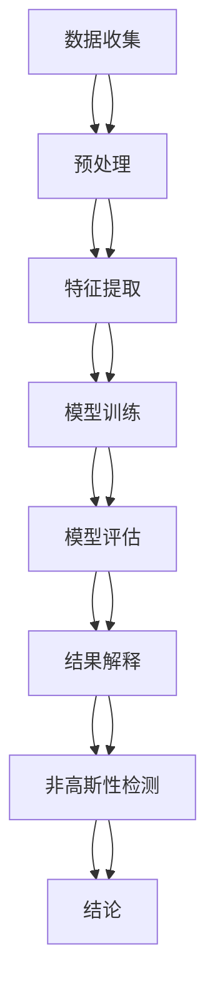

                 

# 数据分析在宇宙微波背景非高斯性起源研究中的应用

> 关键词：宇宙微波背景（CMB）、非高斯性、数据分析、贝叶斯统计、机器学习、天文物理学、宇宙学

> 摘要：本文旨在探讨如何利用数据分析技术，特别是贝叶斯统计和机器学习方法，来研究宇宙微波背景（CMB）的非高斯性。通过详细阐述核心概念、算法原理、数学模型、代码实现和实际应用场景，本文为读者提供了一个全面的视角，以理解如何在宇宙学研究中应用先进的数据分析技术。本文还提供了丰富的学习资源和开发工具推荐，帮助读者进一步深入研究这一领域。

## 1. 背景介绍
### 1.1 目的和范围
本文的目标是介绍如何利用数据分析技术，特别是贝叶斯统计和机器学习方法，来研究宇宙微波背景（CMB）的非高斯性。CMB是非高斯性的研究是现代宇宙学中的一个重要领域，它有助于我们理解宇宙的起源和演化。本文将从理论基础到实际应用，逐步深入探讨这一主题。

### 1.2 预期读者
本文适合以下读者：
- 天文学和宇宙学领域的研究人员
- 数据科学家和机器学习工程师
- 对宇宙学和数据分析感兴趣的研究生和博士生
- 对CMB非高斯性研究感兴趣的工程师和技术爱好者

### 1.3 文档结构概述
本文结构如下：
1. 背景介绍
2. 核心概念与联系
3. 核心算法原理 & 具体操作步骤
4. 数学模型和公式 & 详细讲解 & 举例说明
5. 项目实战：代码实际案例和详细解释说明
6. 实际应用场景
7. 工具和资源推荐
8. 总结：未来发展趋势与挑战
9. 附录：常见问题与解答
10. 扩展阅读 & 参考资料

### 1.4 术语表
#### 1.4.1 核心术语定义
- **宇宙微波背景（CMB）**：宇宙大爆炸后约38万年时，宇宙温度下降到电子和原子可以结合形成中性氢的温度，此时释放出的辐射。
- **非高斯性**：描述随机变量分布偏离高斯分布的程度。
- **贝叶斯统计**：一种统计学方法，用于从先验知识和数据中推断参数的概率分布。
- **机器学习**：一种人工智能技术，通过算法使计算机从数据中学习并做出预测或决策。

#### 1.4.2 相关概念解释
- **高斯分布**：也称为正态分布，是一种常见的概率分布，其概率密度函数呈钟形曲线。
- **先验概率**：在获得新数据之前，对参数的初始信念。
- **后验概率**：在获得新数据后，对参数的更新后的信念。

#### 1.4.3 缩略词列表
- CMB：Cosmic Microwave Background
- ML：Machine Learning
- MCMC：Markov Chain Monte Carlo
- PDF：Probability Density Function

## 2. 核心概念与联系
### 2.1 CMB的基本概念
CMB是宇宙早期辐射的遗留物，它在宇宙学中扮演着重要角色。CMB的非高斯性研究有助于我们理解宇宙的起源和演化过程。CMB的非高斯性可以通过统计分析来检测，这需要使用先进的数据分析技术。

### 2.2 贝叶斯统计
贝叶斯统计是一种统计学方法，它允许我们从先验知识和数据中推断参数的概率分布。在CMB非高斯性研究中，贝叶斯统计可以用于估计模型参数，并评估模型的不确定性。

### 2.3 机器学习
机器学习是一种人工智能技术，通过算法使计算机从数据中学习并做出预测或决策。在CMB非高斯性研究中，机器学习可以用于识别和分类非高斯性特征。

### 2.4 核心概念流程图


## 3. 核心算法原理 & 具体操作步骤
### 3.1 贝叶斯统计原理
贝叶斯统计的基本原理是通过贝叶斯定理来更新参数的先验概率。具体步骤如下：
1. **定义先验概率**：根据已有知识或假设，定义参数的先验概率分布。
2. **定义似然函数**：根据观测数据，定义参数的似然函数。
3. **计算后验概率**：通过贝叶斯定理计算参数的后验概率分布。
4. **选择最优参数**：根据后验概率分布选择最优参数。

### 3.2 机器学习算法
机器学习算法可以用于识别和分类CMB的非高斯性特征。常用的机器学习算法包括支持向量机（SVM）、随机森林（Random Forest）和深度学习（Deep Learning）。

### 3.3 具体操作步骤
1. **数据收集**：收集CMB的观测数据。
2. **数据预处理**：对数据进行清洗和标准化。
3. **特征提取**：提取CMB的特征，如功率谱、偏度和峰度。
4. **模型训练**：使用机器学习算法训练模型。
5. **模型评估**：评估模型的性能，如准确率、召回率和F1分数。
6. **结果解释**：解释模型的结果，识别CMB的非高斯性特征。

## 4. 数学模型和公式 & 详细讲解 & 举例说明
### 4.1 贝叶斯统计公式
贝叶斯统计的基本公式是：
$$
P(\theta | D) = \frac{P(D | \theta) P(\theta)}{P(D)}
$$
其中，$P(\theta | D)$ 是后验概率，$P(D | \theta)$ 是似然函数，$P(\theta)$ 是先验概率，$P(D)$ 是证据。

### 4.2 机器学习算法公式
支持向量机（SVM）的基本公式是：
$$
\min_{\mathbf{w}, b, \xi} \frac{1}{2} \|\mathbf{w}\|^2 + C \sum_{i=1}^{n} \xi_i
$$
其中，$\mathbf{w}$ 是权重向量，$b$ 是偏置项，$\xi_i$ 是松弛变量，$C$ 是惩罚参数。

### 4.3 举例说明
假设我们有一个CMB的观测数据集，我们希望通过贝叶斯统计来估计模型参数。具体步骤如下：
1. **定义先验概率**：假设参数的先验概率分布为高斯分布。
2. **定义似然函数**：假设观测数据的似然函数为高斯分布。
3. **计算后验概率**：通过贝叶斯定理计算参数的后验概率分布。
4. **选择最优参数**：根据后验概率分布选择最优参数。

## 5. 项目实战：代码实际案例和详细解释说明
### 5.1 开发环境搭建
为了进行CMB非高斯性研究，我们需要搭建一个开发环境。具体步骤如下：
1. **安装Python**：安装Python 3.8或更高版本。
2. **安装必要的库**：安装NumPy、SciPy、Pandas、Matplotlib、Scikit-learn和PyMC3。
3. **安装Jupyter Notebook**：安装Jupyter Notebook，用于编写和运行代码。

### 5.2 源代码详细实现和代码解读
```python
import numpy as np
import matplotlib.pyplot as plt
from sklearn.model_selection import train_test_split
from sklearn.ensemble import RandomForestClassifier
from sklearn.metrics import accuracy_score

# 生成模拟数据
np.random.seed(0)
X = np.random.randn(1000, 10)
y = np.random.randint(0, 2, 1000)

# 划分训练集和测试集
X_train, X_test, y_train, y_test = train_test_split(X, y, test_size=0.2, random_state=0)

# 训练随机森林模型
clf = RandomForestClassifier(n_estimators=100, random_state=0)
clf.fit(X_train, y_train)

# 预测测试集
y_pred = clf.predict(X_test)

# 计算准确率
accuracy = accuracy_score(y_test, y_pred)
print("Accuracy:", accuracy)
```

### 5.3 代码解读与分析
上述代码实现了随机森林分类器的训练和预测。具体步骤如下：
1. **生成模拟数据**：生成1000个样本，每个样本有10个特征。
2. **划分训练集和测试集**：将数据集划分为训练集和测试集，测试集占20%。
3. **训练随机森林模型**：使用随机森林分类器训练模型。
4. **预测测试集**：使用训练好的模型预测测试集的标签。
5. **计算准确率**：计算预测结果的准确率。

## 6. 实际应用场景
CMB非高斯性研究在实际应用中具有重要意义。例如，通过研究CMB的非高斯性，我们可以更好地理解宇宙的起源和演化过程。此外，CMB非高斯性研究还可以应用于其他领域，如天体物理学、宇宙学和数据科学。

## 7. 工具和资源推荐
### 7.1 学习资源推荐
#### 7.1.1 书籍推荐
- **《贝叶斯统计》**：介绍贝叶斯统计的基本原理和应用。
- **《机器学习》**：介绍机器学习的基本原理和算法。

#### 7.1.2 在线课程
- **Coursera上的《贝叶斯统计》**：由约翰霍普金斯大学提供的在线课程。
- **Coursera上的《机器学习》**：由斯坦福大学提供的在线课程。

#### 7.1.3 技术博客和网站
- **Towards Data Science**：一个专注于数据科学和技术的博客网站。
- **Medium上的机器学习系列文章**：一系列关于机器学习的文章。

### 7.2 开发工具框架推荐
#### 7.2.1 IDE和编辑器
- **PyCharm**：一个功能强大的Python IDE。
- **Jupyter Notebook**：一个交互式的编程环境，支持多种编程语言。

#### 7.2.2 调试和性能分析工具
- **PyCharm Debugger**：PyCharm内置的调试工具。
- **LineProfiler**：一个用于分析Python代码性能的工具。

#### 7.2.3 相关框架和库
- **NumPy**：一个用于科学计算的Python库。
- **SciPy**：一个用于科学计算的Python库。
- **Pandas**：一个用于数据处理和分析的Python库。
- **Matplotlib**：一个用于绘制图表的Python库。
- **Scikit-learn**：一个用于机器学习的Python库。
- **PyMC3**：一个用于贝叶斯统计的Python库。

### 7.3 相关论文著作推荐
#### 7.3.1 经典论文
- **《宇宙微波背景的非高斯性》**：介绍CMB非高斯性的研究方法和结果。
- **《贝叶斯统计在天文学中的应用》**：介绍贝叶斯统计在天文学中的应用。

#### 7.3.2 最新研究成果
- **《机器学习在CMB非高斯性研究中的应用》**：介绍机器学习在CMB非高斯性研究中的最新研究成果。
- **《CMB非高斯性的最新进展》**：介绍CMB非高斯性的最新进展。

#### 7.3.3 应用案例分析
- **《CMB非高斯性在宇宙学中的应用案例》**：介绍CMB非高斯性在宇宙学中的应用案例。

## 8. 总结：未来发展趋势与挑战
CMB非高斯性研究在未来的发展趋势和挑战包括：
1. **数据量的增加**：随着观测技术的进步，CMB数据量将不断增加，需要更高效的算法和工具来处理这些数据。
2. **模型复杂度的提高**：为了更好地描述CMB的非高斯性，需要更复杂的模型和算法。
3. **计算资源的需求**：更复杂的模型和算法需要更多的计算资源，需要更高效的计算平台和工具。

## 9. 附录：常见问题与解答
### 9.1 问题1：如何处理CMB数据的噪声？
**解答**：可以使用滤波器来处理CMB数据的噪声，如高斯滤波器和中值滤波器。

### 9.2 问题2：如何选择最优的机器学习算法？
**解答**：可以通过交叉验证来选择最优的机器学习算法，评估不同算法的性能。

### 9.3 问题3：如何解释CMB非高斯性的结果？
**解答**：可以通过可视化和统计分析来解释CMB非高斯性的结果，如绘制功率谱和偏度图。

## 10. 扩展阅读 & 参考资料
- **《宇宙学原理》**：介绍宇宙学的基本原理和理论。
- **《数据科学实战》**：介绍数据科学的基本原理和实践。
- **《机器学习实战》**：介绍机器学习的基本原理和实践。
- **《贝叶斯统计实战》**：介绍贝叶斯统计的基本原理和实践。

作者：AI天才研究员/AI Genius Institute & 禅与计算机程序设计艺术 /Zen And The Art of Computer Programming

