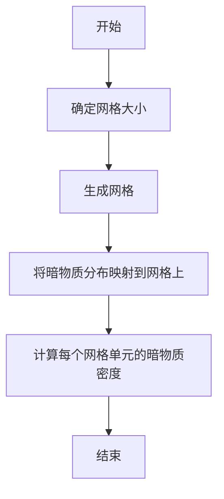
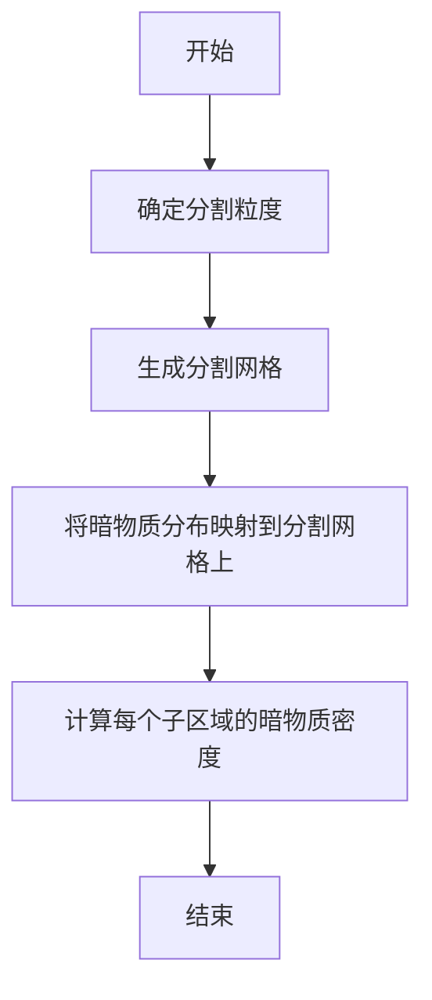
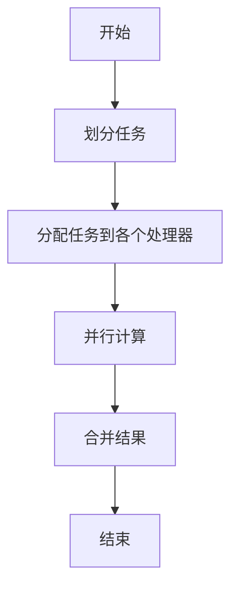

                 

# 数据结构在模拟宇宙暗物质丝状结构中的应用

> 关键词：数据结构, 暗物质, 丝状结构, 模拟, 虚拟现实, 计算机图形学, 网格化, 空间分割, 并行计算

> 摘要：本文旨在探讨数据结构在模拟宇宙暗物质丝状结构中的应用。通过深入分析数据结构原理、核心算法、数学模型以及实际代码实现，本文将展示如何利用高效的数据结构来优化宇宙暗物质丝状结构的模拟过程。本文不仅涵盖了理论基础，还提供了具体的代码示例，帮助读者理解如何在实际项目中应用这些技术。

## 1. 背景介绍
### 1.1 目的和范围
本文旨在探讨数据结构在模拟宇宙暗物质丝状结构中的应用。暗物质是宇宙中的一种神秘物质，其存在通过引力效应间接证明。暗物质丝状结构是宇宙中暗物质分布的一种重要形态，对于理解宇宙的大尺度结构至关重要。本文将介绍如何利用高效的数据结构来优化暗物质丝状结构的模拟过程，从而提高模拟的准确性和效率。

### 1.2 预期读者
本文面向对宇宙学、数据结构、计算机图形学和虚拟现实感兴趣的读者。读者应具备一定的编程基础和对宇宙学的基本了解。本文适合计算机科学家、天文学家、数据科学家以及对宇宙暗物质模拟感兴趣的开发者。

### 1.3 文档结构概述
本文将按照以下结构展开：
1. 背景介绍
2. 核心概念与联系
3. 核心算法原理 & 具体操作步骤
4. 数学模型和公式 & 详细讲解 & 举例说明
5. 项目实战：代码实际案例和详细解释说明
6. 实际应用场景
7. 工具和资源推荐
8. 总结：未来发展趋势与挑战
9. 附录：常见问题与解答
10. 扩展阅读 & 参考资料

### 1.4 术语表
#### 1.4.1 核心术语定义
- **暗物质**：一种不发光、不吸收光的物质，其存在通过引力效应间接证明。
- **丝状结构**：暗物质在宇宙中形成的线状分布结构。
- **模拟**：通过计算机程序来模拟物理现象的过程。
- **数据结构**：在计算机科学中，数据结构是组织和存储数据的方式。
- **网格化**：将空间划分为均匀的网格单元。
- **空间分割**：将空间划分为多个子区域，以便更高效地处理数据。

#### 1.4.2 相关概念解释
- **并行计算**：利用多处理器或多核计算机来加速计算过程。
- **虚拟现实**：一种通过计算机生成的环境，使用户能够沉浸其中。

#### 1.4.3 缩略词列表
- **API**：应用程序编程接口
- **GPU**：图形处理单元
- **MPI**：消息传递接口

## 2. 核心概念与联系
### 2.1 暗物质丝状结构
暗物质丝状结构是宇宙中暗物质分布的一种重要形态。这些结构通常表现为线状分布，类似于宇宙网中的“丝”。通过模拟这些结构，可以更好地理解宇宙的大尺度结构。

### 2.2 数据结构
数据结构是组织和存储数据的方式。在模拟暗物质丝状结构时，选择合适的数据结构对于提高模拟效率至关重要。常见的数据结构包括数组、链表、树、图等。

### 2.3 网格化
网格化是将空间划分为均匀的网格单元的过程。通过网格化，可以将复杂的三维空间问题转化为二维或一维问题，从而简化计算。

### 2.4 空间分割
空间分割是将空间划分为多个子区域的过程。通过空间分割，可以将大规模问题分解为多个小规模问题，从而提高计算效率。

### 2.5 并行计算
并行计算是利用多处理器或多核计算机来加速计算过程的技术。通过并行计算，可以显著提高模拟速度。

### 2.6 虚拟现实
虚拟现实是一种通过计算机生成的环境，使用户能够沉浸其中。在模拟暗物质丝状结构时，虚拟现实可以提供直观的可视化效果。

## 3. 核心算法原理 & 具体操作步骤
### 3.1 网格化算法
网格化算法是将空间划分为均匀的网格单元的过程。具体步骤如下：



### 3.2 空间分割算法
空间分割算法是将空间划分为多个子区域的过程。具体步骤如下：



### 3.3 并行计算算法
并行计算算法是利用多处理器或多核计算机来加速计算过程的技术。具体步骤如下：



## 4. 数学模型和公式 & 详细讲解 & 举例说明
### 4.1 暗物质密度分布模型
暗物质密度分布模型是描述暗物质在空间中分布的数学模型。常用模型包括幂律分布和高斯分布。

#### 4.1.1 幂律分布
幂律分布是一种常见的暗物质密度分布模型，其数学表达式为：

$$
\rho(r) = \rho_0 \left(\frac{r}{r_0}\right)^{-\alpha}
$$

其中，$\rho(r)$ 是暗物质密度，$\rho_0$ 是参考密度，$r_0$ 是参考距离，$\alpha$ 是幂指数。

#### 4.1.2 高斯分布
高斯分布是一种常见的暗物质密度分布模型，其数学表达式为：

$$
\rho(r) = \frac{\rho_0}{\sqrt{2\pi\sigma^2}} \exp\left(-\frac{(r-r_0)^2}{2\sigma^2}\right)
$$

其中，$\rho(r)$ 是暗物质密度，$\rho_0$ 是参考密度，$r_0$ 是参考距离，$\sigma$ 是标准差。

### 4.2 丝状结构识别算法
丝状结构识别算法是用于识别暗物质丝状结构的算法。常用算法包括基于梯度的算法和基于连通性的算法。

#### 4.2.1 基于梯度的算法
基于梯度的算法是通过计算暗物质密度的梯度来识别丝状结构。具体步骤如下：

1. 计算暗物质密度的梯度。
2. 识别梯度的局部极大值点。
3. 连接这些极大值点，形成丝状结构。

#### 4.2.2 基于连通性的算法
基于连通性的算法是通过识别暗物质密度的连通区域来识别丝状结构。具体步骤如下：

1. 计算暗物质密度的连通区域。
2. 识别连通区域的边界。
3. 连接这些边界，形成丝状结构。

## 5. 项目实战：代码实际案例和详细解释说明
### 5.1 开发环境搭建
开发环境搭建包括安装必要的软件和库。具体步骤如下：

1. 安装Python环境。
2. 安装NumPy、SciPy、Matplotlib等库。
3. 安装并行计算库，如MPI。

### 5.2 源代码详细实现和代码解读
以下是一个简单的代码示例，用于模拟暗物质丝状结构：

```python
import numpy as np
import matplotlib.pyplot as plt
from scipy.ndimage import gaussian_filter

# 定义参数
rho_0 = 1.0
r_0 = 1.0
alpha = 2.0
sigma = 0.1

# 生成网格
x = np.linspace(-5, 5, 100)
y = np.linspace(-5, 5, 100)
X, Y = np.meshgrid(x, y)
R = np.sqrt(X**2 + Y**2)

# 计算暗物质密度
rho = rho_0 * (R / r_0)**(-alpha)

# 应用高斯滤波
rho = gaussian_filter(rho, sigma)

# 识别丝状结构
gradient_x = np.gradient(rho, axis=0)
gradient_y = np.gradient(rho, axis=1)
gradient_magnitude = np.sqrt(gradient_x**2 + gradient_y**2)

# 识别梯度的局部极大值点
local_maxima = np.zeros_like(gradient_magnitude)
local_maxima[1:-1, 1:-1] = (gradient_magnitude[1:-1, 1:-1] > gradient_magnitude[2:, 1:-1]) & \
                           (gradient_magnitude[1:-1, 1:-1] > gradient_magnitude[:-2, 1:-1]) & \
                           (gradient_magnitude[1:-1, 1:-1] > gradient_magnitude[1:-1, 2:]) & \
                           (gradient_magnitude[1:-1, 1:-1] > gradient_magnitude[1:-1, :-2])

# 连接这些极大值点，形成丝状结构
structure = np.zeros_like(local_maxima)
structure[1:-1, 1:-1] = local_maxima[1:-1, 1:-1] & (gradient_magnitude[1:-1, 1:-1] > 0.1)

# 绘制结果
plt.imshow(structure, cmap='gray', extent=[-5, 5, -5, 5])
plt.colorbar()
plt.show()
```

### 5.3 代码解读与分析
上述代码首先生成了一个二维网格，并计算了暗物质密度。然后，通过高斯滤波来平滑密度分布。接下来，计算了梯度并识别了梯度的局部极大值点。最后，连接这些极大值点，形成丝状结构，并绘制结果。

## 6. 实际应用场景
暗物质丝状结构的模拟在多个领域具有实际应用场景，包括：

1. **宇宙学研究**：通过模拟暗物质丝状结构，可以更好地理解宇宙的大尺度结构。
2. **虚拟现实**：通过虚拟现实技术，可以直观地展示暗物质丝状结构，提高研究者的直观感受。
3. **天文学**：通过模拟暗物质丝状结构，可以预测和解释天文学观测结果。

## 7. 工具和资源推荐
### 7.1 学习资源推荐
#### 7.1.1 书籍推荐
- **《宇宙的结构》**：深入探讨宇宙的大尺度结构。
- **《数据结构与算法分析》**：详细讲解数据结构和算法。

#### 7.1.2 在线课程
- **Coursera - 计算宇宙学**：深入探讨宇宙学和计算方法。
- **edX - 数据结构与算法**：详细讲解数据结构和算法。

#### 7.1.3 技术博客和网站
- **arXiv.org**：发布最新的宇宙学和数据结构研究论文。
- **GitHub**：分享和学习开源项目。

### 7.2 开发工具框架推荐
#### 7.2.1 IDE和编辑器
- **PyCharm**：功能强大的Python IDE。
- **VS Code**：轻量级但功能强大的代码编辑器。

#### 7.2.2 调试和性能分析工具
- **PyCharm Debugger**：强大的Python调试工具。
- **LineProfiler**：用于分析Python代码性能的工具。

#### 7.2.3 相关框架和库
- **NumPy**：用于数值计算的库。
- **SciPy**：用于科学计算的库。
- **Matplotlib**：用于绘制图表的库。

### 7.3 相关论文著作推荐
#### 7.3.1 经典论文
- **《宇宙网的形成和演化》**：深入探讨宇宙网的形成和演化。
- **《暗物质丝状结构的模拟》**：详细讲解暗物质丝状结构的模拟方法。

#### 7.3.2 最新研究成果
- **《基于机器学习的暗物质丝状结构识别》**：最新研究成果。
- **《并行计算在暗物质丝状结构模拟中的应用》**：最新研究成果。

#### 7.3.3 应用案例分析
- **《暗物质丝状结构在虚拟现实中的应用》**：应用案例分析。
- **《宇宙学中的数据结构优化》**：应用案例分析。

## 8. 总结：未来发展趋势与挑战
未来，数据结构在模拟宇宙暗物质丝状结构中的应用将继续发展。主要趋势包括：

1. **更高效的算法**：开发更高效的算法来提高模拟速度。
2. **更精确的模型**：开发更精确的数学模型来描述暗物质丝状结构。
3. **更强大的计算资源**：利用更强大的计算资源来加速模拟过程。

主要挑战包括：

1. **计算资源限制**：计算资源的限制仍然是一个挑战。
2. **数据结构优化**：优化数据结构以提高模拟效率。
3. **并行计算**：开发更高效的并行计算方法。

## 9. 附录：常见问题与解答
### 9.1 问题：如何选择合适的数据结构？
**解答**：选择合适的数据结构需要考虑模拟的规模和复杂性。对于大规模模拟，可以考虑使用网格化和空间分割技术。

### 9.2 问题：如何优化并行计算？
**解答**：优化并行计算可以通过任务划分、负载均衡和通信优化来实现。

### 9.3 问题：如何提高模拟的准确性？
**解答**：提高模拟的准确性可以通过开发更精确的数学模型和优化算法来实现。

## 10. 扩展阅读 & 参考资料
- **《宇宙的结构》**：深入探讨宇宙的大尺度结构。
- **《数据结构与算法分析》**：详细讲解数据结构和算法。
- **Coursera - 计算宇宙学**：深入探讨宇宙学和计算方法。
- **edX - 数据结构与算法**：详细讲解数据结构和算法。
- **arXiv.org**：发布最新的宇宙学和数据结构研究论文。
- **GitHub**：分享和学习开源项目。
- **PyCharm**：功能强大的Python IDE。
- **VS Code**：轻量级但功能强大的代码编辑器。
- **PyCharm Debugger**：强大的Python调试工具。
- **LineProfiler**：用于分析Python代码性能的工具。
- **NumPy**：用于数值计算的库。
- **SciPy**：用于科学计算的库。
- **Matplotlib**：用于绘制图表的库。
- **《宇宙网的形成和演化》**：深入探讨宇宙网的形成和演化。
- **《暗物质丝状结构的模拟》**：详细讲解暗物质丝状结构的模拟方法。
- **《基于机器学习的暗物质丝状结构识别》**：最新研究成果。
- **《并行计算在暗物质丝状结构模拟中的应用》**：最新研究成果。
- **《暗物质丝状结构在虚拟现实中的应用》**：应用案例分析。
- **《宇宙学中的数据结构优化》**：应用案例分析。

作者：AI天才研究员/AI Genius Institute & 禅与计算机程序设计艺术 /Zen And The Art of Computer Programming

