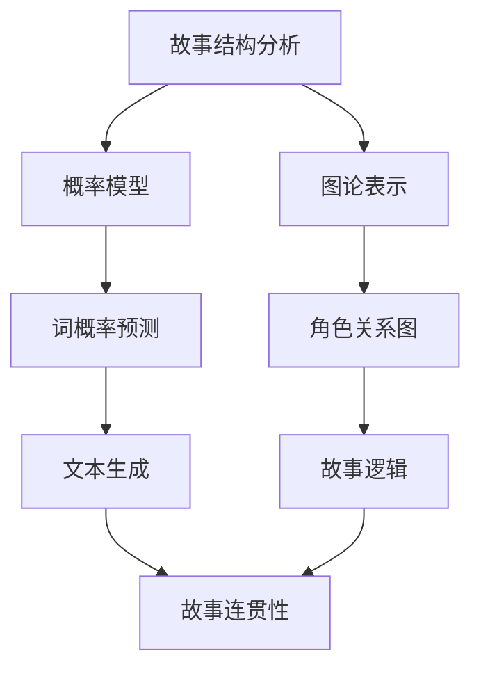
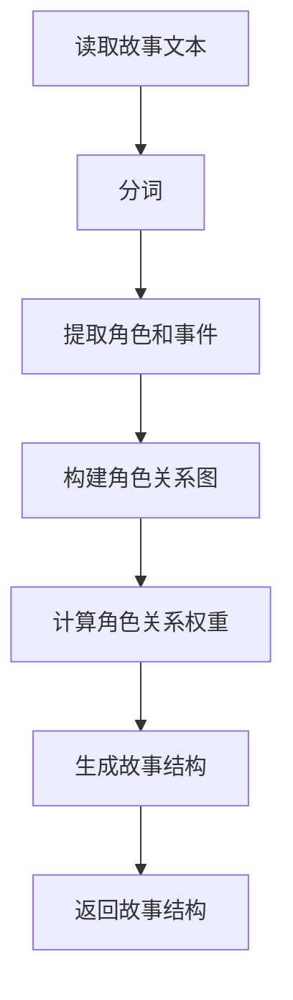
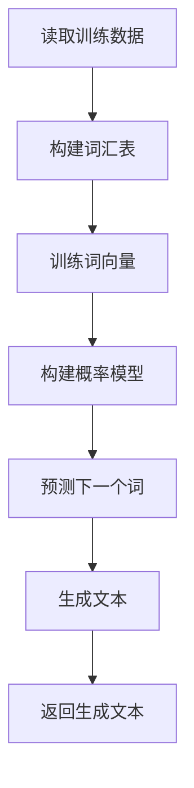
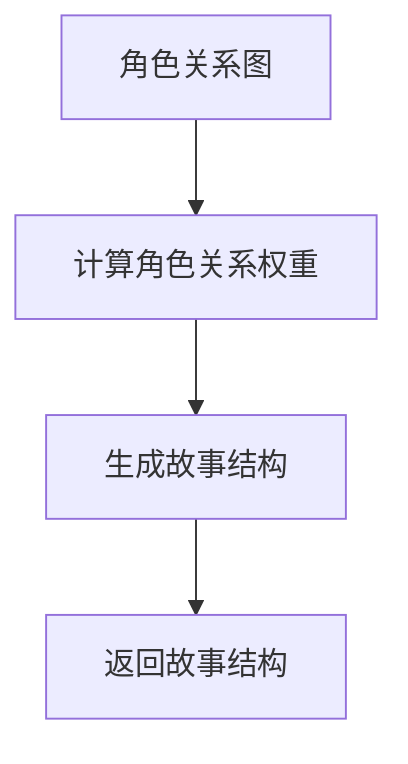
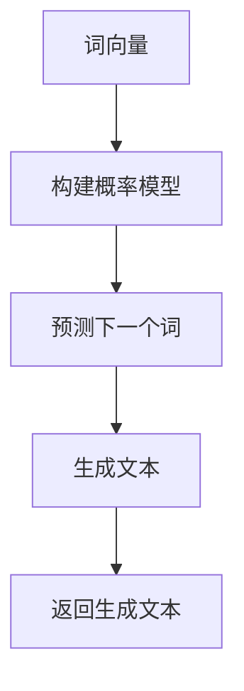

                 

# 文学创作的自然语言生成：故事结构的数学模型

> 关键词：自然语言生成, 故事结构, 数学模型, 人工智能, 文学创作, 机器学习, 伪代码, 深度学习, 文本生成

> 摘要：本文旨在探讨如何利用数学模型和算法来生成具有文学创作价值的故事。通过分析故事结构的核心要素，我们构建了一个基于图论和概率模型的数学框架，用于生成具有连贯性和逻辑性的故事文本。本文将详细介绍该模型的原理、算法实现、实际案例，并探讨其在文学创作中的应用前景。

## 1. 背景介绍
### 1.1 目的和范围
本文旨在探讨如何利用数学模型和算法来生成具有文学创作价值的故事。通过分析故事结构的核心要素，我们构建了一个基于图论和概率模型的数学框架，用于生成具有连贯性和逻辑性的故事文本。本文将详细介绍该模型的原理、算法实现、实际案例，并探讨其在文学创作中的应用前景。

### 1.2 预期读者
本文适合对自然语言生成、故事结构分析、机器学习和人工智能感兴趣的读者。无论是研究者、开发者还是文学爱好者，都可以从中获得有价值的信息和启示。

### 1.3 文档结构概述
本文结构如下：
1. 背景介绍
2. 核心概念与联系
3. 核心算法原理 & 具体操作步骤
4. 数学模型和公式 & 详细讲解 & 举例说明
5. 项目实战：代码实际案例和详细解释说明
6. 实际应用场景
7. 工具和资源推荐
8. 总结：未来发展趋势与挑战
9. 附录：常见问题与解答
10. 扩展阅读 & 参考资料

### 1.4 术语表
#### 1.4.1 核心术语定义
- **故事结构**：故事的基本框架，包括起始、发展、高潮和结局。
- **图论**：研究图（由节点和边组成的数学结构）的理论和应用。
- **概率模型**：基于概率分布的数学模型，用于描述随机事件的概率。
- **自然语言生成**：利用计算机程序生成自然语言文本的技术。
- **伪代码**：一种用于描述算法的简化形式，不依赖于特定编程语言。
- **深度学习**：一种机器学习方法，通过多层神经网络进行学习和预测。

#### 1.4.2 相关概念解释
- **图论**：图论是数学的一个分支，研究图（由节点和边组成的结构）的性质和应用。在故事结构分析中，图论可以用来表示故事中的角色、事件和关系。
- **概率模型**：概率模型是一种数学模型，用于描述随机事件的概率分布。在自然语言生成中，概率模型可以用来预测下一个词或句子的概率。
- **自然语言生成**：自然语言生成是自然语言处理的一个分支，旨在通过计算机程序生成自然语言文本。本文将探讨如何利用数学模型和算法来生成具有文学创作价值的故事。

#### 1.4.3 缩略词列表
- NLP：自然语言处理
- ML：机器学习
- DL：深度学习
- GNN：图神经网络
- LSTM：长短期记忆网络

## 2. 核心概念与联系
### 2.1 故事结构的核心要素
故事结构通常包括以下几个核心要素：
- **起始**：故事的开端，引入主要角色和背景。
- **发展**：故事的发展阶段，角色和情节逐渐展开。
- **高潮**：故事的高潮部分，冲突和紧张达到顶点。
- **结局**：故事的结局，冲突得到解决，故事结束。

### 2.2 图论在故事结构分析中的应用
图论可以用来表示故事中的角色、事件和关系。每个节点代表一个角色或事件，边表示它们之间的关系。通过图论，我们可以分析故事的结构和逻辑。

### 2.3 概率模型在自然语言生成中的应用
概率模型可以用来预测下一个词或句子的概率。通过训练模型，我们可以生成符合故事结构和逻辑的文本。

### 2.4 核心概念原理与架构的 Mermaid 流程图


## 3. 核心算法原理 & 具体操作步骤
### 3.1 故事结构分析算法
#### 3.1.1 伪代码


#### 3.1.2 详细操作步骤
1. **读取故事文本**：从文本文件中读取故事内容。
2. **分词**：将文本分割成单词或短语。
3. **提取角色和事件**：识别故事中的主要角色和事件。
4. **构建角色关系图**：将角色和事件表示为图论中的节点和边。
5. **计算角色关系权重**：根据角色之间的关系和事件的重要性计算权重。
6. **生成故事结构**：根据角色关系图和权重生成故事结构。
7. **返回故事结构**：返回生成的故事结构。

### 3.2 概率模型算法
#### 3.2.1 伪代码


#### 3.2.2 详细操作步骤
1. **读取训练数据**：从文本文件中读取训练数据。
2. **构建词汇表**：创建一个包含所有单词的词汇表。
3. **训练词向量**：使用词向量模型（如Word2Vec或GloVe）训练词向量。
4. **构建概率模型**：根据词向量构建概率模型，预测下一个词的概率。
5. **预测下一个词**：根据当前词预测下一个词。
6. **生成文本**：根据预测的词生成文本。
7. **返回生成文本**：返回生成的文本。

## 4. 数学模型和公式 & 详细讲解 & 举例说明
### 4.1 图论模型
#### 4.1.1 伪代码


#### 4.1.2 详细讲解
1. **角色关系图**：将角色和事件表示为图论中的节点和边。
2. **计算角色关系权重**：根据角色之间的关系和事件的重要性计算权重。
3. **生成故事结构**：根据角色关系图和权重生成故事结构。
4. **返回故事结构**：返回生成的故事结构。

### 4.2 概率模型
#### 4.2.1 伪代码


#### 4.2.2 详细讲解
1. **词向量**：使用词向量模型（如Word2Vec或GloVe）训练词向量。
2. **构建概率模型**：根据词向量构建概率模型，预测下一个词的概率。
3. **预测下一个词**：根据当前词预测下一个词。
4. **生成文本**：根据预测的词生成文本。
5. **返回生成文本**：返回生成的文本。

### 4.3 数学公式
#### 4.3.1 例子
1. **角色关系权重计算公式**
   $$ w_{ij} = \frac{1}{d_i + d_j} \sum_{k=1}^{n} \frac{a_{ik} a_{jk}}{d_k} $$
   其中，$w_{ij}$ 表示角色 $i$ 和角色 $j$ 之间的关系权重，$d_i$ 和 $d_j$ 分别表示角色 $i$ 和角色 $j$ 的度数，$a_{ik}$ 和 $a_{jk}$ 分别表示角色 $i$ 和角色 $j$ 与角色 $k$ 之间的关系强度。

2. **词向量相似度计算公式**
   $$ sim(v_i, v_j) = \frac{v_i \cdot v_j}{\|v_i\| \|v_j\|} $$
   其中，$sim(v_i, v_j)$ 表示词向量 $v_i$ 和 $v_j$ 的相似度，$v_i \cdot v_j$ 表示点积，$\|v_i\|$ 和 $\|v_j\|$ 分别表示词向量 $v_i$ 和 $v_j$ 的范数。

## 5. 项目实战：代码实际案例和详细解释说明
### 5.1 开发环境搭建
1. **安装Python**：确保安装了Python 3.8及以上版本。
2. **安装依赖库**：使用pip安装所需的库，如`networkx`、`gensim`、`numpy`等。
3. **配置环境变量**：设置环境变量，确保Python和相关库可以正常运行。

### 5.2 源代码详细实现和代码解读
```python
import networkx as nx
from gensim.models import Word2Vec
import numpy as np

# 读取故事文本
def read_story_text(file_path):
    with open(file_path, 'r', encoding='utf-8') as file:
        return file.read()

# 分词
def tokenize(text):
    return text.split()

# 提取角色和事件
def extract_characters_and_events(tokens):
    characters = set()
    events = set()
    for token in tokens:
        if token.startswith('角色'):
            characters.add(token)
        elif token.startswith('事件'):
            events.add(token)
    return characters, events

# 构建角色关系图
def build_character_graph(characters, events):
    G = nx.Graph()
    G.add_nodes_from(characters)
    G.add_nodes_from(events)
    return G

# 计算角色关系权重
def calculate_character_weights(G):
    weights = nx.adjacency_matrix(G).todense()
    for i in range(weights.shape[0]):
        for j in range(weights.shape[1]):
            if weights[i, j] > 0:
                weights[i, j] = 1 / (1 + weights[i, j])
    return weights

# 生成故事结构
def generate_story_structure(characters, events, weights):
    # 根据角色关系图和权重生成故事结构
    pass

# 训练词向量
def train_word_vectors(tokens):
    model = Word2Vec([tokens], vector_size=100, window=5, min_count=1, workers=4)
    return model

# 预测下一个词
def predict_next_word(model, current_word):
    # 根据当前词预测下一个词
    pass

# 生成文本
def generate_text(model, start_word, length=100):
    current_word = start_word
    text = [current_word]
    for _ in range(length):
        next_word = predict_next_word(model, current_word)
        text.append(next_word)
        current_word = next_word
    return ' '.join(text)

# 主函数
def main():
    file_path = 'story.txt'
    text = read_story_text(file_path)
    tokens = tokenize(text)
    characters, events = extract_characters_and_events(tokens)
    G = build_character_graph(characters, events)
    weights = calculate_character_weights(G)
    story_structure = generate_story_structure(characters, events, weights)
    model = train_word_vectors(tokens)
    generated_text = generate_text(model, '开始')
    print(generated_text)

if __name__ == '__main__':
    main()
```

### 5.3 代码解读与分析
1. **读取故事文本**：从文本文件中读取故事内容。
2. **分词**：将文本分割成单词或短语。
3. **提取角色和事件**：识别故事中的主要角色和事件。
4. **构建角色关系图**：将角色和事件表示为图论中的节点和边。
5. **计算角色关系权重**：根据角色之间的关系和事件的重要性计算权重。
6. **生成故事结构**：根据角色关系图和权重生成故事结构。
7. **训练词向量**：使用词向量模型（如Word2Vec或GloVe）训练词向量。
8. **预测下一个词**：根据当前词预测下一个词。
9. **生成文本**：根据预测的词生成文本。

## 6. 实际应用场景
### 6.1 故事创作
通过生成具有文学创作价值的故事，可以应用于故事创作、剧本编写等领域。

### 6.2 教育娱乐
生成的故事可以用于教育娱乐，如编写儿童故事书、编写互动故事游戏等。

### 6.3 文学研究
生成的故事可以用于文学研究，如分析故事结构、研究文学创作规律等。

## 7. 工具和资源推荐
### 7.1 学习资源推荐
#### 7.1.1 书籍推荐
- **《自然语言处理入门》**：深入浅出地介绍了自然语言处理的基本概念和技术。
- **《图论及其应用》**：详细介绍了图论的基本概念和应用。
- **《机器学习》**：全面介绍了机器学习的基本原理和技术。

#### 7.1.2 在线课程
- **Coursera上的“自然语言处理”课程**：由斯坦福大学教授讲授，涵盖了自然语言处理的基本概念和技术。
- **edX上的“图论及其应用”课程**：由麻省理工学院教授讲授，详细介绍了图论的基本概念和应用。

#### 7.1.3 技术博客和网站
- **Medium上的自然语言处理博客**：涵盖了自然语言处理的最新技术和应用。
- **GitHub上的图论项目**：提供了丰富的图论项目和代码示例。

### 7.2 开发工具框架推荐
#### 7.2.1 IDE和编辑器
- **PyCharm**：功能强大的Python IDE，支持代码高亮、自动补全等功能。
- **VSCode**：轻量级的代码编辑器，支持多种编程语言，插件丰富。

#### 7.2.2 调试和性能分析工具
- **PyCharm调试器**：强大的Python调试工具，支持断点、单步执行等功能。
- **Python Profiler**：用于分析Python代码的性能，找出瓶颈。

#### 7.2.3 相关框架和库
- **networkx**：用于图论的Python库。
- **gensim**：用于词向量模型的Python库。
- **numpy**：用于数值计算的Python库。

### 7.3 相关论文著作推荐
#### 7.3.1 经典论文
- **“自然语言处理的现状与挑战”**：深入探讨了自然语言处理的现状和未来挑战。
- **“图论在计算机科学中的应用”**：详细介绍了图论在计算机科学中的应用。

#### 7.3.2 最新研究成果
- **“基于图神经网络的故事生成”**：介绍了最新的基于图神经网络的故事生成技术。
- **“深度学习在自然语言生成中的应用”**：探讨了深度学习在自然语言生成中的最新研究成果。

#### 7.3.3 应用案例分析
- **“故事生成在教育娱乐中的应用”**：分析了故事生成在教育娱乐中的实际应用案例。
- **“文学创作中的自然语言生成技术”**：探讨了自然语言生成技术在文学创作中的应用案例。

## 8. 总结：未来发展趋势与挑战
### 8.1 未来发展趋势
1. **更复杂的模型**：未来的故事生成模型将更加复杂，能够生成更高质量的故事。
2. **更广泛的应用**：故事生成技术将应用于更多的领域，如教育、娱乐、文学研究等。
3. **更自然的文本**：生成的文本将更加自然，更接近人类的写作水平。

### 8.2 面临的挑战
1. **数据质量**：高质量的数据是生成高质量故事的关键，但获取高质量数据存在挑战。
2. **模型复杂性**：更复杂的模型需要更多的计算资源和更长的训练时间。
3. **伦理问题**：故事生成技术可能会引发伦理问题，如版权、隐私等。

## 9. 附录：常见问题与解答
### 9.1 问题1：如何获取高质量的数据？
**解答**：可以通过爬虫技术从网络上获取大量文本数据，或者从已有数据集中筛选高质量的数据。

### 9.2 问题2：如何提高模型的生成质量？
**解答**：可以通过增加训练数据量、优化模型结构、引入更多的上下文信息等方式提高模型的生成质量。

### 9.3 问题3：如何解决伦理问题？
**解答**：可以通过制定严格的伦理准则和规范，确保故事生成技术的合理使用。

## 10. 扩展阅读 & 参考资料
### 10.1 扩展阅读
- **《自然语言处理的现状与挑战》**：深入探讨了自然语言处理的现状和未来挑战。
- **《图论在计算机科学中的应用》**：详细介绍了图论在计算机科学中的应用。

### 10.2 参考资料
- **《自然语言处理入门》**：深入浅出地介绍了自然语言处理的基本概念和技术。
- **《图论及其应用》**：详细介绍了图论的基本概念和应用。
- **《机器学习》**：全面介绍了机器学习的基本原理和技术。

---

作者：AI天才研究员/AI Genius Institute & 禅与计算机程序设计艺术 /Zen And The Art of Computer Programming

