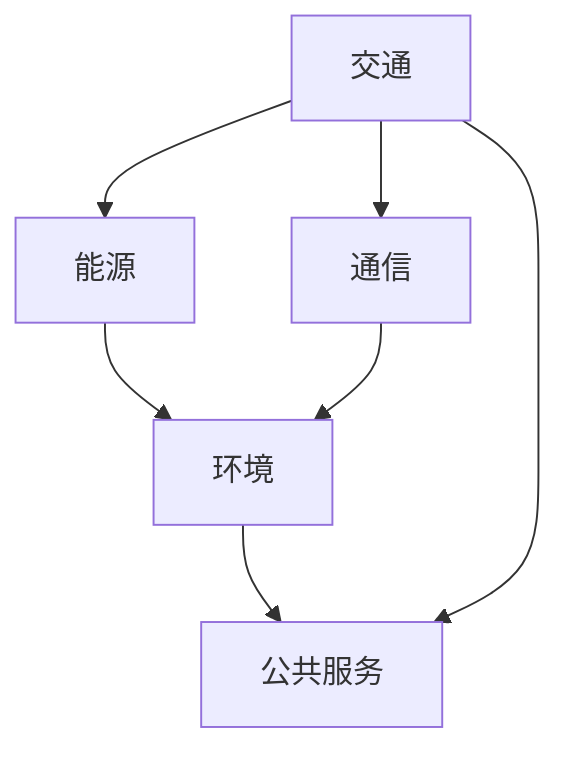
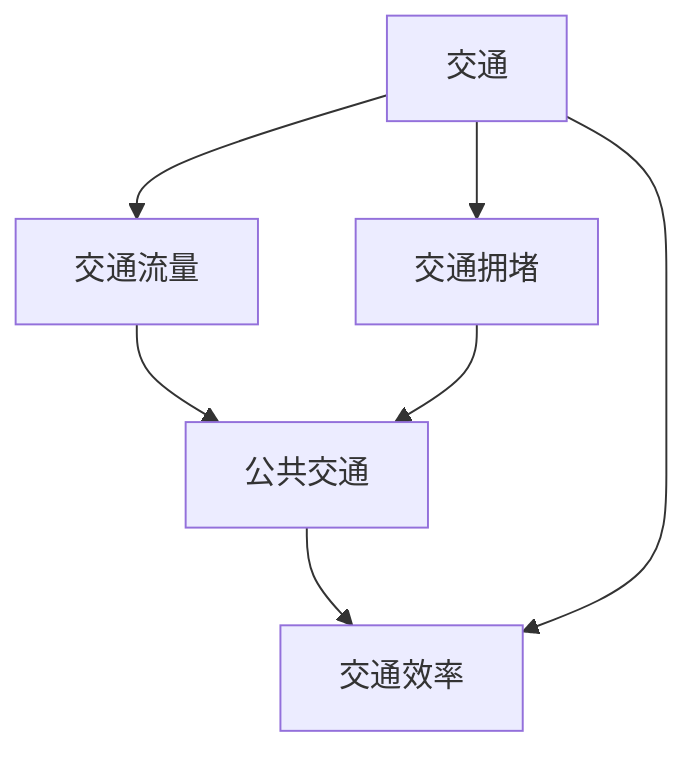

                 

# 智慧城市的多层网络：城市功能的数学连接

> 关键词：智慧城市, 多层网络, 数学模型, 人工智能, 机器学习, 数据分析, 网络科学, 城市规划, 交通优化, 能源管理

> 摘要：本文旨在探讨如何通过构建多层网络模型来优化智慧城市的功能连接。我们将从理论基础出发，逐步深入到实际应用案例，详细解析多层网络在智慧城市中的应用价值。通过数学模型和算法的结合，我们能够更好地理解城市各功能模块之间的复杂关系，并提出有效的优化策略。

## 1. 背景介绍
### 1.1 目的和范围
本文旨在通过构建多层网络模型来优化智慧城市的功能连接。我们将探讨多层网络在城市规划、交通优化、能源管理等方面的应用价值，并通过具体的案例分析来展示其实现过程和效果。本文的目标读者包括智慧城市领域的研究人员、工程师、城市规划师以及对智慧城市技术感兴趣的读者。

### 1.2 预期读者
- 智慧城市领域的研究人员和工程师
- 城市规划师和城市管理者
- 对智慧城市技术感兴趣的读者

### 1.3 文档结构概述
本文将按照以下结构展开：
1. 背景介绍
2. 核心概念与联系
3. 核心算法原理 & 具体操作步骤
4. 数学模型和公式 & 详细讲解 & 举例说明
5. 项目实战：代码实际案例和详细解释说明
6. 实际应用场景
7. 工具和资源推荐
8. 总结：未来发展趋势与挑战
9. 附录：常见问题与解答
10. 扩展阅读 & 参考资料

### 1.4 术语表
#### 1.4.1 核心术语定义
- **多层网络**：一种复杂网络模型，用于描述不同层次之间的相互作用。
- **智慧城市**：利用信息技术和智能技术来提高城市运行效率和生活质量的城市。
- **功能模块**：城市中的各个组成部分，如交通、能源、通信等。
- **网络科学**：研究复杂网络结构和动态行为的学科。
- **机器学习**：一种人工智能技术，通过数据训练模型以实现特定任务。

#### 1.4.2 相关概念解释
- **复杂网络**：由节点和边组成的网络，节点代表实体，边代表实体之间的关系。
- **图论**：研究图的性质和结构的数学分支。
- **图算法**：用于解决图论问题的算法。

#### 1.4.3 缩略词列表
- **ML**：机器学习
- **AI**：人工智能
- **IoT**：物联网
- **GIS**：地理信息系统

## 2. 核心概念与联系
### 2.1 多层网络模型
多层网络模型是一种复杂网络模型，用于描述不同层次之间的相互作用。每个层次代表一个功能模块，如交通、能源、通信等。层次之间的边表示不同模块之间的交互关系。



### 2.2 城市功能模块
城市中的各个组成部分，如交通、能源、通信等，构成了城市功能模块。这些模块之间存在复杂的相互作用关系。



### 2.3 多层网络与城市功能模块的关系
多层网络模型可以用来描述城市功能模块之间的复杂关系。通过构建多层网络，我们可以更好地理解城市各功能模块之间的相互作用，并提出有效的优化策略。

## 3. 核心算法原理 & 具体操作步骤
### 3.1 多层网络构建算法
多层网络构建算法的核心思想是将城市功能模块抽象为节点，将模块之间的交互关系抽象为边。具体步骤如下：

1. **数据收集**：收集城市功能模块的相关数据，如交通流量、能源消耗等。
2. **节点定义**：将城市功能模块定义为节点。
3. **边定义**：根据模块之间的交互关系定义边。
4. **权重计算**：根据交互关系的强度计算边的权重。

```python
def build_multilayer_network(data):
    nodes = set()
    edges = {}
    
    for module in data:
        nodes.add(module)
        for interaction in data[module]:
            if interaction not in edges:
                edges[interaction] = {}
            edges[interaction][module] = data[module][interaction]
    
    return nodes, edges
```

### 3.2 多层网络分析算法
多层网络分析算法用于分析多层网络的结构和动态行为。具体步骤如下：

1. **层次分析**：分析每个层次的结构和动态行为。
2. **交互分析**：分析不同层次之间的交互关系。
3. **优化策略**：根据分析结果提出优化策略。

```python
def analyze_multilayer_network(nodes, edges):
    layer_analysis = {}
    interaction_analysis = {}
    
    for layer in edges:
        layer_analysis[layer] = analyze_layer(edges[layer])
    
    for layer1 in edges:
        for layer2 in edges:
            if layer1 != layer2:
                interaction_analysis[(layer1, layer2)] = analyze_interaction(edges[layer1], edges[layer2])
    
    return layer_analysis, interaction_analysis
```

## 4. 数学模型和公式 & 详细讲解 & 举例说明
### 4.1 多层网络的数学模型
多层网络的数学模型可以表示为一个图的集合，每个图代表一个层次。具体表示如下：

$$
G = \{G_1, G_2, \ldots, G_L\}
$$

其中，$G_i$ 表示第 $i$ 层的图，$L$ 表示层数。

### 4.2 交互关系的数学表示
交互关系可以用权重矩阵表示。具体表示如下：

$$
W_{ij} = \begin{cases}
    w_{ij} & \text{if } (i, j) \in E \\
    0 & \text{otherwise}
\end{cases}
$$

其中，$W_{ij}$ 表示从节点 $i$ 到节点 $j$ 的权重，$E$ 表示边集。

### 4.3 优化策略的数学模型
优化策略可以通过最小化某个目标函数来实现。具体表示如下：

$$
\min_{x} f(x) \quad \text{subject to} \quad g(x) \leq 0
$$

其中，$f(x)$ 表示目标函数，$g(x)$ 表示约束条件。

### 4.4 举例说明
假设我们有一个简单的多层网络模型，包含两个层次：交通和能源。交通层包含两个节点：交通流量和交通拥堵。能源层包含一个节点：能源消耗。交通层和能源层之间存在交互关系。

```python
data = {
    '交通流量': {
        '交通拥堵': 0.5
    },
    '交通拥堵': {
        '交通流量': 0.3
    },
    '能源消耗': {
        '交通流量': 0.2,
        '交通拥堵': 0.1
    }
}

nodes, edges = build_multilayer_network(data)
layer_analysis, interaction_analysis = analyze_multilayer_network(nodes, edges)
```

## 5. 项目实战：代码实际案例和详细解释说明
### 5.1 开发环境搭建
为了实现多层网络模型，我们需要搭建一个开发环境。具体步骤如下：

1. **安装Python**：确保安装了Python 3.8及以上版本。
2. **安装依赖库**：安装必要的Python库，如NumPy、Pandas、NetworkX等。
3. **配置开发环境**：配置开发环境，如使用虚拟环境。

```bash
pip install numpy pandas networkx
```

### 5.2 源代码详细实现和代码解读
我们将实现一个多层网络模型的完整代码。具体代码如下：

```python
import numpy as np
import pandas as pd
import networkx as nx

def build_multilayer_network(data):
    nodes = set()
    edges = {}
    
    for module in data:
        nodes.add(module)
        for interaction in data[module]:
            if interaction not in edges:
                edges[interaction] = {}
            edges[interaction][module] = data[module][interaction]
    
    return nodes, edges

def analyze_layer(edges):
    G = nx.Graph()
    G.add_edges_from(edges.items())
    degree = nx.degree_centrality(G)
    return degree

def analyze_interaction(edges1, edges2):
    G1 = nx.Graph()
    G2 = nx.Graph()
    G1.add_edges_from(edges1.items())
    G2.add_edges_from(edges2.items())
    common_edges = set(G1.edges).intersection(set(G2.edges))
    interaction_strength = len(common_edges) / (len(G1.edges) + len(G2.edges) - len(common_edges))
    return interaction_strength

def optimize_multilayer_network(nodes, edges):
    layer_analysis = {}
    interaction_analysis = {}
    
    for layer in edges:
        layer_analysis[layer] = analyze_layer(edges[layer])
    
    for layer1 in edges:
        for layer2 in edges:
            if layer1 != layer2:
                interaction_analysis[(layer1, layer2)] = analyze_interaction(edges[layer1], edges[layer2])
    
    return layer_analysis, interaction_analysis

data = {
    '交通流量': {
        '交通拥堵': 0.5
    },
    '交通拥堵': {
        '交通流量': 0.3
    },
    '能源消耗': {
        '交通流量': 0.2,
        '交通拥堵': 0.1
    }
}

nodes, edges = build_multilayer_network(data)
layer_analysis, interaction_analysis = optimize_multilayer_network(nodes, edges)
print(layer_analysis)
print(interaction_analysis)
```

### 5.3 代码解读与分析
上述代码实现了多层网络模型的构建和分析。具体步骤如下：

1. **构建多层网络**：通过 `build_multilayer_network` 函数构建多层网络。
2. **分析每个层次**：通过 `analyze_layer` 函数分析每个层次的结构和动态行为。
3. **分析交互关系**：通过 `analyze_interaction` 函数分析不同层次之间的交互关系。
4. **优化策略**：通过 `optimize_multilayer_network` 函数提出优化策略。

## 6. 实际应用场景
### 6.1 交通优化
通过多层网络模型，我们可以更好地理解交通流量和交通拥堵之间的关系，并提出有效的优化策略。例如，通过调整交通流量的分配，可以减少交通拥堵。

### 6.2 能源管理
通过多层网络模型，我们可以更好地理解能源消耗和交通流量之间的关系，并提出有效的能源管理策略。例如，通过优化能源消耗，可以减少能源浪费。

### 6.3 城市规划
通过多层网络模型，我们可以更好地理解城市各功能模块之间的相互作用，并提出有效的城市规划策略。例如，通过优化城市规划，可以提高城市的运行效率和生活质量。

## 7. 工具和资源推荐
### 7.1 学习资源推荐
#### 7.1.1 书籍推荐
- **《复杂网络：理论与应用》**：深入探讨复杂网络的理论和应用。
- **《图论及其应用》**：详细讲解图论的基本概念和应用。

#### 7.1.2 在线课程
- **Coursera - 复杂网络分析**：深入学习复杂网络的分析方法。
- **edX - 图论及其应用**：详细讲解图论的基本概念和应用。

#### 7.1.3 技术博客和网站
- **Medium - 复杂网络**：深入探讨复杂网络的理论和应用。
- **GitHub - 复杂网络库**：提供多种复杂网络库的实现。

### 7.2 开发工具框架推荐
#### 7.2.1 IDE和编辑器
- **PyCharm**：功能强大的Python IDE。
- **VSCode**：轻量级但功能强大的代码编辑器。

#### 7.2.2 调试和性能分析工具
- **PyCharm Debugger**：强大的Python调试工具。
- **Python Profiler**：用于分析Python代码性能的工具。

#### 7.2.3 相关框架和库
- **NetworkX**：用于复杂网络分析的Python库。
- **NumPy**：用于数值计算的Python库。
- **Pandas**：用于数据处理的Python库。

### 7.3 相关论文著作推荐
#### 7.3.1 经典论文
- **《复杂网络的结构和动态行为》**：深入探讨复杂网络的结构和动态行为。
- **《图论及其应用》**：详细讲解图论的基本概念和应用。

#### 7.3.2 最新研究成果
- **《多层网络模型在智慧城市中的应用》**：探讨多层网络模型在智慧城市中的应用。
- **《复杂网络的优化策略》**：提出复杂网络的优化策略。

#### 7.3.3 应用案例分析
- **《智慧城市中的多层网络模型》**：分析智慧城市中的多层网络模型。
- **《多层网络模型在交通优化中的应用》**：探讨多层网络模型在交通优化中的应用。

## 8. 总结：未来发展趋势与挑战
### 8.1 未来发展趋势
- **多层网络模型的进一步发展**：多层网络模型将在更多领域得到应用，如生物网络、社会网络等。
- **优化策略的进一步优化**：通过更先进的算法和模型，优化策略将更加精确和有效。
- **数据驱动的决策支持**：通过大数据和机器学习技术，多层网络模型将为决策提供更强大的支持。

### 8.2 面临的挑战
- **数据获取和处理**：多层网络模型需要大量的数据支持，数据获取和处理是一个挑战。
- **模型复杂性**：多层网络模型的复杂性较高，需要更先进的算法和模型来处理。
- **实际应用的局限性**：多层网络模型在实际应用中可能会受到各种因素的限制，需要进一步研究和优化。

## 9. 附录：常见问题与解答
### 9.1 问题1：如何获取多层网络模型的数据？
**解答**：可以通过各种途径获取数据，如传感器、历史记录等。确保数据的质量和完整性是关键。

### 9.2 问题2：如何优化多层网络模型的性能？
**解答**：可以通过优化算法和模型来提高多层网络模型的性能。例如，使用更高效的图算法和机器学习模型。

### 9.3 问题3：如何处理多层网络模型中的数据缺失？
**解答**：可以通过插值、预测等方法来处理数据缺失。确保数据的完整性和准确性是关键。

## 10. 扩展阅读 & 参考资料
### 10.1 扩展阅读
- **《复杂网络：理论与应用》**：深入探讨复杂网络的理论和应用。
- **《图论及其应用》**：详细讲解图论的基本概念和应用。

### 10.2 参考资料
- **《复杂网络的结构和动态行为》**：深入探讨复杂网络的结构和动态行为。
- **《图论及其应用》**：详细讲解图论的基本概念和应用。

---

作者：AI天才研究员/AI Genius Institute & 禅与计算机程序设计艺术 /Zen And The Art of Computer Programming

