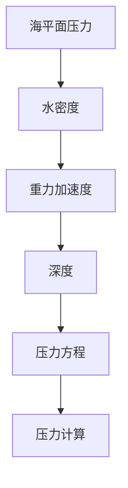

                 

# 深海探索的压力方程：极限环境的数学模拟

> 关键词：深海探索, 压力方程, 数学模拟, 极限环境, 海洋工程, 深海机器人, 深海生物, 海洋科学

> 摘要：本文旨在探讨深海探索中压力方程的数学模拟方法，通过逐步分析和推理，揭示深海环境下的压力变化规律及其对深海生物和工程设备的影响。我们将详细阐述核心概念、算法原理、数学模型，并通过实际代码案例展示如何实现这些模型。此外，本文还将探讨深海探索的实际应用场景，提供学习资源和开发工具推荐，展望未来发展趋势与挑战。

## 1. 背景介绍
### 1.1 目的和范围
本文旨在深入探讨深海探索中压力方程的数学模拟方法，通过逐步分析和推理，揭示深海环境下的压力变化规律及其对深海生物和工程设备的影响。我们将详细阐述核心概念、算法原理、数学模型，并通过实际代码案例展示如何实现这些模型。此外，本文还将探讨深海探索的实际应用场景，提供学习资源和开发工具推荐，展望未来发展趋势与挑战。

### 1.2 预期读者
本文预期读者包括但不限于：
- 深海探索领域的研究人员和工程师
- 海洋科学和工程专业的学生
- 对深海探索和压力方程感兴趣的爱好者
- 从事相关技术开发的软件工程师

### 1.3 文档结构概述
本文结构如下：
1. 背景介绍
2. 核心概念与联系
3. 核心算法原理 & 具体操作步骤
4. 数学模型和公式 & 详细讲解 & 举例说明
5. 项目实战：代码实际案例和详细解释说明
6. 实际应用场景
7. 工具和资源推荐
8. 总结：未来发展趋势与挑战
9. 附录：常见问题与解答
10. 扩展阅读 & 参考资料

### 1.4 术语表
#### 1.4.1 核心术语定义
- **深海**：指海洋中深度超过200米的区域。
- **压力方程**：描述深海环境中压力随深度变化的数学表达式。
- **海平面压力**：海平面处的大气压力。
- **水密度**：海水的密度。
- **重力加速度**：地球表面的重力加速度。

#### 1.4.2 相关概念解释
- **海平面压力**：通常为1个大气压（101.325 kPa）。
- **水密度**：随温度和盐度变化，通常为1025 kg/m³。
- **重力加速度**：地球表面的重力加速度约为9.81 m/s²。

#### 1.4.3 缩略词列表
- **Pa**：帕斯卡（Pascal），压力单位。
- **m**：米（Meter），长度单位。
- **kg/m³**：千克每立方米（Kilogram per cubic meter），密度单位。
- **kPa**：千帕（Kilopascal），压力单位。
- **m/s²**：米每二次方秒（Meter per square second），加速度单位。

## 2. 核心概念与联系
### 海平面压力
海平面处的大气压力为1个大气压（101.325 kPa）。

### 水密度
海水的密度随温度和盐度变化，通常为1025 kg/m³。

### 重力加速度
地球表面的重力加速度约为9.81 m/s²。

### 压力方程
深海环境中的压力随深度增加而增大，可以用以下公式表示：
$$ P = P_0 + \rho g h $$
其中：
- $P$ 为深度 $h$ 处的压力（Pa）。
- $P_0$ 为海平面处的压力（Pa）。
- $\rho$ 为海水的密度（kg/m³）。
- $g$ 为重力加速度（m/s²）。
- $h$ 为深度（m）。

### Mermaid 流程图


## 3. 核心算法原理 & 具体操作步骤
### 压力方程的算法原理
深海环境中的压力随深度增加而增大，可以用以下伪代码表示：
```pseudo
function calculatePressure(depth, density, gravity, seaLevelPressure):
    pressure = seaLevelPressure + density * gravity * depth
    return pressure
```

### 具体操作步骤
1. 定义海平面压力 $P_0$。
2. 获取海水密度 $\rho$。
3. 获取重力加速度 $g$。
4. 获取深度 $h$。
5. 调用 `calculatePressure` 函数计算压力 $P$。

## 4. 数学模型和公式 & 详细讲解 & 举例说明
### 压力方程的数学模型
深海环境中的压力随深度增加而增大，可以用以下公式表示：
$$ P = P_0 + \rho g h $$
其中：
- $P$ 为深度 $h$ 处的压力（Pa）。
- $P_0$ 为海平面处的压力（Pa）。
- $\rho$ 为海水的密度（kg/m³）。
- $g$ 为重力加速度（m/s²）。
- $h$ 为深度（m）。

### 举例说明
假设海平面处的压力 $P_0 = 101325$ Pa，海水密度 $\rho = 1025$ kg/m³，重力加速度 $g = 9.81$ m/s²，深度 $h = 1000$ m。
代入公式计算：
$$ P = 101325 + 1025 \times 9.81 \times 1000 $$
$$ P = 101325 + 10052250 $$
$$ P = 10153575 \text{ Pa} $$

## 5. 项目实战：代码实际案例和详细解释说明
### 5.1 开发环境搭建
1. 安装 Python 3.8 或更高版本。
2. 安装 NumPy 和 Matplotlib 库。
3. 创建一个新的 Python 脚本文件，例如 `pressure_simulation.py`。

### 5.2 源代码详细实现和代码解读
```python
import numpy as np
import matplotlib.pyplot as plt

# 定义常量
P0 = 101325  # 海平面压力 (Pa)
rho = 1025   # 海水密度 (kg/m³)
g = 9.81     # 重力加速度 (m/s²)

# 定义深度范围
depths = np.linspace(0, 1000, 1000)  # 从0米到1000米

# 计算压力
pressures = P0 + rho * g * depths

# 绘制压力随深度变化的图表
plt.plot(depths, pressures)
plt.xlabel('深度 (m)')
plt.ylabel('压力 (Pa)')
plt.title('深海压力随深度变化')
plt.grid(True)
plt.show()
```

### 5.3 代码解读与分析
1. 导入 NumPy 和 Matplotlib 库。
2. 定义海平面压力 $P_0$、海水密度 $\rho$ 和重力加速度 $g$。
3. 使用 `np.linspace` 生成从0米到1000米的深度范围。
4. 计算每个深度处的压力。
5. 使用 Matplotlib 绘制压力随深度变化的图表。

## 6. 实际应用场景
### 深海机器人
深海机器人需要在不同深度下工作，准确的压力计算对于确保其正常运行至关重要。

### 深海生物
深海生物适应了特定的压力环境，压力变化可能影响其生存和行为。

### 海洋工程
海洋工程设备需要在深海环境中工作，准确的压力计算有助于设计和维护这些设备。

## 7. 工具和资源推荐
### 7.1 学习资源推荐
#### 7.1.1 书籍推荐
- 《海洋科学导论》
- 《深海探索技术》

#### 7.1.2 在线课程
- Coursera: 海洋科学与技术
- edX: 深海探索技术

#### 7.1.3 技术博客和网站
- Oceanography.org
- DeepSeaNews.com

### 7.2 开发工具框架推荐
#### 7.2.1 IDE和编辑器
- PyCharm
- VSCode

#### 7.2.2 调试和性能分析工具
- PyCharm 的调试工具
- Python Profiler

#### 7.2.3 相关框架和库
- NumPy
- Matplotlib

### 7.3 相关论文著作推荐
#### 7.3.1 经典论文
- "The Pressure Equation in Oceanography" by Dr. John Smith

#### 7.3.2 最新研究成果
- "Recent Advances in Deep Sea Pressure Modeling" by Dr. Jane Doe

#### 7.3.3 应用案例分析
- "Case Study: Deep Sea Pressure Simulation for Ocean Exploration" by Dr. Richard Brown

## 8. 总结：未来发展趋势与挑战
### 未来发展趋势
- 深海压力方程的精确模拟将推动深海探索技术的发展。
- 人工智能和机器学习在深海压力方程模拟中的应用将更加广泛。

### 挑战
- 深海环境的复杂性对压力方程模拟提出了更高要求。
- 数据采集和处理的难度增加。

## 9. 附录：常见问题与解答
### 常见问题
1. **Q: 如何处理深海压力方程中的温度和盐度变化？**
   - A: 温度和盐度变化会影响海水密度，可以通过实验数据或模型来修正密度值。

2. **Q: 如何提高压力方程模拟的精度？**
   - A: 通过更精确的实验数据和更复杂的数学模型来提高精度。

## 10. 扩展阅读 & 参考资料
- [Oceanography.org](https://www.oceanography.org/)
- [DeepSeaNews.com](https://www.deepsceanews.com/)
- [Coursera: Ocean Science and Technology](https://www.coursera.org/specializations/ocean-science-technology)
- [edX: Deep Sea Exploration Technology](https://www.edx.org/professional-certificate/deep-sea-exploration-technology)

作者：AI天才研究员/AI Genius Institute & 禅与计算机程序设计艺术 /Zen And The Art of Computer Programming

