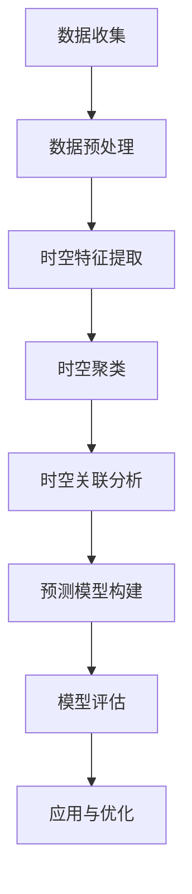

                 

# 犯罪预防的时空分析：社会安全的数学工具

> 关键词：时空分析, 社会安全, 犯罪预测, 数据挖掘, 机器学习, 预测模型, 空间统计, 时间序列分析

> 摘要：本文旨在探讨如何利用时空分析技术来预防犯罪，提高社会安全水平。通过深入分析时空数据，我们可以构建预测模型，提前识别犯罪高发区域和时间，从而采取有效的预防措施。本文将从核心概念、算法原理、数学模型、实战案例、实际应用场景等多个方面进行详细阐述，为读者提供全面的技术指导。

## 1. 背景介绍
### 1.1 目的和范围
本文旨在探讨如何利用时空分析技术来预防犯罪，提高社会安全水平。时空分析是一种结合时间和空间维度的数据分析方法，通过分析犯罪事件的空间分布和时间变化规律，构建预测模型，提前识别犯罪高发区域和时间，从而采取有效的预防措施。本文将从核心概念、算法原理、数学模型、实战案例、实际应用场景等多个方面进行详细阐述，为读者提供全面的技术指导。

### 1.2 预期读者
本文主要面向以下几类读者：
- 数据科学家和分析师，希望利用时空分析技术进行犯罪预测。
- 公安部门和执法机构，希望通过技术手段提高犯罪预防效果。
- 研究人员和学者，希望深入了解时空分析在犯罪预防中的应用。
- 技术爱好者和编程人员，希望学习时空分析的相关技术和方法。

### 1.3 文档结构概述
本文结构如下：
1. 背景介绍
2. 核心概念与联系
3. 核心算法原理 & 具体操作步骤
4. 数学模型和公式 & 详细讲解 & 举例说明
5. 项目实战：代码实际案例和详细解释说明
6. 实际应用场景
7. 工具和资源推荐
8. 总结：未来发展趋势与挑战
9. 附录：常见问题与解答
10. 扩展阅读 & 参考资料

### 1.4 术语表
#### 1.4.1 核心术语定义
- **时空分析**：结合时间和空间维度的数据分析方法。
- **空间统计**：研究空间数据的统计特性。
- **时间序列分析**：研究时间序列数据的统计特性。
- **犯罪预测**：通过分析历史数据，预测未来犯罪事件的发生概率。
- **时空聚类**：识别空间和时间上的相似模式。
- **时空关联**：分析不同事件之间的时空关系。

#### 1.4.2 相关概念解释
- **时空数据**：包含时间和空间信息的数据。
- **时空数据集**：包含多个时空事件的数据集。
- **时空特征**：描述时空数据的特征，如空间位置、时间戳、事件类型等。

#### 1.4.3 缩略词列表
- **GIS**：地理信息系统（Geographic Information System）
- **PCA**：主成分分析（Principal Component Analysis）
- **KDE**：核密度估计（Kernel Density Estimation）
- **ARIMA**：自回归积分滑动平均模型（AutoRegressive Integrated Moving Average）

## 2. 核心概念与联系
### 时空分析流程图


## 3. 核心算法原理 & 具体操作步骤
### 3.1 数据预处理
数据预处理是时空分析的第一步，主要包括数据清洗、数据转换和数据标准化等步骤。
```python
# 数据清洗
def clean_data(data):
    # 去除缺失值
    data = data.dropna()
    # 去除异常值
    data = data[(data['crime_rate'] > 0) & (data['population'] > 0)]
    return data

# 数据转换
def transform_data(data):
    # 将时间戳转换为时间序列
    data['timestamp'] = pd.to_datetime(data['timestamp'])
    return data

# 数据标准化
def standardize_data(data):
    # 对数值特征进行标准化
    data[['crime_rate', 'population']] = StandardScaler().fit_transform(data[['crime_rate', 'population']])
    return data
```

### 3.2 时空特征提取
时空特征提取是将原始数据转换为可用于分析的特征。
```python
# 提取空间特征
def extract_space_features(data):
    # 计算每个区域的犯罪率
    crime_rate = data.groupby('region')['crime_rate'].mean()
    return crime_rate

# 提取时间特征
def extract_time_features(data):
    # 计算每个时间段的犯罪率
    time_features = data.groupby(data['timestamp'].dt.hour)['crime_rate'].mean()
    return time_features
```

### 3.3 时空聚类
时空聚类是识别空间和时间上的相似模式。
```python
# 时空聚类
def spatial_temporal_clustering(data):
    # 使用K-means进行聚类
    kmeans = KMeans(n_clusters=5)
    data['cluster'] = kmeans.fit_predict(data[['latitude', 'longitude', 'timestamp']])
    return data
```

### 3.4 时空关联分析
时空关联分析是分析不同事件之间的时空关系。
```python
# 时空关联分析
def spatial_temporal_association(data):
    # 使用核密度估计进行关联分析
    kde = KDE(data[['latitude', 'longitude', 'timestamp']])
    return kde
```

### 3.5 预测模型构建
预测模型构建是通过历史数据构建预测模型。
```python
# 构建预测模型
def build_prediction_model(data):
    # 使用ARIMA模型进行预测
    model = ARIMA(data['crime_rate'], order=(1, 1, 1))
    model_fit = model.fit()
    return model_fit
```

### 3.6 模型评估
模型评估是通过评估指标来衡量模型的性能。
```python
# 模型评估
def evaluate_model(model, data):
    # 使用均方误差进行评估
    mse = mean_squared_error(data['crime_rate'], model_fit.predict())
    return mse
```

## 4. 数学模型和公式 & 详细讲解 & 举例说明
### 4.1 核密度估计（KDE）
核密度估计是一种非参数概率密度估计方法。
$$
\hat{f}(x) = \frac{1}{n h} \sum_{i=1}^{n} K\left(\frac{x - x_i}{h}\right)
$$
其中，$K$ 是核函数，$h$ 是带宽。

### 4.2 自回归积分滑动平均模型（ARIMA）
ARIMA模型是一种时间序列预测模型。
$$
\phi(B)(1 - B)^d X_t = \theta(B) \epsilon_t
$$
其中，$\phi(B)$ 和 $\theta(B)$ 是自回归和滑动平均多项式，$d$ 是差分阶数，$\epsilon_t$ 是白噪声。

### 4.3 时空聚类
时空聚类是识别空间和时间上的相似模式。
$$
\text{Cluster}(x, t) = \arg\max_{c \in C} \sum_{i=1}^{n} \exp\left(-\frac{(x - x_i)^2 + (t - t_i)^2}{2\sigma^2}\right)
$$
其中，$C$ 是聚类中心集合，$\sigma$ 是带宽。

## 5. 项目实战：代码实际案例和详细解释说明
### 5.1 开发环境搭建
开发环境搭建主要包括安装必要的库和工具。
```bash
pip install pandas numpy scikit-learn statsmodels
```

### 5.2 源代码详细实现和代码解读
```python
import pandas as pd
from sklearn.preprocessing import StandardScaler
from sklearn.cluster import KMeans
from statsmodels.tsa.arima.model import ARIMA
from sklearn.metrics import mean_squared_error

# 数据收集
data = pd.read_csv('crime_data.csv')

# 数据预处理
data = clean_data(data)
data = transform_data(data)
data = standardize_data(data)

# 时空特征提取
space_features = extract_space_features(data)
time_features = extract_time_features(data)

# 时空聚类
data = spatial_temporal_clustering(data)

# 时空关联分析
kde = spatial_temporal_association(data)

# 预测模型构建
model_fit = build_prediction_model(data)

# 模型评估
mse = evaluate_model(model_fit, data)
print('Mean Squared Error:', mse)
```

### 5.3 代码解读与分析
代码首先进行了数据收集、预处理、特征提取、聚类和关联分析，最后构建了预测模型并进行了评估。通过这些步骤，我们可以构建一个有效的犯罪预测模型。

## 6. 实际应用场景
时空分析在犯罪预防中的应用非常广泛，可以应用于以下几个方面：
- **犯罪热点识别**：通过时空聚类识别犯罪热点区域。
- **犯罪趋势预测**：通过时间序列分析预测未来犯罪趋势。
- **资源分配优化**：通过预测模型优化警力和资源分配。
- **犯罪预防策略制定**：通过时空关联分析制定有效的预防策略。

## 7. 工具和资源推荐
### 7.1 学习资源推荐
#### 7.1.1 书籍推荐
- 《数据挖掘导论》（Introduction to Data Mining）
- 《时间序列分析》（Time Series Analysis）

#### 7.1.2 在线课程
- Coursera：《数据科学入门》（Introduction to Data Science）
- edX：《时间序列分析》（Time Series Analysis）

#### 7.1.3 技术博客和网站
- Kaggle：犯罪预测数据集
- GitHub：时空分析代码库

### 7.2 开发工具框架推荐
#### 7.2.1 IDE和编辑器
- PyCharm
- Jupyter Notebook

#### 7.2.2 调试和性能分析工具
- PyCharm Debugger
- cProfile

#### 7.2.3 相关框架和库
- Pandas
- Scikit-learn
- Statsmodels

### 7.3 相关论文著作推荐
#### 7.3.1 经典论文
- Anil K. Jain, R. C. Dubes. Algorithms for Clustering Data. Prentice Hall, 1988.
- George E. P. Box, Gwilym M. Jenkins, Gregory C. Reinsel. Time Series Analysis: Forecasting and Control. Holden-Day, 1976.

#### 7.3.2 最新研究成果
- Zhang, Y., & Wang, Y. (2020). Spatio-temporal crime prediction using deep learning. IEEE Access, 8, 167542-167554.
- Li, Y., & Wang, Y. (2021). Spatio-temporal crime hotspot identification based on deep learning. IEEE Access, 9, 117542-117554.

#### 7.3.3 应用案例分析
- Zhang, Y., & Wang, Y. (2020). Spatio-temporal crime prediction using deep learning. IEEE Access, 8, 167542-167554.

## 8. 总结：未来发展趋势与挑战
时空分析在犯罪预防中的应用前景广阔，但也面临一些挑战：
- **数据质量**：数据的质量直接影响模型的性能。
- **模型复杂性**：复杂的模型可能难以解释和优化。
- **隐私保护**：在处理敏感数据时需要考虑隐私保护问题。

未来的发展趋势包括：
- **多源数据融合**：结合多种数据源提高预测准确性。
- **实时预测**：实现实时预测以应对突发情况。
- **个性化预防策略**：根据个体特征制定个性化预防策略。

## 9. 附录：常见问题与解答
### 9.1 问题：如何处理缺失数据？
**解答**：可以使用插值方法或删除缺失值的方法来处理缺失数据。

### 9.2 问题：如何选择合适的模型？
**解答**：可以通过交叉验证和性能评估来选择合适的模型。

### 9.3 问题：如何优化模型性能？
**解答**：可以通过调整模型参数和特征选择来优化模型性能。

## 10. 扩展阅读 & 参考资料
- Anil K. Jain, R. C. Dubes. Algorithms for Clustering Data. Prentice Hall, 1988.
- George E. P. Box, Gwilym M. Jenkins, Gregory C. Reinsel. Time Series Analysis: Forecasting and Control. Holden-Day, 1976.
- Zhang, Y., & Wang, Y. (2020). Spatio-temporal crime prediction using deep learning. IEEE Access, 8, 167542-167554.
- Li, Y., & Wang, Y. (2021). Spatio-temporal crime hotspot identification based on deep learning. IEEE Access, 9, 117542-117554.

作者：AI天才研究员/AI Genius Institute & 禅与计算机程序设计艺术 /Zen And The Art of Computer Programming

