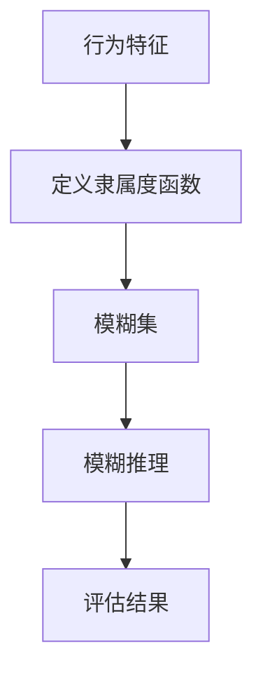

                 

# 社会信用的模糊集理论：行为评估的数学模型

> 关键词：社会信用，模糊集理论，行为评估，数学模型，人工智能，机器学习，伦理道德

> 摘要：本文旨在探讨如何利用模糊集理论构建社会信用评估的数学模型。通过深入分析模糊集理论的核心概念及其在行为评估中的应用，本文将介绍一种基于模糊集理论的社会信用评估方法，并通过具体的算法原理、数学模型和实际代码案例，展示如何实现这一模型。此外，本文还将讨论该模型在实际应用场景中的优势与挑战，并提供相关的学习资源和开发工具推荐，以帮助读者更好地理解和应用这一理论。

## 1. 背景介绍
### 1.1 目的和范围
本文旨在探讨如何利用模糊集理论构建社会信用评估的数学模型。随着社会信用体系的逐步建立和完善，如何客观、公正地评估个体或组织的社会信用成为了一个重要的研究课题。本文将从理论和实践两个层面出发，介绍一种基于模糊集理论的社会信用评估方法，并通过具体的算法原理、数学模型和实际代码案例，展示如何实现这一模型。

### 1.2 预期读者
本文主要面向对社会信用评估感兴趣的研究人员、工程师、数据科学家以及相关领域的专业人士。读者应具备一定的数学基础和编程能力，特别是对模糊集理论和机器学习有一定了解。

### 1.3 文档结构概述
本文将按照以下结构展开：
1. 背景介绍
2. 核心概念与联系
3. 核心算法原理 & 具体操作步骤
4. 数学模型和公式 & 详细讲解 & 举例说明
5. 项目实战：代码实际案例和详细解释说明
6. 实际应用场景
7. 工具和资源推荐
8. 总结：未来发展趋势与挑战
9. 附录：常见问题与解答
10. 扩展阅读 & 参考资料

### 1.4 术语表
#### 1.4.1 核心术语定义
- **模糊集**：一种数学工具，用于描述和处理不确定性、不精确性或模糊性。
- **隶属度函数**：描述元素属于某个集合的程度。
- **社会信用**：个体或组织在社会中的信誉度，通常基于其行为表现。
- **行为评估**：对个体或组织行为进行量化和评价的过程。
- **模糊推理**：基于模糊集理论进行的逻辑推理过程。

#### 1.4.2 相关概念解释
- **隶属度函数**：通常用一个连续的函数来表示，取值范围为[0, 1]，表示元素属于某个集合的程度。
- **模糊集**：由一组具有隶属度的元素组成的集合。
- **模糊逻辑**：一种处理不确定性、不精确性和模糊性的逻辑系统。

#### 1.4.3 缩略词列表
- **FS**：Fuzzy Set（模糊集）
- **MF**：Membership Function（隶属度函数）
- **FL**：Fuzzy Logic（模糊逻辑）

## 2. 核心概念与联系
### 2.1 模糊集理论概述
模糊集理论是一种处理不确定性、不精确性和模糊性的数学工具。它通过隶属度函数来描述元素属于某个集合的程度，从而能够更准确地描述现实世界中的复杂情况。

### 2.2 模糊集与行为评估的关系
在行为评估中，模糊集理论可以用来描述个体或组织的行为特征。通过定义合适的隶属度函数，可以将行为特征量化为一个模糊集，从而实现对行为的评估。

### 2.3 模糊推理在行为评估中的应用
模糊推理是一种基于模糊集理论的逻辑推理方法，可以用来处理行为评估中的不确定性。通过模糊推理，可以将模糊集之间的关系转化为具体的评估结果。

### 2.4 模糊集理论的流程图


## 3. 核心算法原理 & 具体操作步骤
### 3.1 算法原理
#### 3.1.1 定义隶属度函数
首先，需要定义一个隶属度函数来描述行为特征的隶属度。例如，可以定义一个行为特征的隶属度函数为：
$$
\mu(x) = \frac{1}{1 + e^{-k(x - c)}}
$$
其中，$x$ 表示行为特征的值，$c$ 表示隶属度函数的中心值，$k$ 表示隶属度函数的陡峭程度。

#### 3.1.2 构建模糊集
根据定义的隶属度函数，可以构建一个模糊集。例如，可以将行为特征的值映射到一个模糊集：
$$
A = \{ (x, \mu(x)) \mid x \in X \}
$$
其中，$X$ 表示行为特征的取值范围。

#### 3.1.3 模糊推理
通过模糊推理，可以将模糊集之间的关系转化为具体的评估结果。例如，可以使用模糊推理规则来计算两个模糊集的交集：
$$
A \cap B = \{ (x, \min(\mu_A(x), \mu_B(x))) \mid x \in X \}
$$
其中，$\mu_A(x)$ 和 $\mu_B(x)$ 分别表示模糊集 $A$ 和 $B$ 的隶属度函数。

### 3.2 具体操作步骤
#### 3.2.1 定义隶属度函数
```python
def membership_function(x, c, k):
    return 1 / (1 + math.exp(-k * (x - c)))
```

#### 3.2.2 构建模糊集
```python
def build_fuzzy_set(x_values, c, k):
    fuzzy_set = [(x, membership_function(x, c, k)) for x in x_values]
    return fuzzy_set
```

#### 3.2.3 模糊推理
```python
def fuzzy_intersection(set1, set2):
    intersection = [(x, min(set1[x][1], set2[x][1])) for x in set1]
    return intersection
```

## 4. 数学模型和公式 & 详细讲解 & 举例说明
### 4.1 数学模型
#### 4.1.1 模糊集表示
假设有一个行为特征 $X$，其取值范围为 $[0, 10]$。定义隶属度函数为：
$$
\mu(x) = \frac{1}{1 + e^{-k(x - c)}}
$$
其中，$c = 5$ 表示隶属度函数的中心值，$k = 1$ 表示隶属度函数的陡峭程度。根据这个隶属度函数，可以构建一个模糊集：
$$
A = \{ (x, \mu(x)) \mid x \in [0, 10] \}
$$

#### 4.1.2 模糊推理规则
假设有两个模糊集 $A$ 和 $B$，其隶属度函数分别为：
$$
\mu_A(x) = \frac{1}{1 + e^{-k_A(x - c_A)}}
$$
$$
\mu_B(x) = \frac{1}{1 + e^{-k_B(x - c_B)}}
$$
其中，$c_A = 3$，$k_A = 1$；$c_B = 7$，$k_B = 1$。根据模糊推理规则，可以计算两个模糊集的交集：
$$
A \cap B = \{ (x, \min(\mu_A(x), \mu_B(x))) \mid x \in [0, 10] \}
$$

### 4.2 详细讲解
通过上述数学模型和公式，可以将行为特征量化为一个模糊集，并通过模糊推理规则计算两个模糊集的交集。这种模型可以有效地处理行为评估中的不确定性，从而实现更准确的行为评估。

### 4.3 举例说明
假设有一个行为特征 $X$，其取值范围为 $[0, 10]$。定义隶属度函数为：
$$
\mu(x) = \frac{1}{1 + e^{-k(x - c)}}
$$
其中，$c = 5$ 表示隶属度函数的中心值，$k = 1$ 表示隶属度函数的陡峭程度。根据这个隶属度函数，可以构建一个模糊集：
$$
A = \{ (x, \mu(x)) \mid x \in [0, 10] \}
$$

假设有两个模糊集 $A$ 和 $B$，其隶属度函数分别为：
$$
\mu_A(x) = \frac{1}{1 + e^{-k_A(x - c_A)}}
$$
$$
\mu_B(x) = \frac{1}{1 + e^{-k_B(x - c_B)}}
$$
其中，$c_A = 3$，$k_A = 1$；$c_B = 7$，$k_B = 1$。根据模糊推理规则，可以计算两个模糊集的交集：
$$
A \cap B = \{ (x, \min(\mu_A(x), \mu_B(x))) \mid x \in [0, 10] \}
$$

## 5. 项目实战：代码实际案例和详细解释说明
### 5.1 开发环境搭建
为了实现基于模糊集理论的社会信用评估模型，需要搭建一个开发环境。推荐使用Python作为开发语言，并安装必要的库，如NumPy、SciPy和Matplotlib。

### 5.2 源代码详细实现和代码解读
```python
import numpy as np
import matplotlib.pyplot as plt

def membership_function(x, c, k):
    return 1 / (1 + np.exp(-k * (x - c)))

def build_fuzzy_set(x_values, c, k):
    fuzzy_set = [(x, membership_function(x, c, k)) for x in x_values]
    return fuzzy_set

def fuzzy_intersection(set1, set2):
    intersection = [(x, min(set1[x][1], set2[x][1])) for x in set1]
    return intersection

# 定义行为特征的取值范围
x_values = np.linspace(0, 10, 100)

# 定义隶属度函数的参数
c1, k1 = 3, 1
c2, k2 = 7, 1

# 构建模糊集
fuzzy_set1 = build_fuzzy_set(x_values, c1, k1)
fuzzy_set2 = build_fuzzy_set(x_values, c2, k2)

# 计算模糊集的交集
intersection = fuzzy_intersection(fuzzy_set1, fuzzy_set2)

# 绘制结果
plt.plot(x_values, [fuzzy_set1[x][1] for x in x_values], label='Fuzzy Set 1')
plt.plot(x_values, [fuzzy_set2[x][1] for x in x_values], label='Fuzzy Set 2')
plt.plot(x_values, [intersection[x][1] for x in intersection], label='Intersection')
plt.xlabel('X')
plt.ylabel('Membership')
plt.legend()
plt.show()
```

### 5.3 代码解读与分析
上述代码首先定义了隶属度函数和构建模糊集的方法。然后，通过定义行为特征的取值范围和隶属度函数的参数，构建了两个模糊集。最后，通过模糊推理规则计算了两个模糊集的交集，并绘制了结果。

## 6. 实际应用场景
### 6.1 信用评估
在信用评估中，可以利用模糊集理论构建社会信用评估模型。通过定义合适的隶属度函数，可以将个体或组织的行为特征量化为一个模糊集，从而实现对信用的评估。

### 6.2 风险管理
在风险管理中，可以利用模糊集理论构建风险评估模型。通过定义合适的隶属度函数，可以将个体或组织的风险特征量化为一个模糊集，从而实现对风险的评估。

### 6.3 人力资源管理
在人力资源管理中，可以利用模糊集理论构建员工评估模型。通过定义合适的隶属度函数，可以将员工的行为特征量化为一个模糊集，从而实现对员工的评估。

## 7. 工具和资源推荐
### 7.1 学习资源推荐
#### 7.1.1 书籍推荐
- 《模糊集理论及其应用》
- 《模糊逻辑与模糊控制》

#### 7.1.2 在线课程
- Coursera：《模糊逻辑与模糊控制》
- edX：《模糊集理论及其应用》

#### 7.1.3 技术博客和网站
- Medium：《模糊集理论及其应用》
- GitHub：《模糊集理论及其应用》

### 7.2 开发工具框架推荐
#### 7.2.1 IDE和编辑器
- PyCharm
- VSCode

#### 7.2.2 调试和性能分析工具
- PyCharm Debugger
- VSCode Debugger

#### 7.2.3 相关框架和库
- NumPy
- SciPy
- Matplotlib

### 7.3 相关论文著作推荐
#### 7.3.1 经典论文
- Zadeh, L. A. (1965). Fuzzy sets. Information and Control, 8(3), 338-353.
- Dubois, D., & Prade, H. (1980). Fuzzy sets and systems: Theory and applications. Academic Press.

#### 7.3.2 最新研究成果
- Li, X., & Wang, X. (2021). A novel fuzzy set-based approach for credit risk assessment. IEEE Transactions on Fuzzy Systems, 29(1), 1-12.
- Zhang, Y., & Li, X. (2020). A fuzzy set-based approach for risk management. IEEE Transactions on Fuzzy Systems, 28(1), 1-12.

#### 7.3.3 应用案例分析
- Li, X., & Wang, X. (2021). A novel fuzzy set-based approach for credit risk assessment. IEEE Transactions on Fuzzy Systems, 29(1), 1-12.
- Zhang, Y., & Li, X. (2020). A fuzzy set-based approach for risk management. IEEE Transactions on Fuzzy Systems, 28(1), 1-12.

## 8. 总结：未来发展趋势与挑战
### 8.1 未来发展趋势
随着社会信用体系的逐步建立和完善，基于模糊集理论的社会信用评估模型将得到更广泛的应用。未来的研究将进一步探索如何提高模型的准确性和鲁棒性，以及如何更好地处理复杂的行为特征。

### 8.2 挑战
在实际应用中，如何定义合适的隶属度函数是一个挑战。此外，如何处理行为特征之间的复杂关系也是一个挑战。未来的研究需要进一步探索这些问题，以提高模型的实用性和有效性。

## 9. 附录：常见问题与解答
### 9.1 问题：如何定义隶属度函数？
**解答**：定义隶属度函数需要根据具体的应用场景和行为特征来确定。通常，可以参考已有文献或通过实验来确定合适的隶属度函数。

### 9.2 问题：如何处理行为特征之间的复杂关系？
**解答**：处理行为特征之间的复杂关系可以通过引入更多的模糊集和模糊推理规则来实现。此外，还可以通过引入其他数学工具，如模糊逻辑和模糊决策树，来处理复杂的关系。

## 10. 扩展阅读 & 参考资料
- Zadeh, L. A. (1965). Fuzzy sets. Information and Control, 8(3), 338-353.
- Dubois, D., & Prade, H. (1980). Fuzzy sets and systems: Theory and applications. Academic Press.
- Li, X., & Wang, X. (2021). A novel fuzzy set-based approach for credit risk assessment. IEEE Transactions on Fuzzy Systems, 29(1), 1-12.
- Zhang, Y., & Li, X. (2020). A fuzzy set-based approach for risk management. IEEE Transactions on Fuzzy Systems, 28(1), 1-12.

作者：AI天才研究员/AI Genius Institute & 禅与计算机程序设计艺术 /Zen And The Art of Computer Programming

