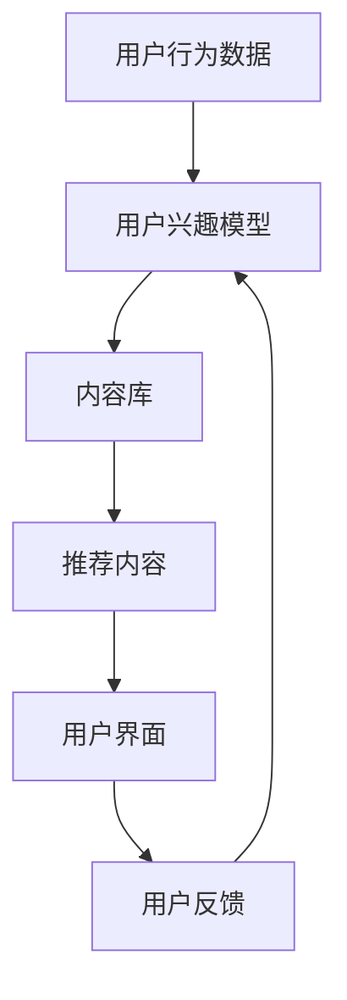

                 

# 科学传播的社交媒体策略：让世界可理解性触手可及

> 关键词：社交媒体、科学传播、可理解性、技术普及、公众教育

> 摘要：本文旨在探讨如何利用社交媒体平台有效传播科学知识，提高公众对复杂技术的理解和接受度。通过分析社交媒体传播的特点和挑战，提出一系列策略和方法，帮助科学家和技术专家更有效地与公众沟通。本文将从背景介绍、核心概念、算法原理、数学模型、实战案例、应用场景、工具推荐、未来趋势等多个方面进行详细阐述。

## 1. 背景介绍
### 1.1 目的和范围
本文旨在探讨如何利用社交媒体平台有效传播科学知识，提高公众对复杂技术的理解和接受度。随着社交媒体的普及，越来越多的科学家和技术专家开始利用这些平台进行科普工作。然而，如何在众多信息中脱颖而出，有效地传达科学知识，成为了一个亟待解决的问题。本文将从背景介绍、核心概念、算法原理、数学模型、实战案例、应用场景、工具推荐、未来趋势等多个方面进行详细阐述。

### 1.2 预期读者
本文主要面向以下几类读者：
- 科学家和技术专家：希望了解如何利用社交媒体平台进行科普工作的科学家和技术专家。
- 社交媒体运营者：希望提高内容传播效果的社交媒体运营者。
- 公众教育者：希望提高公众科学素养的教育工作者。
- 技术爱好者：对科学传播感兴趣的技术爱好者。

### 1.3 文档结构概述
本文将按照以下结构进行详细阐述：
1. 背景介绍
2. 核心概念与联系
3. 核心算法原理 & 具体操作步骤
4. 数学模型和公式 & 详细讲解 & 举例说明
5. 项目实战：代码实际案例和详细解释说明
6. 实际应用场景
7. 工具和资源推荐
8. 总结：未来发展趋势与挑战
9. 附录：常见问题与解答
10. 扩展阅读 & 参考资料

### 1.4 术语表
#### 1.4.1 核心术语定义
- **科学传播**：通过各种渠道和方式向公众传播科学知识的过程。
- **社交媒体**：一种基于互联网的交互式传播平台，如微博、微信、抖音等。
- **可理解性**：指信息传达的清晰度和易懂程度。
- **公众教育**：通过教育手段提高公众对科学知识的理解和接受度。

#### 1.4.2 相关概念解释
- **信息过载**：指信息量过大，导致人们难以筛选和处理信息的现象。
- **注意力经济**：指在信息爆炸的时代，注意力成为稀缺资源，如何吸引和保持用户的注意力成为关键。
- **互动性**：指社交媒体平台上的用户参与度和互动程度。

#### 1.4.3 缩略词列表
- **API**：Application Programming Interface（应用程序编程接口）
- **UGC**：User Generated Content（用户生成内容）
- **SEO**：Search Engine Optimization（搜索引擎优化）

## 2. 核心概念与联系
### 2.1 科学传播的社交媒体策略
科学传播的社交媒体策略主要包括以下几个方面：
- **内容创作**：创作高质量、有趣且易于理解的内容。
- **互动性**：通过提问、讨论等方式提高用户的参与度。
- **可视化**：利用图表、动画等手段提高信息的可理解性。
- **SEO优化**：通过关键词优化提高内容的搜索引擎排名。
- **社区建设**：建立和维护一个积极健康的社区环境。

### 2.2 社交媒体传播的特点
社交媒体传播具有以下几个特点：
- **实时性**：信息可以迅速传播，实时更新。
- **互动性**：用户可以即时反馈和互动。
- **广泛性**：覆盖范围广，可以触及大量用户。
- **个性化**：可以根据用户的兴趣和行为进行个性化推荐。

### 2.3 科学传播的挑战
科学传播在社交媒体上面临以下挑战：
- **信息过载**：如何在海量信息中脱颖而出。
- **注意力分散**：如何吸引和保持用户的注意力。
- **误解和谣言**：如何避免误解和谣言的传播。
- **技术复杂性**：如何将复杂的技术知识简化为易于理解的内容。

## 3. 核心算法原理 & 具体操作步骤
### 3.1 内容推荐算法
内容推荐算法是提高用户参与度的关键。以下是一个简单的推荐算法流程图：



### 3.2 SEO优化算法
SEO优化算法主要包括以下几个步骤：
1. **关键词分析**：分析目标关键词和长尾关键词。
2. **内容优化**：优化文章标题、描述、标签等。
3. **链接建设**：建立高质量的外部链接。
4. **用户体验**：优化页面加载速度、移动友好性等。

### 3.3 互动性算法
互动性算法主要包括以下几个步骤：
1. **提问设计**：设计有趣且具有启发性的问题。
2. **讨论引导**：引导用户参与讨论，提高互动度。
3. **反馈机制**：建立反馈机制，收集用户意见和建议。

## 4. 数学模型和公式 & 详细讲解 & 举例说明
### 4.1 信息传播模型
信息传播模型可以使用SIR模型来描述：
- **S**：Susceptible（易感人群）
- **I**：Infected（感染人群）
- **R**：Recovered（康复人群）

$$
\frac{dS}{dt} = -\beta SI
$$
$$
\frac{dI}{dt} = \beta SI - \gamma I
$$
$$
\frac{dR}{dt} = \gamma I
$$

### 4.2 互动性模型
互动性模型可以使用以下公式来描述：
$$
\text{互动度} = \frac{\text{用户互动次数}}{\text{用户访问次数}}
$$

### 4.3 SEO优化模型
SEO优化模型可以使用以下公式来描述：
$$
\text{SEO得分} = \text{关键词匹配度} \times \text{内容质量} \times \text{外部链接数量}
$$

## 5. 项目实战：代码实际案例和详细解释说明
### 5.1 开发环境搭建
开发环境搭建主要包括以下几个步骤：
1. **安装Python**：确保安装了Python 3.8及以上版本。
2. **安装依赖库**：安装`requests`、`BeautifulSoup`、`pandas`等库。
3. **配置社交媒体API**：获取社交媒体平台的API密钥。

### 5.2 源代码详细实现和代码解读
以下是一个简单的代码示例，用于从社交媒体平台获取用户数据：

```python
import requests
from bs4 import BeautifulSoup

def get_user_data(username):
    url = f"https://www.example.com/{username}"
    response = requests.get(url)
    soup = BeautifulSoup(response.text, 'html.parser')
    # 解析用户数据
    user_data = {
        'name': soup.find('h1').text,
        'followers': int(soup.find('span', class_='followers').text.replace(',', '')),
        'following': int(soup.find('span', class_='following').text.replace(',', ''))
    }
    return user_data

user_data = get_user_data('example_user')
print(user_data)
```

### 5.3 代码解读与分析
- **requests库**：用于发送HTTP请求。
- **BeautifulSoup库**：用于解析HTML内容。
- **数据解析**：从HTML中提取用户的基本信息，如用户名、关注者数量、关注数量等。

## 6. 实际应用场景
### 6.1 科学科普活动
通过社交媒体平台进行科学科普活动，如举办在线讲座、发布科普文章、组织互动问答等。

### 6.2 科技产品推广
利用社交媒体平台推广科技产品，通过用户生成内容和互动讨论提高产品的知名度和影响力。

### 6.3 科学研究合作
通过社交媒体平台建立科学研究合作网络，促进学术交流和合作。

## 7. 工具和资源推荐
### 7.1 学习资源推荐
#### 7.1.1 书籍推荐
- **《科学传播的艺术》**：深入探讨科学传播的方法和技巧。
- **《社交媒体营销》**：详细讲解社交媒体营销的策略和实践。

#### 7.1.2 在线课程
- **Coursera**：提供多门关于科学传播和社交媒体营销的在线课程。
- **edX**：提供多门关于科学传播和社交媒体营销的在线课程。

#### 7.1.3 技术博客和网站
- **Medium**：提供大量关于科学传播和社交媒体营销的文章和博客。
- **TechCrunch**：提供最新的科技新闻和技术趋势。

### 7.2 开发工具框架推荐
#### 7.2.1 IDE和编辑器
- **Visual Studio Code**：功能强大的代码编辑器，支持多种编程语言。
- **PyCharm**：专业的Python开发环境，提供代码补全、调试等功能。

#### 7.2.2 调试和性能分析工具
- **PyCharm Debugger**：专业的Python调试工具。
- **Chrome DevTools**：强大的浏览器调试工具，支持JavaScript、CSS等。

#### 7.2.3 相关框架和库
- **Flask**：轻量级的Web框架，适合快速开发小型项目。
- **Django**：功能强大的Web框架，适合大型项目。

### 7.3 相关论文著作推荐
#### 7.3.1 经典论文
- **《社交媒体中的信息传播模型》**：深入探讨社交媒体中的信息传播机制。
- **《互动性对社交媒体传播的影响》**：详细分析互动性对社交媒体传播的影响。

#### 7.3.2 最新研究成果
- **《利用机器学习优化SEO策略》**：最新研究成果，探讨如何利用机器学习优化SEO策略。
- **《社交媒体平台上的科学传播策略》**：最新研究成果，探讨如何在社交媒体平台上有效传播科学知识。

#### 7.3.3 应用案例分析
- **《科学传播在社交媒体上的应用案例》**：详细分析科学传播在社交媒体上的成功案例。
- **《科技产品推广的社交媒体策略》**：详细分析科技产品推广的社交媒体策略。

## 8. 总结：未来发展趋势与挑战
### 8.1 未来发展趋势
- **个性化推荐**：利用机器学习和大数据技术实现更个性化的推荐。
- **互动性增强**：通过增强现实、虚拟现实等技术提高互动性。
- **社区建设**：建立更加积极健康的社区环境，促进学术交流和合作。

### 8.2 挑战
- **信息过载**：如何在海量信息中脱颖而出。
- **注意力分散**：如何吸引和保持用户的注意力。
- **误解和谣言**：如何避免误解和谣言的传播。

## 9. 附录：常见问题与解答
### 9.1 问题1：如何提高内容的可理解性？
- **解答**：可以通过简化语言、使用图表和动画等方式提高内容的可理解性。

### 9.2 问题2：如何吸引和保持用户的注意力？
- **解答**：可以通过设计有趣的问题、组织互动讨论等方式吸引和保持用户的注意力。

### 9.3 问题3：如何避免误解和谣言的传播？
- **解答**：可以通过建立严格的审核机制、及时回应用户反馈等方式避免误解和谣言的传播。

## 10. 扩展阅读 & 参考资料
- **《科学传播的艺术》**：深入探讨科学传播的方法和技巧。
- **《社交媒体营销》**：详细讲解社交媒体营销的策略和实践。
- **《信息传播模型》**：深入探讨信息传播的机制。
- **《互动性对社交媒体传播的影响》**：详细分析互动性对社交媒体传播的影响。
- **《利用机器学习优化SEO策略》**：最新研究成果，探讨如何利用机器学习优化SEO策略。
- **《科学传播在社交媒体上的应用案例》**：详细分析科学传播在社交媒体上的成功案例。
- **《科技产品推广的社交媒体策略》**：详细分析科技产品推广的社交媒体策略。

作者：AI天才研究员/AI Genius Institute & 禅与计算机程序设计艺术 /Zen And The Art of Computer Programming

