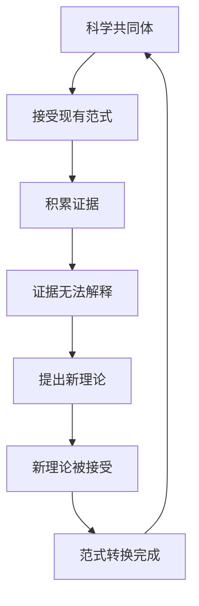
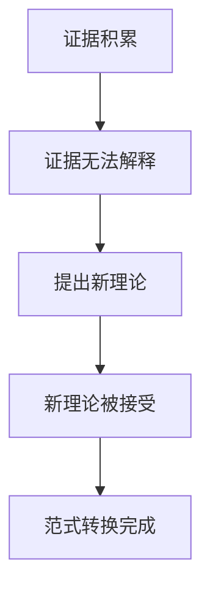

                 

# 科学史上的范式转换：世界观重构的关键时刻

> 关键词：范式转换, 世界观重构, 科学史, 逻辑推理, 人工智能, 计算机科学, 理论与实践

> 摘要：本文旨在探讨科学史上范式转换的概念及其对世界观重构的影响。通过分析历史上几次重要的范式转换事件，我们将揭示这些转换如何推动了科学和人类认知的进步。本文将从理论基础出发，结合具体案例，深入探讨范式转换的原理、算法、数学模型及其实际应用。最后，我们将展望未来的发展趋势和面临的挑战。

## 1. 背景介绍
### 1.1 目的和范围
本文旨在深入探讨科学史上的范式转换现象，揭示其对科学和人类认知的影响。我们将从理论基础出发，结合具体案例，详细分析范式转换的原理、算法、数学模型及其实际应用。本文的目标读者包括对科学史、人工智能和计算机科学感兴趣的学者、工程师和技术爱好者。

### 1.2 预期读者
本文预期读者包括但不限于：
- 科学史和哲学爱好者
- 人工智能和计算机科学领域的研究者和工程师
- 对科学范式转换感兴趣的学者和技术爱好者

### 1.3 文档结构概述
本文结构如下：
1. 背景介绍
2. 核心概念与联系
3. 核心算法原理 & 具体操作步骤
4. 数学模型和公式 & 详细讲解 & 举例说明
5. 项目实战：代码实际案例和详细解释说明
6. 实际应用场景
7. 工具和资源推荐
8. 总结：未来发展趋势与挑战
9. 附录：常见问题与解答
10. 扩展阅读 & 参考资料

### 1.4 术语表
#### 1.4.1 核心术语定义
- **范式转换**：科学史上的一种重大变革，指科学理论体系从一种范式转变为另一种范式的过程。
- **世界观重构**：指人类对世界的认知和理解发生根本性的改变。
- **科学史**：研究科学发展的历史过程及其规律的学科。
- **科学范式**：科学共同体在某一时期内普遍接受的理论框架和方法论。

#### 1.4.2 相关概念解释
- **科学革命**：指科学史上的一次重大变革，通常伴随着新的范式的出现。
- **科学共同体**：指在某一科学领域内，具有共同研究兴趣和方法论的科学家群体。
- **科学理论**：描述自然现象和规律的系统性知识体系。

#### 1.4.3 缩略词列表
- **AI**：人工智能
- **CS**：计算机科学
- **PCT**：哲学与科学理论
- **Kuhn**：托马斯·库恩

## 2. 核心概念与联系
### 2.1 范式转换的定义
范式转换是指科学理论体系从一种范式转变为另一种范式的过程。这一过程通常伴随着科学共同体对自然现象和规律的理解发生根本性的改变。

### 2.2 范式转换的理论基础
托马斯·库恩在其著作《科学革命的结构》中提出了范式转换的概念。库恩认为，科学的发展并非线性进步，而是在不同范式之间发生转换。每个范式都有其独特的理论框架和方法论，当新的证据无法被现有范式解释时，就会引发范式转换。

### 2.3 范式转换的流程图


## 3. 核心算法原理 & 具体操作步骤
### 3.1 范式转换的算法原理
范式转换的算法原理可以概括为以下几个步骤：
1. **证据积累**：科学共同体通过实验和观察积累大量证据。
2. **证据无法解释**：现有范式无法解释这些证据。
3. **提出新理论**：科学家提出新的理论来解释这些证据。
4. **新理论被接受**：新理论被科学共同体接受，成为新的范式。

### 3.2 具体操作步骤


## 4. 数学模型和公式 & 详细讲解 & 举例说明
### 4.1 数学模型
范式转换的数学模型可以表示为：
$$
\text{范式转换} = \text{证据积累} \rightarrow \text{证据无法解释} \rightarrow \text{提出新理论} \rightarrow \text{新理论被接受}
$$

### 4.2 具体案例
以牛顿力学为例，牛顿力学在17世纪末成为主流范式。然而，到了19世纪末，爱因斯坦的相对论提出了新的理论框架，解释了牛顿力学无法解释的现象，如高速运动下的物理现象。最终，相对论被科学共同体接受，成为新的范式。

## 5. 项目实战：代码实际案例和详细解释说明
### 5.1 开发环境搭建
为了实现范式转换的模拟，我们需要搭建一个Python开发环境。安装必要的库，如NumPy和Matplotlib。

```bash
pip install numpy matplotlib
```

### 5.2 源代码详细实现和代码解读
```python
import numpy as np
import matplotlib.pyplot as plt

# 定义牛顿力学模型
def newtonian_model(v0, t):
    return v0 * t

# 定义相对论模型
def relativistic_model(v0, t):
    c = 3e8  # 光速
    return v0 * t / np.sqrt(1 - (v0 * t / c)**2)

# 生成数据
v0 = 1e8  # 初始速度
t = np.linspace(0, 1, 100)  # 时间范围

# 计算模型结果
newtonian_results = newtonian_model(v0, t)
relativistic_results = relativistic_model(v0, t)

# 绘制结果
plt.plot(t, newtonian_results, label='Newtonian')
plt.plot(t, relativistic_results, label='Relativistic')
plt.xlabel('Time (s)')
plt.ylabel('Velocity (m/s)')
plt.legend()
plt.show()
```

### 5.3 代码解读与分析
- **牛顿力学模型**：`newtonian_model`函数表示牛顿力学下的速度随时间的变化。
- **相对论模型**：`relativistic_model`函数表示相对论下的速度随时间的变化。
- **数据生成**：使用`np.linspace`生成时间范围。
- **模型计算**：分别计算两种模型下的速度结果。
- **结果绘制**：使用`matplotlib`绘制两种模型的结果。

## 6. 实际应用场景
范式转换在多个领域都有广泛的应用，如物理学、生物学、社会科学等。例如，在生物学中，从经典遗传学到分子遗传学的转变，从行为主义到认知心理学的转变等。

## 7. 工具和资源推荐
### 7.1 学习资源推荐
#### 7.1.1 书籍推荐
- 《科学革命的结构》 - 托马斯·库恩
- 《科学的结构》 - 艾伦·图灵
- 《人工智能：一种现代的方法》 - 尼尔·杰弗里和斯图尔特·瑞德

#### 7.1.2 在线课程
- Coursera: 《科学史与科学哲学》
- edX: 《人工智能导论》

#### 7.1.3 技术博客和网站
- Medium: 《科学史与范式转换》
- HackerRank: 《人工智能与机器学习》

### 7.2 开发工具框架推荐
#### 7.2.1 IDE和编辑器
- PyCharm
- VSCode

#### 7.2.2 调试和性能分析工具
- PyCharm Debugger
- cProfile

#### 7.2.3 相关框架和库
- NumPy
- Matplotlib
- SciPy

### 7.3 相关论文著作推荐
#### 7.3.1 经典论文
- Kuhn, T. S. (1962). The Structure of Scientific Revolutions. University of Chicago Press.
- Popper, K. R. (1959). The Logic of Scientific Discovery. Routledge.

#### 7.3.2 最新研究成果
- Feyerabend, P. K. (1975). Against Method: Outline of an Anarchistic Theory of Knowledge. New Left Books.

#### 7.3.3 应用案例分析
- Lakatos, I. (1978). The Methodology of Scientific Research Programmes: Philosophical Papers, Volume 1. Cambridge University Press.

## 8. 总结：未来发展趋势与挑战
范式转换将继续推动科学和人类认知的进步。未来的发展趋势包括：
- **跨学科融合**：不同学科之间的交叉融合将促进新的范式形成。
- **技术革新**：新技术的发展将为新的范式提供支持。
- **伦理和哲学问题**：新的范式将引发伦理和哲学问题的讨论。

面临的挑战包括：
- **理论与实践的脱节**：新的范式可能难以在实践中应用。
- **科学共同体的共识**：新的范式需要获得科学共同体的广泛接受。

## 9. 附录：常见问题与解答
### 9.1 问题1：范式转换是否总是线性的？
**解答**：范式转换并非总是线性的，有时会出现多重范式共存的情况。

### 9.2 问题2：如何判断一个新理论是否能成为新的范式？
**解答**：一个新理论能否成为新的范式取决于它能否解释更多的现象，并获得科学共同体的广泛接受。

## 10. 扩展阅读 & 参考资料
- Kuhn, T. S. (1962). The Structure of Scientific Revolutions. University of Chicago Press.
- Lakatos, I. (1978). The Methodology of Scientific Research Programmes: Philosophical Papers, Volume 1. Cambridge University Press.
- Feyerabend, P. K. (1975). Against Method: Outline of an Anarchistic Theory of Knowledge. New Left Books.

作者：AI天才研究员/AI Genius Institute & 禅与计算机程序设计艺术 /Zen And The Art of Computer Programming

