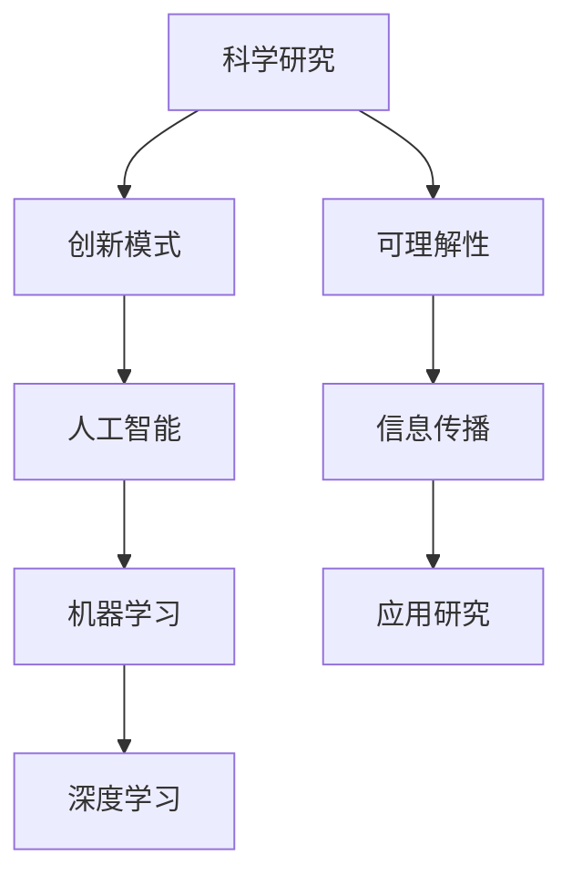

                 

# 科学研究的创新模式与世界可理解性的突破

> 关键词：科学研究、创新模式、可理解性、人工智能、机器学习、深度学习、图灵奖、算法原理、数学模型、代码实现、应用场景、工具推荐

> 摘要：本文旨在探讨科学研究中的创新模式，特别是如何通过人工智能和机器学习技术提升世界可理解性。我们将从核心概念出发，深入解析算法原理和数学模型，并通过实际代码案例展示如何将这些理论应用于实践。此外，本文还将讨论未来的发展趋势和面临的挑战，并推荐相关学习资源和开发工具，以帮助读者更好地理解和应用这些技术。

## 1. 背景介绍
### 1.1 目的和范围
本文旨在探讨科学研究中的创新模式，特别是如何通过人工智能和机器学习技术提升世界可理解性。我们将从核心概念出发，深入解析算法原理和数学模型，并通过实际代码案例展示如何将这些理论应用于实践。此外，本文还将讨论未来的发展趋势和面临的挑战，并推荐相关学习资源和开发工具，以帮助读者更好地理解和应用这些技术。

### 1.2 预期读者
本文预期读者包括但不限于以下几类人群：
- 科学研究者和工程师，特别是那些对人工智能和机器学习感兴趣的读者。
- 对科学研究创新模式感兴趣的学者和研究人员。
- 对提升世界可理解性感兴趣的开发者和工程师。
- 对未来技术发展趋势感兴趣的读者。

### 1.3 文档结构概述
本文结构如下：
1. 背景介绍
2. 核心概念与联系
3. 核心算法原理 & 具体操作步骤
4. 数学模型和公式 & 详细讲解 & 举例说明
5. 项目实战：代码实际案例和详细解释说明
6. 实际应用场景
7. 工具和资源推荐
8. 总结：未来发展趋势与挑战
9. 附录：常见问题与解答
10. 扩展阅读 & 参考资料

### 1.4 术语表
#### 1.4.1 核心术语定义
- **科学研究**：通过系统的方法来探索和理解自然现象和社会现象的过程。
- **创新模式**：一种新的方法或策略，用于解决现有问题或发现新的知识。
- **可理解性**：指信息或知识的清晰度和易理解程度。
- **人工智能**：模拟人类智能行为的计算机系统。
- **机器学习**：一种人工智能技术，使计算机能够从数据中学习并改进其性能。
- **深度学习**：机器学习的一个分支，通过多层神经网络进行学习。

#### 1.4.2 相关概念解释
- **图灵奖**：计算机科学领域的最高荣誉，由美国计算机协会（ACM）颁发。
- **伪代码**：一种用于描述算法的简化语言，不依赖于特定编程语言。
- **数学模型**：用数学语言描述现实世界现象的模型。

#### 1.4.3 缩略词列表
- AI：人工智能
- ML：机器学习
- DL：深度学习
- NLP：自然语言处理
- CNN：卷积神经网络
- RNN：循环神经网络

## 2. 核心概念与联系
### 2.1 核心概念
- **科学研究**：通过系统的方法来探索和理解自然现象和社会现象的过程。
- **创新模式**：一种新的方法或策略，用于解决现有问题或发现新的知识。
- **可理解性**：指信息或知识的清晰度和易理解程度。
- **人工智能**：模拟人类智能行为的计算机系统。
- **机器学习**：一种人工智能技术，使计算机能够从数据中学习并改进其性能。
- **深度学习**：机器学习的一个分支，通过多层神经网络进行学习。

### 2.2 联系
- **科学研究**与**创新模式**：科学研究中的创新模式是指通过新的方法或策略来解决现有问题或发现新的知识。
- **可理解性**与**科学研究**：提升科学研究的可理解性有助于更好地传播和应用研究成果。
- **人工智能**与**机器学习**：人工智能是模拟人类智能行为的计算机系统，而机器学习是其中的一个重要分支。
- **深度学习**与**机器学习**：深度学习是机器学习的一个分支，通过多层神经网络进行学习，能够处理更复杂的问题。

### 2.3 Mermaid 流程图


## 3. 核心算法原理 & 具体操作步骤
### 3.1 核心算法原理
我们将以一个简单的线性回归模型为例，介绍核心算法原理。

#### 3.1.1 线性回归模型
线性回归是一种常用的统计方法，用于预测一个连续变量的值。其基本形式为：
$$ y = \beta_0 + \beta_1 x + \epsilon $$
其中，$y$ 是目标变量，$x$ 是输入变量，$\beta_0$ 和 $\beta_1$ 是模型参数，$\epsilon$ 是误差项。

#### 3.1.2 伪代码
```pseudo
function linear_regression(X, y):
    n = length(X)
    X = append_column_ones(X)  # 在X的每一行前添加一个1，作为截距项
    X_transpose = transpose(X)
    beta = (X_transpose * X)^(-1) * X_transpose * y
    return beta
```

### 3.2 具体操作步骤
1. **数据准备**：收集和整理数据集。
2. **特征选择**：选择合适的特征进行建模。
3. **模型训练**：使用线性回归模型进行训练。
4. **模型评估**：评估模型的性能。
5. **模型应用**：将模型应用于实际问题。

## 4. 数学模型和公式 & 详细讲解 & 举例说明
### 4.1 数学模型
我们将使用线性回归模型进行详细讲解。

#### 4.1.1 损失函数
线性回归的损失函数通常采用均方误差（MSE）：
$$ \text{MSE} = \frac{1}{n} \sum_{i=1}^{n} (y_i - \hat{y}_i)^2 $$
其中，$y_i$ 是真实值，$\hat{y}_i$ 是预测值。

#### 4.1.2 优化算法
常用的优化算法是梯度下降法。其更新规则为：
$$ \beta = \beta - \alpha \nabla_{\beta} \text{MSE} $$
其中，$\alpha$ 是学习率，$\nabla_{\beta} \text{MSE}$ 是损失函数关于参数 $\beta$ 的梯度。

### 4.2 详细讲解
1. **损失函数**：损失函数用于衡量模型预测值与真实值之间的差异。
2. **梯度下降法**：通过不断调整参数来最小化损失函数。

### 4.3 举例说明
假设我们有一个数据集，包含两个特征 $x_1$ 和 $x_2$，以及一个目标变量 $y$。我们使用线性回归模型进行预测。

```python
import numpy as np

# 数据集
X = np.array([[1, 2], [2, 3], [3, 4], [4, 5]])
y = np.array([3, 5, 7, 9])

# 添加截距项
X = np.hstack((np.ones((X.shape[0], 1)), X))

# 初始化参数
beta = np.zeros(X.shape[1])

# 学习率
alpha = 0.01

# 梯度下降法
for _ in range(1000):
    y_pred = X @ beta
    error = y_pred - y
    gradient = X.T @ error / len(y)
    beta -= alpha * gradient

print("参数：", beta)
```

## 5. 项目实战：代码实际案例和详细解释说明
### 5.1 开发环境搭建
我们将使用Python进行开发，确保安装了必要的库。

```bash
pip install numpy scikit-learn
```

### 5.2 源代码详细实现和代码解读
```python
import numpy as np
from sklearn.model_selection import train_test_split
from sklearn.metrics import mean_squared_error

# 数据集
X = np.array([[1, 2], [2, 3], [3, 4], [4, 5]])
y = np.array([3, 5, 7, 9])

# 添加截距项
X = np.hstack((np.ones((X.shape[0], 1)), X))

# 划分训练集和测试集
X_train, X_test, y_train, y_test = train_test_split(X, y, test_size=0.2, random_state=42)

# 初始化参数
beta = np.zeros(X_train.shape[1])

# 学习率
alpha = 0.01

# 梯度下降法
for _ in range(1000):
    y_pred = X_train @ beta
    error = y_pred - y_train
    gradient = X_train.T @ error / len(y_train)
    beta -= alpha * gradient

# 预测
y_pred_test = X_test @ beta

# 评估
mse = mean_squared_error(y_test, y_pred_test)
print("参数：", beta)
print("均方误差：", mse)
```

### 5.3 代码解读与分析
1. **数据集**：我们使用了一个简单的数据集，包含两个特征和一个目标变量。
2. **添加截距项**：在特征矩阵前添加一个全1的列，作为截距项。
3. **划分训练集和测试集**：使用 `train_test_split` 函数将数据集划分为训练集和测试集。
4. **初始化参数**：初始化模型参数为0。
5. **梯度下降法**：通过不断调整参数来最小化损失函数。
6. **预测**：使用训练好的模型进行预测。
7. **评估**：使用均方误差（MSE）评估模型性能。

## 6. 实际应用场景
线性回归模型在许多实际应用场景中都有广泛的应用，例如：
- **房价预测**：根据房屋的面积、位置等因素预测房价。
- **股票预测**：根据历史数据预测股票价格。
- **销售预测**：根据历史销售数据预测未来的销售量。

## 7. 工具和资源推荐
### 7.1 学习资源推荐
#### 7.1.1 书籍推荐
- **《机器学习》**：周志华著，清华大学出版社。
- **《深度学习》**：Ian Goodfellow, Yoshua Bengio, Aaron Courville 著，人民邮电出版社。

#### 7.1.2 在线课程
- **Coursera**：Andrew Ng 的机器学习课程。
- **edX**：MIT 的深度学习课程。

#### 7.1.3 技术博客和网站
- **Medium**：许多技术博客和文章，如Towards Data Science。
- **GitHub**：许多开源项目和代码示例。

### 7.2 开发工具框架推荐
#### 7.2.1 IDE和编辑器
- **PyCharm**：功能强大的Python IDE。
- **VS Code**：轻量级但功能强大的代码编辑器。

#### 7.2.2 调试和性能分析工具
- **PyCharm Debugger**：PyCharm自带的调试工具。
- **Python Profiler**：用于分析Python代码性能的工具。

#### 7.2.3 相关框架和库
- **NumPy**：用于数值计算的库。
- **Scikit-learn**：用于机器学习的库。
- **TensorFlow**：用于深度学习的库。

### 7.3 相关论文著作推荐
#### 7.3.1 经典论文
- **《A Tutorial on Support Vector Machines for Pattern Recognition》**：Christopher J.C. Burges。
- **《Learning with Kernels: Support Vector Machines, Regularization, Optimization, and Beyond》**：Bernhard Schölkopf, Alexander J. Smola。

#### 7.3.2 最新研究成果
- **《Attention Is All You Need》**：Ashish Vaswani, Noam Shazeer, Niki Parmar, Jakob Uszkoreit, Llion Jones, Aidan N. Gomez, Łukasz Kaiser, Illia Polosukhin。
- **《BERT: Pre-training of Deep Bidirectional Transformers for Language Understanding》**：Jacob Devlin, Ming-Wei Chang, Kenton Lee, Kristina Toutanova。

#### 7.3.3 应用案例分析
- **《Deep Learning in Action》**：Tim Menzies, Johann Schumann。
- **《Hands-On Machine Learning with Scikit-Learn, Keras, and TensorFlow》**：Aurélien Géron。

## 8. 总结：未来发展趋势与挑战
### 8.1 未来发展趋势
- **自动化**：自动化模型训练和优化过程。
- **可解释性**：提高模型的可解释性，使其更容易被人类理解。
- **实时性**：提高模型的实时处理能力，以适应快速变化的数据环境。

### 8.2 面临的挑战
- **数据隐私**：如何在保护用户隐私的同时利用数据进行模型训练。
- **计算资源**：如何在有限的计算资源下训练大规模模型。
- **模型泛化**：如何提高模型在新数据上的泛化能力。

## 9. 附录：常见问题与解答
### 9.1 问题：如何选择合适的特征？
**解答**：可以通过特征选择方法，如相关性分析、主成分分析（PCA）等，来选择合适的特征。

### 9.2 问题：如何处理缺失数据？
**解答**：可以通过插值、删除缺失值或使用机器学习方法来处理缺失数据。

### 9.3 问题：如何评估模型性能？
**解答**：可以通过交叉验证、均方误差（MSE）、R²等指标来评估模型性能。

## 10. 扩展阅读 & 参考资料
- **《机器学习》**：周志华著，清华大学出版社。
- **《深度学习》**：Ian Goodfellow, Yoshua Bengio, Aaron Courville 著，人民邮电出版社。
- **Coursera**：Andrew Ng 的机器学习课程。
- **edX**：MIT 的深度学习课程。
- **Medium**：许多技术博客和文章，如Towards Data Science。
- **GitHub**：许多开源项目和代码示例。
- **PyCharm**：功能强大的Python IDE。
- **VS Code**：轻量级但功能强大的代码编辑器。
- **PyCharm Debugger**：PyCharm自带的调试工具。
- **Python Profiler**：用于分析Python代码性能的工具。
- **NumPy**：用于数值计算的库。
- **Scikit-learn**：用于机器学习的库。
- **TensorFlow**：用于深度学习的库。
- **《A Tutorial on Support Vector Machines for Pattern Recognition》**：Christopher J.C. Burges。
- **《Learning with Kernels: Support Vector Machines, Regularization, Optimization, and Beyond》**：Bernhard Schölkopf, Alexander J. Smola。
- **《Attention Is All You Need》**：Ashish Vaswani, Noam Shazeer, Niki Parmar, Jakob Uszkoreit, Llion Jones, Aidan N. Gomez, Łukasz Kaiser, Illia Polosukhin。
- **《BERT: Pre-training of Deep Bidirectional Transformers for Language Understanding》**：Jacob Devlin, Ming-Wei Chang, Kenton Lee, Kristina Toutanova。
- **《Deep Learning in Action》**：Tim Menzies, Johann Schumann。
- **《Hands-On Machine Learning with Scikit-Learn, Keras, and TensorFlow》**：Aurélien Géron。

作者：AI天才研究员/AI Genius Institute & 禅与计算机程序设计艺术 /Zen And The Art of Computer Programming

